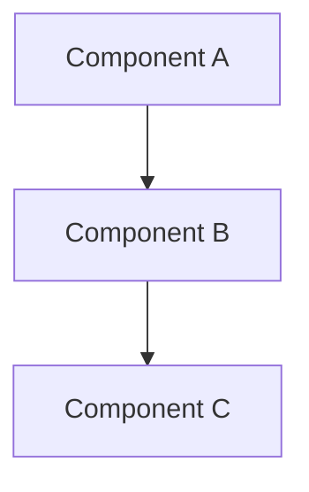

# IP-XXX: [Title]

Brief description of what this proposal addresses (2-3 sentences).

<!-- more -->

## Status

**Status**: Draft | Under Review | Accepted | Implemented
**Last Updated**: YYYY-MM-DD
**Implementation**: Not started | In Progress | Complete

## Problem Statement

What problem are we trying to solve? What need or challenge does this address?

- What is the current situation?
- What are the pain points?
- Who is affected?
- What are the consequences of not addressing this?

## Proposed Solution

High-level description of the proposed solution.

### Overview

Brief overview of the approach.

### Key Components

List and describe the main components or aspects of the solution:

1. **Component 1**: Description
2. **Component 2**: Description
3. **Component 3**: Description

### Architecture



Include architectural diagrams, data models, or flow charts as needed.

## Implementation Plan

### Phase 1: [Phase Name]

- [ ] Task 1
- [ ] Task 2
- [ ] Task 3

### Phase 2: [Phase Name]

- [ ] Task 1
- [ ] Task 2

### Prerequisites

What needs to be in place before implementation:

- Prerequisite 1
- Prerequisite 2

## Technical Details

### Technology Stack

What technologies, frameworks, or tools will be used?

- Technology 1: Why chosen
- Technology 2: Why chosen

### Data Model Changes

If applicable, describe database schema changes:

```sql
-- Example SQL or use Mermaid ER diagram
```

### API Changes

If applicable, describe API changes:

```
GET /api/endpoint
POST /api/endpoint
```

### Configuration

Any new configuration needed:

```yaml
# Example configuration
```

## Alternatives Considered

What other approaches were considered and why were they not chosen?

### Alternative 1: [Name]

**Description**: Brief description
**Pros**:
- Pro 1
- Pro 2

**Cons**:
- Con 1
- Con 2

**Why not chosen**: Explanation

### Alternative 2: [Name]

Similar format as above.

## Trade-offs and Risks

### Trade-offs

- **Trade-off 1**: Description and justification
- **Trade-off 2**: Description and justification

### Risks

| Risk | Impact | Mitigation |
|------|--------|-----------|
| Risk 1 | High/Medium/Low | How to mitigate |
| Risk 2 | High/Medium/Low | How to mitigate |

## Open Questions

Questions that need to be answered before or during implementation:

1. Question 1?
2. Question 2?

## Success Criteria

How will we know this solution is successful?

- [ ] Criterion 1
- [ ] Criterion 2
- [ ] Criterion 3

## Future Considerations

What might we want to consider in the future?

- Future enhancement 1
- Future enhancement 2

## References

- [Link 1](url)
- [Link 2](url)
- Related proposals or documentation


## Review Questions

**Note**: This section is REQUIRED for AI-created proposals. Human-authored proposals may include it if needed.

**Status**: ⏳ Awaiting Answers | ✅ Resolved
**Review Date**: YYYY-MM-DD
**Reviewer**: [Name or "Claude AI"]

The following questions must be answered before implementation:

---

### Q1: [Question Title]

**Issue**: [Description of the problem/inconsistency with line numbers]

**Context**: [Why this matters - impact on implementation, data integrity, etc.]

**Question**: [The specific question to answer]

**Options**:
- [ ] **A**: [Option description] (recommended/not recommended)
- [ ] **B**: [Option description]
- [ ] **C**: [Option description]

**Answer**:
```
[User fills this in with chosen option and reasoning]
```

**Resolution**:
```
[AI writes this — describes how proposal will be updated based on the user's answer]
```

---

### Q2: [Next Question Title]

[Follow same format as Q1]

---

**Instructions for completing Review Questions**:

1. For each question, check the box next to your chosen option
2. Fill in the "Answer" section with your reasoning
3. Fill in the "Resolution" section with specific changes to make
4. Update the proposal based on all resolutions.
5. Change Status to "✅ Resolved" when all questions answered.  Remove the "Review Questions" after the document is accepted.
6. Add changelog entry: "Resolved review questions and updated proposal accordingly"

---

## Changelog

| Date | Author | Changes |
|------|--------|---------|
| YYYY-MM-DD | [author] | Initial draft |
| YYYY-MM-DD | [author] | [Description of changes] |