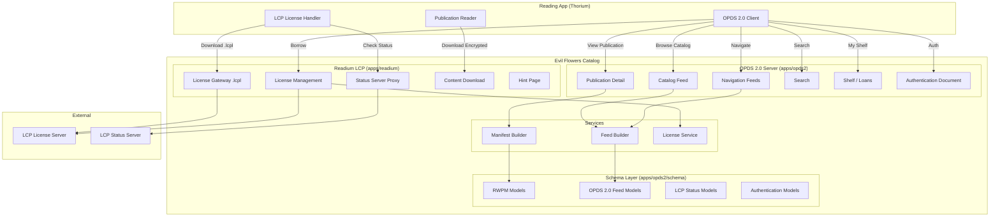
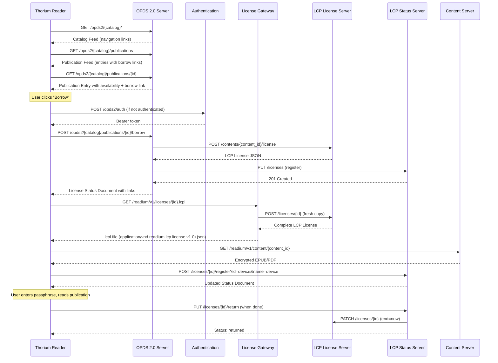

# IP-001: Complete LCP Integration & OPDS 2.0 Server with Readium Borrowing

This proposal addresses the incomplete LCP integration that causes missing metadata when reading publications in Thorium (and other Readium-based readers), and introduces a full OPDS 2.0 server implementation with native Readium LCP borrowing support built on Pydantic models.

<!-- more -->

## Status

**Status**: Accepted
**Last Updated**: 2026-04-08
**Implementation**: Complete (Phases 1-4)

## Problem Statement

The current Evil Flowers Catalog has a working LCP encryption and licensing pipeline, but several critical gaps prevent a complete end-to-end reading experience:

### 1. Missing Metadata in LCP Licenses & Publications

When a user opens a borrowed publication in Thorium Reader, the reading app receives:

- **A bare `.lcpl` license** with user/encryption/rights data but no publication metadata (title, author, publisher, language, cover) embedded in the license links
- **An encrypted file** served from `/readium/v1/content/{lcp_content_id}` with the correct MIME type but without a proper Readium Web Publication Manifest

Thorium and other compliant readers expect:
- The `.lcpl` license to contain a `publication` link pointing to a manifest or packaged publication
- A `hint` link for passphrase recovery UX
- Proper `status` link to the License Status Document
- The encrypted EPUB to contain a valid `META-INF/license.lcpl` and manifest metadata

Currently, the LCP Server generates these links based on its own configuration, but our CMS does not serve the corresponding endpoints (manifest, hint page, publication download with embedded license).

### 2. No OPDS 2.0 Server

The `apps/opds2/` module is effectively empty (only an LCP Status Document schema exists). OPDS 2.0 is the modern, JSON-based standard that Readium-based readers (Thorium, Readium Mobile) natively support for:

- Catalog browsing with rich metadata
- **Borrowing workflows** (OPDS Authentication + acquisition links with `borrow` relations)
- License Status Document integration
- Availability information per publication

Without OPDS 2.0, users cannot discover and borrow publications directly from their reading app.

### 3. No Pydantic Schema for Readium Web Publication Manifest

The Readium Web Publication Manifest (RWPM) is the core data structure for OPDS 2.0 publications. It defines how metadata, reading order, resources, and links are structured. There is no implementation of this manifest, which means:

- No way to serve standalone manifest endpoints
- No way to package proper OPDS 2.0 publication objects
- No typed, validated data layer for the rich metadata Thorium expects

### Who is affected?

- End users borrowing publications via Thorium/Readium apps (broken or degraded reading experience)
- Library administrators managing catalogs (no OPDS 2.0 discovery)
- Integration partners expecting standards-compliant OPDS 2.0 + LCP

### Consequences of not addressing

- Thorium displays publications without title, author, cover, or language
- No self-service borrowing from reading apps (users must use the web API manually)
- Cannot pass Readium LCP compliance testing
- Blocks adoption by institutions expecting OPDS 2.0 catalog discovery

## Proposed Solution

### Overview

Implement three interconnected components:

1. **Readium Web Publication Manifest** -- Pydantic model layer for RWPM, the foundation for both OPDS 2.0 feeds and LCP publication metadata
2. **OPDS 2.0 Server** -- Full JSON-based catalog server in `apps/opds2/` with navigation, search, publication detail, and borrowing flows
3. **LCP Integration Completion** -- Fix license metadata, serve publication manifests, add hint page, and wire everything together so Thorium gets a complete experience

### Key Components

1. **`apps/opds2/schema/`** -- Pydantic models for OPDS 2.0 and RWPM (metadata, links, publications, feeds, authentication)
2. **`apps/opds2/views/`** -- Django views serving OPDS 2.0 JSON feeds with catalog navigation, publication detail, search, shelf, and borrowing
3. **`apps/opds2/services/`** -- Feed builders and manifest generators that bridge Django ORM models to Pydantic schemas
4. **LCP metadata enrichment** -- Ensure licenses carry full publication context and readers can resolve all required links

### Architecture



### Borrowing Flow (End-to-End)



## Implementation Plan

### Phase 1: Pydantic Schema Layer (RWPM + OPDS 2.0 Models)

Build the minimal viable typed model layer for PDF/EPUB borrowing. Audiobook fields (`duration`, `bitrate`), holds/reservation models, and purchase-specific models are deferred until those features are needed.

- [ ] Create `apps/opds2/schema/rwpm/` package with Readium Web Publication Manifest models
    - [ ] `metadata.py` -- `Metadata` model (title, subtitle, author, translator, editor, publisher, language, subject, description, published, modified, identifier, number_of_pages, belongs_to)
    - [ ] `link.py` -- `Link` model with rel, href, type, templated, title, properties, height, width, children
    - [ ] `contributor.py` -- `Contributor` model (name, identifier, sort_as, role, links, position)
    - [ ] `subject.py` -- `Subject` model (name, sort_as, scheme, code, links)
    - [ ] `belongs_to.py` -- `BelongsTo` model (series with position, collection)
    - [ ] `publication.py` -- `Publication` model (context, metadata, links, reading_order, resources)
- [ ] Create `apps/opds2/schema/opds/` package with OPDS 2.0 feed models
    - [ ] `feed.py` -- `OpdsFeed` model (metadata, links, navigation, publications, groups, facets)
    - [ ] `navigation.py` -- `NavigationEntry` model (href, title, type, rel)
    - [ ] `facet.py` -- `Facet` model (metadata, links, with number_of_items)
    - [ ] `group.py` -- `Group` model (metadata, links, publications, navigation)
    - [ ] `acquisition.py` -- `AcquisitionObject` with properties (price, indirect_acquisition, availability, copies)
    - [ ] `availability.py` -- `Availability` model (state: available/unavailable/reserved, since, until) and `Copies` model (total, available)
    - [ ] `price.py` -- `Price` model (currency, value)
    - [ ] `authentication.py` -- OPDS Authentication Document 1.0 models
- [ ] Create `apps/opds2/schema/lcp/license.py` -- typed LCP License model (id, issued, provider, updated, encryption, links, user, rights, signature)
- [ ] Update existing `apps/opds2/schema/lcp/status.py` -- align with RWPM Link model, add missing fields

### Phase 2: Manifest & Feed Services

Bridge Django ORM to the Pydantic schema layer.

- [ ] Create `apps/opds2/services/manifest_builder.py`
    - [ ] `build_publication_manifest(entry: Entry) -> Publication` -- convert Entry + Acquisitions + Authors + Categories into a full RWPM
    - [ ] `build_metadata(entry: Entry) -> Metadata` -- map all Entry fields to RWPM Metadata
    - [ ] `build_acquisition_links(entry: Entry) -> list[Link]` -- generate acquisition links with proper rel types, availability, and indirect acquisition chains
    - [ ] `build_cover_links(entry: Entry) -> list[Link]` -- cover image and thumbnail links
    - [ ] `build_contributor_list(entry: Entry) -> list[Contributor]` -- map EntryAuthor to RWPM Contributors with roles
- [ ] Create `apps/opds2/services/feed_builder.py`
    - [ ] `build_catalog_feed(catalog: Catalog, request) -> OpdsFeed` -- root navigation feed
    - [ ] `build_publication_feed(entries: QuerySet, catalog, request, pagination) -> OpdsFeed` -- paginated publication feed
    - [ ] `build_navigation_feed(feeds: QuerySet, catalog, request) -> OpdsFeed` -- navigation entries
    - [ ] `build_search_feed(entries: QuerySet, catalog, request, query) -> OpdsFeed` -- search results
    - [ ] `build_shelf_feed(user: User, catalog, request) -> OpdsFeed` -- user's borrowed publications with license status
    - [ ] Pagination support with `next`, `previous`, `first`, `last` links

### Phase 3: OPDS 2.0 Views & URLs

Implement the HTTP layer.

- [ ] Create `apps/opds2/views/base.py` -- `Opds2View` base class (catalog resolution, auth, JSON response with proper content-type `application/opds+json`)
- [ ] Create `apps/opds2/views/catalog.py` -- `CatalogView`
    - [ ] `GET /opds2/{catalog_name}/` -- Root feed with navigation links (new, popular, shelf, feeds, search)
- [ ] Create `apps/opds2/views/publication.py` -- `PublicationFeedView`, `PublicationDetailView`
    - [ ] `GET /opds2/{catalog_name}/publications` -- Paginated publication feed with full metadata
    - [ ] `GET /opds2/{catalog_name}/publications/{entry_id}` -- Single publication with manifest, availability, and acquisition links
    - [ ] `GET /opds2/{catalog_name}/publications/{entry_id}/manifest.json` -- Standalone RWPM endpoint
- [ ] Create `apps/opds2/views/navigation.py` -- `NavigationView`, `FeedView`
    - [ ] `GET /opds2/{catalog_name}/navigation` -- All navigation entries
    - [ ] `GET /opds2/{catalog_name}/feed/{feed_name}` -- Custom feed content
    - [ ] `GET /opds2/{catalog_name}/new` -- Latest publications
    - [ ] `GET /opds2/{catalog_name}/popular` -- Popular publications
- [ ] Create `apps/opds2/views/search.py` -- `SearchView`
    - [ ] `GET /opds2/{catalog_name}/search{?query}` -- Full-text search returning publication feed (reuses `EntryFilter` from `apps/api/filters/entries.py`; ES-based search is being built by a separate team and will be swapped in later)
- [ ] Create `apps/opds2/views/shelf.py` -- `ShelfView`
    - [ ] `GET /opds2/{catalog_name}/shelf` -- Authenticated user's active loans with status
- [ ] Create `apps/opds2/views/borrow.py` -- `BorrowView`, `ReturnView`
    - [ ] `POST /opds2/{catalog_name}/publications/{entry_id}/borrow` -- Initiate borrow, return License Status Document. Validates `user.lcp_passphrase_hash` is set; returns HTTP 400 with clear message if missing. Uses global `EVILFLOWERS_READIUM_DEFAULT_BORROW_DURATION_DAYS` for loan duration.
    - [ ] `POST /opds2/{catalog_name}/publications/{entry_id}/return` -- Return loan early
    - [ ] `POST /opds2/{catalog_name}/publications/{entry_id}/renew` -- Extend loan
- [ ] Create `apps/opds2/views/auth.py` -- `AuthenticationDocumentView`
    - [ ] `GET /opds2/auth` -- OPDS Authentication Document (describes available auth methods)
- [ ] Wire all views in `apps/opds2/urls.py`

### Phase 4: LCP Metadata Completion & Full LSD Proxy

Fix the license and content serving so Thorium gets full metadata. All LSD interactions are proxied through our server (LSD stays internal-only). This establishes the proxy layer needed for a future custom license server.

- [ ] Enrich the License Gateway response (`.lcpl` download)
    - [ ] Ensure `links` array in the LCP license includes: `publication` (link to manifest or encrypted content), `status` (link to our status proxy), `hint` (link to passphrase hint page)
    - [ ] Verify the LCP Server configuration sets correct `publication`, `status`, and `hint` link URLs pointing back to our endpoints
- [ ] Create `apps/readium/views/hint.py` -- `HintPageView`
    - [ ] `GET /readium/v1/hint` -- Simple HTML page that displays the passphrase hint for the user (required by LCP spec for passphrase recovery UX)
- [ ] Create `apps/readium/views/status_proxy.py` -- Full LSD proxy (LSD is never exposed publicly)
    - [ ] `GET /readium/v1/licenses/{license_id}/status` -- Proxy to LCP Status Server, returns typed `ReadiumLcpStatusDocument` with links rewritten to point to our proxy endpoints
    - [ ] `POST /readium/v1/licenses/{license_id}/register` -- Proxy device registration to LSD
    - [ ] `PUT /readium/v1/licenses/{license_id}/return` -- Proxy loan return to LSD
    - [ ] `PUT /readium/v1/licenses/{license_id}/renew` -- Proxy loan renewal to LSD
    - [ ] All proxy responses rewrite `links` to point back through our server (never expose LSD URLs)
- [ ] Create `apps/readium/views/manifest.py` -- `PublicationManifestView`
    - [ ] `GET /readium/v1/publications/{entry_id}/manifest.json` -- RWPM manifest for the publication, includes link to encrypted content
    - [ ] Include all Entry metadata: title, author, publisher, language, description, cover, identifiers
- [ ] Validate LCP Server configuration
    - [ ] `frontend.license_link_url` must point to our License Gateway
    - [ ] `lsd_notify_auth` credentials configured
    - [ ] `lsd.public_base_url` must point to our proxy: `https://{domain}/readium/v1`

### Phase 5: Testing & Compliance

- [ ] Add Thorium Reader end-to-end test (manual): browse catalog via OPDS 2.0, borrow publication, read with full metadata
- [ ] Validate `.lcpl` output against LCP license JSON schema
- [ ] Validate OPDS 2.0 feeds against OPDS 2.0 JSON schema
- [ ] Validate RWPM output against Readium Web Publication Manifest schema
- [ ] Test borrowing flow: borrow -> download -> register device -> read -> return
- [ ] Test renewal flow: borrow -> renew -> verify extended dates
- [ ] Test expiration handling: borrow -> wait -> verify expired status
- [ ] Test edge cases: max concurrent loans, already borrowed, encryption not ready

### Prerequisites

- LCP License Server (`lcpsv`) and Status Server (`lsd`) deployed and accessible
- At least one entry with `readium_enabled=True` and a successfully encrypted acquisition (status: `REGISTERED`)
- Thorium Reader (or another Readium-compatible reader) for testing
- LCP Server configuration updated to point link URLs to our endpoints

## Technical Details

### Technology Stack

- **Pydantic v2** (already in use): All OPDS 2.0 and RWPM models, with `model_dump(exclude_none=True, by_alias=True)` for clean JSON output
- **Django views**: Standard class-based views returning `JsonResponse` with `application/opds+json` content type
- **Existing services**: `LicenseService`, `LCPServerClient`, `StatusServerClient` (extended, not replaced)
- **Existing auth**: Bearer token authentication (JWT RS256) already implemented, exposed via OPDS Authentication Document

### Pydantic Model Hierarchy

```
# Readium Web Publication Manifest (RWPM) -- Minimal Viable for PDF/EPUB
Link                        # Fundamental link object
  rel: list[str]            # Relationship (self, acquisition, borrow, etc.)
  href: str                 # URI or URI template
  type: str | None          # MIME type
  templated: bool           # URI template flag
  title: str | None
  properties: Properties | None  # Acquisition properties, availability
  height: int | None
  width: int | None
  children: list[Link]      # Indirect acquisition chain
  # Future: duration, bitrate (audiobooks)

Properties                  # Link properties
  number_of_items: int | None
  price: Price | None
  indirect_acquisition: list[Link] | None
  availability: Availability | None
  copies: Copies | None
  authenticate: Link | None
  # Future: holds (reservation system)

Contributor                 # Author, translator, publisher, etc.
  name: str | LocalizedString
  identifier: str | None    # URI (ISNI, VIAF, etc.)
  sort_as: str | None
  role: list[str] | None    # MARC relator codes
  links: list[Link]
  position: float | None    # Position in series

Subject                     # Classification / category
  name: str | LocalizedString
  sort_as: str | None
  scheme: str | None        # BISAC, BIC, Thema, etc.
  code: str | None
  links: list[Link]

BelongsTo                   # Series / collection membership
  series: list[Contributor] | None  # With position
  collection: list[Contributor] | None

Metadata                    # Full publication metadata
  identifier: str | None    # Canonical URI (ISBN URN, DOI, etc.)
  type: str | None           # schema.org type (Book, Periodical, etc.)
  title: str | LocalizedString
  subtitle: str | LocalizedString | None
  modified: datetime | None
  published: date | str | None
  language: list[str]        # BCP 47 codes
  sort_as: str | None
  author: list[Contributor]
  translator: list[Contributor]
  editor: list[Contributor]
  publisher: list[Contributor]
  subject: list[Subject]
  description: str | None    # HTML allowed
  belongs_to: BelongsTo | None
  number_of_pages: int | None
  # Future: duration (audiobooks), reading_progression (rtl support)

Publication                 # Complete RWPM
  context: list[str]        # JSON-LD @context
  metadata: Metadata
  links: list[Link]         # Self, search, etc.
  reading_order: list[Link] # Spine items
  resources: list[Link]     # Images, stylesheets, fonts

# OPDS 2.0 Feed
Availability
  state: "available" | "unavailable" | "reserved"
  since: datetime | None
  until: datetime | None

Copies
  total: int | None
  available: int | None

# Future: Holds (total, position) -- for reservation system

Price
  currency: str             # ISO 4217
  value: float

NavigationEntry
  href: str
  title: str
  type: str                 # MIME type
  rel: list[str]

Facet
  metadata: Metadata
  links: list[Link]
  number_of_items: int | None

Group
  metadata: Metadata | None
  links: list[Link]
  publications: list[Publication]
  navigation: list[NavigationEntry]

OpdsFeed
  metadata: Metadata
  links: list[Link]         # self, search, next, previous, first, last
  navigation: list[NavigationEntry] | None
  publications: list[Publication] | None
  groups: list[Group] | None
  facets: list[Facet] | None

# OPDS Authentication Document 1.0
AuthenticationFlow
  type: str                 # e.g., "http://opds-spec.org/auth/basic"
  links: list[Link] | None  # Logo, registration, help
  labels: dict | None       # login, password labels

AuthenticationDocument
  id: str
  title: str
  description: str | None
  links: list[Link] | None
  authentication: list[AuthenticationFlow]
```

### Key Model Design Decisions

**`LocalizedString`**: Support both simple `str` and `dict[str, str]` for multilingual metadata. Thorium renders localized strings based on the reader's language preference.

```python
class LocalizedString(BaseModel):
    """Supports both 'Title' and {'en': 'Title', 'sk': 'Nazov'}"""
    model_config = ConfigDict(extra="allow")

    # Validator handles str -> {"und": str} normalization
```

**`Link.properties`**: The Properties sub-model carries acquisition-specific data (price, availability, indirect acquisition chain). This is how OPDS 2.0 expresses "this publication can be borrowed, here's its availability."

**Indirect Acquisition Chain**: For LCP-protected publications, the link structure is:

```json
{
  "rel": "http://opds-spec.org/acquisition/borrow",
  "href": "/opds2/{catalog}/publications/{id}/borrow",
  "type": "application/vnd.readium.lcp.license.v1.0+json",
  "properties": {
    "availability": {"state": "available"},
    "copies": {"total": 3, "available": 2}
  },
  "children": [
    {
      "type": "application/epub+zip"
    }
  ]
}
```

This tells Thorium: "borrowing this returns an LCP license, which ultimately gives you an EPUB."

### API Endpoints Summary

#### OPDS 2.0 Endpoints (`apps/opds2/`)

| Method | Path | Content-Type | Description |
|--------|------|-------------|-------------|
| GET | `/opds2/{catalog}/` | `application/opds+json` | Root catalog feed (navigation) |
| GET | `/opds2/{catalog}/publications` | `application/opds+json` | All publications (paginated) |
| GET | `/opds2/{catalog}/publications/{id}` | `application/opds+json` | Single publication entry |
| GET | `/opds2/{catalog}/publications/{id}/manifest.json` | `application/webpub+json` | RWPM manifest |
| GET | `/opds2/{catalog}/new` | `application/opds+json` | Latest publications |
| GET | `/opds2/{catalog}/popular` | `application/opds+json` | Popular publications |
| GET | `/opds2/{catalog}/navigation` | `application/opds+json` | Navigation entries |
| GET | `/opds2/{catalog}/feed/{name}` | `application/opds+json` | Custom feed |
| GET | `/opds2/{catalog}/search{?query}` | `application/opds+json` | Search results |
| GET | `/opds2/{catalog}/shelf` | `application/opds+json` | User's active loans |
| POST | `/opds2/{catalog}/publications/{id}/borrow` | `application/opds+json` | Borrow publication |
| POST | `/opds2/{catalog}/publications/{id}/return` | `application/opds+json` | Return loan |
| POST | `/opds2/{catalog}/publications/{id}/renew` | `application/opds+json` | Renew loan |
| GET | `/opds2/auth` | `application/opds-authentication+json` | Authentication document |

#### New Readium Endpoints (`apps/readium/`)

| Method | Path | Content-Type | Description |
|--------|------|-------------|-------------|
| GET | `/readium/v1/hint` | `text/html` | Passphrase hint page |
| GET | `/readium/v1/licenses/{id}/status` | `application/vnd.readium.license.status.v1.0+json` | License Status Document (LSD proxy) |
| POST | `/readium/v1/licenses/{id}/register` | `application/vnd.readium.license.status.v1.0+json` | Device registration (LSD proxy) |
| PUT | `/readium/v1/licenses/{id}/return` | `application/vnd.readium.license.status.v1.0+json` | Loan return (LSD proxy) |
| PUT | `/readium/v1/licenses/{id}/renew` | `application/vnd.readium.license.status.v1.0+json` | Loan renewal (LSD proxy) |
| GET | `/readium/v1/publications/{entry_id}/manifest.json` | `application/webpub+json` | Publication manifest |

### Entry -> RWPM Metadata Mapping

| Entry Field | RWPM Metadata Field | Notes |
|-------------|-------------------|-------|
| `title` | `title` | Direct, or `LocalizedString` with `language.alpha2` key |
| `summary` | `description` | Plain text description |
| `publisher` | `publisher[0].name` | As `Contributor` |
| `published_at` | `published` | PartialDateField -> ISO string |
| `language.alpha2` | `language[0]` | BCP 47 code |
| `authors` (via EntryAuthor) | `author` | List of `Contributor` with `sort_as`, `position` |
| `categories` | `subject` | List of `Subject` with `scheme`, `code` from Category |
| `identifiers["isbn"]` | `identifier` | `urn:isbn:{value}` |
| `identifiers["doi"]` | `identifier` | `https://doi.org/{value}` (alternate) |
| `image` | `links` (rel: cover) | Link with image MIME type |
| `thumbnail` | `links` (rel: thumbnail) | Link with image MIME type |
| `config.readium_enabled` | acquisition links | Determines if `borrow` acquisition links are generated |
| `config.readium_amount` | `properties.copies.total` | Max concurrent loans |
| Active license count | `properties.copies.available` | Computed: `total - active_count` |

### OPDS Authentication Document

```json
{
  "id": "https://catalog.example.com/opds2/auth",
  "title": "Evil Flowers Catalog",
  "description": "Sign in to borrow publications",
  "links": [
    {
      "rel": "logo",
      "href": "/static/logo.png",
      "type": "image/png"
    }
  ],
  "authentication": [
    {
      "type": "http://opds-spec.org/auth/basic",
      "labels": {
        "login": "Username or Email",
        "password": "Password"
      }
    },
    {
      "type": "http://opds-spec.org/auth/bearer",
      "links": [
        {
          "rel": "authenticate",
          "href": "/api/v1/auth/token",
          "type": "application/json"
        },
        {
          "rel": "refresh",
          "href": "/api/v1/auth/token/refresh",
          "type": "application/json"
        }
      ]
    }
  ]
}
```

### Borrow Response

When a user borrows via `POST /opds2/{catalog}/publications/{id}/borrow`, the response is a publication entry with updated acquisition links pointing to the license:

```json
{
  "metadata": {
    "title": "Example Book",
    "author": [{"name": "Author Name"}],
    "publisher": [{"name": "Publisher"}],
    "language": ["en"],
    "identifier": "urn:isbn:978-3-16-148410-0"
  },
  "links": [
    {
      "rel": "self",
      "href": "/opds2/library/publications/550e8400-e29b-41d4-a716-446655440000",
      "type": "application/opds+json"
    }
  ],
  "images": [
    {
      "href": "/files/covers/550e8400-e29b-41d4-a716-446655440000",
      "type": "image/jpeg"
    }
  ],
  "acquisition": [
    {
      "rel": "http://opds-spec.org/acquisition",
      "href": "/readium/v1/licenses/license-uuid.lcpl",
      "type": "application/vnd.readium.lcp.license.v1.0+json",
      "properties": {
        "availability": {
          "state": "available",
          "until": "2026-04-22T00:00:00Z"
        }
      },
      "children": [
        {"type": "application/epub+zip"}
      ]
    }
  ]
}
```

### LCP License Links (What Thorium Expects)

The `.lcpl` file returned by the License Gateway must contain these links (generated by the LCP Server, configured via server settings):

```json
{
  "id": "license-uuid",
  "provider": "https://catalog.example.com",
  "issued": "2026-04-08T12:00:00Z",
  "encryption": { "..." : "..." },
  "user": { "..." : "..." },
  "rights": { "..." : "..." },
  "links": [
    {
      "rel": "publication",
      "href": "https://catalog.example.com/readium/v1/content/{content_id}",
      "type": "application/epub+zip",
      "title": "Example Book",
      "length": 1234567,
      "hash": "sha256-abc..."
    },
    {
      "rel": "status",
      "href": "https://catalog.example.com/readium/v1/licenses/{license_id}/status",
      "type": "application/vnd.readium.license.status.v1.0+json"
    },
    {
      "rel": "hint",
      "href": "https://catalog.example.com/readium/v1/hint",
      "type": "text/html"
    }
  ],
  "signature": { "..." : "..." }
}
```

**Key**: These links are generated by the LCP Server based on its configuration. We need to ensure:

1. `publication` link points to our content download endpoint with correct MIME type
2. `status` link points to our status proxy (or directly to LSD if publicly accessible)
3. `hint` link points to our hint page endpoint

### Configuration

```python
# settings.py additions

# OPDS 2.0
EVILFLOWERS_OPDS2_PAGE_SIZE = 50               # Publications per page
EVILFLOWERS_OPDS2_MAX_PAGE_SIZE = 100           # Maximum allowed page size

# Readium LCP borrowing
EVILFLOWERS_READIUM_DEFAULT_BORROW_DURATION_DAYS = 14  # Global default loan duration

# LCP Server link configuration (must match LCP Server config.yaml):
# frontend:
#   license_link_url: "https://catalog.example.com/readium/v1/licenses/{license_id}.lcpl"
# lsd:
#   public_base_url: "https://catalog.example.com/readium/v1"  # Points to OUR proxy, not LSD directly
# hint_page_url: "https://catalog.example.com/readium/v1/hint"
#
# LSD must NOT be publicly accessible -- all traffic goes through our proxy.
```

### Data Model Changes

No database schema changes are required. All new functionality uses existing models:

- `Entry` (with `config.readium_enabled`, `config.readium_amount`)
- `Acquisition` (with `relation`, `mime`)
- `EncryptedContent` (with `lcp_content_id`, `status`)
- `License` (with `lcp_license_id`, `state`, dates)
- `Author`, `Category`, `Language`, `Catalog`, `Feed`

The Pydantic models are a presentation/serialization layer only.

## Alternatives Considered

### Alternative 1: Extend OPDS 1.2 with LCP support

**Description**: Add LCP acquisition links and availability info to existing OPDS 1.2 XML feeds instead of building OPDS 2.0.

**Pros**:
- Less work (modify existing code)
- OPDS 1.2 is widely supported

**Cons**:
- OPDS 1.2 has no standard way to express availability, copies, holds
- XML-based feeds cannot carry the rich acquisition metadata Thorium needs for borrowing
- Readium's OPDS client is moving towards OPDS 2.0
- Would still need RWPM manifests separately

**Why not chosen**: OPDS 2.0 is the standard that Readium-based readers are built for. The borrowing workflow requires OPDS 2.0 link properties (availability, copies, indirect acquisition). Maintaining two incomplete standards is worse than building one complete one.

### Alternative 2: Use readium-lcp-server's built-in test frontend

**Description**: Delegate the borrowing UX to the LCP test frontend instead of building it into the catalog.

**Pros**:
- Already exists
- Quick to deploy

**Cons**:
- Test-quality code, not production-ready
- Separate system from the catalog (fragmented UX)
- No OPDS 2.0 feed generation
- No integration with our multi-tenant catalog model
- SQLite-based, doesn't scale

**Why not chosen**: The test frontend is for development testing, not production. Our users need catalog discovery and borrowing as a unified experience.

### Alternative 3: Generate RWPM manifests at encryption time (static)

**Description**: Pre-generate and store RWPM manifests when content is encrypted, rather than building them dynamically.

**Pros**:
- No runtime computation
- Manifest is a static file served from storage

**Cons**:
- Metadata updates to Entry wouldn't reflect in manifests without re-generation
- Would need a rebuild mechanism for any metadata change
- Acquisition links with availability must be dynamic (license count changes)
- Storage overhead for duplicate metadata

**Why not chosen**: Dynamic manifest generation from live Entry data ensures metadata is always current. The computation cost is negligible (single DB query + Pydantic serialization).

## Trade-offs and Risks

### Trade-offs

- **Pydantic-only serialization (no Django REST Framework)**: Consistent with the existing codebase pattern (OPDS 1.2 uses pydantic-xml, API uses Pydantic serializers). Avoids adding another serialization framework. Trade-off: slightly more manual work for pagination and error responses.
- **Full LSD proxy (decided)**: All Status Document interactions are proxied through our server. Adds a network hop but keeps LSD internal-only, gives full control over response rewriting, and establishes the abstraction layer needed for a future custom license server.
- **Single `apps/opds2/` app vs. separate schema package**: Keeping schemas in `apps/opds2/schema/` keeps them close to their consumers. A separate top-level `schemas/` package would be more reusable but adds complexity for no current benefit.

### Risks

| Risk | Impact | Mitigation |
|------|--------|-----------|
| LCP Server link configuration mismatch | High -- Thorium cannot resolve links, borrowing fails completely | Document exact LCP Server config required; add a health-check management command that validates all link URLs are reachable |
| Thorium-specific OPDS 2.0 parsing quirks | Medium -- Some features may not render correctly in specific reader versions | Test with Thorium nightly builds; follow Readium OPDS parser source for edge cases |
| LCP profile compatibility | Medium -- If LCP Server uses profile 2.x but reader expects 1.0 | Pin LCP profile version in deployment config; document supported profiles |
| Performance of dynamic manifest generation | Low -- Extra DB queries per publication request | Use `select_related`/`prefetch_related` on Entry queries; manifests are small JSON documents |
| Breaking changes to existing `/readium/v1/` endpoints | Medium -- Existing API consumers may be affected | New endpoints are additive; existing license/encryption endpoints unchanged |

## Open Questions

1. ~~Should the Status Document be proxied through our server, or should we expose the LSD directly?~~ **Resolved**: Full proxy. LSD stays internal-only. (See Q1)
2. ~~Should the OPDS 2.0 borrow endpoint create the license with a default duration, or should duration be a request parameter?~~ **Resolved**: Global setting `EVILFLOWERS_READIUM_DEFAULT_BORROW_DURATION_DAYS`. (See Q3)
3. Should we support OPDS 2.0 faceted search (facets for language, category, author) in the initial implementation, or defer to a later phase?
4. ~~What passphrase strategy should the borrow endpoint use?~~ **Resolved**: Require `user.lcp_passphrase_hash` to be set before borrowing; return 400 if missing. (See Q2)

## Success Criteria

- [ ] Thorium Reader can discover the catalog via OPDS 2.0 feed URL
- [ ] Thorium displays publications with full metadata (title, author, publisher, language, cover, description)
- [ ] User can borrow a publication from Thorium and receive a valid `.lcpl` license
- [ ] Thorium downloads the encrypted publication and opens it after passphrase entry
- [ ] Publication displays correct metadata in Thorium's library (not blank/missing fields)
- [ ] User can return a loan from Thorium
- [ ] User's shelf shows active loans with expiration dates
- [ ] OPDS 2.0 feeds validate against the OPDS 2.0 JSON schema
- [ ] Existing OPDS 1.2 feeds and REST API endpoints remain unaffected

## Future Considerations

- **Seamless passphrase flow**: Once email notifications are implemented, auto-generate passphrases and deliver them to users via email, removing the requirement to set `lcp_passphrase_hash` on profile before borrowing
- **Per-entry / per-catalog borrow duration**: Upgrade from global `EVILFLOWERS_READIUM_DEFAULT_BORROW_DURATION_DAYS` to hierarchical config (entry -> catalog -> global) when different publications need different loan periods
- **Elasticsearch-powered search**: A separate team is building ES-based search; swap the OPDS 2.0 search endpoint to use it once available (search view is designed to be backend-agnostic via `EntryFilter` interface)
- **Custom license server**: The full LSD proxy layer is designed to be replaceable with a custom license server implementation in the future
- **OPDS 2.0 for Audiobooks**: Extend RWPM models with `duration`, `bitrate` fields and reading order for audio segments
- **Holds / Reservations**: Add `Holds` Pydantic model (total, position) for queue-based borrowing when all copies are out
- **Purchase support**: Add `buy` acquisition links with `Price` properties for paid catalogs
- **OPDS 2.0 for OPDS 1.2 replacement**: Eventually deprecate OPDS 1.2 feeds once all consumers support OPDS 2.0
- **WebSocket notifications**: Notify reading apps when a held publication becomes available
- **Multi-format acquisition**: Serve both EPUB and PDF for the same entry, with format selection in the acquisition chain

## References

- [OPDS 2.0 Specification (Readium)](https://drafts.opds.io/opds-2.0)
- [Readium Web Publication Manifest](https://readium.org/webpub-manifest/)
- [OPDS Authentication Document 1.0](https://drafts.opds.io/authentication-for-opds-1.0)
- [LCP License Server Wiki](https://github.com/readium/readium-lcp-server/wiki) (submodule: `docs/readium/lcp-server-wiki/`)
- [Readium LCP Specification](https://readium.org/lcp-specs/)
- [Thorium Reader](https://www.edrlab.org/software/thorium-reader/)
- [OPDS 1.2 Specification](https://specs.opds.io/opds-1.2)

## Discussion

### Why Pydantic for Everything?

The codebase already uses Pydantic consistently:

- `apps/api/serializers/` -- All API serializers extend `pydantic.BaseModel`
- `apps/opds/schema.py` -- OPDS 1.2 uses `pydantic_xml.BaseXmlModel`
- `apps/opds2/schema/lcp/status.py` -- LCP Status Document uses `pydantic.BaseModel`

Adding RWPM and OPDS 2.0 as Pydantic models means:

- Type safety and validation at serialization time
- `model_dump(exclude_none=True, by_alias=True)` produces clean JSON matching the specs
- `model_json_schema()` can generate OpenAPI documentation automatically
- `Field(alias=...)` handles Python snake_case to JSON camelCase mapping where needed
- IDE autocompletion and refactoring support across the entire schema layer
- Models can be shared between OPDS 2.0 feeds and standalone manifest endpoints

### Thorium Metadata Requirements

Based on Thorium Reader's OPDS parser and LCP handler, these are the metadata fields it renders:

| Field | Where Displayed | Required for UX |
|-------|----------------|-----------------|
| `title` | Library list, reader header | Critical |
| `author` | Library list, info panel | Critical |
| `description` | Info panel | Important |
| `publisher` | Info panel | Nice-to-have |
| `language` | Info panel, reading settings | Important (affects text direction) |
| `published` | Info panel | Nice-to-have |
| `cover` (image link) | Library grid, info panel | Critical (visual) |
| `identifier` (ISBN) | Info panel | Nice-to-have |
| `subject` | Info panel categories | Nice-to-have |
| `availability` | Borrow button state | Critical (for borrowing) |
| `copies` | Borrow button label | Important |

Without these fields, Thorium shows a blank entry or generic placeholder -- which is the current problem.

## Review Questions

**Status**: :white_check_mark: Resolved
**Review Date**: 2026-04-08
**Reviewer**: Claude AI

The following questions must be answered before implementation:

---

### Q1: LCP Status Document Serving Strategy

**Issue**: The proposal mentions both proxying the Status Document through our server (Phase 4) and the possibility of exposing LSD directly. This architectural decision affects security, latency, and deployment complexity. The LCP Status Server handles device registration, returns, and renewals -- all endpoints that reading apps call directly.

**Context**: Thorium calls the `status` link from the `.lcpl` file to check license state and find register/return/renew endpoints. If we proxy, we control the URLs but add latency and must forward all LSD endpoints. If LSD is direct, we lose control but simplify the architecture.

**Question**: Should we proxy LSD through our server, expose LSD directly, or use a hybrid approach?

**Options**:
- [X] **A**: Full proxy -- all Status Document requests go through our server (`/readium/v1/licenses/{id}/status`, `/readium/v1/licenses/{id}/register`, etc.). We rewrite links to point to our proxy. (recommended for control and single-domain deployment)
- [ ] **B**: Direct LSD -- configure LCP Server's `lsd.public_base_url` to point directly to the Status Server. Simpler, but requires LSD to be publicly accessible.
- [ ] **C**: Hybrid -- proxy only the Status Document GET (so we can enrich it), but let register/return/renew go directly to LSD. Requires LSD to be public but gives us control over the status response.

**Answer**:
```
I would like to one day implement custom license server. Full proxy for now.
```

**Resolution**:
```
Phase 4 updated: implement full LSD proxy with all endpoints (status, register, return, renew) under
/readium/v1/licenses/{id}/. LCP Server config must set lsd.public_base_url to our server. The Status
Document proxy view rewrites all links to point back through our proxy. This keeps LSD internal-only
and establishes the proxy layer needed for a future custom license server replacement.

Updated sections: Phase 4 tasks, Configuration, Trade-offs (remove "vs direct" hedging -- proxy is the decision).
```

---

### Q2: Borrow Endpoint Passphrase Handling :red_circle: Critical

**Issue**: The current `LicenseService.create_license()` requires either a `user_passphrase` or a pre-stored `lcp_passphrase_hash` on the User model. The OPDS 2.0 borrow endpoint needs to create a license, but Thorium's OPDS client sends a simple POST without passphrase parameters. The passphrase is entered later when the user opens the publication.

**Context**: If the user has no `lcp_passphrase_hash` set on their profile, the borrow endpoint cannot generate a license. This is a critical UX gap -- users shouldn't need to configure a passphrase before they can borrow.

**Question**: How should the borrow endpoint handle passphrase generation?

**Options**:
- [ ] **A**: Auto-generate a deterministic passphrase from user data (e.g., `sha256(user.pk + catalog.pk + secret_key)`). User never sees it; the reading app handles it transparently via a custom LCP passphrase resolution endpoint. (recommended -- seamless UX)
- [X] **B**: Require users to set `lcp_passphrase_hash` on their profile before borrowing. Borrow endpoint returns 400 if not set. (simpler but worse UX)
- [ ] **C**: Use a default catalog-wide passphrase for all users (e.g., catalog URL). Simple but less secure -- anyone with the passphrase can open any license. (least secure)
- [ ] **D**: Accept passphrase as an optional parameter in the borrow POST body. If not provided, use user's stored hash. If neither exists, return error. (flexible but Thorium won't send it)

**Answer**:
```
For now go with Option B. Later we will improve (when we will implement email notifications).
```

**Resolution**:
```
Borrow endpoint requires user.lcp_passphrase_hash to be set. If missing, return HTTP 400 with a clear
error message directing the user to set their LCP passphrase via profile API before borrowing.

Updated sections: Phase 3 borrow view (add passphrase validation), Open Questions (remove Q4 -- answered).
Future Considerations: add "seamless passphrase flow via email notification" as planned improvement.
```

---

### Q3: Default Borrow Duration

**Issue**: The borrow endpoint needs a default loan duration. The current `LicenseService.create_license()` defaults to 14 days. Thorium's OPDS borrow request is a simple POST without duration parameters.

**Context**: Different catalogs or entries might want different default durations (e.g., textbooks for a semester, novels for 2 weeks). The duration also affects the availability calendar.

**Question**: Where should the default borrow duration be configured?

**Options**:
- [ ] **A**: Per-entry in `entry.config` (add `readium_duration_days` field). Allows fine-grained control per publication. (recommended)
- [ ] **B**: Per-catalog setting. All publications in a catalog share the same duration.
- [X] **C**: Global setting in `settings.py`. Simplest but inflexible.
- [ ] **D**: Hierarchical: check entry config -> catalog config -> global default. Most flexible but more complex.

**Answer**:
```
For now just global setting.
```

**Resolution**:
```
Add EVILFLOWERS_READIUM_DEFAULT_BORROW_DURATION_DAYS = 14 to settings.py. The borrow endpoint uses this
global default. No per-entry or per-catalog duration config needed for now.

Updated sections: Configuration (add setting), Phase 3 borrow view (use global setting).
Remove duration from Open Questions.
```

---

### Q4: OPDS 2.0 Search Scope :warning: Medium

**Issue**: The proposal includes a search endpoint but doesn't specify whether it should use the existing `EntryFilter` (Django ORM queries with `icontains`) or a dedicated search backend. The existing OPDS 1.2 search uses `EntryFilter` with OpenSearch templates.

**Context**: For small catalogs, Django ORM search is fine. For larger catalogs (10k+ entries), full-text search with Elasticsearch would provide better results. The project already has optional Elasticsearch support mentioned in CLAUDE.md.

**Question**: What search implementation should the OPDS 2.0 search endpoint use?

**Options**:
- [X] **A**: Reuse `EntryFilter` from `apps/api/filters/entries.py` for consistency. Add Elasticsearch later. (recommended for initial implementation)
- [ ] **B**: Build Elasticsearch-powered search from the start.
- [ ] **C**: Support both: use Elasticsearch if configured, fall back to EntryFilter.

**Answer**:
```
There is a team already working for ES based. For now just reuse EntryFilter.
```

**Resolution**:
```
Search view reuses EntryFilter from apps/api/filters/entries.py. No Elasticsearch integration in this
proposal. Note in Future Considerations that a separate team is building ES-based search, and the OPDS 2.0
search endpoint should be swappable to use it once available.

Updated sections: Phase 3 search view (explicit EntryFilter reference), Future Considerations (note ES team).
```

---

### Q5: Scope of Phase 1 Pydantic Models

**Issue**: The Pydantic model hierarchy is comprehensive (covers the full RWPM and OPDS 2.0 specs). Some fields may not be used by the initial implementation (e.g., `duration`, `bitrate` for audiobooks; `holds` for reservation system). Building unused models adds code that needs maintenance.

**Context**: Building the complete model layer upfront ensures spec compliance and makes future features easier. Building only what's needed now is leaner but may require refactoring later.

**Question**: How complete should the Phase 1 Pydantic models be?

**Options**:
- [ ] **A**: Full spec coverage -- implement all RWPM and OPDS 2.0 fields even if unused initially. Models serve as living documentation of the spec. (recommended)
- [X] **B**: Minimal viable -- only implement fields used by the current implementation (books/EPUBs/PDFs, borrowing, no audiobooks/holds/purchases).
- [ ] **C**: Progressive -- start minimal, add fields as features are implemented. Use `extra="allow"` on base models so unknown fields pass through.

**Answer**:
```
Minimal for now - we will extend when needed. For now we are going to serve PDFs / EPUBs.
```

**Resolution**:
```
Trim Phase 1 Pydantic models to minimal viable set for PDF/EPUB borrowing:
- RWPM: Metadata (title, author, publisher, language, subject, description, published, identifier,
  number_of_pages -- no duration/bitrate/reading_progression), Link, Contributor, Subject, BelongsTo,
  Publication (no toc)
- OPDS 2.0: OpdsFeed, NavigationEntry, Availability, Copies, Price, Properties, Group, Facet,
  AuthenticationDocument -- no Holds model (defer to future reservation feature)
- LCP: License model, existing Status Document
- Drop audiobook-specific fields (duration, bitrate on Link), holds/reservation models

Updated sections: Phase 1 task list (trim to minimal models), Pydantic Model Hierarchy (remove
audiobook/holds fields, mark as future), Future Considerations (add "extend models for audiobooks
and holds when needed").
```

---

**Instructions for completing Review Questions**:

1. For each question, check the box next to your chosen option
2. Fill in the "Answer" section with your reasoning
3. Fill in the "Resolution" section with specific changes to make
4. Update the proposal based on all resolutions.
5. Change Status to ":white_check_mark: Resolved" when all questions answered. Remove the "Review Questions" after the document is accepted.
6. Add changelog entry: "Resolved review questions and updated proposal accordingly"

---

## Changelog

| Date | Author | Changes |
|------|--------|---------|
| 2026-04-08 | Claude AI | Initial draft |
| 2026-04-08 | Claude AI | Added Review Questions section |
| 2026-04-08 | Claude AI | Resolved review questions and updated proposal accordingly: full LSD proxy (Q1), require passphrase on profile (Q2), global borrow duration setting (Q3), reuse EntryFilter for search (Q4), minimal viable Pydantic models (Q5) |
| 2026-04-08 | Claude AI | Implementation complete (Phases 1-4): schema layer, services, OPDS 2.0 views, LSD proxy, hint page, manifest endpoint |
