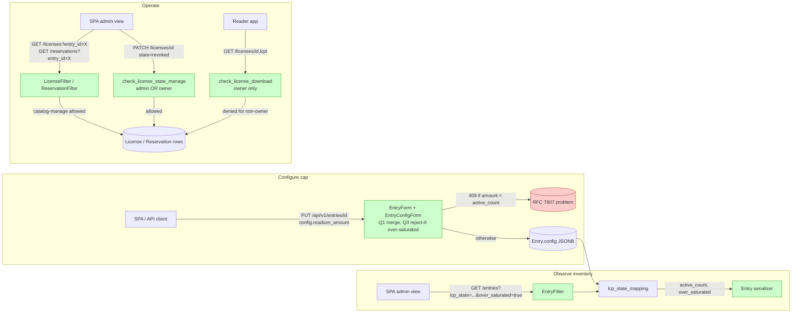

# IP-004: Configure and Operate Per-Entry Active-License Limits

The per-entry concurrent-license ceiling (`Entry.config.readium_amount`) is fully enforced server-side but is not configurable through the API, is not safely changeable while loans exist, and the administrators who set it lack the visibility and permissions they need to manage the resulting library inventory. This proposal closes those administrator-facing gaps as a coherent set so that "limiting active licenses" is a feature operators can actually use, not just a setting that exists.

<!-- more -->

## Status

**Status**: Implemented
**Last Updated**: 2026-05-14
**Implementation**: Complete (Phases 1–6)

## Problem Statement

The Readium LCP integration delivered by [IP-001](ip-001-lcp-opds2-integration.md) treats `Entry.config.readium_amount` as the per-title concurrent-license cap. Enforcement is correct and consistent across the codebase:

- `LicenseService.can_user_borrow` rejects a new license when the count of `READY`/`ACTIVE` licenses overlapping the requested window has reached `readium_amount` (`apps/readium/services/license_service.py:168`).
- `LicenseService.get_entry_availability` builds the per-day slot calendar against the same value (`apps/readium/services/license_service.py:66`).
- `lcp_state_mapping` populates `total_slots`/`available_slots`/`lcp_state` on every entry serializer response (`apps/readium/services/entry_lcp_decorator.py:104`).
- `ReservationService.promote_next` gates queue promotion on the same ceiling (`apps/readium/services/reservation_service.py:153`).
- The OPDS 2.0 manifest builder emits `properties.copies.total` / `properties.copies.available` (`apps/opds2/services/manifest_builder.py:182-202`).

What does **not** work is the operator workflow built around that cap. The audit performed for this proposal found six distinct gaps, each of which is "small" in isolation but together they make the per-entry limit effectively unusable for library staff.

### Current Situation

**G1. `readium_amount` cannot be set via the API.** `EntryConfigForm` (`apps/api/forms/entries.py:51-66`) exposes `readium_enabled` but omits `readium_amount`. There is no `POST`/`PUT` path that accepts the field; only direct JSONB writes work. Default is `1`.

**G2. No value validation.** Direct DB writes can produce `readium_amount=0` or negative values. `lcp_state_mapping` then reports `total_slots=0, available_slots=0` indefinitely with no surfaced error.

**G3. No over-saturation visibility.** `entry_lcp_decorator.py:106` clamps `available_slots = max(0, total - active)`. If an admin reduces the cap from 5 to 2 while 4 licenses are active, the serializer reports `available_slots=0` and the actual over-allocation (`active=4` > `total=2`) is invisible. `active_count` is computed (line 105) but not emitted on the wire.

**G4. Catalog managers cannot list licenses on their own catalog.** `LicenseFilter.qs` (`apps/readium/filters.py:82-83`) is a binary gate: superuser sees everything, everyone else is filtered to their own licenses. A user with `UserCatalog.Mode.MANAGE` on a catalog has no API path to see "who currently holds an active license on entry X" — exactly the information they need to make a cap-reduction decision.

**G5. Catalog managers cannot revoke another user's license.** `check_license_manage` (`apps/core/checkers.py:74-77`) returns `True` only when `obj.user == user`. The license-state PATCH at `apps/readium/views/licenses.py:120` rejects every non-owner attempt with `403`. [IP-003](ip-003-lcp-edrlab-certification.md) Phase 2 ("oversharing & revocation") explicitly says "the existing `check_license_manage` predicate already gates state PATCHes" — that is true mechanically, but the predicate doesn't gate anyone *in* for admin use. The oversharing workflow IP-003 promises cannot actually be exercised by a catalog manager today.

**G6. No "fully borrowed" filter on entries.** The entry list at `/api/v1/entries` surfaces `lcp_state` per entry, but operators cannot filter by it. Listing "all entries currently saturated" requires fetching the whole catalog and post-filtering.

### Pain Points

- **STU library staff cannot configure copy counts.** A textbook with 5 purchased seats is exposed as a single-copy title because the API rejects `readium_amount` on input. (G1)
- **Cap changes are blind operations.** An admin reducing a cap has no way to see who currently holds a license, no signal that the reduction is over-saturating, and no way to do anything about it through the API anyway. (G3, G4, G5)
- **IP-003 Phase 2 oversharing workflow is undeliverable** without a permission fix. The management command `check_overshared_licenses.py` runs as a superuser, but the human SPA workflow doesn't. (G5)
- **EDRLab review impression.** The reviewers will browse the operator surface on the dev instance. A title-edit screen that silently ignores a documented config field, a license collection that doesn't list anything for a logged-in librarian, and a revoke button that returns `403` are all visible failures of operator UX. (G1, G4, G5)
- **Loss of pre-change visibility.** Even read-only saturation reporting (queue depth, fully-borrowed titles, top utilization) is gated behind whole-catalog scans. Bad input for purchasing decisions. (G6)

### Who is Affected

- **STU library staff** managing readium-enabled entries: cannot configure caps, cannot see who holds licenses, cannot revoke.
- **EDRLab reviewers** scoring the operator surface for certification.
- **The SPA team** building the title-edit screen and the oversharing tool, both of which are blocked on backend fixes.
- **Future Slovak universities** adopting the catalog under the multi-tenant rollout — they inherit the same broken operator surface.

### Consequences of Not Addressing

- The per-title cap is documented but not operable.
- IP-003 Phase 2 ships with a permission hole and an unusable revocation workflow.
- Reducing a cap is an "edit JSON in the DB" operation, defeating the audit trail and validation we get from the rest of the entry write path.
- The EDRLab review surfaces the same gaps and we discover them on the worst possible day.

## Proposed Solution

### Overview

Close the six gaps as a single coherent change set. The unifying theme is "make the per-entry cap a feature operators can configure, observe, and operate, not just a value the codebase reads." No new models, no migrations — every change is at the form, serializer, checker, and filter layers.

### Key Components

1. **Configurable cap (G1, G2, Q3 reject)** — Add `readium_amount` to `EntryConfigForm` as `IntegerField(min_value=1)`. Merge `config` with existing instance value on update to preserve omitted keys (Q1). Reject (`409 Conflict` + RFC 7807) any `PUT` that would set `readium_amount` strictly below the current `active_count` (Q3).

2. **Over-saturation visibility for legacy state (G3)** — Emit `active_count` on the entry serializer alongside `total_slots`/`available_slots`. Add a derived boolean `over_saturated = active_count > total_slots`. New writes can no longer create this state after Phase 1, but legacy rows (cap set via direct JSON before this proposal) may already be over-saturated and need a read-side surface for operator remediation. Surface the same fields on the `GET /readium/v1/entries/{id}/availability` payload. OPDS 2.0 `copies` block retains its existing contract (`copies.available` clamps at 0); the richer state lives on the entry serializer.

3. **Admin license / reservation listing (G4)** — Widen `LicenseFilter.qs` and `ReservationFilter.qs` to admit catalog managers (`UserCatalog.Mode.MANAGE`). Row-level visibility including `user_id` and `position` for reservations (Q4). Superuser unchanged.

4. **Admin license management with predicate split (G5, Q2)** — **Split** `LicenseChecker.check_license_manage` into `check_license_state_manage` (admin OR owner — gates PATCH) and `check_license_download` (owner only — gates `.lcpl` download and License Gateway content fetch). Catalog managers can revoke/cancel/return but cannot impersonate users to download licensed content. This is the prerequisite IP-003 Phase 2 is implicitly missing. Ship alongside a wider audit of similar conflated-predicate patterns in `apps/core/checkers.py` (Q2).

5. **Saturation filtering (G6)** — Add `lcp_state` (comma-separated `LcpState` values) and `over_saturated` (boolean, Q3) filters to the entry filter set. Python-level post-filter — `lcp_state_mapping` is already a per-request precomputation. Documented as paginated-admin-only, not full-catalog scans.

6. **Documentation & operator playbook** — Update `docs/catalog-wiki/Readium-LCP-Integration.md` with API examples, the hard-reject cap-reduction operator playbook (list → revoke → retry), the catalog-manager permission boundaries, and a `over_saturated=true` filter recipe for legacy-state cleanup. Commit `docs/security/predicate-audit-ip004.md` from the Phase 4 audit. Include the one-off SQL audit query (Q6) for reviewers.

### Architecture



Green nodes are the touched surfaces; everything else already exists.

## Implementation Plan

### Phase 1: Configure the Cap (G1, G2, Q3 reject semantics)

- [ ] `apps/api/forms/entries.py`: add `readium_amount = forms.IntegerField(required=False, min_value=1)` to `EntryConfigForm`. No upper bound per Q5.
- [ ] In `EntryForm.clean` (or nearest appropriate hook), merge incoming `config` with the existing instance value (per Q1 resolution): `cleaned_data["config"] = (self.instance.config or {}) | cleaned_data["config"]`. This is added unconditionally — fixes the latent partial-update bug for all `config` keys, not just `readium_amount`.
- [ ] In `EntryForm.clean`, add a cap-reduction safety check (per Q3 resolution): if the new `readium_amount` is strictly less than the entry's current `active_count`, raise `ValidationError` mapped to `409 Conflict` + RFC 7807 with `detail_type=READIUM_AMOUNT_BELOW_ACTIVE_COUNT` and a payload including `current_active_count`, `requested_readium_amount`, and `licenses_url`.
- [ ] Add `DetailType.READIUM_AMOUNT_BELOW_ACTIVE_COUNT` to the error-type enum (`apps/core/errors.py` or equivalent).
- [ ] Tests in `apps/api/tests/test_entries.py` (or nearest):
    - `test_create_entry_with_readium_amount_persists_value`
    - `test_update_entry_readium_amount_updates_serializer_total_slots`
    - `test_readium_amount_below_one_returns_400_problem_detail`
    - `test_omitting_readium_amount_preserves_existing_value`
    - `test_omitting_config_keys_preserves_all_other_keys` (broader merge contract)
    - `test_reducing_readium_amount_below_active_count_returns_409_problem_detail`
    - `test_reducing_readium_amount_to_equal_active_count_succeeds`
    - `test_reducing_readium_amount_when_no_active_licenses_succeeds`
    - `test_409_payload_includes_current_active_count_and_licenses_url`

### Phase 2: Over-Saturation Visibility for Legacy State (G3)

Phase 1's validator prevents *new* over-saturated writes (Q3 reject). This phase surfaces the *pre-existing* over-saturated state on read paths so operators can find and remediate legacy entries.

- [ ] Extend `LcpState` resolution and `lcp_state_mapping` (`apps/readium/services/entry_lcp_decorator.py`):
    - Emit `active_count` (already computed at line 105, just return it)
    - Emit `over_saturated = active_count > total_slots` boolean
- [ ] Extend `EntrySerializer.Base` (`apps/api/serializers/entries.py`) with the two new fields, defaulting to `0` and `False` and resolved via the existing `_resolve_lcp_field` validator pattern.
- [ ] Extend `LicenseService.get_entry_availability` to return `active_count` and `over_saturated` at the top level of the response and on each calendar day where applicable.
- [ ] Tests:
    - `test_entry_serializer_reports_active_count`
    - `test_entry_serializer_reports_over_saturated_for_legacy_entry` (seed via direct ORM write to bypass the form validator; assert serializer reports the mismatch)
    - `test_availability_calendar_reports_over_saturated`
    - `test_new_writes_cannot_produce_over_saturated_state` (assert the Phase 1 validator path)

### Phase 3: Admin License & Reservation Listing (G4, Q4)

- [ ] In `apps/readium/filters.py`, widen `LicenseFilter.qs` (currently lines 75-85):
    - Superuser: unchanged (sees all).
    - Otherwise: union of (a) licenses where `user == request.user` and (b) licenses where `entry.catalog` has a `UserCatalog` row for `request.user` with `mode=MANAGE`.
- [ ] Apply the same widening pattern to `ReservationFilter.qs` (currently lines 108-118). Row-level visibility including `user_id`, `position`, `requested_at`, `available_at`, `claim_deadline`, `status` (Q4 resolution — no anonymization).
- [ ] Tests:
    - `test_catalog_manager_sees_licenses_in_their_catalog`
    - `test_catalog_manager_does_not_see_licenses_in_other_catalogs`
    - `test_non_manager_sees_only_own_licenses`
    - `test_catalog_manager_sees_reservations_in_their_catalog`
    - `test_catalog_manager_does_not_see_reservations_in_other_catalogs`
    - `test_non_manager_sees_only_own_reservations`
    - `test_reservation_response_includes_user_id_for_catalog_managers`

### Phase 4: Admin License Management & Predicate Audit (G5 — IP-003 prerequisite, Q2 resolution)

- [ ] In `apps/core/checkers.py`, **split** `LicenseChecker` into two predicates:
    - `check_license_state_manage(user, obj)` — gates `PATCH /readium/v1/licenses/{id}`. Returns `True` if `user.is_superuser`, OR `obj.user == user`, OR `obj.entry.catalog.user_catalogs.filter(user=user, mode=UserCatalog.Mode.MANAGE).exists()`.
    - `check_license_download(user, obj)` — gates `.lcpl` download via `apps/readium/views/download.py:35` and the License Gateway content endpoint. Returns `True` only if `obj.user == user` (admins cannot impersonate users when fetching licensed content). Superuser is intentionally NOT exempted here; if break-glass is ever needed, route it through a separate audited management command, not the regular download endpoint.
- [ ] Update call sites:
    - `apps/readium/views/licenses.py:120` → `check_license_state_manage`
    - `apps/readium/views/download.py:35` → `check_license_download`
    - License Gateway / fresh-license fetch endpoints → `check_license_download`
- [ ] **Predicate audit** (per Q2 resolution). Sweep all predicates in `apps/core/checkers.py` for the "single predicate covers multiple operations with different blast radii" antipattern. Specific candidates:
    - `check_entry_manage` — evaluate whether entry delete needs a stronger predicate than entry edit/config.
    - `check_user_acquisition_read` — listing vs encrypted-content download (very likely needs splitting, same shape as the license bug).
    - `check_catalog_read` — catalog metadata vs entry listing (probably intentional; confirm and document).
    - `check_shelf_record_access` — verify scope is narrow.
    For each finding, classify as **SPLIT** (implement now), **INTENTIONAL** (document why), or **DEFERRED** (open follow-up issue). Record in `docs/security/predicate-audit-ip004.md`. Any **SPLIT** outcomes ship in this phase with their own tests.
- [ ] Tests:
    - `test_catalog_manager_can_revoke_other_users_license`
    - `test_catalog_manager_cannot_download_other_users_license_content`
    - `test_non_manager_cannot_revoke_other_users_license`
    - `test_superuser_can_revoke_any_license`
    - `test_superuser_cannot_download_other_users_license_content` (intentional split — break-glass via management command, not API)
    - Additional tests for any SPLIT outcomes from the predicate audit.
- [ ] Update [IP-003](ip-003-lcp-edrlab-certification.md) Phase 2 to reference IP-004 as a prerequisite and remove the misleading "predicate already gates" framing.

### Phase 5: Saturation Filtering (G6)

- [ ] In `apps/api/filters/entries.py`, add an `lcp_state` filter accepting a comma-separated list of `LcpState` enum values, using the request-scoped `lcp_state_mapping` (post-filter in Python — the value is computed, not stored). Document the performance characteristic (linear in catalog size; paginated admin views, not full-catalog scans).
- [ ] Add an `over_saturated` boolean filter (per Q3 resolution — operators need a way to find pre-existing over-saturated entries for manual cleanup).
- [ ] Tests:
    - `test_filter_entries_by_lcp_state_fully_borrowed`
    - `test_filter_entries_by_multiple_lcp_states`
    - `test_filter_lcp_state_with_pagination_respects_total_count`
    - `test_filter_entries_by_over_saturated_true`
    - `test_filter_entries_by_over_saturated_false`

### Phase 6: Documentation & Playbook

- [ ] Update `docs/catalog-wiki/Readium-LCP-Integration.md`:
    - Replace the "set the JSON field directly" framing in the "Entry Configuration" section (lines 571-582) with a `PUT /api/v1/entries/{id}` example.
    - Add a "Reducing the cap" subsection documenting **hard reject on over-saturation** (per Q3 resolution): the API returns `409 Conflict` + RFC 7807 if the new `readium_amount` is below the current `active_count`. Operator playbook: list active licenses (`GET /readium/v1/licenses?entry_id=…&state=active`), revoke or wait for natural attrition until `active_count <= desired_amount`, then retry the `PUT`. Show the exact 409 payload shape.
    - Document the catalog-manager-can-list/revoke scope under "Permissions" (cite the `check_license_state_manage` / `check_license_download` split).
    - Add a "Detecting pre-existing over-saturation" note pointing operators at `GET /api/v1/entries?over_saturated=true` for legacy entries written before this validator existed.
- [ ] Include the one-off SQL audit query (per Q6 resolution) for code reviewers to run against dev/production during PR review.
- [ ] Update IP-003 Phase 2 cross-reference (one-line edit pointing at IP-004 + remove the "predicate already gates" misclaim).
- [ ] Commit `docs/security/predicate-audit-ip004.md` produced by the Phase 4 audit.
- [ ] Regenerate OpenAPI: `python manage.py openapi`.

### Prerequisites

None. All changes are on existing models, forms, filters, checkers, and serializers.

## Technical Details

### Technology Stack

Existing Django + `django_api_forms` + django-filter + Pydantic v2. No new dependencies.

### Data Model Changes

None.

### API Changes

**Entry config writes:**

```http
PUT /api/v1/entries/{id} HTTP/1.1
Content-Type: application/json

{
  "config": {
    "readium_enabled": true,
    "readium_amount": 5
  }
}
```

`readium_amount < 1` → `400` RFC 7807. Omitting `readium_amount` from a `PUT` preserves the stored value (per Q1 resolution).

**Entry reads (new fields, additive):**

```jsonc
{
  "id": "…",
  "total_slots": 2,
  "available_slots": 0,
  "active_count": 4,         // NEW
  "over_saturated": true,    // NEW
  "lcp_state": "fully_borrowed",
  // …
}
```

**Entry list filtering:**

```
GET /api/v1/entries?lcp_state=fully_borrowed
GET /api/v1/entries?lcp_state=fully_borrowed,available_in_days
```

**License list — catalog managers:**

```
GET /readium/v1/licenses?entry_id=<uuid>
```

Now returns rows for catalog managers (over entries in catalogs they manage), not just license owners or superusers.

**License state PATCH — catalog managers:**

```
PATCH /readium/v1/licenses/{id} { "state": "revoked" }
```

Now succeeds for catalog managers; previously `403` for any non-owner. Gated by `check_license_state_manage`.

**License `.lcpl` download — owner only (unchanged + hardened):**

```
GET /readium/v1/licenses/{id}.lcpl
```

Continues to require ownership. Gated by the new `check_license_download` predicate. Catalog managers and superusers are NOT exempted — break-glass via management command only.

**Cap-reduction conflict response (per Q3):**

```http
HTTP/1.1 409 Conflict
Content-Type: application/problem+json

{
  "type": ".../readium/readium-amount-below-active-count",
  "title": "Cannot reduce readium_amount below current active license count",
  "status": 409,
  "detail_type": "READIUM_AMOUNT_BELOW_ACTIVE_COUNT",
  "current_active_count": 4,
  "requested_readium_amount": 2,
  "licenses_url": "/readium/v1/licenses?entry_id={uuid}&state=active"
}
```

### Configuration

None added at the settings layer. All decisions are per-entry.

## Alternatives Considered

### Alternative 1: Just Phase 1 (form fix only)

**Description**: Original scope of this proposal — add the form field and stop there. Everything else (visibility, permissions, filtering) deferred.

**Pros**:

- Smallest possible change.
- Easy to ship behind a single PR.

**Cons**:

- Leaves G3–G6 unaddressed. The cap remains a setting admins can change but cannot safely operate around.
- Leaves IP-003 Phase 2 with a hidden permission gap that will only surface when STU library staff try to use the oversharing UI.
- Reviewer asked explicitly for "all required administrator stuff" — Phase 1 alone fails the brief.

**Why not chosen**: Identifying the gaps and not fixing them is worse than not having looked.

### Alternative 2: Build an `/admin/lcp-stats` mega-endpoint

**Description**: A single staff-only endpoint returning saturation metrics, per-entry license rosters, queue depths, etc. — replaces filtering on the standard collections.

**Pros**:

- One endpoint, one place to optimize.
- Could be cached.

**Cons**:

- Duplicates information already on the entry and license collections.
- Forces the SPA to maintain a separate fetch path for admin views.
- Filtering the existing collections (Phases 3, 5) is strictly more general and composable.

**Why not chosen**: The existing API surface, slightly widened, does the job better.

### Alternative 3: Soft reduction (allow but warn)

**Description**: Cap reduction succeeds even when it over-saturates; the `over_saturated=true` flag is the operator's signal. SPA renders a confirmation modal client-side.

**Pros**:

- Lower friction for legitimate cap reductions.
- Keeps the API REST-y (no special status code for over-saturation).

**Cons**:

- A typo (`readium_amount=2` instead of `20`) silently puts the entry into an over-saturated state.
- Pushes safety into the SPA — non-SPA API clients (CLI scripts, future integrations) get no protection.
- Library staff expect cap edits to be reversible-by-revocation, not "ambient state."

**Why not chosen**: Resolution Q3 selected hard reject (current proposal). Reject is the conservative default and forces the operator to make an explicit revocation decision before reducing the cap.

### Alternative 4: Cascading revoke on cap decrease

**Description**: When admin reduces the cap below the current active count, automatically revoke the most-recently-issued licenses to bring `active_count` ≤ new cap.

**Pros**:

- Immediately consistent inventory.

**Cons**:

- Surprising side effect of a config edit — silently invalidating users' loans.
- Conflicts with library/lending conventions ("loans-in-flight are honored").
- LCP revocation is a customer-visible event (status server flips state) — embedding it in a config save is a footgun.

**Why not chosen**: Mutating user-visible license state as a side effect of a config edit violates the principle of least surprise. The reject behavior (Q3 resolution) gives the operator the explicit choice.

## Trade-offs and Risks

### Trade-offs

- **Splitting `check_license_manage` into two predicates slightly increases the surface to keep in sync.** Mitigated by the predicate-audit deliverable (`docs/security/predicate-audit-ip004.md`) which classifies all conflated predicates and documents the split rationale once.
- **Hard reject on cap reduction (Q3) adds friction for legitimate reductions.** An admin who genuinely wants to reduce the cap must first revoke licenses. This is intentional — the friction is the safety mechanism. Phase 4 makes revocation a one-call operation, so the friction is bounded.
- **`lcp_state` and `over_saturated` filters (Phase 5) are Python-level, not SQL.** Must run after `lcp_state_mapping`. Acceptable for paginated admin views; documented in API help text. Switching to SQL would require materializing `active_count` on the entry row, which is a much larger change.
- **Legacy over-saturated entries persist until manually remediated.** Phase 1's validator prevents new bad writes, but entries with `active_count > total_slots` set via direct JSON before this lands stay that way until an operator filters by `over_saturated=true` and revokes excess licenses. Documented in Phase 6.

### Risks

| Risk | Impact | Mitigation |
|------|--------|-----------|
| Q1 merge step accidentally introduces a regression on `config` keys with falsy values (e.g., `evilflowers_ip_block=false` being treated as "omitted") | Medium | Use `(self.instance.config or {}) \| cleaned_data["config"]` (dict union, not `dict.update` style) — this preserves explicit `False`/`0` writes from the incoming payload. Backfill test covers every key in `EntryConfig`. |
| Phase 3 widening accidentally exposes system-owned licenses | Low | All licenses belong to a real `User`; no system principal owns licenses today. Tests cover the negative case. |
| Phase 4 predicate split is incomplete — some call site still uses the old predicate name and silently grants admin download | High | Type-checking via mypy + the predicate audit + grep-based call-site sweep. Tests assert admin-cannot-download for every download-related endpoint. |
| Phase 4 predicate audit surfaces a third class of conflated predicate that wasn't anticipated and balloons scope | Medium | Audit doc classifies each finding as **SPLIT** (this PR), **INTENTIONAL** (document), or **DEFERRED** (follow-up issue). Scope creep is explicit and reviewable. |
| Q3 reject behavior masks operator intent — admin doesn't realize there are active licenses and gets confused by 409 | Low | The 409 payload includes `current_active_count` and `licenses_url` pointing directly at the active-license collection. The error is actionable. |
| Phase 5 filter performance on large catalogs | Low | Document as paginated-only. Out-of-scope to materialize a SQL-friendly column in this proposal. |
| OpenAPI consumers don't see new fields until spec regen | Low | Phase 6 covers regen. |

## Open Questions

See Review Questions section.

## Success Criteria

- [ ] `PUT /api/v1/entries/{id}` with `config.readium_amount=5` persists the value; subsequent `GET` returns `total_slots: 5`.
- [ ] `PUT` with `config.readium_amount=0` returns `400` + RFC 7807.
- [ ] `PUT` without `config.readium_amount` does not change the stored value (Q1 partial-update merge).
- [ ] `PUT` that would reduce `readium_amount` below the current `active_count` returns `409 Conflict` + RFC 7807 with `detail_type=READIUM_AMOUNT_BELOW_ACTIVE_COUNT`, `current_active_count`, `requested_readium_amount`, and `licenses_url` (Q3 hard reject).
- [ ] `PUT` that reduces `readium_amount` to exactly `active_count` (or above) succeeds.
- [ ] Pre-existing over-saturated entries (legacy data) show `over_saturated: true` and `active_count > total_slots` on the entry serializer and availability calendar.
- [ ] `GET /api/v1/entries?over_saturated=true` returns only those legacy over-saturated entries.
- [ ] `GET /api/v1/entries?lcp_state=fully_borrowed` returns only entries currently saturated.
- [ ] OPDS 2.0 `properties.copies.total` reflects the new value on the next feed render.
- [ ] A catalog manager (non-superuser) can `GET /readium/v1/licenses?entry_id=X` and see all rows for entries in their catalog.
- [ ] A catalog manager (non-superuser) can `GET /readium/v1/reservations?entry_id=X` and see queue rows with `user_id` and `position` (Q4 row-level visibility).
- [ ] A catalog manager (non-superuser) can `PATCH /readium/v1/licenses/{id} { "state": "revoked" }` for a license they did not personally issue (`check_license_state_manage` allows).
- [ ] A catalog manager (non-superuser) **cannot** download encrypted content for another user's license (`check_license_download` denies). A superuser cannot either — break-glass via management command only (Q2 split).
- [ ] `docs/security/predicate-audit-ip004.md` is committed and classifies every predicate in `apps/core/checkers.py` as SPLIT / INTENTIONAL / DEFERRED.
- [ ] IP-003 Phase 2 cross-reference updated to point at IP-004 as a prerequisite.
- [ ] OpenAPI spec lists the new fields, filters, and the `readium_amount` field on `EntryConfig` with `minimum: 1`.

## Future Considerations

Captured during the IP-004 audit. Each is real but defers cleanly.

- **Per-user concurrent-loan cap.** A new `EVILFLOWERS_READIUM_MAX_LOANS_PER_USER` setting enforced in `LicenseService.can_user_borrow`, optionally overridable per catalog. Today a user can hold one license on every entry simultaneously — the only cap is "one active license per (entry, user)."
- **Catalog-level default for `readium_amount`.** `Catalog.config.readium_amount_default` so institutions set one value rather than touching every entry.
- **Bulk cap updates.** `PATCH /api/v1/catalogs/{id}/entries` with `{"config": {"readium_amount": N}, "filter": {"publisher": "..."}}` to set caps across many entries at once.
- **Audit log of cap changes.** `EntryConfigChangeLog` model recording who changed what and when, useful for EDRLab compliance and post-incident review. Cross-cuts beyond `readium_amount` — should be a broader audit-log proposal.
- **Saturation dashboard endpoint.** Aggregate `/api/v1/catalogs/{id}/lcp-stats` with top-borrowed, % saturation distribution, queue-depth histograms. Phase 5 filter unblocks the SPA from building this client-side; a server-side aggregate becomes worthwhile once usage data justifies it.
- **OPDS 1.2 copies surfacing.** OPDS 1.2 emits a `borrow` link but no copies count. Document as a known limitation; a non-standard extension would carry risk.
- **Model-level guard on direct JSON writes.** A JSONField-level validator catching `readium_amount<1` written outside the form, useful if oversight reveals manual SQL editing in production.
- **`evilflowers_render_type` parity.** This audit only touched `readium_amount`; the same form-omission pattern may exist for other config keys. Worth a one-shot sweep.

## References

- [IP-001: Complete LCP Integration & OPDS 2.0 Server with Readium Borrowing](ip-001-lcp-opds2-integration.md) — original integration that introduced `readium_amount` semantics.
- [IP-003: Readium LCP — EDRLab Certification Readiness](ip-003-lcp-edrlab-certification.md) — Phase 2 (oversharing & revocation) depends on G5 being fixed.
- [Readium LCP License Server API](https://github.com/readium/readium-lcp-server/wiki/LCP-License-Server-API) — confirms LCP itself has no concurrent-loan semantics; the cap is the provider's responsibility.
- `apps/core/models/entry.py:24-49` — `EntryConfig` typed dict and `default_entry_config()`.
- `apps/api/forms/entries.py:51-66` — `EntryConfigForm` (Phase 1).
- `apps/api/serializers/entries.py:104-131` — `EntrySerializer.Base` and `_resolve_lcp_field` (Phase 2).
- `apps/readium/services/entry_lcp_decorator.py:91-148` — `_resolve_one` (Phase 2 source-of-truth).
- `apps/readium/filters.py:75-118` — `LicenseFilter.qs`, `ReservationFilter.qs` (Phase 3).
- `apps/core/checkers.py:74-77` — `LicenseChecker.check_license_manage` (Phase 4 splits this into `check_license_state_manage` and `check_license_download`).
- `apps/api/filters/entries.py` — entry filter set (Phase 5).
- `apps/readium/services/license_service.py:66, 168` — enforcement points.
- `apps/opds2/services/manifest_builder.py:182-202` — OPDS 2.0 copies surface.

## Review Questions

**Status**: ✅ Resolved
**Review Date**: 2026-05-13
**Reviewer**: Claude AI

---

### Q1 🔴: Partial-update semantics of `EntryConfigForm`

**Issue**: `EntryConfigForm` uses the default population strategy on `EntryForm` (`apps/api/forms/entries.py:71-74` declares `BaseStrategy` for `config`). It is unclear from inspection whether a `PUT /api/v1/entries/{id}` body containing `config: { "readium_enabled": true }` (no `readium_amount`) preserves the previously-stored `readium_amount` value or replaces the whole `config` dict (wiping the omitted key).

**Context**: Determines the Phase 1 test plan and whether we ship an additional `EntryForm.clean` merge step. Affects *all* `config` keys, not just `readium_amount` — surfacing a pre-existing bug rather than creating one.

**Question**: What is the desired semantics for `PUT` on `config`?

**Options**:

- [X] **A**: Partial update — omitted keys preserved (Recommended). Matches REST conventions and the merge pattern `Entry.read_config` already applies. If current implementation does not do this, fix in Phase 1 with `cleaned_data["config"] = (instance.config or {}) | cleaned_data["config"]` shim in `EntryForm.clean` (or equivalent hook).
- [ ] **B**: Full replacement — clients must send the complete `config` dict on every update.
- [ ] **C**: Empirical inspection first — write a regression test against current behaviour, decide based on what it reveals.

**Answer**:

```
Use the same approach as was used till now. We have default values introduced on each deploy using management command
- introduce reasonable default (1 i guess) and use properly. FE knows which fields to update.
```

**Resolution**:

```
Adopt option A (partial update). Concrete changes:

- Phase 1 adds `readium_amount = forms.IntegerField(required=False, min_value=1)`
  to `EntryConfigForm` (apps/api/forms/entries.py).
- `EntryForm.clean` is extended to merge incoming `config` with the existing
  instance's stored `config` before save:

      cleaned_data["config"] = (self.instance.config or {}) | cleaned_data["config"]

  This is added unconditionally — it fixes the latent gap for ALL `config`
  keys, not just `readium_amount`. The merge is one line; a regression test
  asserts that a `PUT` containing only `{"config": {"readium_enabled": true}}`
  preserves the previously-stored `readium_amount`.
- The existing `python manage.py setup` lifecycle is unchanged; deployments
  rely on it to backfill defaults (`readium_amount=1`) for entries that
  predate the field. No new heal command (see Q6).
- The four-test plan stays as written; the "omitting preserves value" test
  is now an explicit assertion of the merge contract rather than a
  bug-discovery probe.
```

---

### Q2 🔴: Split `check_license_manage` along download vs state-change axis

**Issue**: Phase 4 widens `check_license_manage` to admit catalog managers. The same predicate currently gates both `PATCH /readium/v1/licenses/{id}` (state change — admin-appropriate) and `GET /readium/v1/licenses/{id}.lcpl` download via `apps/readium/views/download.py:35` (content access — *not* admin-appropriate; admins should not be able to download a user's licensed content under their own identity).

**Context**: Widening a single predicate to allow admin revocation accidentally hands admins the ability to download every user's `.lcpl`. LCP licenses are user-scoped artifacts; admin download is a real exfiltration vector and would be flagged by EDRLab.

**Question**: How should we partition the permission?

**Options**:

- [X] **A**: Split into two predicates — `check_license_state_manage` (admin OR owner, gates PATCH) and `check_license_download` (owner-only, gates `.lcpl` download) (Recommended). Cleanest separation; matches the actual operations.
- [ ] **B**: Keep one predicate; gate the download endpoint behind an additional `obj.user == user` check inline. Less symmetric, easier merge.
- [ ] **C**: Allow admin download too, log it explicitly. Aligns with "admin sees everything" but violates the LCP user-scoping contract.

**Answer**:

```
Yes - this is why we have this proposal. Check for more - align / split properly.
```

**Resolution**:

```
Adopt option A (split into two predicates) AND widen the audit. Phase 4 is
restructured:

- Split LicenseChecker (apps/core/checkers.py) into:
    * `check_license_state_manage` (admin OR owner) — gates
      `PATCH /readium/v1/licenses/{id}` (state changes: return, revoke,
      cancel, renew).
    * `check_license_download`     (owner only)     — gates `.lcpl`
      download via apps/readium/views/download.py and the License Gateway
      content endpoint. Catalog managers cannot impersonate users when
      fetching licensed content.

- Add a new sub-task: full audit of apps/core/checkers.py for the same
  "single predicate covers multiple operations with different blast radii"
  antipattern. Specific candidates to evaluate:
    * `check_entry_manage` — currently gates edit AND delete AND config
      changes uniformly. Decide whether deletion should require a strictly
      stronger predicate.
    * `check_user_acquisition_read` — gates listing AND encrypted content
      download. Same shape as the license bug; very likely needs splitting.
    * `check_catalog_read` — gates catalog metadata AND child entry listing.
      Probably intentional; document the decision either way.
    * `check_shelf_record_access` — appears narrowly-scoped already; verify.

  Each finding is recorded in `docs/security/predicate-audit-ip004.md` with
  one of three outcomes:
    1. SPLIT — implement now alongside the license fix.
    2. INTENTIONAL — document why the conflation is correct.
    3. DEFERRED — open a follow-up issue, link from the audit doc.

- Tests in Phase 4 (already listed) cover the license split. The audit
  document is the deliverable for the wider sweep; any SPLIT findings get
  their own test cases under the same Phase 4.
```

---

### Q3 ⚠️: Cap-reduction safety — warn-only vs require-confirmation

**Issue**: Phase 1 + Phase 2 together let an admin reduce `readium_amount` from 5 to 2 while 4 licenses are active. Soft reduction is documented as the intended behaviour. The question is whether the `PUT` should *succeed silently* (just flipping `over_saturated=true` in the next read) or *require an explicit override flag* (e.g., `?confirm_oversaturation=true`) when the reduction over-saturates.

**Context**: Admins making this change on purpose are fine. Admins making it by typo (intending `readium_amount=20`, typing `2`) currently get no signal at write time.

**Question**: How firm should the safety rail be?

**Options**:

- [ ] **A**: Warn-only — `PUT` always succeeds; response body includes a `warnings: ["over_saturated_after_change"]` envelope when applicable; SPA renders a confirmation modal client-side (Recommended). Keeps the API REST-y, puts UX in the SPA.
- [ ] **B**: Require `?confirm_oversaturation=true` query flag when the reduction over-saturates; otherwise return `409 Conflict` with RFC 7807. Stronger server-side rail, more friction for legitimate cap reductions.
- [X] **C**: Reject the change entirely if it would over-saturate; admin must revoke licenses first. Most conservative; aligns with how some library systems behave.

**Answer**:

```
Rather reject and return proper exception.
```

**Resolution**:

```
Adopt option C (hard reject with RFC 7807). Concrete changes:

- Phase 1 / EntryConfigForm gains a clean-time validator: if the incoming
  `readium_amount` is less than the entry's current `active_count`
  (`License.objects.filter(entry=entry, state__in=[READY, ACTIVE],
   expires_at__gt=now).count()`), raise `ValidationError` mapped to:

      HTTP 409 Conflict
      Content-Type: application/problem+json
      {
        "type": ".../readium/readium-amount-below-active-count",
        "title": "Cannot reduce readium_amount below current active license count",
        "status": 409,
        "detail_type": "READIUM_AMOUNT_BELOW_ACTIVE_COUNT",
        "current_active_count": 4,
        "requested_readium_amount": 2,
        "licenses_url": "/readium/v1/licenses?entry_id={uuid}&state=active"
      }

  Add a `DetailType.READIUM_AMOUNT_BELOW_ACTIVE_COUNT` enum value in
  apps/core/errors.py (or wherever the enum lives).

- Operator playbook: to reduce below the current active count, the admin
  must first revoke (or wait for) licenses until `active_count <= desired`.
  Phase 4 already gives them the API to do this.

- Phase 2 (over-saturation visibility) is RETAINED. `active_count` and
  `over_saturated` still ship on the serializer/availability calendar —
  they cover the pre-existing case (entries with bad caps written via
  direct JSON before this proposal lands). New writes after Phase 1 can
  no longer produce that state, but reads of legacy state still need to
  surface it.

- Phase 5 (saturation filter) gains an explicit `over_saturated=true`
  filter alongside `lcp_state` so operators can find pre-existing
  over-saturated entries to remediate manually.

- Phase 6 documentation:
    * "Reducing the cap" section explicitly documents the reject behaviour,
      shows the 409 payload, and walks through the operator playbook
      (list active licenses → revoke or wait → retry PUT).
    * Mentions that the validator is conservative: equality is allowed
      (`readium_amount == active_count` succeeds; only strict-less-than
      rejects).

- Tests added:
    * `test_reducing_readium_amount_below_active_count_returns_409_problem_detail`
    * `test_reducing_readium_amount_to_equal_active_count_succeeds`
    * `test_reducing_readium_amount_when_no_active_licenses_succeeds`
    * `test_409_payload_includes_current_active_count_and_licenses_url`
```

---

### Q4 ⚠️: Catalog-manager visibility on `Reservation` list

**Issue**: Phase 3 widens `ReservationFilter.qs` symmetrically with `LicenseFilter`. This means a catalog manager would see every reservation row for their catalog, including the requesting user's identity. The reservation row is less sensitive than the license (no content access), but it does expose "user X wants book Y."

**Context**: Library staff routinely need queue visibility to plan acquisitions (long queues = buy more copies). Whether this view should be aggregated (only show counts) or row-level (show user IDs) is a privacy decision.

**Question**: What level of reservation visibility do catalog managers need?

**Options**:

- [X] **A**: Row-level, including user_id and position (Recommended). Matches the level of visibility they already have on `License` rows after Phase 3. Privacy is governed by the institutional relationship (the manager is library staff, the user is a library patron).
- [ ] **B**: Aggregate-only — a separate `/api/v1/catalogs/{id}/queues` endpoint that returns `entry_id → queue_length`, never user identities.
- [ ] **C**: Row-level but anonymized — return user_id as a hash, with a separate "reveal" endpoint that requires a justified reason. Highest friction; overkill for the STU context.

**Answer**:

```
We can do that
```

**Resolution**:

```
Adopt option A (row-level visibility). Phase 3 widens ReservationFilter.qs
symmetric with LicenseFilter.qs:

- Superuser: unchanged (sees all).
- Catalog manager (UserCatalog.Mode.MANAGE): sees reservations on entries
  in their catalog, with full row data — `user_id`, `position`,
  `requested_at`, `available_at`, `claim_deadline`, `status`.
- Anyone else: sees only their own reservations (current behaviour).

No anonymization layer. Institutional context (library staff ↔ library
patron) covers privacy.

Tests added:
- `test_catalog_manager_sees_reservations_in_their_catalog`
- `test_catalog_manager_does_not_see_reservations_in_other_catalogs`
- `test_non_manager_sees_only_own_reservations`
- `test_reservation_response_includes_user_id_for_catalog_managers`
```

---

### Q5 ℹ️: Maximum-value cap on `readium_amount`

**Issue**: Phase 1 adds `min_value=1` but no `max_value`. Staff could set `readium_amount=10_000` either by typo or to effectively disable the cap.

**Context**: A very large value silently disables the throughput limit and may confuse OPDS consumers rendering `copies.total`. A hard cap is arbitrary — institutions may legitimately license thousands of seats for a popular textbook.

**Question**: Should we cap `readium_amount`?

**Options**:

- [X] **A**: No cap (Recommended). Trust staff; SPA can surface a soft warning at large values.
- [ ] **B**: Cap at a reasonable maximum (e.g. `max_value=10_000`). Catches typos but is arbitrary.
- [ ] **C**: Make the cap a settings value (`EVILFLOWERS_READIUM_MAX_AMOUNT_PER_ENTRY`, default unset). Configurable per deployment, more complexity.

**Answer**:

```
This is configuration issue - don't be weird
```

**Resolution**:

```
Adopt option A (no upper cap). Final form-field definition:

    readium_amount = forms.IntegerField(required=False, min_value=1)

No `max_value`, no `EVILFLOWERS_READIUM_MAX_AMOUNT_PER_ENTRY` settings key.
The cap is a per-entry library-operations concern, not a deployment-level
guardrail.

If an institution ever needs a typo-guard at large values, the SPA can add
a client-side soft warning ("you entered 10,000 — confirm?"). Out of scope
here.
```

---

### Q6 ℹ️: Heal command for pre-existing bad values

**Issue**: The validator runs at the form layer only. Existing rows with `readium_amount=0` or with the key missing despite `readium_enabled=true` are not detected by this change.

**Context**: A quick audit query against the STU dev/production instances would tell us whether any such rows exist; whether to ship a fixup command depends on the answer.

**Question**: Should the implementation include a heal step?

**Options**:

- [X] **A**: Defer — run a one-off SQL audit during code review; ship a heal command only if rows are found (Recommended).
- [ ] **B**: Ship `manage.py heal_readium_amount` — sets `readium_amount=max(1, current)` on every readium-enabled entry. Idempotent, safe to re-run.
- [ ] **C**: Data migration that does the heal automatically. Safest, most invasive.

**Answer**:

```
Do not overengineer.
```

**Resolution**:

```
Adopt option A (defer). No heal command, no data migration, no permanent
tooling.

Phase 6 documentation includes a one-off SQL audit query for code reviewers
to run against dev/production during PR review:

    SELECT id, title, catalog_id, config->>'readium_amount' AS amount
      FROM entries
     WHERE config->>'readium_enabled' = 'true'
       AND (config->>'readium_amount' IS NULL
            OR (config->>'readium_amount')::int < 1);

Any rows surfaced are fixed with a direct UPDATE at deploy time. The form
validator from Q5 prevents new bad rows; existing bad rows are a one-off
cleanup, not an ongoing concern that justifies a management command.
```

---

## Changelog

| Date | Author | Changes |
|------|--------|---------|
| 2026-05-13 | jdubec | Initial draft based on May 2026 audit of `readium_amount` configurability gap; scope confirmed via review session (form fix only; per-user cap, catalog default, ops dashboard deferred). |
| 2026-05-13 | jdubec | Added Review Questions Q1–Q3 (partial-update semantics, max-value cap, heal command). |
| 2026-05-13 | jdubec | Expanded scope to cover full administrator surface: G3 over-saturation visibility, G4 catalog-manager license listing, G5 catalog-manager license management (IP-003 Phase 2 prerequisite), G6 saturation filtering. Added Phases 2–6 and Review Q1–Q6 (renumbered; added Q2 download/state split, Q3 cap-reduction safety, Q4 reservation privacy). Updated risks, success criteria, and IP-003 cross-reference. |
| 2026-05-13 | jdubec | Resolved review questions and updated proposal accordingly. Q1: adopt partial-update merge in `EntryForm.clean` (fixes latent bug for all `config` keys). Q2: split `check_license_manage` into `check_license_state_manage` (admin OR owner) and `check_license_download` (owner only) + commit a wider predicate audit at `docs/security/predicate-audit-ip004.md`. Q3: hard-reject cap reduction with `409` + RFC 7807 (replaces the warn-only/soft-reduction framing); legacy over-saturated rows surfaced via `over_saturated=true` filter. Q4: row-level reservation visibility for catalog managers. Q5: no upper bound on `readium_amount` (per-deployment concern, not model). Q6: defer heal command, ship one-off SQL audit query in docs. Phase 1 and Phase 4 tasks expanded; alternatives 3 and 4 split (Alt-3 documents the rejected soft-reduction approach for posterity). Status updated to ✅ Resolved. |
| 2026-05-13 | jdubec | Aligned remaining body sections with resolutions: updated Architecture mermaid (predicate split + 409 path), retitled Phase 2 to "Over-Saturation Visibility for Legacy State", expanded Phase 2 test plan to cover the new-writes-cannot-create-this-state assertion, expanded Phase 3 test plan with explicit reservation cases (Q4), updated References to flag the `LicenseChecker` split. |
| 2026-05-14 | jdubec | Implementation complete (Phases 1–6). Status flipped from Draft → Implemented. Touched files: `apps/core/errors.py` (DetailType.READIUM_AMOUNT_BELOW_ACTIVE_COUNT); `apps/api/forms/entries.py` (readium_amount field + populate_config merge); `apps/api/views/entries.py` (_assert_readium_amount_above_active helper, wired into PUT); `apps/readium/services/entry_lcp_decorator.py` (active_count + over_saturated on _resolve_one); `apps/api/serializers/entries.py` (active_count + over_saturated fields); `apps/readium/services/license_service.py` (active_count + over_saturated on get_entry_availability + per-day calendar); `apps/readium/filters.py` (LicenseFilter.qs + ReservationFilter.qs widen for catalog managers); `apps/core/checkers.py` (split check_license_manage into check_license_state_manage + check_license_download); `apps/readium/views/{licenses,download}.py` call-site updates; `apps/api/filters/entries.py` (lcp_state + over_saturated post-filters). Tests: `apps/readium/tests/test_ip004_readium_amount.py` — 27 cases, all green; full readium suite (36 tests) green. Docs: updated `docs/catalog-wiki/Readium-LCP-Integration.md` (operator playbook, permissions, audit SQL); committed `docs/security/predicate-audit-ip004.md`; updated [IP-003](ip-003-lcp-edrlab-certification.md) Phase 2 cross-reference. |
