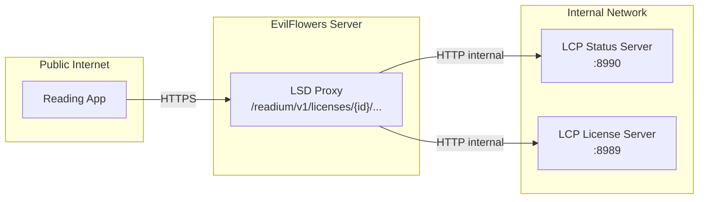

# Readium LCP Integration

EvilFlowers Catalog implements **Standard LCP** (Licensed Content Protection) for DRM-protected publication distribution. This directory contains reference documentation for the Readium LCP integration.

## Documentation Index

| Document | Description |
|----------|-------------|
| [Integration Guide](../catalog-wiki/Readium-LCP-Integration.md) | Architecture, services, workflows, API reference, and database models |
| [Client Integration](../catalog-wiki/Readium-LCP-Client-Integration.md) | Frontend/mobile integration with code examples (JS, HTML) |
| [Frontend Integration (TypeScript)](./frontend-integration-guide.md) | Detailed TypeScript API client, React components, and borrowing service |
| [Deployment Guide](../catalog-wiki/Readium-LCP-Deployment.md) | Docker Compose setup, shared filesystem, LCP server configuration |
| [OPDS 2.0 Server](../catalog-wiki/OPDS-2.md) | OPDS 2.0 feeds with borrowing support for reading apps |
| [Thorium Reader Setup](./thorium-setup-guide.md) | Step-by-step guide for connecting Thorium Reader |
| [LCP Server Wiki](./lcp-server-wiki/) | Upstream Readium LCP Server documentation (API, encryption tool, deployment) |

## Quick Overview

### How It Works

1. **Admin enables Readium** on an Entry (`readium_enabled=True`)
2. **Content is encrypted** automatically via `lcpencrypt` worker (EPUB/PDF -> AES-256-CBC)
3. **User sets passphrase** on their profile (one-time setup)
4. **User borrows** via OPDS 2.0 feed in reading app or `POST /readium/v1/licenses`
5. **User downloads `.lcpl` file** via `GET /readium/v1/licenses/{id}.lcpl`
6. **User opens in reading app** (Thorium Reader, Aldiko Next) and enters passphrase
7. **Device registers** with the Status Server (via our LSD proxy)
8. **User returns** via the reading app or `POST /opds/v2/{catalog}/publications/{id}/return`

### Key Components

- **ContentEncryptionService** - Triggers encryption, tracks status
- **LCPServerClient** - Communicates with LCP License Server (generates/fetches licenses)
- **StatusServerClient** - Communicates with LCP Status Server (device tracking, returns, revocations)
- **LicenseService** - High-level license lifecycle (availability, creation, renewal, return, revocation)
- **ManifestBuilder** - Converts Entry to Readium Web Publication Manifest (RWPM)
- **FeedBuilder** - Generates OPDS 2.0 JSON feeds for reading apps

### API Endpoints

#### License Management (`/readium/v1/`)

| Method | Endpoint | Purpose |
|--------|----------|---------|
| POST | `/licenses` | Create new license |
| GET | `/licenses` | List user's licenses |
| GET | `/licenses/{id}` | License details |
| PUT | `/licenses/{id}` | Update state (return, renew, revoke, cancel) |
| GET | `/licenses/{id}.lcpl` | Download license file (License Gateway) |
| GET | `/content/{lcp_content_id}` | Download encrypted publication |
| GET | `/entries/{id}/availability` | Availability calendar |
| GET/POST | `/entries/{id}/encryption` | Encryption status / manual trigger |
| POST | `/hooks/encryption` | Webhook from lcpencrypt worker |

#### LSD Proxy (`/readium/v1/`) - New

All LCP Status Server interactions are proxied through EvilFlowers. The LSD is never exposed publicly. All link URLs in status responses are rewritten to point back through the proxy.

| Method | Endpoint | Purpose |
|--------|----------|---------|
| GET | `/licenses/{id}/status` | License Status Document |
| POST | `/licenses/{id}/register` | Device registration |
| PUT | `/licenses/{id}/return` | Loan return (from reading app) |
| PUT | `/licenses/{id}/renew` | Loan renewal (from reading app) |

#### Publication Metadata (`/readium/v1/`) - New

| Method | Endpoint | Purpose |
|--------|----------|---------|
| GET | `/publications/{entry_id}/manifest.json` | RWPM manifest (title, author, cover, reading order) |
| GET | `/hint` | Passphrase hint page (required by LCP spec) |

#### OPDS 2.0 Borrowing (`/opds/v2/`)

See the [OPDS 2.0 documentation](../catalog-wiki/OPDS-2.md) for the complete endpoint reference.

| Method | Endpoint | Purpose |
|--------|----------|---------|
| GET | `/{catalog}/` | Catalog feed (entry point for reading apps) |
| GET | `/{catalog}/publications` | Browse publications with availability |
| POST | `/{catalog}/publications/{id}/borrow` | Borrow a publication |
| POST | `/{catalog}/publications/{id}/return` | Return a loan |
| POST | `/{catalog}/publications/{id}/renew` | Renew a loan |
| GET | `/{catalog}/shelf` | User's active loans |
| GET | `/auth` | Authentication Document |

### LSD Proxy Architecture



The proxy:
- **Rewrites all links** in Status Document responses to point through the proxy (reading apps never see internal LSD URLs)
- **Updates local license state** on device registration (READY -> ACTIVE) and returns
- **Forwards query parameters** (`id`, `name`, `end`) to the LSD for device identification

### Configuration

The LCP Server must be configured to generate links pointing to the EvilFlowers proxy:

```yaml
# LCP Status Server config.yaml
lsd:
  public_base_url: "https://your-catalog.example.com/readium/v1"

# hint page
hint_page_url: "https://your-catalog.example.com/readium/v1/hint"
```

| Setting | Default | Description |
|---------|---------|-------------|
| `EVILFLOWERS_READIUM_LCPSV_URL` | `http://127.0.0.1:8989` | LCP License Server URL |
| `EVILFLOWERS_READIUM_LSDSV_URL` | `http://127.0.0.1:8990` | LCP Status Server URL |
| `EVILFLOWERS_READIUM_BASE_URL` | `http://127.0.0.1:8000` | Public base URL for content links |
| `EVILFLOWERS_READIUM_DEFAULT_BORROW_DURATION_DAYS` | `14` | Default loan duration |
