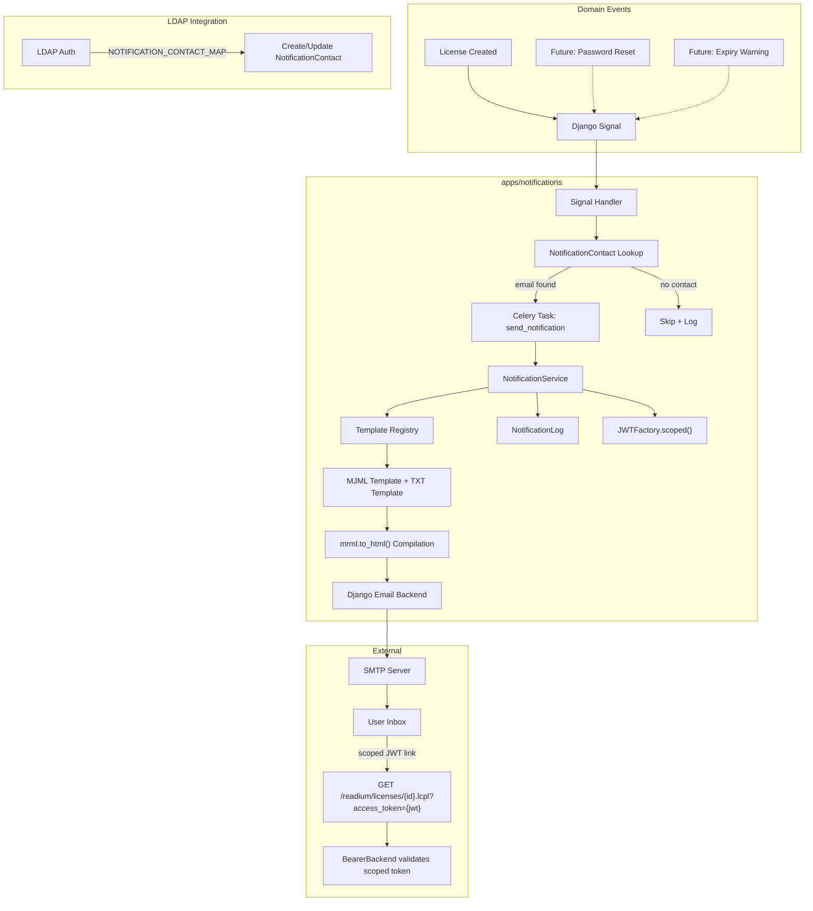

# IP-002: Notification Engine with MJML Templates

This proposal introduces a notification engine built on MJML-compiled email templates, designed to be easily extensible for future notification types. The initial implementation covers license creation notifications with time-limited download links for license files, with a clear path toward password recovery, availability alerts, and other transactional emails.

<!-- more -->

## Status

**Status**: Implemented
**Last Updated**: 2026-07-18
**Implementation**: Complete (Phases 1-3)

> Verified against `develop`: `apps/notifications/` ships the engine
> (`models/{notification_contact,notification_log}.py`, `services.py`, `tasks.py`,
> `signals.py`, `registry.py`, `attachments.py`), MJML templates + subjects, and the
> `test_notification`/`compile_templates` commands. Reservation-lifecycle templates were
> added by IP-003/IP-011. (Template engine later switched `mrml` → `mjml-python` per IP-007 D5.)

## Problem Statement

The Evil Flowers Catalog currently has no mechanism to notify users about events that happen in the system. When a user borrows a publication and a license is created, there is no way to inform them — they must actively check their shelf or already have the OPDS feed configured in a reader app.

### Current Situation

- The `apps/notifications/` app exists as an empty shell (empty `migrations/` and `models/` directories, no code)
- No email sending infrastructure is configured in production settings (only a dev IMAP backend in `development.py`)
- No notification templates exist
- No notification history or audit trail
- License creation (`apps/readium/models.py`) uses Django signals (`post_save`) but only for internal state management, not user-facing notifications

### Pain Points

- **Users have no awareness of new loans** — when a license is created (state `ready`), the user has no way to know unless they check manually
- **No delivery of license files** — LCP `.lcpl` files could be delivered via email for easy import into reading apps on any device
- **No transactional email foundation** — password recovery, account verification, expiry warnings, and similar flows have no infrastructure to build on
- **No audit trail** — there is no record of what notifications were sent, to whom, when, or whether delivery succeeded

### Who is Affected

- End users borrowing publications (no notification of successful loans)
- System administrators (no visibility into notification delivery)
- Future development (every new notification type would require building email infrastructure from scratch)

### Consequences of Not Addressing

- Poor user experience for borrowing workflows
- Inability to implement password recovery or account verification flows
- Each future notification need would require ad-hoc email implementation
- No compliance trail for user communications

## Proposed Solution

### Overview

Build a notification engine in `apps/notifications/` that:

1. Uses **MJML templates** compiled to responsive HTML via `mrml` (Rust-based MJML compiler with Python bindings)
2. Sends emails asynchronously through **Celery tasks**
3. Logs every notification attempt with delivery status in a **NotificationLog** model
4. Supports **multiple notification types** through a template registry pattern
5. Integrates with Django signals to trigger notifications on domain events (starting with license creation)
6. Resolves recipient email addresses via a **NotificationContact** model, with automatic contact creation from LDAP attributes during authentication

### Key Components

1. **Template Engine** — MJML templates compiled at runtime via `mrml` Python package (Rust bindings, no Node.js dependency). Each notification type has an `.mjml` template (HTML) and a `.txt` template (plain text) with a shared base layout for consistent branding.

2. **Notification Service** — Central service class that resolves templates, renders context, compiles MJML → HTML, renders plain-text template, and dispatches via Django's email backend.

3. **Notification Contact** — Model mapping users to their notification email addresses. Automatically populated from LDAP attributes during authentication via `AuthSource` configuration. Decouples notification delivery from username format.

4. **Notification Log** — Database model tracking every notification: recipient, type, status (queued/sent/failed), timestamps, and error details.

5. **Scoped JWT Tokens** — Time-limited JWTs issued via the existing `JWTFactory` with a new `scoped` token type. Used to generate download links for existing API endpoints (e.g., license `.lcpl` download). No new models or endpoints — extends the existing auth infrastructure.

6. **Celery Integration** — All email dispatch happens in async tasks. Leverages existing Celery + Redis infrastructure.

7. **Signal Handlers** — Django signal receivers that trigger notifications on domain events (e.g., `License` post_save when state is `ready`).

### Architecture



### Template Structure

```
apps/notifications/
├── __init__.py
├── models.py              # NotificationLog, NotificationContact
├── services.py            # NotificationService
├── tasks.py               # Celery tasks
├── signals.py             # Signal receivers
├── apps.py                # AppConfig with signal registration
├── registry.py            # Template registry
├── admin.py               # Admin interface for NotificationLog, NotificationContact
├── migrations/
└── templates/
    └── notifications/
        ├── base.mjml              # Base MJML layout (header, footer, branding)
        ├── license_created.mjml   # New license notification (HTML)
        ├── license_created.txt    # New license notification (plain text)
        ├── subjects/
        │   └── license_created.txt    # Subject line template
        └── ...                    # Future templates (.mjml + .txt pairs)
```

## Implementation Plan

### Phase 1: Core Infrastructure

- [ ] Add `mrml` dependency to `pyproject.toml`
- [ ] Create `NotificationContact` model with migration
- [ ] Create `NotificationLog` model with migration
- [ ] Implement `NotificationService` with MJML compilation, plain-text rendering, and Django email dispatch
- [ ] Implement template registry for discovering and resolving notification templates
- [ ] Create `base.mjml` layout template with Evil Flowers branding
- [ ] Add Celery task `send_notification` in `apps/notifications/tasks.py`
- [ ] Extend `JWTFactory` with `scoped()` method for time-limited resource access tokens
- [ ] Extend `BearerBackend` to validate `type="scoped"` tokens with scope/resource checks
- [ ] Add notification-related settings to `base.py` (sender address, feature toggle, scoped token TTL)
- [ ] Register `apps/notifications` in `INSTALLED_APPS`
- [ ] Extend `AuthSource.content` `LdapConfig` with `NOTIFICATION_CONTACT_MAP` field
- [ ] Add `NotificationContact` creation/update logic to `BasicBackend._ldap()` auth flow
- [ ] Add Django admin views for `NotificationContact`, `NotificationLog`

### Phase 2: License Created Notification

- [ ] Create `license_created.mjml` template (publication title, author, loan dates, passphrase hint, download link)
- [ ] Create `license_created.txt` plain-text template
- [ ] Create `subjects/license_created.txt` subject line template
- [ ] Implement signal handler on `License` post_save (state=`ready`) to enqueue notification with scoped download URL

### Phase 3: Configuration & Observability

- [ ] Add management command `test_notification` to send a test email
- [ ] Add management command `compile_templates` to pre-validate all MJML templates
- [ ] Expose notification stats in existing admin/API (sent/failed counts per type)

### Prerequisites

- SMTP server or email delivery service configured (Django `EMAIL_BACKEND`, `EMAIL_HOST`, etc.)
- Celery worker running (already in place)
- Redis broker (already in place)

## Technical Details

### Technology Stack

- **`mrml`** (PyPI: `mrml`): Rust-based MJML compiler with Python bindings. No Node.js runtime required. Compiles MJML markup to responsive HTML email. Fast, dependency-light, production-proven.
- **Django email framework**: `django.core.mail.EmailMultiAlternatives` for sending HTML emails with plain-text fallback.
- **Celery**: Async task dispatch via existing infrastructure.
- **Django template engine**: Used to render MJML templates with context variables before MJML compilation.

### Compilation Pipeline

```
1. Resolve recipient email via NotificationContact lookup
2. Load MJML template file (Django template with MJML markup)
3. Render Django template with context dict → raw MJML string
   (context may include download URLs generated via JWTFactory.scoped() by the signal handler)
4. Compile MJML → HTML via mrml.to_html()
5. Render plain-text template (.txt) with same context dict
6. Send via EmailMultiAlternatives (HTML + plain text)
```

### Data Model Changes

#### NotificationContact

```python
class NotificationContact(BaseModel):
    """Maps users to their notification contact addresses."""

    class Meta:
        app_label = "notifications"
        db_table = "notification_contacts"
        default_permissions = ()
        constraints = [
            models.UniqueConstraint(
                fields=["user", "type", "value"],
                name="unique_user_contact",
            ),
        ]

    class ContactType(models.TextChoices):
        EMAIL = "email"
        # Future types:
        # WEBHOOK = "webhook"
        # PUSH = "push"

    user = models.ForeignKey(
        "core.User", on_delete=models.CASCADE, related_name="notification_contacts"
    )
    type = models.CharField(max_length=20, choices=ContactType.choices)
    value = models.CharField(max_length=255)  # email address, webhook URL, etc.
    is_primary = models.BooleanField(default=False)
```

Contacts are created automatically during LDAP authentication via `AuthSource.content` configuration (see [LDAP Integration](#ldap-integration) below), or manually for database-auth users.

#### NotificationLog

```python
class NotificationLog(BaseModel):
    """Tracks every notification attempt."""

    class Meta:
        app_label = "notifications"
        db_table = "notification_logs"
        default_permissions = ()
        ordering = ["-created_at"]
        indexes = [
            models.Index(fields=["recipient", "notification_type"]),
            models.Index(fields=["status", "created_at"]),
        ]

    class Status(models.TextChoices):
        QUEUED = "queued"        # Task enqueued in Celery
        SENT = "sent"            # Email handed off to SMTP
        FAILED = "failed"        # Sending failed (see error_message)
        NO_CONTACT = "no_contact"  # No NotificationContact found for user

    class NotificationType(models.TextChoices):
        LICENSE_CREATED = "license_created"
        # Future types added here:
        # PASSWORD_RECOVERY = "password_recovery"
        # LICENSE_EXPIRING = "license_expiring"
        # AVAILABILITY = "availability"

    recipient = models.ForeignKey(
        "core.User", on_delete=models.SET_NULL, null=True, related_name="notifications"
    )
    recipient_email = models.EmailField(
        help_text="Denormalized email address at time of sending"
    )
    notification_type = models.CharField(max_length=50, choices=NotificationType.choices)
    status = models.CharField(max_length=10, choices=Status.choices, default=Status.QUEUED)
    subject = models.CharField(max_length=255, blank=True, default="")
    context_snapshot = models.JSONField(
        default=dict, help_text="Serialized template context for debugging/replay"
    )
    error_message = models.TextField(blank=True, default="")
    sent_at = models.DateTimeField(null=True, blank=True)
```

#### Key Design Decisions

- **`NotificationContact`** decouples email delivery from `User.username` — supports LDAP users with non-email usernames, multiple contacts per user, and future channel types
- **`recipient_email` is denormalized** in `NotificationLog` — captures the email used at send time, survives user deletion or contact change
- **`recipient` uses `SET_NULL`** — notification history persists even if user is deleted
- **`context_snapshot`** — stores the template context as JSON for debugging and potential resend
- **All models inherit `BaseModel`** — get `id` (UUID), `created_at`, `updated_at` from the project's base model

### Core Service

```python
# apps/notifications/services.py

import mrml
from django.conf import settings
from django.core.mail import EmailMultiAlternatives
from django.template.loader import render_to_string
from django.utils import timezone

from apps.core.auth import JWTFactory
from apps.notifications.models import NotificationContact, NotificationLog


class NotificationService:
    @staticmethod
    def resolve_recipient_email(user) -> str | None:
        """Resolve primary email contact for user. Returns None if no contact exists."""
        contact = NotificationContact.objects.filter(
            user=user, type=NotificationContact.ContactType.EMAIL, is_primary=True
        ).first()
        return contact.value if contact else None

    @staticmethod
    def generate_scoped_url(user_id: str, scope: str, resource_path: str) -> str:
        """Generate a time-limited URL using a scoped JWT appended as access_token query param."""
        token = JWTFactory(user_id).scoped(scope=scope)
        base_url = settings.EVILFLOWERS_BASE_URL.rstrip("/")
        return f"{base_url}{resource_path}?access_token={token}"

    @staticmethod
    def send(
        notification_type: str,
        recipient_user,
        context: dict,
    ) -> NotificationLog:
        """
        Resolve recipient, render templates, compile MJML, send email, and log result.
        """
        # 1. Resolve recipient email
        recipient_email = NotificationService.resolve_recipient_email(recipient_user)
        if not recipient_email:
            return NotificationLog.objects.create(
                recipient=recipient_user,
                recipient_email="",
                notification_type=notification_type,
                status=NotificationLog.Status.NO_CONTACT,
                context_snapshot=context,
            )

        # 2. Create log entry
        log = NotificationLog.objects.create(
            recipient=recipient_user,
            recipient_email=recipient_email,
            notification_type=notification_type,
            status=NotificationLog.Status.QUEUED,
            context_snapshot=context,
        )

        # 3. Render subject
        subject_template = f"notifications/subjects/{notification_type}.txt"
        subject = render_to_string(subject_template, context).strip()
        log.subject = subject

        # 4. Render MJML template → compile to HTML
        mjml_content = render_to_string(f"notifications/{notification_type}.mjml", context)
        html_content = mrml.to_html(mjml_content)

        # 5. Render plain-text template
        text_content = render_to_string(f"notifications/{notification_type}.txt", context)

        # 6. Send
        try:
            email = EmailMultiAlternatives(
                subject=subject,
                body=text_content,
                from_email=settings.EVILFLOWERS_NOTIFICATION_FROM_EMAIL,
                to=[recipient_email],
            )
            email.attach_alternative(html_content, "text/html")
            email.send()

            log.status = NotificationLog.Status.SENT
            log.sent_at = timezone.now()
        except Exception as e:
            log.status = NotificationLog.Status.FAILED
            log.error_message = str(e)

        log.save()
        return log
```

### Celery Task

```python
# apps/notifications/tasks.py

from celery import shared_task


@shared_task
def send_notification(notification_type: str, recipient_user_id: str, context: dict):
    from apps.notifications.services import NotificationService
    from apps.core.models import User

    recipient_user = User.objects.get(pk=recipient_user_id)

    NotificationService.send(
        notification_type=notification_type,
        recipient_user=recipient_user,
        context=context,
    )
```

### Signal Handler (License Created)

```python
# apps/notifications/signals.py

from django.db.models.signals import post_save
from django.dispatch import receiver
from django.conf import settings

from apps.readium.models import License


@receiver(post_save, sender=License)
def on_license_created(sender, instance: License, created: bool, **kwargs):
    if not created:
        return

    if not getattr(settings, "EVILFLOWERS_NOTIFICATIONS_ENABLED", False):
        return

    from apps.notifications.tasks import send_notification
    from apps.notifications.services import NotificationService

    # Generate a time-limited download URL using existing license endpoint + scoped JWT
    download_url = NotificationService.generate_scoped_url(
        user_id=str(instance.user.pk),
        scope="license:read",
        resource_path=f"/readium/licenses/{instance.pk}.lcpl",
    )

    context = {
        "user_name": instance.user.full_name,
        "entry_title": instance.entry.title,
        "entry_author": instance.entry.author,
        "starts_at": instance.starts_at.isoformat(),
        "expires_at": instance.expires_at.isoformat(),
        "passphrase_hint": instance.passphrase_hint or "",
        "download_url": download_url,
        "download_expires_hours": settings.EVILFLOWERS_NOTIFICATION_SCOPED_TOKEN_TTL_HOURS,
    }

    send_notification.delay(
        notification_type="license_created",
        recipient_user_id=str(instance.user.pk),
        context=context,
    )
```

### Configuration

New settings in `evil_flowers_catalog/settings/base.py`:

```python
# Notifications
EVILFLOWERS_NOTIFICATIONS_ENABLED = os.getenv("EVILFLOWERS_NOTIFICATIONS_ENABLED", "false").lower() == "true"
EVILFLOWERS_NOTIFICATION_FROM_EMAIL = os.getenv("EVILFLOWERS_NOTIFICATION_FROM_EMAIL", EVILFLOWERS_CONTACT_EMAIL)
EVILFLOWERS_NOTIFICATION_SCOPED_TOKEN_TTL_HOURS = int(os.getenv("EVILFLOWERS_NOTIFICATION_SCOPED_TOKEN_TTL_HOURS", 72))
EVILFLOWERS_BASE_URL = os.getenv("EVILFLOWERS_BASE_URL", "http://localhost:8000")
```

Standard Django email settings (configured per environment):

```python
EMAIL_BACKEND = "django.core.mail.backends.smtp.EmailBackend"
EMAIL_HOST = os.getenv("EMAIL_HOST", "localhost")
EMAIL_PORT = int(os.getenv("EMAIL_PORT", 587))
EMAIL_USE_TLS = os.getenv("EMAIL_USE_TLS", "true").lower() == "true"
EMAIL_HOST_USER = os.getenv("EMAIL_HOST_USER", "")
EMAIL_HOST_PASSWORD = os.getenv("EMAIL_HOST_PASSWORD", "")
```

### LDAP Integration

The `AuthSource.content` JSON for LDAP drivers gains an optional `NOTIFICATION_CONTACT_MAP` field. This follows the same pattern as the existing `USER_ATTR_MAP` — a dict mapping contact types to LDAP attribute names:

```json
{
  "URI": "ldap://ldap.example.com",
  "FILTER": "(&(objectClass=user)(userPrincipalName={username}))",
  "BIND": "{username}",
  "ROOT_DN": "ou=EvilFlowers,dc=example,dc=com",
  "USER_ATTR_MAP": {
    "name": "givenName",
    "surname": "sn"
  },
  "NOTIFICATION_CONTACT_MAP": {
    "email": "mail"
  }
}
```

In `BasicBackend._ldap()`, after the existing `USER_ATTR_MAP` loop that sets user attributes, a similar loop creates/updates `NotificationContact` records:

```python
# After the existing USER_ATTR_MAP loop (apps/core/auth.py)
for contact_type, ldap_attr in config.get("NOTIFICATION_CONTACT_MAP", {}).items():
    if ldap_attr in attrs:
        contact_value = attrs[ldap_attr][0].decode()
        NotificationContact.objects.update_or_create(
            user=user,
            type=contact_type,
            defaults={"value": contact_value, "is_primary": True},
        )
```

This requires no migration scripts, no management commands, and no new authentication flow — just a few lines added to the existing LDAP auth method. For database-auth users, `NotificationContact` records are created manually via Django admin or a future API endpoint.

### Scoped JWT Tokens

Instead of a dedicated download model and endpoint, the notification engine extends the existing JWT infrastructure in `apps/core/auth.py`. Email download links point to **existing API endpoints** (e.g., `GET /readium/licenses/{id}.lcpl`) with a scoped JWT passed as the `access_token` query parameter — a pattern `SecuredView` already supports.

#### JWTFactory Extension

A new `scoped()` method on the existing `JWTFactory` class:

```python
# Addition to apps/core/auth.py — JWTFactory class

def scoped(self, scope: str) -> str:
    """Issue a time-limited JWT scoped to a specific action.

    Used by the notification engine to generate download links
    that authenticate the user for a specific resource.
    """
    return self._generate(
        {
            "type": "scoped",
            "scope": scope,
            "exp": timezone.now() + timedelta(
                hours=settings.EVILFLOWERS_NOTIFICATION_SCOPED_TOKEN_TTL_HOURS
            ),
        }
    )
```

The `scope` claim is a string like `"license:read"` that describes what the token allows. The token inherits `sub` (user ID), `iss`, and `iat` from `JWTFactory._generate()`.

#### BearerBackend Extension

A new branch in the existing `BearerBackend.authenticate()` method:

```python
# Addition to apps/core/auth.py — BearerBackend.authenticate()

elif claims["type"] == "scoped":
    # Scoped tokens are time-limited (exp claim validated by JoseError catch above)
    # They authenticate the user but the scope is advisory —
    # endpoint-level permission checks (has_object_permission) still apply.
    try:
        user = User.objects.get(pk=claims["sub"])
    except User.DoesNotExist:
        raise ProblemDetailException(_("Inactive user."), status=HTTPStatus.FORBIDDEN)
```

This is deliberately minimal: the scoped token authenticates the user (like an access token), and the existing endpoint permission checks (`has_object_permission("check_license_manage", ...)` in `LicenseDownloadView`) handle authorization. The `scope` claim is available for future fine-grained enforcement if needed.

#### How It Works End-to-End

1. License is created → signal handler fires
2. Signal handler calls `JWTFactory(user_id).scoped(scope="license:read")` → gets a JWT valid for 72h
3. Constructs URL: `{base_url}/readium/licenses/{license_id}.lcpl?access_token={jwt}`
4. URL is passed in template context → rendered in MJML and plain-text templates
5. User clicks link → `SecuredView` extracts `access_token` from query param → `BearerBackend` validates the scoped JWT → authenticates user
6. `LicenseDownloadView` runs its normal permission check (`has_object_permission`) → serves `.lcpl` file

No new models. No new endpoints. No parallel auth system.

### API Changes

No public API changes in Phase 1-2. Notification log and contacts are accessible through Django admin.

Future phases may expose:

```
GET /api/v1/notifications/          # User's notification history
POST /api/v1/notifications/prefs/   # Notification preferences
GET /api/v1/notifications/contacts/ # User's notification contacts
```

## Alternatives Considered

### Alternative 1: Django Templating Only (No MJML)

**Description**: Use standard Django HTML templates for email rendering.

**Pros**:

- No additional dependency
- Familiar Django template syntax

**Cons**:

- Responsive email HTML is notoriously fragile — requires inline styles, table-based layouts, and extensive client-specific hacks
- Maintenance burden grows with each new template
- Developers need deep email HTML expertise

**Why not chosen**: MJML abstracts away email client compatibility issues. Templates are readable, maintainable, and compile to tested, responsive HTML. The `mrml` Rust binding keeps it fast and dependency-light (no Node.js).

### Alternative 2: Third-Party Email Service (SendGrid, Mailgun, etc.)

**Description**: Use a managed email API with its own template system.

**Pros**:

- Built-in deliverability, analytics, and template editors
- No SMTP configuration needed

**Cons**:

- Vendor lock-in
- Templates live outside the codebase (not version-controlled)
- Additional cost
- External dependency for core functionality

**Why not chosen**: The notification engine should be self-contained and deployable on-premises. Using Django's email backend allows operators to plug in any SMTP provider (including SendGrid/Mailgun via SMTP) without code changes.

### Alternative 3: django-notifications or django-herald

**Description**: Use an existing Django notification library.

**Pros**:

- Community-maintained
- May cover edge cases out of the box

**Cons**:

- `django-notifications` is focused on in-app notifications, not email
- `django-herald` hasn't been updated since 2021
- Neither supports MJML
- Additional abstraction layer for a relatively simple need

**Why not chosen**: The notification requirements are straightforward and the implementation is lean. A custom solution gives full control over the template pipeline and avoids carrying unused features or stale dependencies.

## Trade-offs and Risks

### Trade-offs

- **NotificationContact model vs. email field on User**: Adds a join for recipient resolution, but cleanly separates notification concerns from the identity model. Supports multiple contact types and channels without touching the User model.
- **MJML compilation at send time**: Adds ~5-10ms per email. Acceptable for async Celery tasks. Could add template pre-compilation/caching in the future if needed.
- **Separate plain-text templates**: Doubles the template count per notification type, but ensures professional plain-text rendering and gives full control over text formatting.
- **Scoped JWTs for download links**: Reuses existing auth infrastructure instead of a parallel token system. Trade-off: tokens are not single-use (can be clicked multiple times within TTL), but the license endpoint already has permission checks and the `.lcpl` file is passphrase-bound anyway.
- **No in-app notifications**: This proposal focuses on email. In-app notification center (WebSocket push, unread badges) is a separate concern for a future proposal.

### Risks

| Risk | Impact | Mitigation |
|------|--------|-----------|
| `mrml` package instability or abandonment | Medium | `mrml` is backed by jdrouet/mrml (active Rust project). Fallback: switch to `mjml` Node.js CLI subprocess. |
| SMTP misconfiguration causes silent failures | High | `NotificationLog` tracks every attempt with status and error. Management command for test emails. Feature toggle to disable. |
| High email volume under load (mass license creation) | Medium | Celery rate limiting (`task_annotations`). Batch operations should be mindful of notification triggers. |
| Email deliverability issues (spam filtering) | Medium | Proper SPF/DKIM/DMARC configuration (ops concern, not code). Configurable `from_email`. |
| LDAP missing `NOTIFICATION_CONTACT_MAP` config | Medium | Gracefully skipped if not configured. `NO_CONTACT` status logged per notification attempt. Admin-visible in NotificationLog. |
| Scoped JWT link shared/forwarded | Low | JWT is user-scoped (`sub` claim) — endpoint permission checks prevent other users from downloading. Token expires after 72h. `.lcpl` is passphrase-bound regardless. |

## Open Questions

1. What branding/styling should the base MJML template use (logo, colors, footer text)?
2. Do we need to support non-email channels (e.g., webhook, push) in the initial architecture, or is email-only sufficient for now?

## Success Criteria

- [ ] License creation triggers an email notification to the user
- [ ] Email is rendered from MJML template (HTML) and plain-text template with correct publication metadata
- [ ] License file (`.lcpl`) is downloadable via time-limited scoped JWT link pointing to the existing license endpoint
- [ ] Recipient email is resolved via `NotificationContact`, not hardcoded to username
- [ ] LDAP authentication auto-creates `NotificationContact` from configured LDAP attributes
- [ ] Every notification attempt is logged in `NotificationLog` with status tracking (including `no_contact`)
- [ ] Failed notifications are logged with error details
- [ ] Notifications can be toggled on/off via `EVILFLOWERS_NOTIFICATIONS_ENABLED` setting
- [ ] Test notification management command works end-to-end
- [ ] Adding a new notification type requires only: new `.mjml` + `.txt` templates + signal handler (no service changes)

## Future Considerations

- **Database-backed per-type toggle management** — replace the global env var toggle with a `NotificationTypeConfig` model or admin panel, allowing runtime enable/disable per notification type without redeployment
- **Notification preferences** — per-user, per-type opt-in/opt-out stored in a `NotificationPreference` model
- **Additional notification types**:
    - License expiry warning (X days before `expires_at`)
    - Password recovery / reset
    - Account verification
    - New publication availability in subscribed catalog
    - Loan return confirmation
- **Template pre-compilation and caching** — compile MJML at deploy time, serve cached HTML
- **In-app notification center** — WebSocket-based real-time notifications with unread count
- **Multi-channel support** — webhook callbacks, push notifications (FCM/APNs)
- **Internationalization (i18n)** — per-locale MJML templates or Django i18n integration within templates
- **Bulk notification support** — efficient batch sending for announcements or catalog-wide events
- **Notification API endpoints** — REST API for listing notification history and managing preferences

## References

- [MJML Documentation](https://mjml.io/documentation/)
- [mrml (Rust MJML implementation)](https://github.com/jdrouet/mrml)
- [mrml Python bindings (PyPI)](https://pypi.org/project/mrml/)
- [Django Email Documentation](https://docs.djangoproject.com/en/5.0/topics/email/)
- [Celery Task Documentation](https://docs.celeryq.dev/en/stable/userguide/tasks.html)
- IP-001: Complete LCP Integration & OPDS 2.0 Server (license model reference)

## Review Questions

**Status**: ✅ Resolved
**Review Date**: 2026-04-09
**Reviewer**: Claude AI

The following questions must be answered before implementation:

---

### Q1: Username-as-Email Assumption

🔴 **Critical**

**Issue**: The proposal assumes `User.username` is always a valid email address (used directly as `recipient_email` in the signal handler at the signal handler section). However, the User model defines `username` as `CharField(max_length=200)` with no email validation, and LDAP-sourced users may have non-email usernames.

**Context**: If a username is not a valid email (e.g., `jdubec` from LDAP), the notification will either fail silently or error out. This affects all notification delivery from day one.

**Question**: How should we resolve the recipient email address for users whose username may not be an email?

**Options**:
- [ ] **A**: Add an `email` field to the User model now (nullable, falls back to username if empty). Validate before sending. (recommended)
- [ ] **B**: Keep username-as-email assumption. Validate email format before sending, skip + log if invalid. Add `email` field later.
- [X] **C**: Add a separate `NotificationContact` model that maps users to their notification email(s).

**Answer**:
```
Let's introduce such model. I would like to add capacity to the LDAP auth where we can specify from which field should
be such contant created by default. If possible I would like to apply this without migration and as nice as possible
in terms of creating messy scripts and features. This could by actually nice and configurable
(check the LDAP implementation). I would like to configiure using AuthSource.
```

**Resolution**:
```
Proposal will be updated to:

1. Replace the "username == email" assumption throughout with a NotificationContact model:
   - NotificationContact(user, type="email", value="user@example.com", is_primary=True)
   - Signal handler resolves recipient via NotificationContact.objects.filter(user=..., type="email", is_primary=True)
   - If no contact exists, notification is skipped and logged as "no_contact"

2. Extend AuthSource.content LdapConfig with an optional NOTIFICATION_CONTACT_MAP field:
   - Example: {"NOTIFICATION_CONTACT_MAP": {"email": "mail"}} — maps contact type to LDAP attribute
   - During LDAP auth in BasicBackend._ldap(), after the existing USER_ATTR_MAP loop,
     iterate NOTIFICATION_CONTACT_MAP and create/update NotificationContact records
   - This follows the exact same pattern as USER_ATTR_MAP (lines 212-215 in auth.py) —
     no new migration scripts or management commands needed, just a few lines in the
     existing LDAP auth flow
   - For database AuthSource users, NotificationContact is created manually or via API

3. Update Data Model Changes section to add NotificationContact model definition
4. Update signal handler code to resolve email from NotificationContact instead of user.username
5. Update Architecture diagram to show NotificationContact in the flow
6. Add NotificationContact to Phase 1 implementation tasks
```

---

### Q2: License File Delivery Method

⚠️ **Medium**

**Issue**: The proposal mentions attaching `.lcpl` license files to emails but also notes this as an open question. The `.lcpl` file contains cryptographic material (encrypted content key, user key hash). Attaching it to email means it could be forwarded, stored in email archives, or intercepted.

**Context**: LCP licenses are designed to be user-specific (tied to the user's passphrase hash). A forwarded `.lcpl` file is useless without the passphrase, so the security risk is limited. However, some deployments may prefer a time-limited download link.

**Question**: Should `.lcpl` files be attached directly to emails or delivered via a download link?

**Options**:
- [ ] **A**: Attach `.lcpl` directly — simpler UX, user can open in reading app from email. Security risk is low due to passphrase binding.
- [X] **B**: Include a time-limited download link — more secure, but adds complexity (token generation, download endpoint).
- [ ] **C**: Make it configurable per-deployment (setting to choose attach vs. link). (recommended)

**Answer**:
```
Definetly B. Propose a reasonable mechanism.
```

**Resolution**:
```
Proposal updated to use scoped JWT tokens via the existing JWTFactory + BearerBackend
infrastructure instead of a dedicated NotificationToken model and download endpoint:

1. Extended JWTFactory with scoped() method — issues time-limited JWT with
   type="scoped", scope claim, and configurable TTL (default 72h)
2. Extended BearerBackend to validate type="scoped" tokens — authenticates user,
   existing endpoint permission checks handle authorization
3. Email links point to existing endpoints with ?access_token={jwt} query param
   (already supported by SecuredView) — e.g., /readium/licenses/{id}.lcpl
4. No new models, no new endpoints, no parallel auth system
5. Signal handler generates the scoped URL and passes it in template context
```

---

### Q3: Notification Feature Toggle Granularity

ℹ️ **Low**

**Issue**: The proposal defines a single boolean `EVILFLOWERS_NOTIFICATIONS_ENABLED` toggle. This is all-or-nothing — you cannot enable license notifications but disable (future) marketing emails, or vice versa.

**Context**: For Phase 1 with a single notification type, a global toggle is sufficient. But as more types are added, operators may want per-type control.

**Question**: Is the global toggle sufficient for the initial implementation?

**Options**:
- [X] **A**: Global toggle only for now. Per-type toggles deferred to when the second notification type is added. (recommended)
- [ ] **B**: Implement per-type toggles from the start (e.g., `EVILFLOWERS_NOTIFICATION_LICENSE_CREATED_ENABLED`).

**Answer**:
```
We will create some kind of database management later.
```

**Resolution**:
```
Proposal will be updated to:

1. Keep the single global EVILFLOWERS_NOTIFICATIONS_ENABLED toggle for Phase 1
2. Add a note in Future Considerations that per-type toggle management will move to
   a database-backed configuration (e.g., a NotificationTypeConfig model or admin panel)
   rather than environment variables, allowing runtime control without redeployment
3. No code changes needed for this question — the proposal already uses global toggle
```

---

### Q4: Plain-Text Fallback Quality

ℹ️ **Low**

**Issue**: The proposal generates plain-text fallback by stripping HTML tags from the compiled MJML output (`strip_tags(html_content)`). This produces readable but poorly formatted text (no structure, no spacing around headings, no link URLs visible).

**Context**: Some email clients (rare) or corporate environments may render only plain text. A crude strip_tags fallback could look unprofessional.

**Question**: Is `strip_tags` sufficient, or should we maintain separate plain-text templates?

**Options**:
- [ ] **A**: `strip_tags` is fine for now. Revisit if users report issues. (recommended)
- [X] **B**: Create parallel `.txt` templates for each notification type from the start.

**Answer**:
```
Rather define cute text files for this.
```

**Resolution**:
```
Proposal will be updated to:

1. Replace strip_tags approach in NotificationService with a dedicated plain-text
   template per notification type
2. Update template structure to include parallel .txt files:
   - templates/notifications/license_created.mjml (HTML via MJML)
   - templates/notifications/license_created.txt  (plain text)
   - templates/notifications/subjects/license_created.txt (subject line, shared)
3. Update NotificationService.send() pipeline:
   - Step 4 changes from "strip_tags(html_content)" to
     "render_to_string(f'notifications/{notification_type}.txt', context)"
4. Update template directory structure in the proposal to show .txt files alongside .mjml
5. Add to Phase 1 tasks: create plain-text templates alongside each MJML template
```

---

## Changelog

| Date | Author | Changes |
|------|--------|---------|
| 2026-04-08 | jdubec    | Initial draft                                          |
| 2026-04-08 | Claude AI | Added Review Questions section                          |
| 2026-04-09 | jdubec    | Answered Review Questions Q1-Q4                         |
| 2026-04-09 | Claude AI | Wrote resolutions for all Review Questions              |
| 2026-04-09 | Claude AI | Applied resolutions: NotificationContact, LDAP integration, scoped JWT tokens, plain-text templates |
| 2026-04-09 | Claude AI | Implementation complete (Phases 1-3) |
