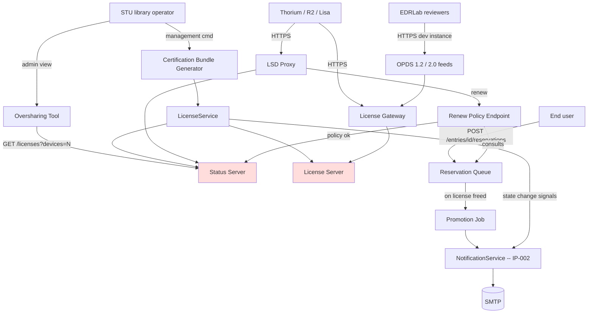
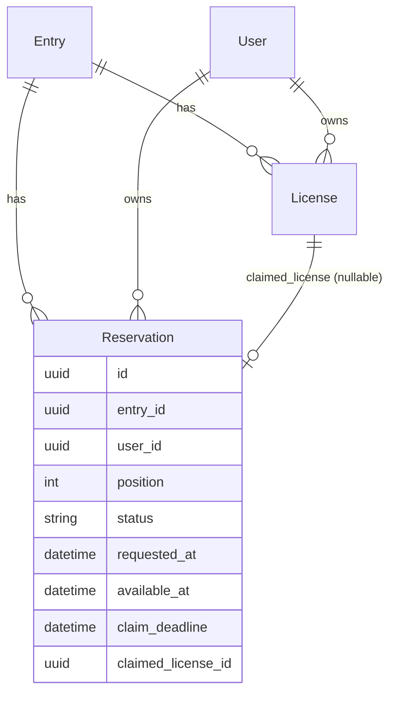

# IP-003: Readium LCP — EDRLab Certification Readiness

This proposal closes the remaining gaps between the current LCP integration (delivered by [IP-001](ip-001-lcp-opds2-integration.md)) and the artifacts EDRLab requires to certify EvilFlowersCatalog as a Readium LCP license provider for production deployment at the Slovak University of Technology.

<!-- more -->

## Status

**Status**: Accepted
**Last Updated**: 2026-05-12
**Implementation**: In Progress

## Scope: PDF-only (LCP-for-PDF profile)

STU distributes PDF documents only. Certification therefore targets the **LCP-for-PDF profile** (`.lcpdf` artifacts produced by `lcpencrypt`). EPUB support is out of scope: the upstream stack supports EPUB and audiobooks as well, but EDRLab certifies the formats actually deployed by the license provider, and we will not ship EPUB at STU. Adding EPUB support later (e.g. for another Slovak university) is a follow-up that re-uses the same bundle generator and compliance suite without re-doing certification — EDRLab would only need new sample EPUB artifacts.

### Bundled non-LCP work

Issues [#50](https://github.com/EvilFlowersCatalog/EvilFlowersCatalog/issues/50) (advanced entry details) and [#49](https://github.com/EvilFlowersCatalog/EvilFlowersCatalog/issues/49) (advanced entries filtering) are general catalog improvements, not LCP-specific. They are bundled into this proposal because EDRLab will browse the catalog on our development instance during the review, and a more complete catalog UI affects the review impression. They live in Phase 0 alongside the LCP-blocking bug fix.

## Problem Statement

[IP-001](ip-001-lcp-opds2-integration.md) brought the LCP integration to a state where licenses can be issued, fresh-fetched, returned, renewed, revoked and cancelled in **test mode** against the open-source `readium-lcp-server`. The Status Server is fully proxied, the License Gateway is in place, and OPDS 2.0 feeds carry LCP-aware borrow links.

What is missing is the operational and compliance work that EDRLab requires before they will sign the LCP Agreement, issue a production X509 certificate, and grant us the right to ship LCP-protected content.

### Current Situation

- `apps/readium/` runs end-to-end in LCP test mode against the open-source server
- We have no reproducible way to produce the **6 sample artifacts** EDRLab demands for certification (3 buy + 2 loan + 1 protected EPUB across specific states)
- We have no tool for **detecting overshared licenses** beyond a thin client method on `StatusServerClient` that is not exposed anywhere
- Deployment hardening (HTTPS-only, License Server network isolation, reverse proxy) exists informally but is not codified
- The **renew policy** uses the default Status Server window with no provider override, so library staff cannot enforce queue/embargo rules
- We have not run EDRLab's own `lcp-testing-tools` harness against our deployment
- There is no documented procedure for applying the **production-mode patch** EDRLab will send (X509 cert + secret material)
- There is no **staging environment** dedicated to EDRLab review

### Pain Points

- **Certification submission blocked** — we cannot produce the bundle EDRLab wants without manual, error-prone steps
- **Library operators have no oversharing controls** — a leaked passphrase would not be detected until a user complained
- **Production deployment is not reproducible** — STU IT cannot bring up a second instance for another Slovak university without the original engineer present
- **Compliance regressions are invisible** — RFC 7807 conformance, link rewrites, HTTPS enforcement, and cache-control are not asserted by any test

### Who is Affected

- EDRLab reviewers (cannot certify what they cannot exercise)
- STU library staff (no admin tooling for oversharing/revocation)
- Future Slovak universities adopting the catalog (no reproducible install)
- The EvilFlowers project (no compliance regression net for future LCP changes)

### Consequences of Not Addressing

- LCP certification cannot be completed — STU library remains stuck on the non-LCP fallback that was already deployed
- No path to onboarding additional Slovak universities under the multi-tenant rollout already discussed
- The Faculty of Informatics and Information Technology (FIIT STU) cannot meet its commitment to EDRLab to enter production this year

## Proposed Solution

### Overview

Deliver the missing code, configuration, and operator documentation required to:

1. Produce on demand the EDRLab certification bundle (3 buy + 2 loan + 1 protected EPUB)
2. Give library operators a usable oversharing detection and revocation workflow
3. Ship a **reservation queue** so users can claim a slot on a fully-borrowed title and be promoted automatically when one frees up
4. Replace the default renew window with a provider-controlled renewal policy that consults the queue
5. Deliver **lifecycle email notifications** (loan created, expiring, returned, renewed, revoked; reservation placed, available, expired; passphrase changed) on top of the existing IP-002 notification engine
6. Codify production-grade deployment: HTTPS-only ingress, isolated License Server, reproducible production-mode patching procedure
7. Lock in compliance through a pre-flight run of `edrlab/lcp-testing-tools`
8. Hand EDRLab the certification bundle plus access to our existing development instance for the review (no separate staging environment)

The work is intentionally scoped to **everything EvilFlowersCatalog itself needs to ship**. The signing of the LCP Agreement, the X509 production material, and EDRLab membership paperwork are tracked in a parallel org/legal track and are blockers for the final certification submission, not for this implementation.

### Key Components

0. **Phase 0 fixes** — close issue #56 (license-creation 500), surface availability state on entries (#55), and bundle the non-LCP catalog improvements #50 and #49 so the dev instance is review-ready.

1. **Certification Bundle Generator** — a single Django management command, `generate_lcp_certification_bundle`, that drives `LicenseService` and `StatusServerClient` against a configured demo catalog and writes all six artifacts (with their LSD status documents) to a target directory.

2. **Oversharing & Revocation** — no new endpoints. Add a `device_count__gte` filter to `LicenseFilter` so operators can discover overshared licenses via the existing `GET /readium/v1/licenses?device_count__gte=N` collection, and rely on the existing license-state PATCH (`PATCH /readium/v1/licenses/{id}` with `{ "state": "revoked" }`) to revoke them. A staff-only admin page in the SPA consumes those two endpoints; a management command does the same headlessly.

3. **Reservation Queue** — a `Reservation` resource with a `status` state machine. Created via `POST /reservations`, mutated only via `PATCH /reservations/{id}` (`status: "cancelled"` for user-cancel, `status: "claimed"` to convert into a license). Server-side promotion (`queued` → `available`) and expiry (`available` → `expired`) fire automatically on license terminal-state transitions and a minute-grained Celery sweep — there are no client-facing "promote" or "expire" actions.

4. **Renewals as a sub-resource** — instead of a `/renew-policy` callback verb, model a renewal as a child resource: `POST /licenses/{id}/renewals` with `{ requested_end }`. The Status Server's `renew_custom_url` template points at this endpoint. The handler enforces STU policy (no renew if the queue is non-empty, embargo on freshly-acquired titles) and either returns the upstream LSD status document on success or an RFC 7807 problem on deny.

5. **Lifecycle Email Notifications** — eight MJML+plain-text templates plumbed through the IP-002 `NotificationService` and triggered by signals on `License` and `Reservation` state changes, plus a Celery beat job for time-based events (expiring soon, expired). Covers: `license_created` (already in IP-002 — kept as-is), `license_expiring_soon`, `license_returned`, `license_renewed`, `license_revoked`, `reservation_placed`, `reservation_available`, `reservation_expired`, `passphrase_changed`.

6. **Compliance Test Suite** — pytest cases that assert RFC 7807 problem-details responses on the LSD proxy and License Gateway, HTTPS-only redirection behavior in the Nginx config, and presence of `application/vnd.readium.lcp.license.v1.0+json` links in both OPDS 1.2 and OPDS 2.0 feeds.

7. **Deployment Hardening Docs & Configs** — committed Nginx config templates (under `docs/readium/deployment/`), iptables snippet, and a Docker Compose override pattern for production-mode patching. Reusable for any future Slovak university.

8. **EDRLab Review Plan** — use the existing development instance, plus the certification bundle, as the EDRLab review surface. No separate staging environment.

### Architecture



(`LCP License Server` is private — only reachable from EvilFlowersCatalog and the Encryption Tool. `LSD` is reverse-proxied; readers never address it directly.)

## Implementation Plan

### Phase 0: Bug Fixes & Loan UX Foundations

Prerequisites that must land before the certification bundle is meaningful. Covers the open GitHub issues that block or degrade the EDRLab review surface.

- [ ] **Fix [#56](https://github.com/EvilFlowersCatalog/EvilFlowersCatalog/issues/56) — `name 'user_passphrase' is not defined` on POST `/readium/v1/licenses`**
    - Reproduce against the dev instance at `dev.evilflowers.elvira.stuba.sk`
    - Trace `LicenseManagement.post` (`apps/readium/views/licenses.py`) → `LicenseService.create_license` (`apps/readium/services/license_service.py`) → `LCPServerClient.generate_license` (`apps/readium/services/lcp_server_client.py`) and locate the unbound reference
    - Add a regression test in `apps/readium/tests/test_license_creation.py` that asserts the happy path returns `201` and the missing-passphrase path returns a clean `400` (not a `NameError`)

- [ ] **Passphrase pre-flight (loan UX doc)**
    - When `user.lcp_passphrase_hash` is missing on a license-create call, return RFC 7807 `400` with a dedicated `detail_type=PASSPHRASE_REQUIRED` and a `set_passphrase_url` link, instead of a generic `ValueError`
    - Mention the Thorium-Reader requirement in the license-creation response under a `reader_requirements` field (purely informational; consumed by the SPA to render the post-borrow modal)

- [ ] **[#55](https://github.com/EvilFlowersCatalog/EvilFlowersCatalog/issues/55) — Entries data: surface LCP availability state**
    - Extend the entry serializer at `/api/v1/entries` and `/api/v1/catalogs/{id}/entries/{id}` with computed fields powered by `LicenseService.get_entry_availability()`:
        - `lcp_state`: one of `not_lcp`, `available_now`, `available_in_days`, `active_loan_for_user`, `fully_borrowed`
        - `available_slots`, `total_slots`
        - `next_available_at` (ISO 8601, nullable)
        - `user_active_license_id` (nullable, present when the requesting user already holds a license)
    - Cache the computation per `(entry_id, user_id)` for the request lifetime to avoid N+1 on list views
    - pytest coverage for each `lcp_state` value

- [ ] **[#50](https://github.com/EvilFlowersCatalog/EvilFlowersCatalog/issues/50) — Advanced entry details** *(non-LCP, bundled — partial scope)*
    - Extend `Entry` and its serializer with: `page_count`, `table_of_contents` (JSON), `related_entries`
    - **Out of scope**: ratings and reviews (`rating_avg`, `review_count`) — deferred to follow-up [#57](https://github.com/EvilFlowersCatalog/EvilFlowersCatalog/issues/57) per Q6 resolution. Issue #50 stays open until #57 is also closed

- [ ] **[#49](https://github.com/EvilFlowersCatalog/EvilFlowersCatalog/issues/49) — Advanced entries filtering** *(non-LCP, bundled)*
    - In `apps/api/filters/entry_filter.py`: accept comma-separated values on `category_id`, `feed_id`, `language_code`, `author` and translate to `__in` lookups
    - Add a free-text OR query across `title`, `summary`, and `author.name` via `Q` objects
    - pytest coverage for combined filters (e.g. `?language_code=sk,en&category_id=<uuid>,<uuid>`)

### Phase 1: Certification Artifacts

- [ ] Add `apps/readium/management/commands/generate_lcp_certification_bundle.py` — single command, `--output-dir`, `--catalog`, `--entry` flags
- [ ] Command drives `LicenseService.create_license()` and the LSD proxy paths to produce the 6 states (no DB shortcuts):
    - `buy_ready.lcpl` + status doc
    - `buy_cancelled.lcpl` + status doc (via real `cancel_license`)
    - `buy_revoked.lcpl` + status doc (via real `revoke_license`)
    - `loan_ready.lcpl` + status doc
    - `loan_expired.lcpl` + status doc (license issued with `end` in the past)
    - `protected.lcpdf` (one Licensed PDF with the license embedded — LCP-for-PDF profile)
- [ ] Write a `README.md` in the output dir listing each artifact, the user passphrase, and how to verify with Thorium
- [ ] pytest case that asserts the command produces all 6 files and that each license parses as JSON with the expected `id`, `rights.end`, and `status` link

### Phase 2: Oversharing & Revocation

No new endpoints. We extend the existing license collection and reuse the existing license-state PATCH path.

- [ ] Extend `LicenseFilter` in `apps/readium/filters.py` with `device_count__gte` and `device_count__lte` numeric filters
- [ ] Backfill `License.device_count` from the Status Server on a daily Celery beat job (the Status Server is the source of truth; our DB is a cache for filtering). Already partly tracked via `DeviceRegistrationProxyView`; the job covers drift
- [ ] Add `apps/readium/management/commands/check_overshared_licenses.py` — purely a client of `GET /readium/v1/licenses?device_count__gte=N` and `PATCH /readium/v1/licenses/{id}` `{state: "revoked"}`. `--threshold N`, `--revoke` flag, `--dry-run` default. The command does NOT call the service layer directly; it goes through the HTTP API so the behaviour matches what library staff see in the SPA
- [ ] Permission: the existing `check_license_manage` predicate already gates state PATCHes; ensure the device-count filter is allowed for users with that permission
- [ ] pytest case: seed two licenses with device_count above/below threshold, assert the filter result and that a PATCH transitions state to `revoked` and triggers the upstream Status Server revocation

### Phase 3: Reservation Queue & Renew Policy

The queue is the central new piece of domain logic in this proposal. It is also the prerequisite for a meaningful renew policy and for the `reservation_*` notifications in Phase 4.

#### 3a. Reservation model

- [ ] Add `apps/readium/models/reservation.py` (and re-export from `apps/readium/models.py`):
    ```python
    class Reservation(BaseModel):
        class Status(models.TextChoices):
            QUEUED = "queued", _("Queued")           # waiting in line
            AVAILABLE = "available", _("Available")  # a slot opened, user must claim
            CLAIMED = "claimed", _("Claimed")        # user converted reservation to a license
            EXPIRED = "expired", _("Expired")        # claim window passed without action
            CANCELLED = "cancelled", _("Cancelled")  # user-cancelled or admin-cancelled

        entry = models.ForeignKey(Entry, on_delete=models.CASCADE, related_name="reservations")
        user = models.ForeignKey(User, on_delete=models.CASCADE, related_name="reservations")
        position = models.PositiveIntegerField()              # 1-based position when QUEUED
        status = models.CharField(choices=Status.choices, default=Status.QUEUED, max_length=16)
        requested_at = models.DateTimeField(auto_now_add=True)
        available_at = models.DateTimeField(null=True, blank=True)  # set when promoted to AVAILABLE
        claim_deadline = models.DateTimeField(null=True, blank=True)  # available_at + claim window
        claimed_license = models.ForeignKey(
            License, on_delete=models.SET_NULL, null=True, blank=True, related_name="from_reservation"
        )

        class Meta:
            db_table = "reservations"
            unique_together = [["entry", "user", "status"]]  # one active reservation per (entry, user)
            indexes = [models.Index(fields=["entry", "status", "position"])]
    ```
- [ ] Migration `0004_reservation.py`

#### 3b. Reservation API (declarative, resource-centric)

No verb-style endpoints. The full lifecycle is driven by `POST /reservations` (create) and `PATCH /reservations/{id}` (mutate `status`). Server-side transitions (`queued` → `available`, `available` → `expired`) are not exposed as client-callable endpoints — they happen as side effects of license state changes and the Celery sweep.

- [ ] `apps/readium/views/reservations.py` and matching URL entries:
    - `POST /readium/v1/reservations` — body `{ "entry_id": "<uuid>" }`. `400` if entry is not LCP, `409` if the user already has an active license or a non-terminal reservation, `201` with `position` on success
    - `GET  /readium/v1/reservations` — list. Query params: `entry_id`, `user_id`, `status` (single value or comma-separated, matching the Phase 0 #49 filter convention). Permissioned: non-admin callers only see their own
    - `GET  /readium/v1/reservations/{id}` — detail
    - `PATCH /readium/v1/reservations/{id}` — body `{ "status": "cancelled" }` for user-cancel (allowed from `queued` or `available`) or `{ "status": "claimed" }` to convert an `available` reservation into a license. `status: "claimed"` delegates to `LicenseService.create_license` and on success sets `claimed_license_id` and returns the new license URL in the `Location` header. All other PATCH bodies are rejected `400`
- [ ] Form classes for create (`CreateReservationForm` — `entry_id`) and PATCH (`UpdateReservationForm` — `status` only; rejects any transition the state machine forbids)
- [ ] `ReservationFilter` (django-filter) for the GET list — `entry_id`, `user_id`, `status__in`

#### 3c. Promotion logic

- [ ] `ReservationService` in `apps/readium/services/reservation_service.py` with:
    - `enqueue(entry, user)` — places at tail, returns `Reservation` with `position`
    - `cancel(reservation)` — terminal cancel + reflow positions
    - `promote_next(entry)` — picks the head of the queue, sets it `AVAILABLE`, sets `claim_deadline = now + RESERVATION_CLAIM_HOURS`, triggers `reservation_available` notification
    - `expire_unclaimed()` — sweeps `AVAILABLE` reservations past their `claim_deadline`, marks them `EXPIRED`, calls `promote_next` again, triggers `reservation_expired` notification
- [ ] Hook into license-state transitions: `LicenseService.return_license`, `LicenseService.revoke_license`, `LicenseService.cancel_license`, and the natural-expiry handler — all call `ReservationService.promote_next(entry)` after the license is in its terminal state
- [ ] Celery beat job `apps/readium/tasks.py::sweep_unclaimed_reservations` running every minute

#### 3d. Availability counts include reservations

- [ ] Extend `LicenseService.get_entry_availability()` and the Phase 0 `lcp_state` field to surface:
    - `queue_length` (count of `QUEUED + AVAILABLE` reservations)
    - `user_reservation_id` (if the requesting user is in the queue)
    - `user_position` (1-based, when `QUEUED`)
- [ ] pytest coverage for the new fields

#### 3e. Renewal as a sub-resource of License

The Status Server's `renew_custom_url` is the only externally-fixed contract (the LSD upstream must be able to call it). The path itself is our choice — we model the renewal as a child resource of the license rather than a verb endpoint.

- [ ] Add `apps/readium/services/renew_policy.py` with `evaluate_renew(license, requested_end)`:
    - Deny if `Reservation.objects.filter(entry=license.entry, status__in=[QUEUED, AVAILABLE]).exists()`
    - Deny if license was created within `EVILFLOWERS_READIUM_RENEW_EMBARGO_DAYS`
    - Deny if `requested_end > now() + EVILFLOWERS_READIUM_MAX_RENEW_DAYS`
    - Otherwise allow and forward to the upstream Status Server renewal method
- [ ] New view `LicenseRenewalsView` at `POST /readium/v1/licenses/{id}/renewals` (collection-style sub-resource). Body: `{ "requested_end": "<iso-8601>" }`. Returns the upstream LSD status document on `200`, RFC 7807 problem on `403` deny
- [ ] Document the Status Server YAML config: `renew_custom_url: "https://catalog.example.org/readium/v1/licenses/{license_id}/renewals"`
- [ ] pytest: queue-blocked renew returns `403` + RFC 7807; embargo-blocked renew returns `403`; happy path returns the upstream LSD response

### Phase 4: Lifecycle Email Notifications

Builds on the IP-002 `NotificationService`. All templates extend `notifications/base.mjml` and follow the existing pattern: `<name>.mjml`, `<name>.txt`, and `subjects/<name>.txt`.

#### 4a. Template registry

- [ ] Add to `apps/notifications/templates/notifications/`:
    - `license_expiring_soon.mjml` / `.txt` / `subjects/license_expiring_soon.txt`
    - `license_returned.mjml` / `.txt` / `subjects/license_returned.txt`
    - `license_renewed.mjml` / `.txt` / `subjects/license_renewed.txt`
    - `license_revoked.mjml` / `.txt` / `subjects/license_revoked.txt`
    - `reservation_placed.mjml` / `.txt` / `subjects/reservation_placed.txt`
    - `reservation_available.mjml` / `.txt` / `subjects/reservation_available.txt` (includes the claim deadline prominently + claim URL)
    - `reservation_expired.mjml` / `.txt` / `subjects/reservation_expired.txt`
    - `passphrase_changed.mjml` / `.txt` / `subjects/passphrase_changed.txt`
- [ ] Each template renders `{{ user_name }}`, `{{ entry_title }}`, `{{ entry_author }}`, plus the type-specific context (claim URL, deadline, new expiry, etc.)
- [ ] All templates pass `python manage.py compile_templates` (existing IP-002 command)

#### 4b. Signal wiring

- [ ] Add `apps/readium/signals.py`:
    - On `License` `post_save` with transition to `RETURNED` / `RENEWED` (expiry changed forward) / `REVOKED` → enqueue the matching notification
    - On `User` `post_save` when `lcp_passphrase_hash` changes → enqueue `passphrase_changed`
- [ ] On `Reservation` `post_save`:
    - `QUEUED` (new) → `reservation_placed`
    - transition to `AVAILABLE` → `reservation_available`
    - transition to `EXPIRED` → `reservation_expired`
- [ ] All sends go through `NotificationService.send(notification_type, user, context)` — no direct email calls from `apps/readium/`

#### 4c. Time-based notifications

- [ ] Add Celery beat job `apps/readium/tasks.py::notify_expiring_licenses` running daily at 06:00 UTC:
    - For each active license expiring within `EVILFLOWERS_READIUM_EXPIRY_REMINDER_DAYS` (default 3), and where no `license_expiring_soon` notification has been logged in the last `reminder_window` (avoid spam), fire `license_expiring_soon`
- [ ] Use `NotificationLog` (IP-002) to query for last-sent and avoid duplicates

#### 4d. Tests

- [ ] `apps/readium/tests/test_notifications.py`:
    - Each state transition produces exactly one `NotificationLog` row with the expected `notification_type`
    - Templates render without raising (mock `mjml2html` to assert content presence)
    - Duplicate-suppression for `license_expiring_soon` works
- [ ] `apps/notifications/tests/test_template_registry.py`: `TemplateRegistry.validate_templates()` passes for all eight new templates

### Phase 5: Compliance Test Suite

- [ ] Add `apps/readium/tests/test_lcp_compliance.py`:
    - All error paths in `views/status_proxy.py`, `views/licenses.py`, `views/download.py` return an RFC 7807 `application/problem+json` body
    - LSD link rewrites point at our own host (no `127.0.0.1`)
    - Hint page reachable unauthenticated and renders a non-empty body
    - Encrypted content download responses set `Cache-Control` headers suitable for CDN caching
    - The encrypted-content download route serves `.lcpdf` MIME type for PDF acquisitions
- [ ] Add `apps/opds/tests/test_lcp_acquisition_link.py` and `apps/opds2/tests/test_lcp_acquisition_link.py`:
    - For a readium-enabled entry the feed entry MUST contain a link with `type=application/vnd.readium.lcp.license.v1.0+json` and a templated href to the License Gateway
- [ ] Add a CI step `make lcp-compliance` aggregating these

### Phase 6: Deployment Hardening

Secrets live in a restricted host directory and are mounted read-only into the LCP containers (resolved Q4 — option D). No Vault, no sealed-secrets, no 1Password Connect dependency.

- [ ] Commit `docs/readium/deployment/nginx-production.conf` — HTTPS-only, HSTS, TLS 1.2/1.3, port-80 redirect, reverse proxy to Status Server, static file route for encrypted content
- [ ] Commit `docs/readium/deployment/iptables-isolation.md` — License Server bound to `127.0.0.1`, accept rules for the catalog node only, drop public access to ports 8989/8089
- [ ] Commit `docs/readium/deployment/docker-compose.production.yml` — service definitions for License Server + Status Server with the production patch material mounted **read-only from `/etc/evilflowers/lcp-secrets/`** on the host (owned by the LCP service user, mode 0400 on files, 0500 on the directory); healthchecks; restart policy
- [ ] Commit `docs/readium/deployment/production-patching.md` — step-by-step procedure for applying the EDRLab X509 cert and patch:
    - Directory layout: `/etc/evilflowers/lcp-secrets/{cert.pem, key.pem, patch/...}`
    - File and directory permissions (`chown lcp:lcp`, `chmod 0400/0500`)
    - How the Docker Compose mount reads them
    - Backup procedure (encrypted tarball to STU IT's backup vault)
    - Rotation procedure when EDRLab re-issues
    - Recovery from accidental deletion
- [ ] Smoke test script that checks the deployed License Server reports production mode and that `/etc/evilflowers/lcp-secrets/` has the expected permissions

### Phase 7: EDRLab Pre-Flight & Submission

- [ ] Curate a small demo set on the existing development instance (a handful of PDF titles, public-domain or STU-owned) and a guest account for EDRLab
- [ ] Run `edrlab/lcp-testing-tools` against the development instance, fix everything it reports
- [ ] Run `generate_lcp_certification_bundle` against the development instance, archive the result in `docs/readium/certification-bundle/`
- [ ] Send EDRLab the development-instance URL, guest credentials, and bundle download link
- [ ] On EDRLab go-ahead: sign Agreement, receive production patch, apply on STU production, re-test, request final certification

### Prerequisites

- [IP-001](ip-001-lcp-opds2-integration.md) is implemented (it is — confirmed in the proposals index)
- [IP-002](ip-002-notification-engine.md) is implemented (it is — `NotificationService`, `NotificationContact`, `NotificationLog`, MJML templates, and the `license_created` template are already in place; Phase 4 only adds new template types)
- A demo catalog exists with at least one PDF acquisition that successfully encrypts via `encrypt_readium_content`
- Open org/legal track: EDRLab prospect form refilled, membership signature authority confirmed (tracked separately)

## Technical Details

### Technology Stack

- Django management commands (consistent with the rest of `apps/readium/`)
- `responses` library for mocking the Status Server in tests (already used in the codebase, if not we will add it)
- Nginx 1.18+ for reverse proxy (matches the wiki recommendation in `docs/readium/lcp-server-wiki/Server-deployment.md`)

### Data Model Changes

One new model — `Reservation` in `apps/readium/models/reservation.py` (schema in Phase 3a above), migration `0004_reservation.py`. No changes to `License`, `EncryptedContent`, `NotificationContact`, or `NotificationLog`.



### API Changes

The new endpoints follow a declarative, resource-centric style: no action verbs in URLs, no `/claim`, `/revoke`, `/cancel`, `/admin/...` paths. Resources are created with `POST`, mutated with `PATCH` on their `status`, discovered with `GET` + filter query params. Server-side state transitions are not exposed as endpoints.

| Endpoint | Method | Purpose |
|----------|--------|---------|
| `/readium/v1/reservations` | POST | Create a reservation. Body: `{ "entry_id": "<uuid>" }` |
| `/readium/v1/reservations` | GET | List reservations. Filters: `entry_id`, `user_id`, `status` (comma-separated) |
| `/readium/v1/reservations/{id}` | GET | Read a reservation |
| `/readium/v1/reservations/{id}` | PATCH | Mutate `status`: `cancelled` (user-cancel), `claimed` (convert to license) |
| `/readium/v1/licenses/{id}/renewals` | POST | Renewal sub-resource. Body: `{ "requested_end": "<iso-8601>" }`. Pointed at by the Status Server's `renew_custom_url` |
| `/readium/v1/licenses` | GET | *(existing — extended)* New filters: `device_count__gte`, `device_count__lte` for oversharing discovery |
| `/readium/v1/licenses/{id}` | PATCH | *(existing — reused)* Set `state: "revoked"` for oversharing remediation; already supports `returned`, `renewed`, `cancelled` |

Entry response (existing endpoint) gains: `queue_length`, `user_reservation_id`, `user_position`.

### Configuration

New settings (in `evil_flowers_catalog/settings/base.py`):

```python
# Renew policy
EVILFLOWERS_READIUM_MAX_RENEW_DAYS = int(os.getenv("EVILFLOWERS_READIUM_MAX_RENEW_DAYS", 14))
EVILFLOWERS_READIUM_RENEW_EMBARGO_DAYS = int(os.getenv("EVILFLOWERS_READIUM_RENEW_EMBARGO_DAYS", 30))

# Oversharing detection
EVILFLOWERS_READIUM_OVERSHARE_THRESHOLD = int(os.getenv("EVILFLOWERS_READIUM_OVERSHARE_THRESHOLD", 5))

# Reservation queue
EVILFLOWERS_READIUM_RESERVATION_CLAIM_HOURS = int(os.getenv("EVILFLOWERS_READIUM_RESERVATION_CLAIM_HOURS", 48))
EVILFLOWERS_READIUM_MAX_RESERVATIONS_PER_USER = int(os.getenv("EVILFLOWERS_READIUM_MAX_RESERVATIONS_PER_USER", 5))

# Lifecycle notifications
EVILFLOWERS_READIUM_EXPIRY_REMINDER_DAYS = int(os.getenv("EVILFLOWERS_READIUM_EXPIRY_REMINDER_DAYS", 3))
```

Celery beat additions (in `evil_flowers_catalog/celery.py` or settings):

```python
CELERY_BEAT_SCHEDULE = {
    **CELERY_BEAT_SCHEDULE,  # existing entries
    "readium-sweep-unclaimed-reservations": {
        "task": "apps.readium.tasks.sweep_unclaimed_reservations",
        "schedule": crontab(minute="*"),  # every minute
    },
    "readium-notify-expiring-licenses": {
        "task": "apps.readium.tasks.notify_expiring_licenses",
        "schedule": crontab(hour=6, minute=0),  # daily 06:00 UTC
    },
}
```

Status Server YAML change (deployment-side, documented in `docs/readium/deployment/`):

```yaml
license_status:
  renew_custom_url: "https://catalog.example.org/readium/v1/licenses/{license_id}/renewals"
```

## Alternatives Considered

### Alternative 1: Per-state management commands

**Description**: Six separate commands (`generate_buy_ready`, `generate_buy_cancelled`, …) instead of a single bundle generator.

**Pros**:
- Finer granularity if EDRLab requests only a subset
- Easier to debug a single state in isolation

**Cons**:
- Six command surfaces to keep documented
- Operator must remember the right sequence
- Shared setup (find demo entry, create user, fetch passphrase) duplicated six times

**Why not chosen**: EDRLab submissions are atomic — they want the full bundle. One command keeps the public surface small and the operator instructions short.

### Alternative 2: Pytest fixture as the certification bundle generator

**Description**: A pytest run that produces the artifacts in `tests/output/` as a side effect.

**Pros**:
- Doubles as a regression test
- No separate operator instructions

**Cons**:
- Couples certification production to the test suite (CI must be green to produce a bundle for a busy submission)
- Non-developers cannot easily invoke it
- Test isolation requirements (transactional rollback) conflict with the actual HTTP calls to the LCP/Status servers

**Why not chosen**: Operator UX wins. We still cover the same ground with a separate pytest case that asserts the command's output shape.

### Alternative 3: `renew_page_url` (HTML form) instead of `renew_custom_url` (REST callback)

**Description**: Direct the reader to an HTML renew page rather than a REST endpoint.

**Pros**:
- No need to design our own JSON contract
- Allows interactive UX (CAPTCHA, custom messaging)

**Cons**:
- Forces a browser context into the reader app flow
- STU library policy is rule-based and best automated
- Worse UX in Thorium — pops a web view

**Why not chosen**: STU's renewal rules are deterministic. REST callback gives us native UX in the reader.

### Alternative 4: Imperative action endpoints (`/claim`, `/revoke`, `/admin/overshared`)

**Description**: Earlier drafts of this proposal exposed verb-style action endpoints — `POST /reservations/{id}/claim`, `POST /admin/overshared/{id}/revoke`, `PUT /licenses/{id}/renew-policy`, `DELETE /reservations/{id}`. Each user-visible state transition would map to its own URL.

**Pros**:
- Each URL is self-documenting ("this endpoint claims a reservation")
- Simpler permission predicates per endpoint
- Easy to evolve a single action without touching shared PATCH logic

**Cons**:
- Resource state lives in two places: the resource itself plus an ever-growing set of action endpoints
- Every new transition needs a new URL, view, form, permission check, OpenAPI entry
- Special-cases admin tooling: `/admin/overshared` is just a saved filter on the licenses collection
- Inconsistent with the existing `PUT /licenses/{id}` state-transition pattern already shipped in IP-001
- API surface grows faster than the state machine, so clients have to learn N endpoints instead of one

**Why not chosen**: declarative wins on uniformity. Every reservation transition is a `PATCH /reservations/{id}` with a `status` body. Oversharing discovery is `GET /licenses?device_count__gte=N`. Revocation is `PATCH /licenses/{id}` with `state: "revoked"` — reusing what IP-001 already shipped. The state machine on the resource is the contract; URLs do not encode actions. Server-side promotions (`queued`→`available`, `available`→`expired`) are intentionally NOT exposed as endpoints — they happen as side effects of license transitions and the Celery sweep.

## Trade-offs and Risks

### Trade-offs

- **Single bundle command vs. per-state**: We accept that fixing a single artifact state means re-running the whole bundle. Worth it for operator simplicity.
- **Declarative state-PATCH vs. action endpoints**: We drove the entire reservation lifecycle through `POST /reservations` + `PATCH /reservations/{id}` (`status` mutation) instead of `/claim`, `/cancel`, `/revoke` verbs. Same for oversharing — `GET /licenses?device_count__gte=N` + `PATCH /licenses/{id}` instead of a dedicated `/admin/overshared` namespace. Cost: clients must understand the legal state transitions; benefit: a small, uniform surface that mirrors the database state machine.
- **Queue state machine vs. position-only**: A full `Status` state machine is heavier than a simple integer `position`, but it gives us a clean way to express the "promoted but not yet claimed" window (`available`) — which is what the `reservation_available` email and the `PATCH status: "claimed"` transition operate on. Worth the extra column.
- **Synchronous promotion vs. queued Celery job**: We promote inline on license terminal-state transitions (`return`/`revoke`/`cancel`) so the user gets the email within seconds. The minute-grained Celery sweep only handles the time-based concerns (claim deadline, natural expiry, expiring-soon reminders).
- **Email-only notifications vs. multi-channel**: This proposal ships email only. Push and SMS channels are left to a future proposal; the `NotificationService` from IP-002 is channel-extensible.
- **Renew policy embargo length**: 30 days default is library-conventional, but a placeholder. STU can tune via `EVILFLOWERS_READIUM_RENEW_EMBARGO_DAYS`.
- **Tests against mocked Status Server vs. real one**: Phase 5 mocks. Phase 7 runs against the real dev instance. Both are necessary.

### Risks

| Risk | Impact | Mitigation |
|------|--------|-----------|
| EDRLab's required bundle composition changes before submission | Medium | The follow-up email (`EMAIL.txt`) explicitly asks Priyanka to confirm the artifact list before we lock the generator's output |
| Production patch from EDRLab is delivered as opaque binary with no install script | Medium | Phase 6 `production-patching.md` is written based on the upstream wiki; we adapt on receipt |
| `lcp-testing-tools` flags a deep issue requiring a wiki re-read | Medium | Phase 7 runs the tool against the dev instance before submission so we surface issues early |
| EDRLab requires a publicly exposed instance and the dev instance is not reachable from the open internet | High | Fallback path: hand EDRLab a pre-defined bundle + access to the LCP test frontend, as documented in `docs/readium/lcp-server-wiki/Server-deployment.md` §"Moving from Test to Production" |
| Renewal policy callback latency degrades reader UX | Low | The endpoint is called only on user-initiated renew; we add a 2 s timeout and fall through to "allow" with logging on timeout |
| Queue race: two promotions for one freed slot | Medium | `ReservationService.promote_next` uses `SELECT … FOR UPDATE SKIP LOCKED` on the head row inside a transaction; only one worker can promote at a time |
| Email volume spikes during a popular release | Low | All sends go through `NotificationService` (IP-002), which already queues via Celery; rate limits are an SMTP-side concern documented in deployment |
| User changes email between reservation and promotion | Low | `NotificationContact` is resolved at send time, not at queue-enter time |
| `notify_expiring_licenses` runs while Celery beat is down | Medium | Job is idempotent: re-runs deduplicate via `NotificationLog` lookup for the same `(license_id, notification_type, day)` |

## Success Criteria

- [ ] Issue #56 closed: POST `/readium/v1/licenses` returns `201` on the happy path and a clean RFC 7807 `400` on the missing-passphrase path
- [ ] Issue #55 closed: every entry response carries `lcp_state`, `available_slots`, `total_slots`, `next_available_at`, `user_active_license_id`, `queue_length`, `user_reservation_id`, `user_position`
- [ ] Issue #50 partially addressed: entry detail responses include page count, ToC, related entries. Ratings/reviews tracked as follow-up #57 and explicitly out of scope here
- [ ] Issue #49 closed: entries endpoint accepts comma-separated multi-value filters and free-text OR query
- [ ] `python manage.py generate_lcp_certification_bundle --output-dir /tmp/cert` produces all 6 artifacts plus a README, exit code 0
- [ ] `python manage.py check_overshared_licenses --threshold 5` lists offenders; `--revoke` revokes them via the Status Server
- [ ] POST `/readium/v1/licenses/{id}/renewals` evaluates STU rules and returns the upstream LSD response on allow / RFC 7807 problem on deny; deny path triggered by a queued reservation is covered by pytest
- [ ] POST `/readium/v1/reservations` places a queued reservation; releasing a license (via `PATCH /licenses/{id}` `state: "returned" | "revoked" | "cancelled"`) triggers `promote_next` and a `reservation_available` email within 10 s; unclaimed reservations expire on the minute-cron and the next user is promoted
- [ ] PATCH `/readium/v1/reservations/{id}` accepts `status: "cancelled"` and `status: "claimed"` (the latter returns a `201 Location: /licenses/{id}`); all other status values yield `400`
- [ ] `GET /readium/v1/licenses?device_count__gte=5` returns the same set the oversharing CLI command iterates over
- [ ] All eight new email templates render via `compile_templates` and `TemplateRegistry.validate_templates()` returns no errors
- [ ] `NotificationLog` rows are written for every lifecycle event (license_created, license_expiring_soon, license_returned, license_renewed, license_revoked, reservation_placed, reservation_available, reservation_expired, passphrase_changed)
- [ ] All Phase 5 pytest cases green in CI
- [ ] `edrlab/lcp-testing-tools` reports zero failures against the development instance
- [ ] EDRLab review reproducible end-to-end from the committed Nginx and Compose configs
- [ ] EDRLab issues an "LCP Certified" report

## Future Considerations

- Build our own Python LCP license server (mentioned in the original 2024 email to EDRLab) once certification is achieved — the bundle generator and compliance test suite then serve as a conformance gate for it
- Push and SMS channels for the notification engine (this proposal is email-only)
- User-facing notification preferences page (see Q8)
- Queue analytics: average wait time per entry, abandonment rate, peak demand windows
- Optional: Licensed Publication endpoint that injects the license into the PDF server-side so users can download a single `.lcpdf` with the license already embedded (wiki §"Think carefully before offering the download of Licensed Publications")
- Multi-tenant certification: when other Slovak universities onboard, evaluate whether each needs its own EDRLab membership or whether a shared license-provider model is possible

## References

- [EDRLab — Become an LCP license provider](https://www.edrlab.org/readium-lcp/become-lcp-license-provider/)
- [EDRLab — Readium LCP](https://www.edrlab.org/readium-lcp/)
- [EDRLab LCP FAQ](https://www.edrlab.org/readium-lcp/faq/)
- [edrlab/lcp-testing-tools](https://github.com/edrlab/lcp-testing-tools)
- [readium-lcp-server wiki — vendored under `docs/readium/lcp-server-wiki/`](https://github.com/readium/readium-lcp-server/wiki)
- [IP-001 — Complete LCP Integration & OPDS 2.0 Server with Readium Borrowing](ip-001-lcp-opds2-integration.md)
- [IP-002 — Notification Engine with MJML Templates](ip-002-notification-engine.md)
- [Loans UX documentation (Team 23, TP2025-T23)](https://elvira.digital/TP2025-T23/docs/ux/loans)
- [Issue #56 — `name 'user_passphrase' is not defined` on POST /readium/v1/licenses](https://github.com/EvilFlowersCatalog/EvilFlowersCatalog/issues/56)
- [Issue #55 — Entries data: availability state for the frontend](https://github.com/EvilFlowersCatalog/EvilFlowersCatalog/issues/55)
- [Issue #50 — Advanced entry details](https://github.com/EvilFlowersCatalog/EvilFlowersCatalog/issues/50)
- [Issue #49 — Advanced entries filtering](https://github.com/EvilFlowersCatalog/EvilFlowersCatalog/issues/49)
- [Issue #57 — Ratings and reviews subsystem for entries (follow-up to #50, deferred per Q6)](https://github.com/EvilFlowersCatalog/EvilFlowersCatalog/issues/57)
- Internal: `READIUM_ACTION_PLAN.md`, `EMAIL.txt` (follow-up to Priyanka Dalotra, EDRLab)

## Changelog

| Date | Author | Changes |
|------|--------|---------|
| 2026-05-12 | Claude AI (for jdubec) | Initial draft based on `READIUM_ACTION_PLAN.md`, EDRLab 8-step process, and vendored `readium-lcp-server` wiki |
| 2026-05-12 | Claude AI (for jdubec) | Added Review Questions section per CLAUDE.md AI-authored-proposal requirement |
| 2026-05-12 | Claude AI (for jdubec) | Narrowed scope to LCP-for-PDF profile (`.lcpdf`); replaced staging plan with development-instance review; dropped Q5; updated bundle generator artifact list and risk row accordingly |
| 2026-05-12 | Claude AI (for jdubec) | Added Phase 0 (Bug Fixes & Loan UX Foundations) covering issues #56, #55, #50, #49 and the Team 23 loans UX doc; added Q6 on ratings/reviews data model; updated success criteria and references |
| 2026-05-12 | Claude AI (for jdubec) | Added reservation queue and lifecycle email notifications: new Reservation model and API, ReservationService with promote/expire logic, eight new MJML email templates plumbed through the IP-002 NotificationService, renew policy now consults the queue, Celery beat jobs for unclaimed-sweep and expiring-reminder. Renumbered Phases 4→5, 5→6, 6→7. Resolved Q1 from user's answer; replaced obsolete Q2 with claim-window question; added Q7 (queue visibility) and Q8 (notification opt-out). |
| 2026-05-12 | Claude AI (for jdubec) | Made the API declarative: removed all action-style endpoints (`/claim`, `/cancel`, `/revoke`, `/admin/overshared`, `/renew-policy`) in favour of resource-state transitions. Reservation lifecycle is now `POST /reservations` + `PATCH /reservations/{id}` with `status` body. Renewal is a sub-resource: `POST /licenses/{id}/renewals`. Oversharing reuses `GET /licenses?device_count__gte=N` + the existing `PATCH /licenses/{id}` with `state: "revoked"`. Added Alternative 4 explaining the choice and updated the API table, Phase 2/3b/3e, Status Server YAML, Trade-offs, and Success Criteria accordingly. |
| 2026-05-12 | Claude AI (for jdubec) | Resolved Q2/Q3/Q4/Q6/Q7/Q8 from user answers; marked Review Questions section as ✅ Resolved; bumped proposal status from Draft to Under Review. Phase 6 deployment hardening now targets host-mounted secrets in `/etc/evilflowers/lcp-secrets/` (Q4=D). Phase 0 #50 task narrowed to drop ratings/reviews per Q6; created follow-up GitHub issue #57 to track the deferred work. Phase 3 confirms `user_position` + `next_available_at` on the entry response for Team 23 UX compatibility (Q7). All eight notifications remain mandatory transactional with no opt-out flag (Q8). |
| 2026-05-12 | Claude AI (for jdubec) | Accepted IP-003. Removed the now-resolved Review Questions section per CLAUDE.md; resolutions are preserved in this changelog and reflected throughout the body. Implementation started. |
