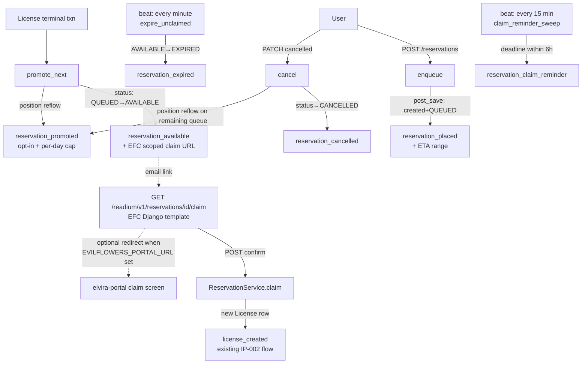

# IP-011: Reservation Queue UX Completion

[IP-003](ip-003-lcp-edrlab-certification.md) Phase 3-4 shipped the reservation queue, the three `reservation_*` email templates, and the signal wiring that fires them. The backend half is correct and tested. The user-visible half — what each email actually says, where each link goes, and which transitions even *get* a notification — has gaps that surface only once a real reservation flow is walked end-to-end against the elvira-portal Figma design. This proposal closes those gaps as one bundled change so the reservation feature ships with a coherent UX rather than five small follow-ups.

<!-- more -->

## Status

**Status**: Draft
**Last Updated**: 2026-05-25
**Implementation**: Not started

## Problem Statement

The IP-003 reservation queue is functionally complete on the backend: `enqueue` → `promote_next` → `claim`/`expire` runs correctly under concurrent load (IP-008 Phase 1 race fixes verified). The signals in `apps/readium/signals.py:95-127` dispatch three notifications. However the surfaces that end users actually see — email contents, links, and the set of moments a notification is sent — were never validated against the SPA design and exhibit the following gaps.

### G1. `claim_url` in `reservation_available` email points to the API endpoint

`apps/readium/signals.py:120-124` builds:

```python
"claim_url": f"{base_url}/readium/v1/reservations/{instance.pk}",
```

This is the raw REST endpoint. Clicking it from an email yields:

- A `405 Method Not Allowed` if the user is logged in (PATCH-only resource)
- A `401` if the session has expired
- Never the actual "Claim your book" screen the user expects

The IP-002 `license_created` email already uses `NotificationService.generate_scoped_url` to issue a JWT-scoped link that bypasses re-auth (`apps/notifications/signals.py:20-24`). The reservation flow needs the equivalent — but a destination that surfaces a confirmation UI before performing the state change, because `claim` is a mutation, not a one-shot download.

### G2. No estimated availability date on `reservation_placed`

When a user joins the queue, the email tells them their `position` and the `claim_window_hours` (how long they get to claim once their turn comes). It does not tell them *when* their turn is expected. The serializer field `next_available_at` (`apps/api/serializers/entries.py:125`) is computed per-entry and would give exactly this estimate, but it isn't piped into the notification context.

Users in position 4+ have no signal whether their wait is hours, days, or weeks. The Figma "you're on the waitlist" screen carries an explicit ETA.

### G3. No notification when the user's queue position improves

The position field reflows automatically: `reservation_service.py:96-100` on cancel, `:187-191` on promotion. A user in position 5 who watches three users ahead of them cancel will silently move to position 2 — they only find out by polling the list endpoint or refreshing the SPA. There is no `reservation_promoted` (or equivalent) notification.

This is the lowest-impact gap of the set; we flag it because the Figma design includes a "good news — you're now #N in line" affordance.

### G4. No notification for user-cancelled or claimed reservations

`apps/readium/signals.py:119-127` handles the `AVAILABLE` and `EXPIRED` transitions only. The state machine also has `CANCELLED` (`reservation_service.py:91-92`) and `CLAIMED` (`reservation_service.py:130-132`) terminal transitions, neither of which fires a notification. The result:

- User cancels their reservation → no confirmation email
- User claims their reservation → no "your loan is ready" follow-up (the `license_created` email *is* sent because a new License is created, but it is a different notification and references the loan rather than confirming the reservation→loan conversion)

For `CLAIMED` the user already gets `license_created`, so the question is whether a separate confirmation adds value or just doubles inbox traffic. For `CANCELLED` no notification is sent at all, which the Figma design seems to expect.

### G5. No reminder before the claim deadline expires

Once `promote_next` fires, the user has `EVILFLOWERS_READIUM_RESERVATION_CLAIM_HOURS` (default 48h) to PATCH `status: "claimed"`. If they miss it, `expire_unclaimed` reclaims the slot and `reservation_expired` notifies them after the fact. There is no reminder *before* the deadline ("8 hours left to claim your reservation"). The Figma design includes an explicit reminder card and a corresponding email.

Without the reminder, a user who got the `reservation_available` email at 09:00 Monday but didn't open it until Wednesday loses their slot without warning.

## Proposed Solution

### Overview

Five focused changes spread across `apps/readium/signals.py`, `apps/readium/services/reservation_service.py`, `apps/readium/services/entry_lcp_decorator.py`, `apps/readium/tasks.py`, two new EFC-hosted views, and the notification template directory. No new domain model or schema migration (only `NotificationLog.NotificationType` enum extensions). Four new settings, three new notification types, one new Celery beat job.

### Key Components

1. **EFC-hosted scoped claim page** — the `reservation_available` email links to a new `GET /readium/v1/reservations/{id}/claim?access_token=<scoped JWT>` endpoint hosted by EFC itself. The endpoint renders a minimal Django template ("Claim 'Title' by 'Author'? `[Claim]` `[Cancel]`") which POSTs back to the sibling confirm endpoint that calls `ReservationService.claim` server-side. EFC therefore remains standalone-usable; an optional `EVILFLOWERS_PORTAL_URL` setting flips the GET into a 302-redirect to elvira-portal for deployments that prefer the SPA path.
2. **ETA range in `reservation_placed`** — compute earliest and latest availability dates at signal time. Earliest = Nth-earliest current `License.expires_at` on the entry (no renewal). Latest = same projection assuming each active license stacks all remaining renewals (`EVILFLOWERS_READIUM_MAX_RENEWALS` minus per-license `renewal_count`). Template renders a range, a single-bound "expected after X", or omits the section entirely depending on which helpers return values.
3. **`reservation_promoted` notification (new type)** — fire on every QUEUED→QUEUED position-decrease transition. Gated by `EVILFLOWERS_READIUM_NOTIFY_POSITION_CHANGES` (default `False`) and additionally throttled by `EVILFLOWERS_READIUM_PROMOTED_MAX_PER_USER_PER_ENTRY_PER_DAY` (default `3`) so a burst of cancellations on a hot title can't flood a user's inbox.
4. **`reservation_cancelled` notification (new type)** — fire on QUEUED/AVAILABLE → CANCELLED transition. CLAIMED transitions remain silent (the existing `license_created` covers the success path).
5. **`reservation_claim_reminder` notification (new type) + Celery beat job** — every 15 minutes (`*/15 * * * *`), find AVAILABLE reservations whose `claim_deadline` is within `EVILFLOWERS_READIUM_CLAIM_REMINDER_HOURS` (default 6h) and that have not yet received a reminder (deduped via `NotificationLog.context_snapshot` keyed on `(reservation_id, available_at)`). Fires the reminder template.

### Architecture



## Implementation Plan

### Phase 1: Self-hosted scoped claim page (G1)

EFC owns the claim screen so a deployment is usable without elvira-portal. Per Q1 resolution.

- [ ] Add a `reservation:claim` JWT scope in `JWTFactory.scoped` (or piggyback the existing `license:read` scope-list mechanism). TTL reuses `EVILFLOWERS_NOTIFICATION_SCOPED_TOKEN_TTL_HOURS`.
- [ ] Add `apps/readium/views/claim.py` with two views and URL entries:
    - `GET /readium/v1/reservations/{id}/claim?access_token=<scoped JWT>` — `ReservationClaimPage`. Validates token, renders `templates/readium/claim_confirm.html` (entry title, author, claim deadline, [Claim] / [Cancel] buttons). The [Claim] button is a form that POSTs back with the same scoped JWT as a hidden field.
    - `POST /readium/v1/reservations/{id}/claim` — `ReservationClaimConfirm`. Validates the scoped JWT, calls `ReservationService.claim(reservation)`, renders `templates/readium/claim_result.html` (success → loan summary + download link / error → problem detail).
- [ ] When `EVILFLOWERS_PORTAL_URL` is set, the GET endpoint 302-redirects to `{EVILFLOWERS_PORTAL_URL}/library/reservations/{id}/claim?access_token=...` instead of rendering. When unset (default), EFC serves the page. Same toggle pattern as the existing license-download flow.
- [ ] Change `apps/readium/signals.py:120-124` to build:
    ```python
    claim_url = NotificationService.generate_scoped_url(
        user_id=str(instance.user.pk),
        scope="reservation:claim",
        resource_path=f"/readium/v1/reservations/{instance.pk}/claim",
    )
    ```
- [ ] Update `apps/notifications/services.py:24-29` `generate_scoped_url` to take an optional `base_url=None` argument (defaults to `EVILFLOWERS_BASE_URL`) so the portal-redirect destination can be passed through if/when needed
- [ ] Mark the scoped JWT single-use: after a successful claim, write the token's `jti` to a deny-list (Redis with the token TTL, or a small `ScopedTokenUsage` table) so a reused link returns 410
- [ ] Update `reservation_available.mjml` / `.txt` button text to "Claim Your Book"
- [ ] pytest: GET renders form when token valid; POST succeeds; expired token returns RFC 7807; replayed token after successful claim returns 410; redirect path activates when `EVILFLOWERS_PORTAL_URL` is set

### Phase 2: ETA range on `reservation_placed` (G2)

Per Q2 resolution, the email surfaces a range (earliest..latest) rather than a single date.

- [ ] Add two helpers in `apps/readium/services/entry_lcp_decorator.py`:
    - `reservation_eta_earliest(entry, position) -> datetime | None` — Nth-earliest `License.expires_at` among currently active licenses on the entry. No renewal adjustment. Returns `None` when `position > active_count` (no licenses to extrapolate from).
    - `reservation_eta_latest(entry, position) -> datetime | None` — assumes each active license stacks all remaining renewals (`EVILFLOWERS_READIUM_MAX_RENEWALS` minus per-license `renewal_count`) on top of its current `expires_at`. When `EVILFLOWERS_READIUM_MAX_RENEWALS` is unset (uncapped), returns `None` so the email omits the upper bound.
- [ ] In `apps/readium/signals.py:107-112` (the QUEUED-created branch), add `estimated_available_from` and `estimated_available_until` keys to the context (both ISO 8601 strings, empty when their respective helper returns None).
- [ ] Update `reservation_placed.mjml` / `.txt` to render one of three blocks:
    - Both set: "Expected available between {from} and {until}"
    - Only `from` set: "Expected available after {from}" (uncapped-renewals deployment)
    - Neither set: ETA section omitted entirely (position 1 or non-LCP-saturated entry)
- [ ] Email copy explicitly notes that dates are estimates and the actual availability depends on whether borrowers renew or return early.
- [ ] pytest: position 1 (both omitted), position 3 with uncapped renewals (only `from` set), position 3 with capped renewals (range), position N > active_count (both omitted).

### Phase 3: `reservation_promoted` notification (G3)

Per Q3 resolution: implement, default off, with a per-user-per-entry-per-day cap as a tunable safety hatch.

- [ ] Add `RESERVATION_PROMOTED = "reservation_promoted"` to `NotificationLog.NotificationType` and migration
- [ ] Add `reservation_promoted.mjml` / `.txt` / `subjects/reservation_promoted.txt` templates
- [ ] Add settings:
    - `EVILFLOWERS_READIUM_NOTIFY_POSITION_CHANGES` (default `False`) — global on/off
    - `EVILFLOWERS_READIUM_PROMOTED_MAX_PER_USER_PER_ENTRY_PER_DAY` (default `3`) — per-(user,entry) burst cap
- [ ] In `apps/readium/services/reservation_service.py:96-100` and `:187-191`, after the bulk `update(position=F("position") - 1)`, dispatch position-improvement notifications:
    - Re-query the affected rows
    - For each, before enqueueing, count `NotificationLog` entries of type `reservation_promoted` for the same (user, entry) in the last 24h; skip silently when at the cap
    - Enqueue `reservation_promoted` with `{old_position, new_position, entry_title, entry_author}`
    - All dispatches gated by `EVILFLOWERS_READIUM_NOTIFY_POSITION_CHANGES`
- [ ] pytest:
    - User-2 in a queue of 4 cancels → users 3 and 4 receive `reservation_promoted` (setting enabled, under cap)
    - Setting disabled → no notification regardless of cap
    - Burst test: 5 cancellations ahead of a user within 24h → cap=3 limits to 3 emails, sweep emits a single warning log on cap-hit

### Phase 4: `reservation_cancelled` notification (G4)

- [ ] Add `RESERVATION_CANCELLED = "reservation_cancelled"` to `NotificationLog.NotificationType` and migration
- [ ] Add templates
- [ ] In `apps/readium/signals.py:115-127`, add:
    ```python
    elif instance.status == Reservation.Status.CANCELLED:
        _enqueue("reservation_cancelled", instance.user, base_context)
    ```
- [ ] No CLAIMED branch — `license_created` already covers the success path
- [ ] pytest: cancelling a QUEUED reservation sends `reservation_cancelled`; cancelling an AVAILABLE reservation does the same; CLAIMED does not

### Phase 5: `reservation_claim_reminder` notification + beat sweep (G5)

Per Q4 and Q5 resolutions: fixed-hour reminder setting; composite `(reservation_id, available_at)` dedup key on `NotificationLog.context_snapshot`.

- [ ] Add `RESERVATION_CLAIM_REMINDER = "reservation_claim_reminder"` to `NotificationLog.NotificationType` and migration
- [ ] Add templates (`reservation_claim_reminder.mjml` / `.txt` / `subjects/reservation_claim_reminder.txt`)
- [ ] Add `EVILFLOWERS_READIUM_CLAIM_REMINDER_HOURS` setting (default `6`). Docstring notes that operators should keep `RESERVATION_CLAIM_HOURS > 2 * CLAIM_REMINDER_HOURS`.
- [ ] Add `apps/readium/tasks.py::reservation_claim_reminder_sweep`:
    - Query AVAILABLE reservations where `claim_deadline` is between `now` and `now + reminder_hours`
    - For each candidate, dedupe with:
      ```python
      NotificationLog.objects.filter(
          notification_type="reservation_claim_reminder",
          context_snapshot__reservation_id=str(reservation.pk),
          context_snapshot__available_at=reservation.available_at.isoformat(),
      ).exists()
      ```
    - When the row already exists, skip silently
    - Otherwise enqueue the reminder. Both `reservation_id` and `available_at` are written into `context_snapshot` so the next sweep's dedup query finds the row
- [ ] Register the beat schedule in `evil_flowers_catalog/celery.py` — every 15 minutes
- [ ] Reminder includes the same scoped claim URL as `reservation_available` so the user can act directly
- [ ] pytest:
    - With a 48h claim window and 6h reminder, a reservation that became AVAILABLE 43h ago triggers a reminder; same reservation at 41h does not
    - A reservation already reminded once is not reminded again on the next sweep
    - A reservation re-promoted with a fresh `available_at` (hypothetical future state) gets a fresh reminder — verified by manually overriding `available_at` in the test fixture

### Phase 6: Documentation & frontend handoff

- [ ] Update `docs/readium/integration-contract.md` notification table with the three new notification types and the GET/POST claim endpoints
- [ ] Update `docs/readium/frontend-integration-guide.md` documenting the new claim endpoint, the `reservation:claim` JWT scope contract, and the optional `EVILFLOWERS_PORTAL_URL` redirect behaviour
- [ ] Update `docs/readium/elvira-portal-action-items.md` with the *optional* claim-route work item (deployments that prefer the SPA claim screen need to implement `/library/reservations/{id}/claim` and consume the same scoped JWT)

### Prerequisites

- IP-002 and IP-003 are implemented (they are, both `:white_check_mark: Implemented` in the index)
- The scoped-JWT mechanism (`JWTFactory.scoped`, `NotificationService.generate_scoped_url`) used by the loan-download flow is in place; Phase 1 extends it with a new scope and an optional `base_url` parameter

## Technical Details

### Data Model Changes

None. All five gaps are addressed in service/signal/task layer + template additions. The new notification types are enum additions on `NotificationLog.NotificationType`; the migration is mechanical.

### API Changes

- Four new settings: `EVILFLOWERS_PORTAL_URL` (optional override), `EVILFLOWERS_READIUM_NOTIFY_POSITION_CHANGES`, `EVILFLOWERS_READIUM_PROMOTED_MAX_PER_USER_PER_ENTRY_PER_DAY`, `EVILFLOWERS_READIUM_CLAIM_REMINDER_HOURS`
- New endpoints `GET/POST /readium/v1/reservations/{id}/claim` — EFC-hosted claim confirmation page + submit handler, gated by a scoped JWT (`reservation:claim` scope)
- `NotificationService.generate_scoped_url` gains an optional `base_url` argument (backwards-compatible default)
- Three new `NotificationLog.NotificationType` choices: `reservation_promoted`, `reservation_cancelled`, `reservation_claim_reminder` (the existing `reservation_available` template's `claim_url` value changes to point at the new claim endpoint)

### Configuration

```bash
# Optional frontend portal base URL. When set, the EFC claim endpoint
# 302-redirects clicked-from-email links to elvira-portal. When unset
# (default), EFC serves a self-contained Django-templated claim page so the
# catalog is standalone-usable.
EVILFLOWERS_PORTAL_URL=

# Send reservation_promoted on every position-decrease. Off by default —
# enable when ops has confirmed the email volume is acceptable.
EVILFLOWERS_READIUM_NOTIFY_POSITION_CHANGES=false

# Per-(user, entry) cap on reservation_promoted emails sent within a 24h
# window. Protects against burst-cancellation storms on hot titles.
EVILFLOWERS_READIUM_PROMOTED_MAX_PER_USER_PER_ENTRY_PER_DAY=3

# How far ahead of claim_deadline to fire the reminder. Keep
# RESERVATION_CLAIM_HOURS > 2 * CLAIM_REMINDER_HOURS or the reminder
# arrives only minutes after the AVAILABLE email.
EVILFLOWERS_READIUM_CLAIM_REMINDER_HOURS=6
```

```python
# celery.py beat schedule additions
CELERY_BEAT_SCHEDULE = {
    # ... existing entries ...
    "reservation_claim_reminder_sweep": {
        "task": "apps.readium.tasks.reservation_claim_reminder_sweep",
        "schedule": crontab(minute="*/15"),
    },
}
```

## Alternatives Considered

### Alternative 1: Magic-Link `/claim` that auto-mutates on GET

**Description**: A single `GET /readium/v1/reservations/{id}/claim?access_token=...` endpoint that, on first visit, performs the claim server-side and 302-redirects to the loan-detail page. No confirmation form.

**Pros**:
- One click — no second interaction to confirm
- Works in plain text email clients without HTML/JS support

**Cons**:
- Side-effecting GET — REST/security antipattern, opens up CSRF / link-prefetching exposure (mail clients pre-fetching URLs would silently claim reservations)
- No place to surface a confirmation UI before the loan is created
- Diverges from the IP-003 "PATCH-only mutation" contract

**Why not chosen**: Link prefetching by Outlook / Apple Mail / anti-phishing scanners would routinely claim reservations against the user's will. The chosen design (per Q1 resolution) keeps the same URL shape but renders a confirmation form on GET and only performs the state change on the POST submit.

### Alternative 1b: Frontend-routed scoped URL (require elvira-portal)

**Description**: Hardcode `EVILFLOWERS_PORTAL_URL` as required and emit `{portal}/library/reservations/{id}/claim?access_token=...`. No EFC-hosted claim screen — elvira-portal is mandatory.

**Pros**:
- Single visual UX for the claim flow
- Backend stays purely API; no Django templates

**Cons**:
- EFC becomes unusable as a standalone catalog without a paired frontend deployment
- Couples release cadences: elvira-portal must ship the claim route before EFC can dispatch any `reservation_available` email

**Why not chosen**: Q1 resolution — the catalog needs to remain standalone-usable. The chosen design makes the portal path an optional override, not a hard dependency.

### Alternative 2: Add a single `reservation_state_changed` notification that covers all four new types

**Description**: One template with a `reason` field rendering different content for promoted/cancelled/reminder/etc.

**Pros**:
- Less template duplication
- Easier to add future transitions

**Cons**:
- IP-002 / IP-003 explicitly model notification types as `NotificationLog.NotificationType` enum values for filtering, dedup, and per-type unsubscribe (a future feature)
- A single "state change" template renders worse — the subject line and CTA differ enough per transition that a single template becomes a conditional spaghetti

**Why not chosen**: Conflicts with the per-type-enum convention and produces lower-quality emails.

### Alternative 3: Defer G3 (position-change notification) indefinitely

**Description**: Drop the `reservation_promoted` work; rely on the SPA's existing reservation-list view to surface position changes via polling/websockets.

**Pros**:
- One fewer notification type, simpler implementation
- Avoids the "queue churn floods my inbox" failure mode

**Cons**:
- The Figma design includes the affordance
- Users who don't keep the SPA open never learn their position improved until it actually flips to AVAILABLE

**Why not chosen**: Per Q3 resolution, the work stays but is gated by an off-by-default setting *and* a per-(user, entry, 24h) cap. Deployments that want it flip the setting on and tune the cap; those that don't pay no cost. The first few months of production give ops a chance to validate the volume assumption — drop the feature in a follow-up if it proves noisy.

## Trade-offs and Risks

### Trade-offs

- **Email volume vs. user awareness (G3)**: `reservation_promoted` could be noisy on hot titles where the queue moves often. Mitigated by an opt-in setting *and* a per-(user, entry, 24h) cap so a burst of cancellations on a hot title doesn't flood a single user's inbox.
- **Reminder freshness vs. cron load (G5)**: 15-minute sweep means worst-case reminder lateness is ~15 minutes. A 5-minute schedule would be more punctual at higher Celery load. 15 minutes balances both; tunable via cron schedule without proposal revision.
- **ETA precision vs. honesty (G2)**: showing a single date promises more than we can deliver under renewals; showing a range is wider and harder to act on. Range chosen per Q2 resolution because the upper bound communicates "could be a while" honestly for high-renewal deployments, while the lower bound remains the actionable signal.
- **Standalone catalog vs. SPA polish (G1)**: EFC-hosted claim page renders correctly but is visually minimal compared to elvira-portal. Acceptable because the catalog can ship without a portal dependency; deployments that care about polish set `EVILFLOWERS_PORTAL_URL` and the redirect path activates.
- **Backwards compatibility (G1)**: The `claim_url` value in `reservation_available` emails changes shape — same hostname, same `/readium/v1/reservations/{id}` prefix, but now suffixed with `/claim?access_token=...` and serves HTML on GET. Deployments whose users already received emails with the old format will see those links return 405 (Method Not Allowed) on click. Acceptable because the reservation feature has not been used in production yet (per IP-003 closeout context — STU deployment is pending EDRLab certification).

### Risks

| Risk                                                                                              | Impact | Mitigation                                                                                                                                                                                                                                          |
|---------------------------------------------------------------------------------------------------|--------|-----------------------------------------------------------------------------------------------------------------------------------------------------------------------------------------------------------------------------------------------------|
| Scoped JWT for `reservation:claim` lets a leaked email link be replayed                           | Medium | TTL on the scope (reuse existing `EVILFLOWERS_NOTIFICATION_SCOPED_TOKEN_TTL_HOURS`); single-use marker after successful claim                                                                                                                        |
| `reservation_promoted` floods inbox when a popular title sees mass cancellations                  | Medium | Opt-in setting (default off) plus `EVILFLOWERS_READIUM_PROMOTED_MAX_PER_USER_PER_ENTRY_PER_DAY` cap (default 3) gives operators a tunable safety hatch without disabling the feature                                                                 |
| Claim-reminder sweep dedup logic over/under-fires across reservation re-availability cycles       | Low    | Dedup key is `(reservation_id, available_at)` in `context_snapshot`, not bare `reservation_id`, so a reservation that expires and is later re-promoted (which can't happen in current state machine but is defended against anyway) gets a fresh window |
| `next_available_at` is wrong for entries with renewable licenses (renewal pushes the expiry out)  | Low    | ETA is rendered as a range (earliest..latest) per Q2 resolution; copy notes the dates are estimates                                                                                                                                                  |

## Open Questions

All five Review Questions (Q1-Q5 below) were resolved on 2026-05-25. The resolved decisions are folded into Phases 1-5 and the Configuration section. No open questions remain pre-implementation.

## Success Criteria

- [ ] All five gaps closed with green test coverage in `apps/readium/tests/` and `apps/notifications/tests/`
- [ ] `reservation_available` email click-through lands in the SPA's claim screen without manual re-auth (verified manually + in `pytest_playwright` smoke if available)
- [ ] `reservation_placed` email displays a usable ETA for positions 1, 3, and 10 in a canned test catalog
- [ ] `reservation_claim_reminder` fires exactly once per AVAILABLE cycle when enabled
- [ ] `reservation_promoted` opt-in setting verified: emails fire only when `True`, no emails when `False`
- [ ] `TemplateRegistry.validate_templates()` returns no errors for the three new templates
- [ ] `docs/readium/elvira-portal-action-items.md` records the *optional* SPA claim-route work item; integration-contract.md documents the new endpoints and notification types

## Future Considerations

- **Push / in-app notifications** — the same notification-type taxonomy would apply; the engine currently dispatches via email only (`apps/notifications/services.py:61-68`). A future proposal could add a generic dispatcher with per-type, per-user channel preferences.
- **Per-type unsubscribe** — `NotificationContact` is single-channel right now; a "I don't want position-change emails but do want availability" preference would slot in here.
- **Webhook fan-out** — institutional integrations might want to receive reservation-state webhooks instead of (or in addition to) email; same enum taxonomy makes that mechanical.

## References

- [IP-002: Notification Engine with MJML Templates](ip-002-notification-engine.md) — the underlying notification service this proposal extends
- [IP-003: Readium LCP — EDRLab Certification Readiness](ip-003-lcp-edrlab-certification.md) — Phase 3 (reservation queue) and Phase 4 (notification wiring) that this proposal completes
- `apps/readium/signals.py:95-127` — current reservation notification dispatch
- `apps/readium/services/reservation_service.py` — queue state machine
- `apps/notifications/services.py:24-29` — `generate_scoped_url`
- `apps/api/serializers/entries.py:113-129` — availability fields surfaced on Entry responses
- `docs/readium/elvira-portal-action-items.md` — frontend punch-list paired with the Readium track

## Review Questions

**Status**: ✅ Resolved
**Review Date**: 2026-05-25
**Reviewer**: Claude AI

The following questions must be answered before implementation:

---

### Q1: Frontend claim-URL contract 🔴 Critical

**Issue**: G1 (Phase 1) proposes `{EVILFLOWERS_PORTAL_URL}/library/reservations/{id}/claim?access_token=...` as the email link. The actual frontend route shape is owned by elvira-portal and must be confirmed before the backend hardcodes a path.

**Context**: A wrong path means the email link 404s in the SPA. The path is referenced directly from `apps/readium/signals.py` and from the email templates; changing it later requires a backend + template release.

**Question**: What is the canonical frontend route for the claim screen, and what query-param contract does it expect?

**Options**:
- [ ] **A**: `/library/reservations/{id}/claim?access_token=...` — backend owns the path, frontend implements it (recommended if the path doesn't already exist)
- [ ] **B**: `/reservations/{id}` with a deep-link `?action=claim` query — keeps the path neutral, makes the claim screen one of several actions accessible from the reservation detail
- [ ] **C**: Some other route already shipped on elvira-portal — share the path and we use that verbatim

**Answer**:
```
I would like to have EFC standalone capable. Rather provide link to the catalog. Keep it RESTful if possible.
```

**Resolution**:
```
EFC owns the claim page. Phase 1 is restructured so the email link goes to a
new GET endpoint hosted by EFC itself — `GET /readium/v1/reservations/{id}/claim?access_token=<scoped JWT>` —
which renders a minimal Django-templated confirmation page ("Claim 'Title' by 'Author'? `[Claim]` `[Cancel]`").
The "Claim" button POSTs a form to a sibling endpoint that internally performs the
PATCH-equivalent state transition. This keeps the resource-level REST contract intact
(state mutations still happen through a non-GET verb on the server side) while giving
clicked-from-email links a working destination without depending on a separate frontend.

`EVILFLOWERS_PORTAL_URL` becomes optional: when set, the GET endpoint 302-redirects to
`{EVILFLOWERS_PORTAL_URL}/library/reservations/{id}/claim?access_token=...` for
deployments that want elvira-portal to own the screen. When unset (default),
EFC serves the page itself. The same toggle pattern is used by the existing
license-download flow, so this is consistent with prior art.

Concrete Phase 1 updates:
- Drop the "must add EVILFLOWERS_PORTAL_URL" requirement; document it as optional override
- Add `apps/readium/views/claim.py` with `ReservationClaimPage` (GET — renders confirm form)
  and `ReservationClaimConfirm` (POST — exchanges scoped JWT for session + calls
  ReservationService.claim + renders success/error page)
- Add `templates/readium/claim_confirm.html` and `templates/readium/claim_result.html`
- Email's `claim_url` now points at the GET endpoint above with the scoped JWT
- Scope name remains `reservation:claim`; TTL reuses the existing scoped-token TTL setting
- Tests cover: GET renders form when token valid, POST succeeds, expired token returns
  problem-details, replayed token after successful claim is rejected
```

---

### Q2: `next_available_at` semantics for `reservation_placed` ETA ⚠️ Medium

**Issue**: G2 (Phase 2) computes the ETA as "the Nth-earliest active-license expiry on the entry, where N = user's queue position". This is naive — it ignores renewals and revocations, and assumes every license runs to its full expiry. The ETA computed at signal time is point-in-time; it doesn't update as the queue evolves.

**Context**: A user in position 3 who sees "expected available 2026-06-01" in their email may find the actual availability is 2026-06-15 (renewals) or 2026-05-28 (early returns). If we promise an ETA, expectation-management matters.

**Question**: What ETA semantics should the placed-email show?

**Options**:
- [ ] **A**: "Earliest" — Nth-earliest current expiry, no adjustment for renewals (recommended; matches the existing `next_available_at` serializer field, simplest to explain in the email copy)
- [ ] **B**: Skip the ETA entirely on the email; only show it in the SPA reservation-list view where it can be recomputed live
- [X] **C**: Compute "earliest" and "latest" bounds (earliest = no renewals; latest = max-allowed renewals stacked) and render a range

**Answer**:
```
This may be nice - provide range.
```

**Resolution**:
```
Phase 2 produces a range, not a single datetime. Two helper functions in
`apps/readium/services/entry_lcp_decorator.py`:

- `reservation_eta_earliest(entry, position) -> datetime | None`
    Nth-earliest current `License.expires_at` among active licenses on the entry
    (matches the existing `next_available_at` serializer field). No renewal adjustment.

- `reservation_eta_latest(entry, position) -> datetime | None`
    Assumes every active license consumes all its remaining renewals stacked on top
    of its current `expires_at`. Uses `EVILFLOWERS_READIUM_MAX_RENEWALS`
    (`evil_flowers_catalog/settings/base.py:311-312`) and per-license
    `renewal_count` (`apps/readium/models.py:104`) to compute remaining renewals.
    When `EVILFLOWERS_READIUM_MAX_RENEWALS` is None (uncapped) the latest bound is
    returned as None and the email omits the upper bound — copy reads "expected
    after <earliest>" rather than "between <earliest> and <latest>".

The `reservation_placed` context gains `estimated_available_from` and
`estimated_available_until` keys (both ISO 8601 strings, both possibly empty).
Template renders one of three blocks:
- Both set:    "Expected available between <from> and <until>"
- Only `from`: "Expected available after <from>"  (uncapped renewals deployment)
- Neither:     ETA section omitted (position 1 or non-LCP-saturated entry)

Email copy explicitly notes that the dates are estimates and the actual
availability depends on whether borrowers renew or return early.

Tests cover: position 1 (omitted), position 3 with uncapped renewals (single
bound), position 3 with capped renewals (range), and position N > active_count
(omitted, no licenses to extrapolate from).
```

---

### Q3: `reservation_promoted` (G3) — keep, kill, or change defaults? ⚠️ Medium

**Issue**: G3 is the lowest-impact gap. The proposal includes it but defaults the setting `EVILFLOWERS_READIUM_NOTIFY_POSITION_CHANGES` to `False`. Implementing it adds code, templates, a new enum value, and a migration even when nobody enables it.

**Context**: Hot titles with high cancellation churn could send 5+ emails to the same user as they ride up the queue. The Figma design includes the affordance, but the design may not have anticipated email volume realities.

**Question**: Should `reservation_promoted` be implemented at all?

**Options**:
- [X] **A**: Implement, default off (current proposal — recommended if Figma showed an email for this transition)
- [ ] **B**: Implement only as an in-SPA banner (`NotificationLog` row written, no email dispatched); add an `email_disabled` field on the type to control delivery
- [ ] **C**: Drop G3 entirely — recompute and surface position in the SPA only

**Answer**:
```
Implement this. We will tune first few months - I may drop some events / notifications and shit.
```

**Resolution**:
```
Phase 3 stays as drafted. `EVILFLOWERS_READIUM_NOTIFY_POSITION_CHANGES`
defaults to `False` so deployments opt in.

To support the "tune over the first few months" plan without requiring code
changes, the resolution adds one safety hatch: a per-entry max-per-day cap.
Add `EVILFLOWERS_READIUM_PROMOTED_MAX_PER_USER_PER_ENTRY_PER_DAY` (default 3).
Before enqueueing `reservation_promoted` for (user, entry), count the
`NotificationLog` rows of that type for the same (user, entry) in the last
24h; if at the cap, skip silently. This protects against burst-cancellation
storms on hot titles without disabling the feature outright. Cap is overridable
via env var so ops can lower it to 1 (one promotion email per day per title)
or raise it during testing.

No other changes to Phase 3 — templates, enum value, signal hook, and migration
remain as drafted.
```

---

### Q4: Claim-reminder cadence vs. claim-window length ⚠️ Medium

**Issue**: G5 (Phase 5) hardcodes `EVILFLOWERS_READIUM_CLAIM_REMINDER_HOURS=6` and a `*/15` cron schedule against a `EVILFLOWERS_READIUM_RESERVATION_CLAIM_HOURS=48` claim window. With a 48h window, 6h is 12.5% of the window — sensible. But the claim-window setting is configurable: a deployment with `RESERVATION_CLAIM_HOURS=4` (short window for fast-moving titles) gets a reminder that arrives only 2h after the AVAILABLE email — feels redundant.

**Context**: Hardcoded reminder timing scales poorly with the claim window. If the reminder fires too early relative to a short window, users get two emails minutes apart.

**Question**: Should the reminder timing be a fraction of the claim window rather than a fixed offset?

**Options**:
- [X] **A**: Keep as a fixed setting `EVILFLOWERS_READIUM_CLAIM_REMINDER_HOURS=6` (recommended for simplicity; operators tune both settings together)
- [ ] **B**: Compute as `max(1, claim_window // 4)` — always reminds at the 75% mark of the window, no extra config
- [ ] **C**: Allow either: setting accepts an int (hours) or a percentage string ("25%"); default `"25%"`

**Answer**:
```
Keep it simple for now. Do we have celery beats?
```

**Resolution**:
```
Yes — Celery beat is already wired up in `evil_flowers_catalog/celery.py`. Three
relevant schedules exist today (`celery.py:33-45`): readium-sweep-unclaimed-reservations
(every minute), readium-notify-expiring-licenses (06:00 UTC daily), and
readium-expire-lapsed-licenses (every 5 minutes). Adding the claim-reminder sweep
is a one-line addition to that file.

Phase 5 stays as drafted: fixed `EVILFLOWERS_READIUM_CLAIM_REMINDER_HOURS=6`
setting + `*/15` cron. Document in the setting's docstring that operators should
keep `RESERVATION_CLAIM_HOURS > 2 * CLAIM_REMINDER_HOURS` to avoid the
"reminder fires minutes after AVAILABLE email" failure mode flagged in the
question. No runtime guard — it's an operator-tuning concern, not a correctness
issue, and tying the two settings together in code adds complexity for a
deployment shape (very-short claim windows) we don't actually have.
```

---

### Q5: Claim-reminder dedup key ℹ️ Low

**Issue**: G5 dedupes reminders via `NotificationLog`. Phase 5 proposes the dedup key as `(reservation_id, available_at)` to handle the edge case of a reservation that expires, gets re-promoted, and needs a fresh reminder cycle. The current state machine doesn't actually allow re-promotion — EXPIRED is terminal — so the `available_at` component is defensive-only.

**Context**: Defensive code that defends against impossible states tends to rot. But making it `reservation_id` alone means a future state-machine change (e.g., adding a "re-queue after expiry" admin action) silently breaks dedup.

**Question**: Which dedup key should we use?

**Options**:
- [X] **A**: `(reservation_id, available_at)` composite — defensive but slightly more code (recommended)
- [ ] **B**: `reservation_id` alone — simpler; revisit if/when the state machine permits re-availability
- [ ] **C**: Add a `claim_reminder_sent_at` field on `Reservation` — most explicit, but requires a migration just for one bool

**Answer**:
```
Make it nice
```

**Resolution**:
```
Use the composite `(reservation_id, available_at)` dedup key as drafted in
Phase 5 (option A). Implementation: when the sweep enqueues a reminder, it
writes `reservation_id` AND `available_at` (ISO 8601 string) into the
`NotificationLog.context_snapshot` JSON. The sweep's dedup query becomes:

    NotificationLog.objects.filter(
        notification_type="reservation_claim_reminder",
        context_snapshot__reservation_id=str(reservation.pk),
        context_snapshot__available_at=reservation.available_at.isoformat(),
    ).exists()

This survives the "EXPIRED is currently terminal" assumption without
requiring a state-machine audit if that invariant changes later — and the
extra JSON-key filter is essentially free on the indexed `notification_type`
column. No new model field, no migration overhead beyond the existing
NotificationType enum addition that Phase 5 already requires.
```

---

## Changelog

| Date | Author | Changes |
|------|--------|---------|
| 2026-05-25 | jdubec | Initial draft covering G1-G5 reservation UX gaps identified during post-IP-003 walkthrough; added Review Questions section |
| 2026-05-25 | jdubec | Resolved review questions Q1-Q5; rewrote Phase 1 around an EFC-hosted claim page, expanded Phase 2 to a range, added per-user cap in Phase 3 |
| 2026-05-25 | jdubec | Updated Overview, Key Components, Architecture diagram, Trade-offs, Open Questions, Alternatives, and Phase 5 dedup-query specifics to match resolutions; added Alternative 1b (frontend-only) for completeness |
