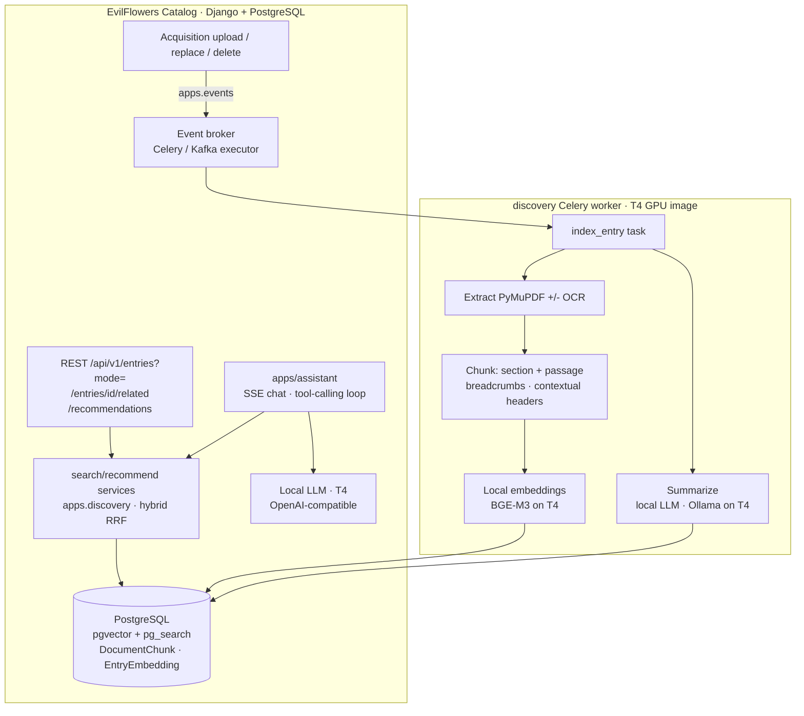

# IP-012: AI-Powered Discovery (Semantic Search, Recommendations, Summarization, Assistant)

Give the EvilFlowers catalog real AI-powered search and discovery over the **contents** of
its books, not just their metadata: full-text semantic + keyword search on the REST API and
portal, content-based recommendations, LLM summaries, and a RAG-grounded conversational
assistant. Everything is built **inside the Django catalog** and runs **fully self-hosted**
on PostgreSQL/pgvector + a single T4 GPU — no Milvus, no Elasticsearch, no paid APIs. This
consolidates GitHub epic #59 and children #60–#63 and folds in the standalone
`elvira-ai-agent` chatbot.

<!-- more -->

## Status

**Status**: Draft (review questions resolved)
**Last Updated**: 2026-07-18
**Implementation**: Not started

This is the single home for GitHub issues #59 (epic), #60 (productionize search), #61
(merge indexing), #62 (recommendations), #63 (summarization), plus folding
`elvira-ai-agent` into the catalog as a RAG assistant. It supersedes the ad-hoc search work
that shipped as a sub-phase of IP-008 (`SearchServiceClient`, OPDS-2 `SearchView`).

> **Depends on [IP-013](ip-013-document-extraction-structure.md) — build that first.** IP-013
> (document extraction, structure, classification) is the foundation: IP-012 consumes its
> `extraction_passage` records + features rather than extracting itself. Build order is
> **IP-013 → IP-012** (the numbers are creation-order, not build-order). All indexing runs as
> **Celery async** tasks on the shared `discovery` worker via `apps/events` — never inline in a request.

### Context & goal

The catalog is being deployed as the **digitized library of the Slovak University of
Technology in Bratislava (STU)**: roughly **~1000 digitized books plus some born-digital
titles**. Two goals drive the product:

1. **Distribute the corpus legally** — already delivered by the Readium LCP work
   (IP-001/003/004/007/008/009/011, considered done).
2. **Provide good AI services for search and discovery** over that corpus — this proposal.

The corpus is **small and bounded** (~1000 books ⇒ order **10⁵ text chunks**, not millions),
which decisively shapes every infrastructure choice below toward simplicity.

### What we take from `monad-knowledge` (and what we deliberately don't)

We reuse **only the indexing-pipeline design** from `Sibyx/monad-knowledge` — the part that
is genuinely good and transferable: structure-aware multi-granularity chunking, contextual-
retrieval headers, hybrid dense + lexical retrieval fused with RRF, a pluggable embedding
engine, and reindex discipline. We explicitly **do not** bring its PhD/research machinery —
the Neo4j knowledge graph, SPECTER2 citation similarity, claim extraction, PageRank/community
detection, or the agentic MCP layer. Those solve an academic-research problem we do not have.
This is a university **library**, not a thesis workbench.

## Problem Statement

Elvira can only search publication **metadata**, has no recommendations or summaries, and its
chatbot cannot see inside books. A prototype pipeline exists but is un-merged, not runnable
as-committed, and built on infrastructure we do not want to operate.

### Current state (verified against `develop` + the three repos)

- **Indexing exists only as a prototype.** `evilflowers-text-service` (Celery worker:
  PyMuPDF extract → optional OCR → llama-index chunking) pushes chunks over HTTP to
  `evilflowers-search-service` (FastAPI: `sentence-transformers/stsb-xlm-r-multilingual`
  768-dim → Milvus HNSW/cosine, plus Elasticsearch 8.11 BM25). The catalog-side trigger
  lives only in the un-merged `text-service-integration` branch and hand-crafts a Celery
  message with kombu, **bypassing `apps/events`**.
- **The prototype is not production-viable.** Confirmed defects: `search-service`
  `Config.py` re-reads `MILVUS_*` with `int(os.getenv(...))` and no default → crash on boot
  when the catalog compose (which only sets `ELASTICSEARCH_HOST`) starts it; Milvus stores
  text truncated to 2000 chars while ES stores full text; `text-service` calls a `/stats`
  endpoint that does not exist (404); `doc_id`/`toc` are never threaded into chunking so
  `metadata.doc_id` is always `"unknown"` and `section` is always empty; the expensive YOLO
  ToC detection and pdfplumber tables are computed then discarded; no auth; two disagreeing
  requirements files; a real-looking `SECRET_KEY` committed in compose.
- **`stsb-xlm-r-multilingual` is the wrong model** — an STS (sentence-similarity) model, not
  a retrieval model. It must be replaced.
- **Query path exists but is unused.** `apps/api/services/search_service_client.py`
  (`keyword()`/`semantic()`) + `apps/opds2/views/search.py` (`SearchView`, `mode=`) are
  reachable **only** via OPDS 2.0 and gated by `SEARCH_SERVICE_URL`. REST `/api/v1/entries`
  is DB-only (`icontains` over title/summary/publisher/author/category in `EntryFilter`).
  **The portal uses neither** — its "intelligent search" only calls REST `/api/v1/entries`.
- **Relevance ordering is broken.** In `apps/api/response.py`, `PaginationResponse` rebuilds
  `order_by` from the `created_at` GET default (line ~51, applied ~141), clobbering any
  relevance sort a search sets upstream.
- **Recommendations and summarization do not exist** anywhere.
- **The chatbot is a separate, metadata-only service.** `elvira-ai-agent` is a Node/TS +
  Express microservice on **hosted OpenAI `gpt-4.1`** (Responses API + function-calling)
  that reaches the catalog only through REST `/api/v1/entries` — so it can describe books by
  **metadata**, but has **no RAG, no embeddings, and no access to book contents**. It
  duplicates the catalog's User model, re-authenticates every turn via a `users/me`
  round-trip, keeps sessions in memory (lost on restart), and depends on a paid API — all of
  which disappear when it becomes an in-process Django app grounded in book contents.

### Constraints that shape the design

- **Self-hosted only, no subscriptions.** We will have **one NVIDIA T4 (16 GB)** for
  inference. No Voyage/OpenAI/Anthropic budget. Every model — embeddings and LLM — runs
  locally on the T4.
- **Minimize infrastructure.** We already run PostgreSQL (`psycopg` v3) and Celery + the
  `apps/events` broker. At ~1000 books, standing up Milvus + etcd + MinIO + Elasticsearch
  would be absurd operational weight.
- **Multilingual (SK/EN) corpus.**

## Proposed Solution

Build the features **inside the catalog** — no new standalone service. Add a Django app
**`apps/discovery`** (indexing, search, recommendations, summarization) and **`apps/assistant`**
(the chatbot), plus a dedicated **`discovery` Celery queue** whose worker image carries the
heavy ML dependencies (so the Django web image stays lean). Store chunks, embeddings, and a
BM25 index in **PostgreSQL** (pgvector + ParadeDB `pg_search`). Retire all three prototype
services (`text-service`, `search-service`, `elvira-ai-agent`), Milvus, and Elasticsearch.

### Overview



The catalog owns the data; the worker owns the GPU and heavy ML dependencies. One broker
(`apps/events`), one database, one deterministic chunk contract, no cross-service HTTP hop
for indexing. The assistant retrieves through the same in-process search code — no REST
pass-through, no API-key relay — so its answers are access-scoped by the requester's session
and grounded in book contents.

### Key Components

1. **`apps/discovery`** — Django models (`DocumentChunk`, `EntryEmbedding`, entry summary
   fields), search/recommendation services, an `EmbeddingEngine` ABC, a `SummarizationBackend`
   ABC, event handlers, and management commands (backfill/reindex).
2. **Event-driven indexing** — upload/replace/delete of a PDF acquisition emits an
   `apps/events` event; a `discovery` Celery task extracts → chunks → embeds → upserts, with
   retries, idempotency, and observability (we already ship logfire/OTel).
3. **PostgreSQL storage** — `DocumentChunk.embedding vector(1024)` with a pgvector **HNSW**
   index (cosine) for dense retrieval, and a **`pg_search` BM25** index for lexical ranking.
   One store, no dual-write drift.
4. **Hybrid retrieval with RRF** — dense (pgvector) + lexical (BM25) branches fused by
   Reciprocal Rank Fusion (`k=60`), access-scoped, with per-entry diversity capping.
5. **Recommendations** — entry-level embeddings power `GET /entries/{id}/related`
   (nearest-neighbor "Related items") and `GET /recommendations` (content-based, from the
   user's own loan history; popularity fallback for cold start).
6. **Summarization** — a local LLM writes an abstract when metadata lacks one, plus optional
   per-section summaries, stored with provenance and never overwriting curator text.
7. **`apps/assistant`** — the `elvira-ai-agent` chatbot reimplemented in Django on a local,
   OpenAI-compatible LLM, calling the catalog ORM and the search services directly as tools,
   with RAG grounding: "find me books about X" semantic search and per-book **"ask this
   book"** Q&A with page/section citations.

### Indexing techniques adopted from monad-knowledge (pipeline only)

- **Contextual-retrieval headers** — store raw `text` and a separate `text_for_embedding`
  that prepends `Title / Authors / Section-breadcrumb` before embedding. Cheap, large recall
  win.
- **Multi-granularity chunking with parent linking** — `section` (≤768 tok) and `passage`
  (≤384 tok) chunks per document with a `parent_id` child→parent edge. Retrieve precise
  passages, expand to section context for the LLM.
- **Section-aware breadcrumbs** — a heading stack from the PDF ToC/headings builds
  `"Introduction > Methods > Data"` paths for the contextual header and for filtering.
- **Hybrid dense + lexical fused by RRF** — pgvector + `pg_search`, `k=60`.
- **Pluggable embedding engine** — an `EmbeddingEngine` ABC with the model id + dimension
  recorded per chunk, so reindex/migration is deterministic.
- **Reindex discipline** — deterministic chunk IDs, cascade delete on unpublish/replace, and
  a "ghost record" guard (drop hits whose Entry was deleted).

## Implementation Plan

### Phase 1: Event-driven indexing pipeline (replaces #61)

> **Extraction is owned by [IP-013](ip-013-document-extraction-structure.md), built first.** The
> document extraction, structure & classification pipeline (OCR/hOCR, ToC, sections, reading-ordered
> passages, figures/tables/math, subject tags) is the foundation. IP-012 **chunks/embeds from
> `extraction_passage`** (+ section breadcrumb + figure/table/equation context) — it does **not**
> re-extract. The "extraction" bullets below therefore reduce to consuming IP-013's structured
> output; the only IP-012-owned indexing work is chunking, embedding, and upsert.

- [ ] Create `apps/discovery` and a `discovery` Celery queue; add a heavy optional dependency
      group (PyMuPDF, sentence-transformers/torch, optional OCR) installed only in the worker
      image, keeping the web image lean.
- [ ] `DocumentChunk` model + migration: `entry` FK, `granularity`, `text`,
      `text_for_embedding`, `embedding vector(1024)`, `search_vector`/`pg_search` index,
      `section_heading` (breadcrumb), `section_level`, `page_start/page_end`, `chunk_index`,
      `parent` self-FK, `language`, `embedding_model`, `embedding_dim`. pgvector **HNSW**
      (cosine) index on `embedding`; **`pg_search` BM25** index on `text`.
- [ ] Enable extensions via migration: `CREATE EXTENSION IF NOT EXISTS vector` and `pg_search`.
- [ ] Extraction: port `TextExtractor` (PyMuPDF digital/scanned detection + optional
      `ocrmypdf`), **thread `doc_id` and `toc` through chunking** (fixes the prototype's
      `doc_id="unknown"`/empty-section bug). Drop YOLO ToC + table extraction from the hot
      path (unused in the prototype output); use `doc.get_toc()`.
- [ ] Chunker: section + passage granularity, breadcrumbs, contextual headers, overlap;
      deterministic chunk IDs (`{entry_id}:{granularity}:{chunk_index}`).
- [ ] Embedding step: `LocalEngine` running **BGE-M3** on the T4; batch by token budget;
      record `embedding_model`/`embedding_dim` per chunk.
- [ ] Wire indexing to `apps/events`: emit events on acquisition create/replace/delete;
      `index_entry`, `reindex_entry`, `delete_entry_index` tasks with retry/backoff, idempotent
      upsert (delete-then-insert per entry in a transaction), structured logging. Remove the
      hand-crafted kombu client.
- [ ] Management commands: `discovery_backfill` (walk the ~1000 existing PDF acquisitions —
      port the prototype's `enqueue_pdfs_from_storage.py` idea), `discovery_reindex` (drop +
      rebuild on model/dimension change).

### Phase 2: Hybrid search on REST + portal (replaces #60)

- [ ] Search service: `mode=catalog|keyword|semantic|hybrid`. `keyword` = `pg_search` BM25,
      `semantic` = pgvector cosine ANN, `hybrid` = RRF fusion of both. Over-fetch and cap
      per-entry chunk count for diversity; hydrate Entries from chunk `entry_id`.
- [ ] **Access scoping (functional requirement):** every query intersects the requester's
      accessible `document_ids` derived from `BaseSecuredFilter`/`EntryFilter`, so content
      search can never surface an inaccessible book.
- [ ] Expose on REST: add `mode=` to `GET /api/v1/entries`, returning the standard paginated
      `IEntriesList` entry schema so the portal reuses `EntryItem`. Preserve relevance order;
      keep metadata filters working alongside content search.
- [ ] **Fix the relevance-ordering regression** in `apps/api/response.py`: when a relevance
      sort / `query` / search `mode` is in effect, do not overwrite it with the `created_at`
      default.
- [ ] Graceful degradation: if the index is unavailable, fall back to `mode=catalog` and
      signal it in `metadata.search_mode`.
- [ ] Re-point OPDS 2.0 `SearchView` at the in-app search service (drop `SearchServiceClient`
      and `SEARCH_SERVICE_URL`).
- [ ] Portal: wire the "intelligent search" toggle to `mode=hybrid`, add snippet/highlight,
      show the degradation notice.

### Phase 3: Recommendations (replaces #62)

- [ ] `EntryEmbedding` model: one vector per Entry = mean-pooled chunk vectors (or a dedicated
      title+summary+categories embedding), maintained on index.
- [ ] `GET /api/v1/entries/{id}/related` — pgvector nearest neighbors over `EntryEmbedding`,
      access-scoped, paginated, cached. Surface as the portal "Súvisiace/Related" strip.
- [ ] `GET /api/v1/recommendations` — per-user rows ("Because you read X") from the user's own
      `apps.readium` loan/read history via item-item content similarity; cold-start falls back
      to popularity; tenant/catalog-scoped; cached. **No cross-user collaborative filtering**
      (privacy), and the data used is documented.

### Phase 4: Summarization (replaces #63)

- [ ] `SummarizationBackend` ABC + `OllamaBackend`; prompts loaded from files, editable
      without code changes; SK/EN aware.
- [ ] On index, generate (a) an entry abstract **only when metadata lacks one**, and (b)
      optional per-section summaries; store `summary_generated`, `summary_source`
      (model + generated_at), `summary_manual_override`. **Never overwrite curator text.**
- [ ] Expose via the entry serializer (`summary_generated` + source flag); portal shows an
      "AI-generated" label. Idempotent, queued through `apps/events`, re-runnable on model
      upgrade.

### Phase 5: RAG-grounded conversational assistant — fold in & extend `elvira-ai-agent`

Built as a full RAG assistant (not a two-step port): it depends on Phases 1–2 for retrieval.

- [ ] New `apps/assistant` app. Models `Chat` (FK → existing `User`) and `ChatMessage`
      (sender, text, entry_id, catalog_id, tokens, `book_ids`/`book_catalogs` JSON) + a
      per-user daily quota. **Drop** the agent's duplicated `users` table.
- [ ] Replace catalog REST pass-through with **direct ORM** access (Entry/Catalog),
      eliminating the API-key relay and the fragile `[Book Catalogs: {...}]` catalogId
      breadcrumb prompt hack (the ORM has the catalog FK natively).
- [ ] Replace hosted OpenAI with a provider-agnostic `LLMClient` over a **local,
      OpenAI-compatible Chat Completions** endpoint (Ollama on the T4). Rewrite the
      Responses-API streaming/tool loop to `chat.completions` semantics.
- [ ] Reuse the existing auth backends (`BearerBackend`/`BasicBackend`) — no per-turn
      `users/me` round-trip; the request is already authenticated in-process.
- [ ] Stateless turns: reconstruct conversation from `ChatMessage` rows (Redis for hot
      sessions) — removes the in-memory session dict and the "404 until resume" problem.
- [ ] Stream via `StreamingHttpResponse`/ASGI (or keep SSE); port the daily-quota logic.
- [ ] **RAG tools grounded in the search service:** keep `getEntries`/`getEntryDetails`/
      `displayBooks`, and add `semantic_search(query)` and `ask_book(entry_id, question)`
      backed by the Phase 1–2 retrieval — content search + per-book Q&A with page/section
      citations, access-scoped at retrieval time.
- [ ] Simplify the tool set and use constrained/JSON decoding to keep a 7B local model's
      tool-calling reliable.
- [ ] Retire the `elvira-ai-agent` repo; point the portal at the in-app endpoint.

### Prerequisites

- pgvector and `pg_search` installable in the PostgreSQL deployment.
- One T4 GPU host reachable by the `discovery` worker / assistant (or they run on it).
- A local, OpenAI-compatible inference runtime (Ollama).

## Technical Details

### Technology Stack

- **Vector store:** PostgreSQL + **pgvector** (HNSW, cosine). At ~10⁵ chunks this is trivial
  for Postgres; it adds zero new services and gives transactional consistency.
- **Lexical search:** **ParadeDB `pg_search`** (real BM25 as a native Postgres index),
  fused with the dense branch by RRF in one SQL query. Chosen over native `ts_rank` (which
  lacks corpus-wide IDF) for better ranking from day one, while staying inside Postgres.
- **Embeddings (local, T4):** `EmbeddingEngine` ABC with a `LocalEngine` running
  **`BAAI/bge-m3`** (1024-dim; strong multilingual SK/EN; dense + native lexical). Model id +
  dim recorded per chunk. Swappable by config with a reindex.
- **LLM (local, T4):** `SummarizationBackend`/`LLMClient` over **Ollama** running
  **Qwen2.5-7B-Instruct** (good SK/EN, easy ops, OpenAI-compatible endpoint) for both
  summarization and the assistant. Bounded one-shot for summaries; a tool-calling loop for
  chat.
- **Extraction:** PyMuPDF (primary) + optional `ocrmypdf` for scanned PDFs. YOLO ToC and
  table extraction deferred (unused in the prototype output).
- **Orchestration:** existing `apps/events` (Celery/Kafka executor) + a dedicated `discovery`
  queue/worker image.

### Data Model Changes

```sql
CREATE EXTENSION IF NOT EXISTS vector;
CREATE EXTENSION IF NOT EXISTS pg_search;    -- ParadeDB BM25

CREATE TABLE discovery_document_chunk (
    id            text PRIMARY KEY,             -- {entry_id}:{granularity}:{chunk_index}
    entry_id      uuid REFERENCES core_entry(id) ON DELETE CASCADE,
    granularity   text NOT NULL,                -- passage | section | chapter-summary
    parent_id     text REFERENCES discovery_document_chunk(id) ON DELETE CASCADE,
    text          text NOT NULL,                -- raw chunk (full length, no truncation)
    text_for_embedding text NOT NULL,           -- contextual header + text
    embedding     vector(1024),                 -- BGE-M3
    section_heading text,                        -- breadcrumb
    section_level int,
    page_start    int,
    page_end      int,
    chunk_index   int,
    language      text,
    embedding_model text NOT NULL,
    embedding_dim int NOT NULL,
    created_at    timestamptz DEFAULT now()
);
CREATE INDEX ON discovery_document_chunk USING hnsw (embedding vector_cosine_ops);
-- BM25 index over `text` via pg_search (bm25 index type)

CREATE TABLE discovery_entry_embedding (
    entry_id  uuid PRIMARY KEY REFERENCES core_entry(id) ON DELETE CASCADE,
    embedding vector(1024),
    embedding_model text NOT NULL,
    updated_at timestamptz DEFAULT now()
);
CREATE INDEX ON discovery_entry_embedding USING hnsw (embedding vector_cosine_ops);

-- Entry summary provenance (columns on core_entry or a 1:1 table):
-- summary_generated text, summary_source text, summary_generated_at timestamptz,
-- summary_manual_override boolean DEFAULT false
```

### API Changes

```
GET /api/v1/entries?query=<q>&mode=catalog|keyword|semantic|hybrid
        -> paginated IEntriesList, access-scoped, metadata.search_mode set
GET /api/v1/entries/{id}/related          -> nearest-neighbor related entries
GET /api/v1/recommendations               -> personalized rows (cold-start: popularity)
# OPDS 2.0 search re-pointed at the in-app search service (no external search-service)

# Assistant (apps/assistant), in-process, session already authenticated:
POST /api/v1/assistant/chats                 -> start a chat (optional entry_id/catalog_id)
POST /api/v1/assistant/chats/{id}/messages   -> send message, SSE stream
GET  /api/v1/assistant/chats                  -> list the user's chats
GET  /api/v1/assistant/chats/{id}             -> chat history
```

### Configuration

```
DISCOVERY_ENABLED=true
DISCOVERY_EMBEDDING_MODEL=BAAI/bge-m3      # recorded per chunk; change ⇒ reindex
DISCOVERY_EMBEDDING_DIM=1024
DISCOVERY_DEVICE=cuda                       # T4
DISCOVERY_CHUNK_SIZE=768
DISCOVERY_CHUNK_OVERLAP=50
DISCOVERY_RRF_K=60
DISCOVERY_LLM_BACKEND=ollama
DISCOVERY_LLM_MODEL=qwen2.5:7b-instruct
DISCOVERY_LLM_BASE_URL=http://t4-host:11434 # OpenAI-compatible Chat Completions
ASSISTANT_ENABLED=true
ASSISTANT_DAILY_LIMIT_MESSAGES=100
ASSISTANT_DAILY_LIMIT_TOKENS=50000
```

## Alternatives Considered

### Alternative 1: Keep the prototype (Milvus + Elasticsearch + separate microservices)

**Pros:** already partly written; independent scaling of the search tier.
**Cons:** four extra stateful services (Milvus, etcd, MinIO, Elasticsearch) for a ~1000-book
library; dual-write consistency burden; repos that already drift; hand-crafted Celery wire
format; not runnable as-committed. **Not chosen** — grossly disproportionate to the corpus.

### Alternative 2: Hosted embeddings + hosted LLM (Voyage, OpenAI/Claude)

**Pros:** best-in-class quality; zero GPU ops. **Cons:** recurring subscription cost. **Not
chosen** — no budget; we have a T4 and want full self-hosting. The `EmbeddingEngine`/
`LLMClient` ABCs keep this a config-only switch if that ever changes.

### Alternative 3: Native Postgres `ts_rank` instead of `pg_search`

**Pros:** no extra extension. **Cons:** `ts_rank` has no corpus-wide IDF, so lexical ranking
trails true BM25. **Not chosen** — `pg_search` gives real BM25 while staying inside Postgres.

### Alternative 4 (future path): VectorChord / Milvus if we ever outgrow pgvector

Not relevant at ~10⁵ chunks. If throughput/memory ever became a problem the escalation is
**VectorChord (still Postgres)** first, then Milvus — the latter justified only above ~10–50M
non-RAM-resident vectors or a hard sub-20 ms p99 at high QPS. Documented so we're not cornered.

## Trade-offs and Risks

### Trade-offs

- **In-catalog vs separate services:** one codebase and broker (big simplification) at the
  cost of a heavier worker image — isolated via an optional dependency group.
- **Local models vs hosted:** no cost and full control, at lower peak quality and T4
  throughput limits. Mitigated by the pluggable ABCs and the small corpus.
- **`pg_search` extension:** one more extension to install, for materially better lexical
  ranking — worth it.

### Risks

| Risk | Impact | Mitigation |
|------|--------|-----------|
| Single T4 shared by embed + summarize + live chat | Medium | Small corpus ⇒ indexing is a one-off/occasional batch; schedule backfill off-peak; keep chat latency priority; a second GPU only if interactive load demands |
| Multilingual (SK) retrieval quality | Medium | BGE-M3 is a real multilingual retrieval model; build a small SK+EN offline eval set to confirm |
| Small local LLM tool-calling / SK summary quality | Medium | Simplify tools; constrained/JSON decoding; never overwrite curator text; label AI output; cite sources |
| `pg_search` availability in the DB deployment | Low | Confirm the extension is installable; fall back to `ts_rank` + RRF if not |
| Embedding model change ⇒ full reindex | Low | Record model+dim per chunk; `discovery_reindex` command; only ~1000 books to re-embed |

## Open Questions

1. Does the production PostgreSQL allow installing the `vector` and `pg_search` extensions
   (managed vs self-hosted)? — tracked in **#64**.
2. Does the `discovery` worker run on the T4 host, or call a remote GPU node? — tracked in **#65**.

**Resolved:** the portal moves to the new **`/api/v1/assistant/*`** endpoints (not the legacy
`elvira-ai-agent` contract) — decided 2026-07-18.

## Success Criteria

- [ ] Uploading/replacing/deleting a PDF acquisition reliably (re)indexes it through
      `apps/events`; failures are logged and retryable.
- [ ] REST `/api/v1/entries?mode=hybrid` returns access-scoped, paginated, relevance-ordered
      entries with snippets; `search_mode` fallback works when indexing is off.
- [ ] Relevance ordering is preserved for `query` searches (regression fixed).
- [ ] Entry detail shows access-scoped related items; a personalized home row appears for
      users with history and degrades to popularity otherwise.
- [ ] Entries without an abstract get a clearly-labeled, access-scoped AI summary; curator
      summaries are never overwritten.
- [ ] The assistant runs in-app on the local LLM, streams answers, and does "ask this book"
      RAG with citations — access-scoped, no OpenAI dependency, no duplicated user table.
- [ ] Milvus, Elasticsearch, and all three prototype repos (`text-service`, `search-service`,
      `elvira-ai-agent`) are retired from the deployment.

## Future Considerations

- Cross-encoder reranking if offline eval shows RRF is insufficient.
- Cross-book thematic Q&A and reading-list generation in the assistant.
- One retrieval index reused across search, recommendations, and chat (one pipeline, many
  surfaces).

## References

- GitHub epic #59 and children #60–#63 (`EvilFlowersCatalog/EvilFlowersCatalog`).
- `Sibyx/monad-knowledge` — indexing-pipeline design only (chunking, contextual headers,
  hybrid RRF, provider abstraction, reindex discipline); PhD/graph tooling intentionally excluded.
- Prototype repos: `evilflowers-text-service`, `evilflowers-search-service`, `elvira-ai-agent`.
- pgvector 0.8 (iterative scans); ParadeDB `pg_search` (BM25 in Postgres); BGE-M3 and
  Qwen2.5 model cards; Anthropic "Contextual Retrieval".
- Prior: IP-008 (introduced `SearchServiceClient` + OPDS-2 `SearchView`, now superseded).

## Review Questions

**Status**: ✅ Resolved
**Review Date**: 2026-07-18
**Reviewer**: Claude AI

All questions were resolved interactively with the author on 2026-07-18; resolutions are
folded into the body above.

---

### Q1: Topology — in-catalog, or separate service(s)?

**Answer**:
```
Build inside the catalog. Do NOT create a standalone "discovery service". monad-knowledge
was provided for its indexing-pipeline design only, not as an architecture to copy, and not
its PhD-research tooling. Target is STU Bratislava's ~1000-book digital library; goals are
legal distribution + good AI search/discovery.
```
**Resolution**:
```
Reframed the whole IP: features live in Django apps (apps/discovery, apps/assistant) + a
discovery Celery worker image; no separate service. Added a "What we take from
monad-knowledge (and what we don't)" section excluding the knowledge graph, SPECTER2, claim
extraction, PageRank/community, and agentic MCP layer. Rescaled all figures to ~1000 books
(~10^5 chunks). Retire all three prototype repos.
```

---

### Q2: pgvector, or Milvus?

**Answer**:
```
pgvector.
```
**Resolution**:
```
pgvector (HNSW/cosine) in the existing PostgreSQL. At ~10^5 chunks it is trivial and adds no
new services. VectorChord→Milvus documented only as a distant future escalation path.
```

---

### Q3: Lexical engine — `ts_rank`, or `pg_search` (BM25)?

**Answer**:
```
pg_search up front.
```
**Resolution**:
```
Adopt ParadeDB pg_search (real BM25) from day one for the lexical half, fused with pgvector
via RRF in SQL. ts_rank kept only as a documented fallback if the extension is unavailable.
```

---

### Q4: Assistant scope for this IP?

**Answer**:
```
Full RAG in one go.
```
**Resolution**:
```
Phase 5 builds the full RAG-grounded assistant (semantic_search + ask_book tools with
citations), depending on Phases 1–2 for retrieval — not a metadata-only intermediate port.
```

---

### Q5: Local embedding model (T4, SK/EN)?

**Answer**:
```
BGE-M3 (BAAI/bge-m3).
```
**Resolution**:
```
LocalEngine runs BGE-M3, 1024-dim; DISCOVERY_EMBEDDING_DIM=1024 and vector(1024) throughout.
Model id + dim recorded per chunk for deterministic reindex.
```

---

### Q6: Local LLM + runtime?

**Answer**:
```
Qwen2.5-7B-Instruct via Ollama.
```
**Resolution**:
```
Ollama-hosted Qwen2.5-7B-Instruct (OpenAI-compatible) powers both summarization and the
assistant. Backend kept pluggable behind SummarizationBackend/LLMClient.
```

---

### Q7: Search endpoint shape?

**Answer**:
```
mode= on /api/v1/entries.
```
**Resolution**:
```
Content search is exposed as mode=catalog|keyword|semantic|hybrid on GET /api/v1/entries,
returning the standard IEntriesList schema so the portal reuses EntryItem.
```

---

### Q8: Recommendation personalization & privacy?

**Answer**:
```
Content-based from the user's own history.
```
**Resolution**:
```
Recommendations use item-item content similarity over the user's OWN loan/read history,
tenant/catalog-scoped and cached, with popularity cold-start. No cross-user collaborative
filtering; data used is documented.
```

---

## Changelog

| Date | Author | Changes |
|------|--------|---------|
| 2026-07-18 | jdubec | Initial draft consolidating epic #59 and children #60–#63; self-hosted pgvector + local-T4 design; Review Questions added |
| 2026-07-18 | jdubec | Added storage research (pgvector vs Milvus), folded `elvira-ai-agent` into `apps/assistant` |
| 2026-07-18 | jdubec | Resolved all review questions interactively; reframed away from a standalone "discovery service" and from monad-knowledge PhD tooling (pipeline design only); rescaled to STU's ~1000-book library; locked pgvector + pg_search (BM25) + BGE-M3 + Qwen2.5-7B/Ollama; full RAG assistant; `mode=` on `/entries`; content-based own-history recommendations |
| 2026-07-18 | jdubec | Split extraction into foundation **IP-013** (build-order IP-013 → IP-012); Phase 1 now consumes `extraction_passage` instead of re-extracting; resolved portal → new `/api/v1/assistant/*`; made Celery-async indexing explicit |
