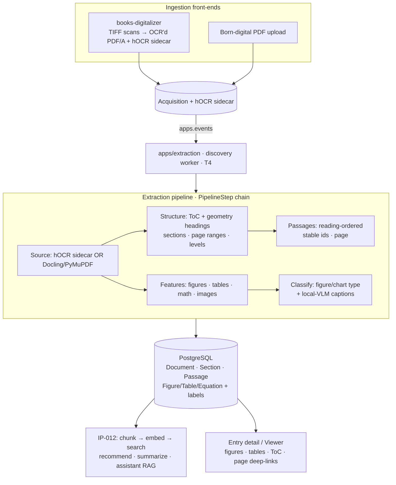

# IP-013: Document Extraction, Classification & Feature Pipeline

Lay down one coherent, self-hosted pipeline that turns each book (scanned or born-digital) into a
normalized structured representation: reading-ordered text, chapters/sections with page ranges,
and extracted + **classified** **figures, tables, math, and images**. This consolidates the org's
scattered extraction prototypes into a single event-driven pipeline inside the catalog and is the
**foundation that IP-012 (search, recommendations, summarization, assistant) consumes**.

<!-- more -->

## Status

**Status**: Draft (review questions resolved)
**Last Updated**: 2026-07-18
**Implementation**: Not started

Companion to **[IP-012](ip-012-ai-powered-discovery.md)**: IP-013 produces the structured,
classified document representation; IP-012 chunks/embeds/searches/summarizes it and grounds the
assistant. IP-012 Phase 1's basic extraction is **subsumed and refined** here.

> **Implementation sequence (foundation first).** IP-013 is the **prerequisite**: it is built
> first so IP-012 consumes clean `extraction_passage` records + features instead of doing its own
> throwaway extraction. Concretely: IP-013 Phase 1 (structured text/structure) unblocks IP-012
> Phases 1–2 (chunk/embed/search); IP-013 Phases 2–3 (features + classification) enrich IP-012
> search/RAG. The proposal numbers are creation-order, not build-order — build order is IP-013 → IP-012.

### Scope & non-goals

**In scope:** proper text extraction, document **structure** (ToC/sections/page ranges),
reading-ordered passages, **feature extraction + classification** — figures (with captions +
chart-type classification), tables (as markdown), math (as LaTeX), and images — and **entry-level
subject classification** (auto-tagging books into catalog categories from their content). The goal
is to **properly index, classify, and extract features** so downstream AI (IP-012) has rich,
structured input. All extraction/classification runs as **Celery async tasks** on the `discovery`
worker (via `apps/events`) — never inline in a request.

**Explicit non-goal:** read-time PDF **highlight/anchoring** (the monad-knowledge
`highlights.py`-style "point a citation back at an exact page region" machinery). We deliberately
do **not** build that. Passages carry a **page number** for reference/deep-linking (e.g. "found on
p. 42"), but no per-passage highlight quads, no anchor resolver, no annotated-PDF export, and no
new Viewer highlight render path. Feature bounding boxes are kept only for **cropping/display** of
figures/tables, not for passage highlighting.

## Problem Statement

The organization has accumulated **eight separate extraction prototypes** that overlap, don't
share a data model, and mostly never shipped. There is no single answer to "what structured,
classified content do we have for a book, and how does IP-012 consume it."

### Current state (verified across the org, 2026-07-18)

Two distinct, non-overlapping lineages plus a viewer:

- **Scanned-book lineage (mature).**
  - **`evilflowers-books-digitalizer`** — the best-engineered repo in the org (yours). TIFF
    spreads on a scanner bed → ScanTailor split/deskew → optional DocRes enhancement →
    **Tesseract hOCR (slk/ces/eng)** → **MRC PDF/A-2b** + JPEG distribution copy. A clean
    `PipelineStep`/`BookContext` architecture; `pipeline/hocr.py` parses hOCR into per-line pixel
    boxes + glyph height; `steps/finalize.py` derives **chapter bookmarks from font-size geometry**
    (no ML) and **`/PageLabels` from printed-page-number voting**; `imaging.py` is a full scan-
    cleanup toolkit. Produces `entry.json` for catalog import.
  - **`evilflowers-ocr-worker`** — production Celery + `ocrmypdf` worker (OTEL, healthcheck). The
    deployable worker shape for on-demand OCR.
- **Born-digital lineage (prototypes, Kafka-era, mostly stubs).**
  - **`evilflowers-text-service`** — PyMuPDF + `ocrmypdf` + **doclayout-YOLO** ToC + pdfplumber
    tables + llama-index chunking (known from IP-012; `doc_id`/`toc` threading is broken).
  - **`evilflowers-image-service`** — pdfplumber image crop (bbox + Y-flip + page tracking) +
    **PaliGemma** captioning + **ViT/ResNet** figure classification. `camelot`/`pytesseract`
    declared but unused. Broken singleton.
  - **`evilflowers-equation-service`** — **Nougat** page-LaTeX + regex math harvest + **sympy**
    normalization. Region detection stubbed; model reloaded per call.
  - **`evilflowers-analyzer-service`** — PyMuPDF metadata + `get_toc()` nested tree; Kafka
    orchestrator. `contains_ocr()` unimplemented.
  - **`evilflowers-importer`** — LLM (OpenAI **or Ollama**) + regex ISBN/DOI metadata + token-
    budget chunking + **recursive map-reduce summarization**. Consumes pre-extracted page `.txt`.
- **Viewer.** **`EvilFlowersViewer`** (pdf.js) — ToC via `getOutline()`, transient search rects.
  Relevant here only as the surface that will *display* figures/tables and page-level deep-links.

### Why this is a problem now

- IP-012's search, RAG, and summarization need **structured, classified** content. Today they'd
  get a flat blob with `doc_id="unknown"` and empty sections (the text-service bug).
- STU's corpus is **~1000 scanned books**; the mature hOCR path and the born-digital path are not
  unified, so nothing downstream can rely on a single contract.
- Figures/tables/math extraction and classification exist only as disconnected, half-finished
  prototypes with no shared model.

## Proposed Solution

One **event-driven extraction pipeline inside the catalog** (`apps/extraction`, running on the
IP-012 `discovery` Celery worker image — same worker, extra stages) that normalizes **both**
lineages into a shared **structured document model**, extracts and **classifies** features, and
hands clean passages + features to IP-012. Retire the Kafka prototype services; keep the
digitalizer as the upstream **scan → OCR'd PDF/A + hOCR sidecar** producer and the ocr-worker
pattern for on-demand OCR of born-scanned uploads.

### Resolved design decisions

- **Docling as the unified born-digital extractor** — one local pass on the T4 yields layout +
  tables (markdown) + figures + **math LaTeX** (CodeFormulaV2) in a single structured output. No
  separate doclayout-YOLO/pdfplumber/Nougat assembly (Nougat kept only as an optional math
  fallback). `do_ocr` **on** for any scanned input.
- **Scanned books consume the digitalizer's hOCR sidecar** — don't re-OCR. The digitalizer is
  extended to persist its hOCR next to the PDF/A; the catalog reuses tuned Slovak OCR + geometry.
- **Figures are captioned and classified now** with a **local VLM (Qwen2-VL) on the T4** (plus
  Docling's own picture classification), so figures are searchable and typed (chart/photo/diagram…).
- **No read-time highlighting/anchoring** (non-goal above).
- **GROBID is not used** — scholarly-paper-tuned, useless on scanned library books.
- **Heuristics degrade gracefully, never fail the document** (the digitalizer discipline), on a
  `PipelineStep` step-list so feature stages slot in independently.

### Architecture



### Key Components

1. **`apps/extraction`** — Django models for the structured document, a `Source` abstraction
   (hOCR sidecar vs Docling/PyMuPDF), a `PipelineStep` chain, feature extractors, and classifiers.
   Runs on the IP-012 `discovery` worker image (shared heavy deps).
2. **Structured document model** — `Document`, `DocumentPage`, `Section` (heading, level, page
   range, `parent`), `Passage` (text, page, seq, section), and `Figure`/`Table`/`Equation`
   (page, bbox, caption, category, payload). The single contract IP-012 chunks/embeds.
3. **Structure recovery** — ToC (`get_toc()`/hOCR) → geometry heading heuristic (font-size ratio +
   wrapped-line merge + noise filter) → `/PageLabels` printed-page mapping. Ported from the
   digitalizer's `finalize.py`.
4. **Feature extraction (Docling)** — figures (crop + page + bbox + size/aspect/category gates),
   tables (→ markdown), math (→ LaTeX + sympy-normalized), images — one Docling pass.
5. **Classification & captioning** — figure/chart-type classification + **local-VLM (Qwen2-VL)
   SK/EN captions**; feed captions/table-markdown/LaTeX into IP-012 so features are searchable.
6. **Consolidation** — fold the four Kafka prototype services into this pipeline as steps and
   **retire** those repos; keep the digitalizer (upstream) and ocr-worker (on-demand OCR).

### What we reuse from the org (concrete)

- **`books-digitalizer/pipeline/hocr.py`** — `HocrLine(page, text, size, bbox)` parser → the
  scanned-book text + geometry primitive (consumed from the sidecar).
- **`books-digitalizer/steps/finalize.py`** — font-size heading detection, wrapped-line merge,
  `/PageLabels` offset voting → chapters/ToC without ML.
- **`books-digitalizer` `PipelineStep`/`BookContext`** — the pipeline architecture.
- **`ocr-worker`** — Celery + `ocrmypdf` + OTEL worker shape for on-demand OCR.
- **`image-service`** — bbox-crop + per-image page tracking + the ViT/ResNet figure-classification
  idea (upgraded to a local VLM).
- **`equation-service`** — sympy LaTeX normalization (Nougat retained only as a math fallback).
- **`importer/ai_facade.py`** — regex ISBN/DOI + recursive map-reduce summarization (metadata
  backfill for entries missing it; feeds IP-012 summarization).
- **monad-knowledge** — figure size/aspect/category gates; breadcrumb + `parent_id` tiered
  sections/passages. (Its read-time highlighting is intentionally **not** adopted.)

## Implementation Plan

### Phase 1: Structured document model + normalized text/structure

- [ ] `apps/extraction` app; models `Document`, `DocumentPage`, `Section`, `Passage` (+ FKs to
      `Entry`/`Acquisition`); migrations. Deterministic ids (`{entry}:{section}:{passage}`).
- [ ] `Source` abstraction: `HocrSource` (parse the digitalizer's hOCR sidecar — port `hocr.py`)
      and `DocProcSource` (Docling; PyMuPDF `get_toc()` for the outline). Pick by sidecar / PDF type.
- [ ] Structure recovery: ToC → geometry heading heuristic + wrapped-line merge + `/PageLabels`
      (port `finalize.py`); build the `Section` tree and reading-ordered `Passage`s (text, page, seq).
- [ ] On-demand OCR for born-scanned uploads with no text layer: dispatch the `ocr-worker` pattern
      (`ocrmypdf`, slk/ces/eng); implement the missing `needs_ocr()` check.
- [ ] Wire to `apps/events` (create/replace/delete); idempotent upsert; retries; observability.
- [ ] Extend `books-digitalizer` to **persist its hOCR sidecar** into acquisition storage.

### Phase 2: Feature extraction (Docling) — figures, tables, math, images

- [ ] Integrate **Docling** on the `discovery` worker (lazy, cached converter; `do_ocr=on` for
      scans; `do_table_structure`, `generate_picture_images`, `do_formula_enrichment` on).
- [ ] Figures/images: store PNG + `page` + `bbox` + size/aspect gates + category whitelist (reject
      `<80px`, extreme aspect, `>90%` page-area watermarks).
- [ ] Tables: `export_to_markdown` + `page` + `caption`.
- [ ] Math: Docling formula LaTeX + **sympy** normalization; store `Equation(page, latex, ...)`.
      Nougat available as a fallback if Docling misses formulas.
- [ ] Surface figures/tables in the entry serializer; render math (KaTeX/MathML) and figures/tables
      in the entry detail / Viewer.

### Phase 3: Classification & captioning

- [ ] Figure/chart-type **classification** (Docling picture classes + refine with the local VLM):
      chart types, photo, diagram, map, screenshot, table-as-image…
- [ ] **Local-VLM (Qwen2-VL) captions** for figures (SK/EN); store `caption` + `category` +
      provenance (model, generated_at).
- [ ] Feed captions + table markdown + equation LaTeX into IP-012 chunking so features are
      searchable and citable (page-level reference).
- [ ] **Entry-level subject classification (first-class):** a Celery task classifies each book into
      the catalog's existing `Category`/subject taxonomy from its extracted text, using the local
      LLM (Qwen2.5-7B) with the `importer` regex/LLM patterns as priors. Store suggested categories
      with provenance + confidence and a **manual-override / curator-approval** flag; never silently
      overwrite curator-assigned categories. Improves browse, filtering, and IP-012 recommendations.

### Phase 4: Consolidation & retirement

- [ ] Fold `text-service`, `image-service`, `equation-service`, `analyzer-service` capabilities
      into `apps/extraction` steps; **retire** those four repos and the Kafka orchestration.
- [ ] Keep `books-digitalizer` (scan→PDF/A + hOCR) and `ocr-worker` (on-demand OCR); document the
      hand-off contract (PDF/A + hOCR sidecar + `entry.json`).
- [ ] Fold `importer`'s metadata/summarization into IP-012 summarization + an entry-metadata
      backfill command.

### Prerequisites

- IP-012 Phase 1 (the `discovery` worker image, `apps/events` wiring, PostgreSQL) — shared here.
- Tesseract (slk/ces/eng) for the on-demand OCR path; Docling + a local VLM (Qwen2-VL) on the T4.
- The digitalizer emitting an hOCR sidecar alongside the PDF/A.

## Technical Details

### Technology Stack

- **Scanned text + geometry:** Tesseract **hOCR** (from the digitalizer sidecar), parsed by a
  ported `hocr.py`. On-demand OCR via `ocrmypdf`.
- **Born-digital + features:** **Docling** (one local pass: layout + tables→markdown + figures +
  math LaTeX) with `do_ocr` on for scans; PyMuPDF for `get_toc()`/page text.
- **Figure captioning/classification:** local **Qwen2-VL** on the T4 (+ Docling picture classes).
- **Math:** Docling CodeFormulaV2 + **sympy**; Nougat (`facebook/nougat-base`) as fallback.
- **Orchestration:** `apps/events` + the IP-012 `discovery` Celery worker image; the digitalizer's
  `PipelineStep` pattern for the step chain.

### Data Model Changes

```sql
CREATE TABLE extraction_document (
    id          text PRIMARY KEY,           -- {entry_id}:{acquisition_id}
    entry_id    uuid REFERENCES core_entry(id) ON DELETE CASCADE,
    acquisition_id uuid REFERENCES core_acquisition(id) ON DELETE CASCADE,
    source_kind text NOT NULL,              -- hocr | pdf-digital | pdf-ocr
    page_count  int,
    page_labels jsonb,                       -- printed-label map (roman front-matter / arabic body)
    created_at  timestamptz DEFAULT now()
);

CREATE TABLE extraction_section (
    id text PRIMARY KEY,                     -- {document_id}:sec:{n}
    document_id text REFERENCES extraction_document(id) ON DELETE CASCADE,
    parent_id   text REFERENCES extraction_section(id) ON DELETE CASCADE,
    heading text, level int, page_start int, page_end int
);

CREATE TABLE extraction_passage (
    id text PRIMARY KEY,                     -- {document_id}:pass:{n}
    document_id text REFERENCES extraction_document(id) ON DELETE CASCADE,
    section_id  text REFERENCES extraction_section(id) ON DELETE SET NULL,
    page int, seq int,                       -- page for reference/deep-link; no highlight quads
    text text NOT NULL, language text
);

-- Features (bbox kept for cropping/display only)
CREATE TABLE extraction_figure (
    id text PRIMARY KEY, document_id text REFERENCES extraction_document(id) ON DELETE CASCADE,
    page int, bbox jsonb, image_path text,
    caption text, caption_source text,       -- local VLM (Qwen2-VL) + provenance
    category text                            -- chart type / photo / diagram / map …
);
CREATE TABLE extraction_table (
    id text PRIMARY KEY, document_id text REFERENCES extraction_document(id) ON DELETE CASCADE,
    page int, bbox jsonb, caption text, markdown text
);
CREATE TABLE extraction_equation (
    id text PRIMARY KEY, document_id text REFERENCES extraction_document(id) ON DELETE CASCADE,
    page int, bbox jsonb, latex text, description text
);

-- Entry-level subject classification (suggestions; curator approves/overrides)
CREATE TABLE extraction_subject_suggestion (
    id          bigserial PRIMARY KEY,
    entry_id    uuid REFERENCES core_entry(id) ON DELETE CASCADE,
    category_id uuid REFERENCES core_category(id) ON DELETE CASCADE,  -- existing taxonomy
    confidence  real,
    source      text NOT NULL,                -- model id + generated_at
    approved    boolean DEFAULT false,        -- curator approval; never auto-overwrites
    created_at  timestamptz DEFAULT now(),
    UNIQUE (entry_id, category_id)
);
```

IP-012's `DocumentChunk` is built **from** `extraction_passage` (+ section breadcrumb + figure/
table/equation context), so IP-013 owns extraction/structure/classification and IP-012 owns
embedding/retrieval.

### API Changes

```
GET /api/v1/entries/{id}/structure          -> ToC / sections tree (+ page labels)
GET /api/v1/entries/{id}/figures            -> figures (page, caption, category, image url)
GET /api/v1/entries/{id}/tables             -> tables (page, caption, markdown)
GET /api/v1/entries/{id}/equations          -> equations (page, latex)
GET  /api/v1/entries/{id}/subject-suggestions -> suggested categories (confidence, approved)
POST /api/v1/entries/{id}/subject-suggestions/{cid}/approve -> curator approves a suggestion
# Passages expose a page number for deep-linking; no highlight/anchor endpoints.
```

## Alternatives Considered

### Alternative 1: Keep the Kafka microservice fan-out (analyzer → text/image/equation)

**Pros:** already partly written; independent per-feature scaling. **Cons:** four half-finished
services, no shared model, broken singletons, hardcoded paths, Kafka for ~1000 books. **Not
chosen** — fold into one in-catalog pipeline (mirrors IP-012's consolidation).

### Alternative 2: À-la-carte extractor (doclayout-YOLO + pdfplumber + Nougat)

**Pros:** reuses org prototype code. **Cons:** fragmented, partly stubbed, three models to wire.
**Not chosen** — Docling gives layout + tables + figures + math in one structured local pass.

### Alternative 3: GROBID for structure

**Pros:** excellent on born-digital scholarly papers. **Cons:** useless on **scanned** library
books (no OCR, no references, no `n=` numbering). **Not chosen** — ToC + geometry + OCR fit STU's
material.

### Alternative 4: Read-time highlighting/anchoring (monad-knowledge style)

Considered and **explicitly rejected by the author** for this initiative — the goal is indexing,
classification, and feature extraction, not pointing citations back at page regions. Passages keep
a page number for deep-linking; no anchor/highlight machinery is built.

## Trade-offs and Risks

### Trade-offs

- **One pipeline vs per-feature services:** simpler, shared model, at the cost of a heavier worker
  image (shared with IP-012, mitigated by the optional dependency group).
- **Docling:** one clean local pass for figures/tables/math, at ~3 GB models and OOM risk —
  acceptable as a batch over ~1000 books, not per-request.
- **Local-VLM captioning:** figures become searchable/typed, at extra T4 load (batch/off-peak).

### Risks

| Risk | Impact | Mitigation |
|------|--------|-----------|
| Scanned-book OCR quality (SK diacritics, old typefaces) | High | Reuse the digitalizer's tuned Tesseract slk/ces + ScanTailor/DocRes; hOCR sidecar is source of truth; QA sample |
| hOCR sidecar not emitted by digitalizer yet | Medium | Extend the digitalizer to persist hOCR (it already produces it); fallback = re-OCR via ocr-worker |
| Docling + VLM weight on the single T4 | Medium | Batch/off-peak; lazy cached converter; gate captioning/math behind flags |
| Docling OOM on large scans | Medium | Page-batch; `do_ocr` only when needed; cap picture-classification VLMs |
| Figure/table false positives on messy scans | Medium | Size/aspect gates + category whitelist; degrade gracefully |

## Open Questions

1. Will the `books-digitalizer` persist its hOCR sidecar into the acquisition storage the catalog
   reads (needed to avoid re-OCR)? — the hand-off contract to finalize with the digitalizer.
   Tracked in **#66**.
2. Which slice of the existing `Category` taxonomy should subject classification target (whole tree
   vs a curated shortlist), and what confidence threshold auto-surfaces a suggestion to curators?
   Tracked in **#67**.

Shared infra prerequisites with IP-012 are tracked in **#64** (Postgres `vector`/`pg_search`) and
**#65** (T4 worker placement).

## Success Criteria

- [ ] Every ingested book yields a `Document` with a section/ToC tree, page labels, and reading-
      ordered passages (page + seq) — for both scanned (hOCR) and born-digital inputs.
- [ ] Figures are extracted with page + bbox + **caption + chart-type category**; tables as
      markdown; math as LaTeX — all searchable via IP-012.
- [ ] IP-012 chunks are built from `extraction_passage` (no more `doc_id="unknown"`/empty sections).
- [ ] Each book gets **subject-category suggestions** with confidence, surfaced to curators for
      approval; curator-assigned categories are never auto-overwritten.
- [ ] All extraction/classification runs as **Celery async tasks** (via `apps/events`), retryable
      and observable; nothing blocks the upload request.
- [ ] The four Kafka prototype repos are retired; digitalizer + ocr-worker remain as the OCR front-
      ends with a documented hand-off (PDF/A + hOCR sidecar).

## Future Considerations

- Reading-order reconstruction for complex multi-column layouts (Docling regions).
- Figure semantic search (embed captions + a local vision embedder).
- Entry-level subject auto-classification into catalog categories.
- Alt-text/accessibility generation from figure captions.

## References

- Org repos: `evilflowers-books-digitalizer` (`pipeline/hocr.py`, `steps/finalize.py`,
  `imaging.py`), `evilflowers-ocr-worker`, `evilflowers-image-service`,
  `evilflowers-equation-service`, `evilflowers-analyzer-service`, `evilflowers-text-service`,
  `evilflowers-importer`.
- `Sibyx/monad-knowledge` — figure size/aspect/category gates; breadcrumb + `parent_id` tiered
  chunking. (Read-time highlighting intentionally not adopted.)
- Tools: Docling, PyMuPDF, `ocrmypdf`/Tesseract, Qwen2-VL, Nougat, sympy, KaTeX.
- Companion: **IP-012** (consumes this pipeline).

## Review Questions

**Status**: ✅ Resolved
**Review Date**: 2026-07-18
**Reviewer**: Claude AI

All questions resolved interactively with the author on 2026-07-18; resolutions folded into the
body above.

---

### Q1: Born-digital feature extractor — Docling (unified) or à-la-carte?

**Answer**:
```
Docling (unified).
```
**Resolution**:
```
Docling is the single born-digital extractor (layout + tables→markdown + figures + math LaTeX in
one local pass on the T4). Nougat kept only as a math fallback; doclayout-YOLO/pdfplumber assembly
dropped.
```

---

### Q2: Read-time anchoring — deferred text-based, stored bboxes, or hybrid?

**Answer**:
```
None of these — do NOT build monad-knowledge-style highlighting. Just properly index, classify,
and extract features.
```
**Resolution**:
```
Read-time highlighting/anchoring is a declared non-goal. Removed the anchor resolver, annotated-PDF
export, Viewer highlight path, and anchor API. Passages keep only a page number for deep-linking;
feature bboxes are for cropping/display. Elevated classification as a first-class concern instead.
```

---

### Q3: Figure handling in v1 — caption now, extract-only, or skip?

**Answer**:
```
Caption now with a local VLM.
```
**Resolution**:
```
Phase 3 captions and classifies figures with a local VLM (Qwen2-VL) on the T4 (plus Docling picture
classes), storing caption + category + provenance; captions feed IP-012 so figures are searchable.
```

---

### Q4: Math extraction scope (implied by Q1)

**Answer**:
```
Docling (from Q1=A) provides math LaTeX for free.
```
**Resolution**:
```
Math is taken from Docling's CodeFormulaV2 output + sympy normalization; Nougat is a fallback only.
No separate math phase needed.
```

---

### Q5: Digitalizer hand-off — hOCR sidecar or re-OCR?

**Answer**:
```
Consume the hOCR sidecar.
```
**Resolution**:
```
Extend books-digitalizer to persist its hOCR next to the PDF/A; the catalog consumes it (reuses
tuned Slovak OCR + geometry, skips a second OCR pass). Re-OCR via ocr-worker only as fallback.
```

---

## Changelog

| Date | Author | Changes |
|------|--------|---------|
| 2026-07-18 | jdubec | Initial draft: unified document-extraction & structure pipeline consolidating the org's scanned (books-digitalizer/ocr-worker) and born-digital (text/image/equation/analyzer/importer) prototypes; foundation for IP-012; added Review Questions |
| 2026-07-18 | jdubec | Resolved review questions interactively: Docling unified extractor; **dropped read-time highlighting/anchoring as a non-goal** and elevated classification; caption+classify figures now with local VLM (Qwen2-VL); math free from Docling; consume the digitalizer hOCR sidecar. Retitled to "Extraction, Classification & Feature Pipeline" |
| 2026-07-18 | jdubec | Promoted **entry-level subject classification to first-class v1** (suggestions + curator approval, `extraction_subject_suggestion`); confirmed full Docling born-digital path now; made explicit that all indexing/extraction runs as **Celery async** tasks; added the IP-013→IP-012 build-order (foundation-first) note |
