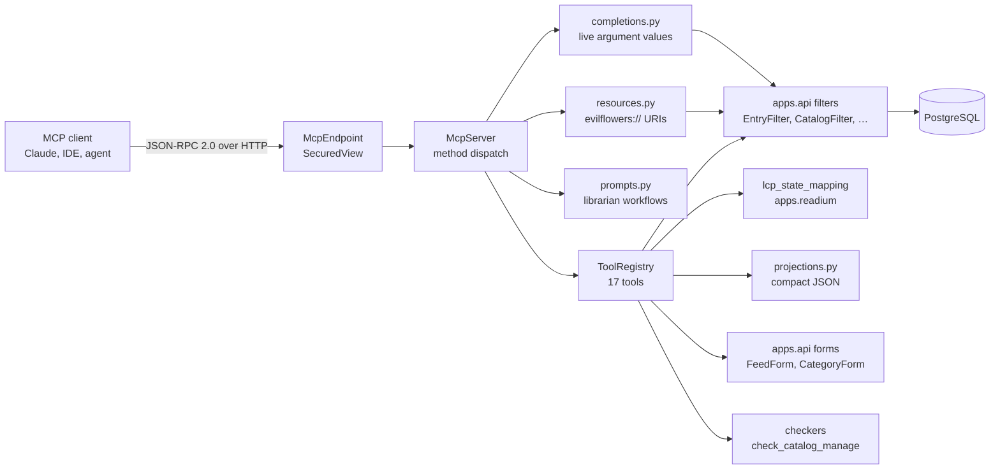

# IP-014: Model Context Protocol Server

Expose the catalog to LLM agents as a first-class **Model Context Protocol** server: a single
Streamable HTTP endpoint at `/mcp/v1` offering twenty-five tools — search and discovery, the
caller's own library, and full curation of catalogs, feeds, categories and the classification
of publications — plus resources, prompts and argument completions. Every tool composes the
existing `apps.api` filters, so access control has one implementation, not two. No new runtime
dependency.

<!-- more -->

## Status

**Status**: Draft (implemented, awaiting review answers)
**Last Updated**: 2026-09-10
**Implementation**: Complete — `apps/mcp/`, 25 tools, 186 tests

## Problem Statement

The catalog has no MCP surface at all. `.mcp.json` in the repository root configures Claude
Code as an MCP *client* (Playwright, GitHub, the gateway SSH server); nothing in the codebase
makes Elvíra itself something an agent can connect to.

That is now the gap that matters most for AI-facing work:

- **`elvira-ai-agent` re-implements catalog access by hand.** As IP-012 documents, the chatbot
  is a Node/TS service that reaches the catalog only through REST `/api/v1/entries`, duplicates
  the User model, and re-authenticates every turn with a `users/me` round-trip. Every other
  agent that wants to talk to the library will rebuild the same glue.
- **Agents cannot discover the API.** OpenAPI describes the REST surface for humans writing
  code. An agent needs tools with names, argument schemas and *guidance on when to call which*
  — that is precisely what MCP standardises and what OpenAPI does not.
- **The REST payloads are the wrong shape for a context window.** `EntrySerializer.Base` emits
  ~30 fields per entry including the full `config` blob, aliased keys and every null. A page of
  ten entries is largely tokens an LLM cannot use.
- **Getting access control right is easy to get wrong twice.** Any new AI-facing surface that
  queries `Entry.objects` directly re-implements catalog scoping. That is exactly how a
  private catalog leaks.

### What this is *not*

IP-012 explicitly declines to import monad-knowledge's "agentic MCP layer" — its Neo4j
knowledge graph, claim extraction and PageRank research workbench. This proposal is a
different thing that shares a name: a **protocol adapter** in front of the catalog Elvíra
already has. It adds no research machinery, no models, and no infrastructure. The two are
complementary — when IP-012 lands semantic search, `search_entries` gains a retrieval mode
(see Q5) and every already-connected agent benefits without changing its integration.

## Proposed Solution

### Overview

One Django app, `apps/mcp`, serving MCP over Streamable HTTP at `POST /mcp/v1`, authenticated
with the catalog's existing credentials, exposing tools that are thin compositions of
`apps.api` filters, forms and checkers — plus the resource, prompt and completion surfaces the
protocol defines.



### Key components

1. **`protocol.py`** — JSON-RPC 2.0 envelope and protocol-version negotiation. Knows nothing
   about Django or catalogs.
2. **`registry.py`** — `Tool` (name, title, descriptions, input/output schemas, handler,
   `ToolAccess` level, annotation flags) and the registry that `tools/list` renders and
   `tools/call` dispatches through. The registry filters write tools out entirely when
   `EVILFLOWERS_MCP_ALLOW_WRITE` is off.
3. **`arguments.py`** — coercion and validation of a tool call's arguments. Nothing in the
   stack validates a client's `arguments` against the advertised `inputSchema`, and models
   routinely send a string where an integer belongs; this turns that into a readable message
   rather than a 500.
4. **`projections.py`** — ORM instances into compact JSON: short keys, nulls dropped, prose
   truncated, URLs absolute, everything a JSON primitive.
5. **`schemas.py`** — shared JSON Schema fragments, including the `outputSchema` every tool
   advertises.
6. **`server.py`** — dispatch for `initialize`, `ping`, `tools/*`, `resources/*`, `prompts/*`
   and `completion/complete`; enforcement of each tool's access level; the `instructions`
   string that tells a model how to use the catalog well (and which changes when the write
   surface is off).
7. **`views.py`** — the HTTP endpoint, extending `SecuredView`, plus the three restrictions
   described under *Authentication* below.
8. **`metadata.py`** — the RFC 9728 protected-resource discovery document and the
   `WWW-Authenticate` challenge that points at it.
9. **`resources.py` / `prompts.py` / `completions.py`** — the non-tool protocol surfaces.
10. **`uris.py`** — the `evilflowers://` URI space, shared by resource reads and the
    `resource_link` blocks tool results emit.
11. **`tools/`** — five modules, seventeen tools.

### The tools

Every tool declares a `ToolAccess` level, and the server enforces it before the handler runs —
a new tool cannot forget to authenticate. Object-level permission ("may this user manage *this*
catalog") stays with the handler, because only it knows which object is involved.

| Tool | Purpose | Access |
|------|---------|--------|
| `search_entries` | Free-text + structured search; the primary entry point | public |
| `get_entry` | One publication in full | public |
| `list_catalogs` / `get_catalog` | Collections this credential may read, and what it may do with each | public |
| `list_authors` | Resolve an author name to an id | public |
| `list_categories` / `get_category` | Browse the subject vocabulary | public |
| `list_feeds` / `get_feed` | Walk the navigation tree | public |
| `whoami` | Who is this session, what can it read, what can it manage | public |
| `get_my_shelf` | The caller's saved publications | user |
| `list_my_loans` | The caller's Readium LCP licences | user |
| `create_catalog` | Mint a collection — **administrators only** | **manage** |
| `update_catalog` / `delete_catalog` | Rename, re-scope, or destroy a collection | **manage** |
| `create_feed` / `update_feed` / `delete_feed` | Curate the navigation tree | **manage** |
| `add_entries_to_feed` / `remove_entries_from_feed` | Move publications in and out of a feed | **manage** |
| `create_category` / `create_categories` / `update_category` / `delete_category` | Curate the subject vocabulary, singly or as a bulk import | **manage** |
| `classify_entries` | File a batch of publications under categories | **manage** |

"public" still means access-controlled — an anonymous session sees public catalogs only. It
describes the *session* requirement, never the data.

### What the write surface deliberately excludes

`classify_entries` touches the `categories` relation and nothing else. An agent may decide that
a book belongs under "624 Stavebné inžinierstvo"; it may not rewrite that book's title,
authors, identifiers, summary or files. Classification is reversible, inspectable and cheap to
undo in bulk; metadata rewriting is none of those, and a hallucinated ISBN is a much longer-lived
problem than a misfiled subject. Full entry editing stays a REST/portal operation (Q12).

Nothing here classifies *for* the caller either. There is no model, no embedding and no
classifier service behind these tools — `classify_entries` records a decision the connected
agent made from each publication's own metadata. That is what keeps this a protocol adapter
rather than the research layer IP-012 declines to import.

`search_entries` accepts `query`, `title`, `author`, `author_ids`, `catalog_id`,
`catalog_title`, `category_ids`, `category_term`, `language_codes`, `published_from`,
`published_to`, `lcp_states`, `readium_only`, `order_by`, `page`, `limit` — the full
`EntryFilter` surface, named for a reader rather than for a query string.

### Design decisions

**Reuse the filters, do not re-query.** Every tool builds a `QueryDict` and hands it to the
`apps.api` filter that already owns that model's access control
(`BaseSecuredFilter.apply_catalog_access_control`). MCP therefore cannot drift from REST on who
may see what. `apps/mcp/tests/test_tools.py::AccessControlTests` is what keeps it that way.

**Relevance ordering is preserved.** `EntryFilter.filter_query` installs a relevance sort;
`search_entries` re-sorts only when the caller asked for a specific `order_by`, or when there
is no `query` at all. This deliberately avoids the bug IP-012 documents on the REST list
endpoint, where `PaginationResponse` rebuilds `order_by` from the `created_at` default and
clobbers relevance.

**Compact projections, not the REST serializers.** Every field in a tool result is spent from a
model's context window. `EVILFLOWERS_MCP_SUMMARY_MAX_CHARS` (600) and
`EVILFLOWERS_MCP_CONTENT_MAX_CHARS` (4000) bound the prose; truncation is flagged in the
payload rather than silent.

**Validate before querying.** Pagination is read at the top of each handler, before the
filter's access control resolves (which runs a query eagerly). A call with `limit=5000` costs
no round-trip.

**Errors go where the model can read them.** Protocol failures — bad envelope, unknown method,
unknown tool — are JSON-RPC errors. Failures *inside* a tool come back as a normal result with
`isError: true` and a message the model can act on ("Unknown argument(s): …. Accepted arguments:
…"). Unexpected exceptions are logged with a stack trace and reported generically.

**Access is declared, enforced centrally, and checked again per object.** Each tool carries a
`ToolAccess` of `PUBLIC`, `USER` or `WRITE`; `McpServer` enforces it before dispatch, so a new
tool cannot forget to authenticate. Object-level permission stays in the handler — it is the
only place that knows which catalog is involved — and uses the same
`has_object_permission("check_catalog_manage", …)` call the REST views use.

**Refusals do not leak existence.** Every management helper resolves the target through the
*read* filter first. A caller who cannot read the record is told it does not exist; only a
caller who can read but not manage it is told they lack permission. Inverting that order would
turn every write tool into an existence oracle for other tenants' catalogs.

**Writes reuse the REST forms.** `create_feed` merges its arguments into a `FeedForm`,
`create_category` into a `CategoryForm` and `create_catalog` into a `CatalogForm` plus
`CatalogService`, so validation is literally the same code path as `POST /api/v1/feeds`. The
update tools merge incoming arguments over the record's current values before validating, which
gives a model PATCH semantics without the server growing a second, laxer validation path.

**Bulk writes are all-or-nothing, bounded, and honest about what changed.** Cataloguing a
thousand books one round-trip at a time is not a workflow, so `create_categories` imports a
whole vocabulary and `classify_entries` files a batch. Three rules make that safe:

- *All-or-nothing.* An id the caller cannot read, or an entry they cannot manage, fails the
  entire batch. A partially-applied write reports a success the caller cannot verify, and
  silently skipping unreadable ids would hide a permission boundary the model needs to see.
- *Bounded* by `EVILFLOWERS_MCP_MAX_BULK_ITEMS` (100). The cap is not really about cost at this
  corpus size; it is about keeping a wrong call small enough to notice and undo.
- *Per-record outcomes.* Every bulk result says which records actually changed, so re-running an
  import or a classification is safe and reports zero changes rather than looking like it worked
  twice.

**One catalog per write.** Every entry, category and feed named in a single call must belong to
the same catalog. Nothing in the schema stops a model from pairing an entry in catalog A with a
category from catalog B; left unchecked that write *succeeds* and produces a classification no
OPDS feed will ever render. `assert_same_catalog` refuses it with the offending ids named.

**Destruction that a hint cannot cover.** MCP's `destructiveHint` asks the *client* to prompt,
which is the client's choice to honour. For `delete_catalog` — which destroys every publication,
file and loan record in a collection — that is not enough, so the tool additionally requires
`confirm_title` echoing the catalog's exact title. It is the one place the server enforces
confirmation itself, and the permission check runs first so a wrong-title refusal never
discloses the real title to someone who may not touch the catalog (Q13).

### Where the management tools are stricter than REST

Three defects surfaced while mirroring the REST endpoints. The MCP tools do not reproduce them;
each is flagged inline in `apps/mcp/tools/feeds.py` and raised as Q8–Q10 below.

1. **`PUT /api/v1/feeds/{id}` permits a cross-catalog move without checking the destination.**
   It calls `check_catalog_manage` on the feed's *current* catalog, then lets the form set any
   `catalog_id`. A manager of catalog A can push a feed into catalog B they do not manage.
   `update_feed` checks both sides.
2. **`(catalog, title)` uniqueness is unchecked.** `Feed.Meta.unique_together` covers both
   `title` and `url_name`; the REST view checks only `url_name`, so a duplicate title reaches
   the database and surfaces as a 500. `create_feed`/`update_feed` check both and return a
   conflict the model can act on.
3. **`Feed.source` is never populated.** `FeedForm` has no `source` field, so `form.populate()`
   leaves the `choices` column at `""`. `create_feed` sets `RELATION`, the only member of
   `Feed.FeedSource`.

A fourth applies to catalogs: `POST`/`PUT /api/v1/catalogs` check `url_name` uniqueness but not
`Catalog.Meta.unique_together = ("creator_id", "title")`, so a repeated title reaches the
database as a 500. `create_catalog` / `update_catalog` check both.

### Authentication

The endpoint extends `SecuredView`, so a credential that works against REST works here.

Two schemes are accepted, both on by default
(`EVILFLOWERS_MCP_AUTHENTICATION_SCHEMAS`, default `Bearer,Basic`):

- **Bearer** — an API key JWT. The scheme to prefer: revocable on its own, scoped to one
  credential, carrying no password.
- **Basic** — username and password, resolved through the same `AuthSource` chain (database or
  LDAP) as REST and OPDS. It is offered because many MCP clients can only attach a username and
  a password, and because a librarian curating the catalog through an agent should not have to
  mint an API key first. The cost is real and worth stating plainly: with an LDAP-backed user it
  puts the directory password in an agent's config file, and it cannot be revoked without
  changing that password. A deployment that would rather not accept that sets
  `EVILFLOWERS_MCP_AUTHENTICATION_SCHEMAS=Bearer` (Q14).

Every "you need credentials" message routes through `metadata.credential_hint()`, so a
deployment that turns Basic off never tells an agent to try it — an agent told to retry with a
credential the endpoint will never accept just retries.

Two further restrictions apply to both, in `McpEndpoint._authenticate`:

- **No credentials in the query string.** `SecuredView` accepts `?access_token=`; here it is a
  400. URLs reach access logs, proxy logs and history. The parent behaviour is untouched for the
  REST and OPDS surfaces that depend on it (notification links, feed readers).
- **Anonymous is optional.** `EVILFLOWERS_MCP_REQUIRE_AUTHENTICATION=1` refuses anonymous
  sessions at the transport, before any JSON-RPC method runs — so a closed deployment does not
  disclose its tool list either.

A 401 carries one challenge per accepted scheme, Bearer first —
`WWW-Authenticate: Bearer realm="…", resource_metadata="…", Basic realm="…"` — pointing at an
RFC 9728 document at `/.well-known/oauth-protected-resource/mcp/v1`. It declares the resource
identifier, bearer-in-header, the deployment's access levels, and (in a non-standard
`authentication_schemes_supported` member, since RFC 9728 covers bearer tokens only) every
scheme accepted — but deliberately no `authorization_servers`, because this catalog runs no
OAuth authorization server and advertising a phantom one would send clients into a discovery
flow that cannot complete (Q3).

Every management call is written to the `apps.mcp.audit` logger: successes with the affected
object, refusals with the reason.

### Modern protocol surfaces

Beyond tools, the server implements what the current revision offers that a stateless HTTP
deployment can honestly support:

| Surface | What it does here |
|---|---|
| `outputSchema` + `structuredContent` | Every tool advertises its result shape; clients may validate it |
| `resource_link` content blocks | Search hits carry `evilflowers://entry/…` links a client can attach |
| `resources/list` + `templates/list` + `read` | Catalogs enumerated with cursor pagination; entries and feeds by URI template |
| `prompts/list` + `prompts/get` | Four librarian workflows (`reading_list`, `availability_report`, `organise_catalog`, `catalog_overview`) |
| `completion/complete` | Live autocompletion for catalog, category, author and language arguments |
| Tool annotations | `readOnlyHint` / `destructiveHint` / `idempotentHint` so clients prompt before writes |

Resources and completions resolve through the same filters as the tools, so neither can reveal
what a tool would refuse — pinned by `test_protocol_surfaces.py`.

`structuredContent` and `resource_link` are gated on the negotiated revision (both postdate
2025-03-26). What is **not** implemented, and why: `sampling`, `elicitation`, `logging` and
resource `subscribe` all require the server to initiate messages, which needs a persistent SSE
channel this stateless design does not have. Adopting any of them means adopting ASGI and the
official SDK — see Q11.

## Implementation Plan

### Phase 1: Transport — complete

- [x] `protocol.py`: JSON-RPC envelope, error codes, version negotiation over
      `2025-06-18` / `2025-03-26` / `2024-11-05`
- [x] `views.py`: `POST /mcp/v1`, batch support, 202 for notification-only requests,
      405 + `Allow: POST` for `GET`/`DELETE`, `MCP-Protocol-Version` handling, `Origin` guard
- [x] `server.py`: `initialize`, `ping`, `tools/list`, `tools/call`, notifications
- [x] Authentication via `SecuredView`; `WWW-Authenticate` restated on 401

### Phase 2: Tool framework — complete

- [x] `registry.py`: `Tool`, `ToolRegistry`, `@registry.tool` decorator, read-only annotations
- [x] `arguments.py`: closed-set argument validation with model-readable errors
- [x] `pagination.py`: `read_pagination` / `paginate`, clamped rather than 404 on overrun
- [x] `projections.py`: compact entry / catalog / author / category / licence shapes

### Phase 3: Tools — complete

- [x] `search_entries`, `get_entry`
- [x] `list_catalogs`, `list_authors`, `list_categories`
- [x] `whoami`, `get_my_shelf`, `list_my_loans`

### Phase 4: Wiring & documentation — complete

- [x] `apps.mcp` in `INSTALLED_APPS`; route mounted only when `EVILFLOWERS_MCP_ENABLED`
- [x] Six `EVILFLOWERS_MCP_*` settings
- [x] `docs/catalog-wiki/Model-Context-Protocol.md`
- [x] 55 tests: transport conformance, tool behaviour, access control, real Bearer auth

### Phase 5: Feed & category management — complete

- [x] `ToolAccess` (`PUBLIC` / `USER` / `WRITE`) declared per tool, enforced in `McpServer`
- [x] `tools/common.py`: `resolve_catalog_for_management` — read check, then manage check
- [x] `create_feed`, `update_feed`, `delete_feed` reusing `FeedForm` and `FeedFilter`
- [x] `create_category`, `update_category`, `delete_category` reusing `CategoryForm`
- [x] `get_category`, `list_feeds`, `get_feed` to complete the read side
- [x] PATCH semantics (merge over current values, then validate through the all-fields form)
- [x] Destination-catalog permission check on cross-catalog moves (Q8)
- [x] Both halves of `Feed` uniqueness checked (Q9); `Feed.source` populated (Q10)
- [x] `EVILFLOWERS_MCP_ALLOW_WRITE` kill switch — unadvertises rather than refuses
- [x] Audit logging to `apps.mcp.audit`

### Phase 6: Authentication hardening — complete

- [x] Query-string tokens refused (`?access_token=`)
- [x] `EVILFLOWERS_MCP_AUTHENTICATION_SCHEMAS`, defaulting to Bearer only
- [x] `EVILFLOWERS_MCP_REQUIRE_AUTHENTICATION` to close anonymous access
- [x] RFC 9728 protected-resource metadata + `WWW-Authenticate: … resource_metadata="…"`
- [x] `EVILFLOWERS_MCP_MAX_REQUEST_BYTES` body ceiling
- [x] `whoami` reports `manageable_catalogs` and `can_write`

### Phase 7: Modern protocol surfaces — complete

- [x] `outputSchema` on all seventeen tools; `structuredContent` gated on the negotiated revision
- [x] `resource_link` content blocks in tool results
- [x] `resources/list` (cursor-paginated), `resources/templates/list`, `resources/read`
- [x] `evilflowers://` URI space shared by links and reads
- [x] `prompts/list` / `prompts/get` — four librarian workflows
- [x] `completion/complete` for catalog, category, author and language arguments
- [x] Tool annotations (`readOnlyHint`, `destructiveHint`, `idempotentHint`)

### Phase 8: Curation — complete

The read surface and the feed/category tools were enough to *describe* a library. This phase is
what lets an agent reorganise one, and it is the phase the STU MDT classification work needs.

- [x] `create_catalog` / `update_catalog` / `delete_catalog`, mirroring `apps/api/views/catalogs.py`
      (`core.add_catalog` for creation, `check_catalog_manage` thereafter)
- [x] `delete_catalog` requires `confirm_title`; the permission check runs before it
- [x] `classify_entries` — bulk add / replace / remove of categories on publications, authorised
      with `check_entry_manage` so an entry's own creator may file it
- [x] `create_categories` — bulk vocabulary import, skipping and reporting existing terms
- [x] `add_entries_to_feed` / `remove_entries_from_feed` — incremental membership, so curation
      cannot silently drop what `update_feed`'s `entry_ids` would replace
- [x] `get_catalog`, and an `access` level plus `manageable_only` on `list_catalogs`
- [x] `tools/common.py`: `assert_same_catalog`, `assert_within_bulk_limit`, `resolve_all`
- [x] `EVILFLOWERS_MCP_MAX_BULK_ITEMS` (100)
- [x] `classify_collection` prompt — the reviewed cataloguing workflow end to end
- [x] Two registry-driven sweeps: every write tool refuses anonymous, and every write tool
      refuses a mere reader (with a per-tool argument fixture the sweep asserts is complete)

### Phase 9: Username/password authentication — complete

- [x] `EVILFLOWERS_MCP_AUTHENTICATION_SCHEMAS` defaults to `Bearer,Basic`
- [x] `metadata.schemes()` / `credential_hint()` — every refusal names only what is accepted
- [x] `WWW-Authenticate` carries one challenge per scheme, Bearer first
- [x] `authentication_schemes_supported` in the RFC 9728 document
- [x] Tests: real Basic round-trip through `BasicBackend`, a management call over Basic, and the
      narrowing case (`=Bearer`) refusing it again

### Phase 10: Follow-ups — not started

- [ ] Resolve the review questions below
- [ ] Rate limiting for the anonymous path (Q4)
- [ ] Decide whether Readium write tools (borrow / reserve / shelve) follow (Q2)
- [ ] Decide whether to adopt ASGI + the SDK for sampling/elicitation (Q11)
- [ ] Decide whether entry metadata editing belongs on this surface at all (Q12)

## Technical Details

### Why no MCP SDK

The official Python SDK builds on Starlette/ASGI. This project is deployed WSGI (gunicorn +
gevent, see `Dockerfile`). A stateless Streamable HTTP server needs no SSE, no session store,
and no async: it is JSON-RPC over `POST`, which is a plain Django view. Adding an ASGI
dependency to serve ~200 lines of dispatch would have been the larger change, and the
transport is small enough to test exhaustively (`test_transport.py`).

### Transport conformance

The Streamable HTTP transport lets a server answer a `POST` with either an SSE stream or a
single JSON body, and lets it omit sessions entirely. This server always answers JSON and
issues no session id, so:

- `GET /mcp/v1` (the SSE-stream opener) → `405` + `Allow: POST`
- `DELETE /mcp/v1` (session teardown) → `405`
- Notifications → `202 Accepted`, empty body
- `MCP-Protocol-Version` absent → treated as `2025-03-26`; unsupported → `400`, except on
  `initialize`, which *is* the negotiation

`structuredContent` is emitted on every `tools/call` result alongside the JSON text block.
Older revisions ignore the unknown key, so one result shape serves all three (Q6).

### Configuration

```bash
EVILFLOWERS_MCP_ENABLED=1                        # 0 unmounts the route entirely (404, not a disabled endpoint)
EVILFLOWERS_MCP_ALLOW_WRITE=1                    # 0 unadvertises all thirteen management tools
EVILFLOWERS_MCP_AUTHENTICATION_SCHEMAS=Bearer,Basic
EVILFLOWERS_MCP_REQUIRE_AUTHENTICATION=0
EVILFLOWERS_MCP_DEFAULT_LIMIT=10
EVILFLOWERS_MCP_MAX_LIMIT=50                     # deliberately below the REST ceiling
EVILFLOWERS_MCP_MAX_BULK_ITEMS=100               # records one bulk write may touch
EVILFLOWERS_MCP_SUMMARY_MAX_CHARS=600
EVILFLOWERS_MCP_CONTENT_MAX_CHARS=4000
EVILFLOWERS_MCP_MAX_REQUEST_BYTES=1048576
EVILFLOWERS_MCP_ALLOWED_ORIGINS=                 # unset = no Origin check (non-browser clients send none)
```

### Client configuration

```json
{
  "mcpServers": {
    "elvira": {
      "command": "npx",
      "args": ["-y", "mcp-remote", "https://elvira.stuba.sk/mcp/v1",
               "--header", "Authorization: Bearer ${ELVIRA_API_KEY}"]
    }
  }
}
```

Swap the header for `Authorization: Basic <base64 username:password>` where the client cannot
hold an API key. Clients with native Streamable HTTP support connect to the URL directly.

## Alternatives Considered

### Alternative 1: A standalone MCP server wrapping the REST API

**Description**: A separate process (Python or Node) that calls `/api/v1/*` over HTTP.

**Pros**: Zero change to the catalog; independent deploy cadence.

**Cons**: A second service to run, monitor and authenticate; every call becomes two network
hops; access control gets re-derived from REST responses rather than enforced at the query;
it would repeat exactly the `elvira-ai-agent` mistake IP-012 is unwinding.

**Why not chosen**: The catalog already owns the data, the filters and the ACL. Putting the
protocol adapter anywhere else means re-deriving all three.

### Alternative 2: Use the official `mcp` Python SDK

**Pros**: Spec conformance maintained upstream; SSE and sessions for free.

**Cons**: ASGI-oriented, against a WSGI deployment; a new dependency and its transitive tree
for a feature whose whole transport is ~200 lines; the SDK's decorators want to own routing.

**Why not chosen**: See "Why no MCP SDK". Worth revisiting if server-initiated messages
(sampling, elicitation, progress) are ever needed — those genuinely need the SDK.

### Alternative 3: Expose the OpenAPI spec and let clients generate tools

**Pros**: Nothing new to build.

**Cons**: 40+ endpoints with no guidance on which to call; REST payload shapes; no way to hide
write endpoints; no per-tool descriptions.

**Why not chosen**: Tool *curation* is most of the value. Eight well-described tools beat forty
mechanically-generated ones.

## Trade-offs and Risks

### Trade-offs

- **Hand-rolled transport vs. SDK**: we own conformance. Mitigated by `test_transport.py`, and
  bounded because the surface is small and versioned.
- **Compact projections vs. REST parity**: the two surfaces now describe an entry differently
  on purpose. A field added to `EntrySerializer` does not appear in MCP until someone adds it
  to `projections.py`.
- **No borrowing**: an agent can find a book and report that it is available, but the user must
  borrow it themselves. Deliberate (Q2) — and note this is now the *only* read-only part of the
  surface, which makes the distinction worth restating rather than assuming.
- **Curation without metadata editing**: an agent can file a publication and move it between
  feeds but cannot correct its title or ISBN. That is a real gap for a librarian working through
  an agent, accepted because a hallucinated identifier outlives a misfiled subject (Q12).
- **Bulk writes are all-or-nothing**: one unreadable id in a hundred fails the batch. Kinder to
  the caller than a partial write, but it does mean a model must resolve ids carefully rather
  than throwing a page of them at the tool.

### Risks

| Risk | Impact | Mitigation |
|------|--------|-----------|
| A future tool queries models directly and bypasses catalog ACL | High | `AccessControlTests` covers every tool; the filter-composition rule is documented at the top of each tool module |
| Unauthenticated search becomes a scraping or DoS vector | Medium | Endpoint is opt-out via `EVILFLOWERS_MCP_ENABLED`; anonymous callers see public catalogs only; `limit` capped at 50. Rate limiting is unresolved (Q4) |
| `lcp_states` filtering is a Python post-filter, linear in catalog size | Medium | ~1000 books at STU makes this cheap today; it inherits the existing `EntryFilter` behaviour rather than adding a new problem (Q7) |
| Protocol revision churn breaks clients | Low | Three revisions negotiated; adding a fourth is one tuple entry |
| Prompt injection via catalog content reaching a connected agent | Medium | Content is truncated and clearly framed as data; agents remain responsible for their own handling. Sharper now that the same session can write — a curation agent acting on catalog text it just read is the shape to worry about, which is why `classify_collection` and `organise_catalog` insist on human approval and why `EVILFLOWERS_MCP_ALLOW_WRITE` exists |
| A Basic credential in an agent config is an unrevokable LDAP password | Medium | Bearer is offered first and documented as preferred; `EVILFLOWERS_MCP_AUTHENTICATION_SCHEMAS=Bearer` closes it. Accepted for now because clients that cannot hold an API key would otherwise be locked out (Q14) |
| An agent misclassifies at scale, quietly | Medium | `add` is the default mode so nothing is discarded; bulk calls are capped at 100 and report per record what changed; every write is audited with the ids involved, so a bad batch is identifiable and reversible with `mode: "remove"` |
| `delete_catalog` destroys a library on a mistaken call | High | Server-enforced `confirm_title` echo, not just a client-side hint; `manage` required; the result reports how many entries went, and the whole thing is one audited line |

## Success Criteria

- [x] An MCP client can `initialize`, list tools and call them over `POST /mcp/v1`
- [x] Anonymous callers see public catalogs only; a credential widens that to exactly its grants
- [x] Every id `search_entries` returns is an id `get_entry` can open, for every caller class
- [x] Malformed arguments produce a readable tool error, never a 500
- [x] A librarian with `manage` on a catalog can create, rename and delete its feeds and
      categories through an agent; a reader on the same catalog cannot
- [x] A refusal never discloses whether a record the caller cannot read exists
- [x] Resources and completions cannot surface anything the equivalent tool would refuse
- [x] Turning off `EVILFLOWERS_MCP_ALLOW_WRITE` removes the management tools from `tools/list`
- [x] A 401 tells a client how to authenticate (RFC 9728 discovery)
- [x] A client that can only hold a username and password can connect, and reaches exactly what
      the same user's API key would
- [x] A write can never link records across two catalogs
- [x] A bulk write either applies completely or not at all, and says per record what changed
- [x] Deleting a catalog requires confirmation the server itself checks
- [x] No new runtime dependency; `black --check` clean; `manage.py test apps.mcp` green
      (186 tests)
- [ ] A real agent answers a librarian's question end-to-end against the STU corpus
- [ ] A real agent completes a curation task (create a feed, file entries into it) under human
      approval, against the STU corpus
- [ ] A real agent imports the STU MDT vocabulary and classifies the ~1000-title corpus against
      it, under human review, with the misfits reported rather than guessed

## Future Considerations

- **Write tools** — `add_to_shelf`, `reserve_entry`, `borrow_entry`, annotated
  `destructiveHint` so clients prompt for confirmation.
- **Semantic search** — when IP-012 lands, `search_entries` gains a `mode` argument
  (`keyword` / `semantic` / `hybrid`); connected agents benefit with no integration change.
- **MCP resources** — cover images and acquisition files as resources rather than URLs, once
  clients handle binary resources consistently.
- **Prompts** — server-supplied prompt templates ("find me course reading on X").
- **OAuth 2.1** — protected-resource metadata, if MCP clients standardise on it (Q3).
- **Per-tool metrics** — call counts and latency into the existing Logfire/OTEL instrumentation.

## References

- [Model Context Protocol specification](https://modelcontextprotocol.io/specification)
- [MCP Streamable HTTP transport](https://modelcontextprotocol.io/specification/2025-06-18/basic/transports)
- [JSON-RPC 2.0](https://www.jsonrpc.org/specification)
- [IP-012: AI-Powered Discovery](ip-012-ai-powered-discovery.md) — the semantic-search work this
  will front
- [IP-013: Document Extraction](ip-013-document-extraction-structure.md)
- `docs/catalog-wiki/Model-Context-Protocol.md` — operator and client guide
- `docs/catalog-wiki/Security.md` — the authentication this endpoint reuses

## Review Questions

**Status**: ⏳ Awaiting Answers
**Review Date**: 2026-09-09
**Reviewer**: Claude AI

The following questions should be answered before this proposal moves past Draft. The
implementation is complete and every question below records the decision that was taken so the
code runs; each can be revised.

---

### Q1: 🔴 Critical — which access-control rule should `get_entry` use?

**Issue**: The two obvious candidates disagree, and the disagreement is pre-existing in REST.

- `EntryFilter` (`apps/api/filters/base.py:30`) grants **anonymous** callers every entry in a
  **public** catalog. This is what `GET /api/v1/entries` uses.
- `EntryChecker.check_entry_read` (`apps/core/checkers.py:56`) returns `False` for any
  unauthenticated user, public catalog or not, and otherwise requires catalog membership. This
  is what `GET /api/v1/catalogs/{id}/entries/{id}` uses.

So on the REST API today, an anonymous client can *list* an entry in a public catalog and then
gets **403** fetching that same entry's detail.

**Context**: MCP makes the inconsistency actively harmful: a model calls `search_entries`, gets
an id, calls `get_entry`, and is refused. It has no way to tell a permissions boundary from a
bug, so it retries, then hallucinates around the gap.

**Question**: Should `get_entry` mirror the *filter* (permissive: public catalogs readable
anonymously) or the *checker* (strict: authentication always required)? And separately — is the
REST inconsistency intended, or a latent bug worth its own issue?

**Options**:

- [ ] **A**: `get_entry` uses the `EntryFilter` ACL — search and detail agree; public catalogs
      are genuinely public. **(implemented)**
- [ ] **B**: `get_entry` uses `check_entry_read` — stricter, but then `search_entries` must
      apply the same rule or the two disagree, which would make MCP anonymous search return
      nothing at all.
- [ ] **C**: A, plus file a separate issue to align the REST detail endpoint with its list
      endpoint.

**Answer**:
```
[User fills this in]
```

**Resolution**:
```
[AI writes this — describes how the proposal and code will be updated based on the answer]
```

---

### Q2: ⚠️ Medium — should v2 add write tools?

**Issue**: Every tool is read-only. An agent can tell a user "this is available now" but cannot
act.

**Context**: The obvious candidates are `add_to_shelf` (harmless, reversible), `reserve_entry`
(consumes a queue slot, capped by `EVILFLOWERS_READIUM_MAX_RESERVATIONS_PER_USER`) and
`borrow_entry` (consumes a licence slot and starts a loan clock). MCP's `destructiveHint`
annotation makes clients prompt before calling, but that prompt is the *client's* choice, not
something the server can force.

**Question**: Which, if any, write tools should exist, and does a loan started by an agent need
an additional server-side confirmation step that the REST API does not require?

**Options**:
- [ ] **A**: Stay read-only. Agents point users at the portal to borrow. **(implemented)**
- [ ] **B**: Add `add_to_shelf` only — reversible, low stakes.
- [ ] **C**: Add shelf + reservation, but never `borrow_entry`.
- [ ] **D**: All three, relying on client-side confirmation.

**Answer**:
```
[User fills this in]
```

**Resolution**:
```
[AI writes this]
```

---

### Q3: ⚠️ Medium — is API-key Bearer auth sufficient, or is OAuth 2.1 needed?

**Issue**: The MCP authorization spec (2025-06-18) describes OAuth 2.1 with protected-resource
metadata discovery. This endpoint authenticates with the catalog's existing static API-key JWTs
instead.

**Context**: For STU, credentials come from LDAP and API keys are issued through the portal, so
OAuth adds a flow nobody needs. But a client that only implements the OAuth path will fail to
connect, and the 401 currently carries a plain `WWW-Authenticate: Bearer realm="…"` rather than
a `resource_metadata` pointer.

**Question**: Is static Bearer acceptable for the foreseeable deployment, or should
`/.well-known/oauth-protected-resource` be served so spec-strict clients can discover the
scheme?

**Options**:
- [ ] **A**: Static Bearer only; document it. **(implemented)**
- [ ] **B**: Static Bearer plus a protected-resource metadata document advertising it.
- [ ] **C**: Full OAuth 2.1 with dynamic client registration.

**Answer**:
```
[User fills this in]
```

**Resolution**:
```
[AI writes this]
```

---

### Q4: ⚠️ Medium — should the endpoint be rate-limited or network-restricted?

**Issue**: `search_entries` is callable anonymously, and there is no throttling anywhere in the
project.

**Context**: The catalog already has `EVILFLOWERS_ALLOWED_IP_RANGES` for IP-gated entries, and
`EVILFLOWERS_MCP_ENABLED` can unmount the route, but neither is a rate limit. An anonymous
caller can page the whole public corpus at 50 records a request, and the `lcp_states` filter
materialises the queryset in Python before filtering (Q7).

**Question**: For the STU deployment, should `/mcp/v1` be public, restricted at the reverse
proxy, or authenticated-only?

**Options**:
- [ ] **A**: Public and unthrottled, matching `/api/v1/entries` and the OPDS feeds today.
      **(implemented)**
- [ ] **B**: Public but rate-limited at nginx.
- [ ] **C**: Authenticated-only — drop the anonymous path entirely
      (`EVILFLOWERS_MCP_REQUIRE_AUTHENTICATION`).

**Answer**:
```
[User fills this in]
```

**Resolution**:
```
[AI writes this]
```

---

### Q5: ℹ️ Low — how should this compose with IP-012's semantic search?

**Issue**: IP-012 will add semantic and hybrid retrieval. `search_entries` currently maps
straight onto `EntryFilter`, which is keyword-only.

**Context**: IP-012 §"What we take from monad-knowledge" rejects the *research* MCP layer. This
proposal is a protocol adapter, not that — but the relationship should be stated so a future
reader does not read the two as contradictory.

**Question**: When IP-012 lands, should `search_entries` grow a `mode` argument
(`keyword`/`semantic`/`hybrid`), or should semantic search be a separate tool?

**Options**:
- [ ] **A**: `mode` argument on `search_entries` — one tool, one mental model, defaults to
      hybrid once available.
- [ ] **B**: A separate `semantic_search` tool, leaving `search_entries` untouched.

**Answer**:
```
[User fills this in]
```

**Resolution**:
```
[AI writes this]
```

---

### Q6: ℹ️ Low — emit `structuredContent` to pre-2025-06-18 clients?

**Issue**: `structuredContent` is sent on every `tools/call` result, including to clients that
negotiated `2025-03-26` or `2024-11-05`, where the field did not exist.

**Context**: JSON consumers ignore unknown keys, and the server is stateless so branching on
the negotiated revision would mean reading it back from a header on every call. The cost is a
duplicated payload (once as JSON text, once structured) — roughly double the response bytes,
though only the text block enters a model's context on older clients.

**Question**: Accept the duplication, or branch on the negotiated revision?

**Options**:
- [ ] **A**: Always emit both. **(implemented)**
- [ ] **B**: Emit `structuredContent` only when the negotiated revision is ≥ 2025-06-18.

**Answer**:
```
[User fills this in]
```

**Resolution**:
```
[AI writes this]
```

---

### Q7: ⚠️ Medium — the `lcp_states` filter materialises the queryset

**Issue**: `EntryFilter.filter_lcp_state` and `filter_over_saturated` call `list(qs)` and filter
in Python (`apps/api/filters/entries.py:353`), then re-filter by pk. `search_entries` exposes
`lcp_states`, so an MCP caller can trigger it.

**Context**: This is pre-existing behaviour, documented in IP-004 Phase 5 as "intended for
paginated admin views; linear in catalog size". At ~1000 books it is cheap. Exposing it to an
anonymous, agent-driven caller changes the traffic profile rather than the cost per call.

**Question**: Keep `lcp_states` on the MCP tool, or withhold it until the filter is pushed into
SQL?

**Options**:
- [ ] **A**: Keep it — availability is one of the most useful things an agent can report, and
      1000 books is small. **(implemented)**
- [ ] **B**: Keep it but require authentication for that argument specifically.
- [ ] **C**: Drop it from the tool schema until the underlying filter is optimised.

**Answer**:
```
[User fills this in]
```

**Resolution**:
```
[AI writes this]
```

---

### Q8: ⚠️ Medium — should the REST cross-catalog feed move be fixed too?

**Issue**: `PUT /api/v1/feeds/{id}` checks `check_catalog_manage` on the feed's *current*
catalog, then lets `FeedForm` set any `catalog_id`. A manager of catalog A can push a feed into
catalog B they do not manage. `update_feed` checks both sides; REST still does not.

**Context**: Divergence between the two surfaces is exactly what this proposal set out to avoid.
Leaving it means the MCP tool is safe while the endpoint behind the portal is not, and the next
person to read `apps/api/views/feeds.py` has no signal that the omission is known.

**Question**: Fix the REST view in this change, or file it separately?

**Options**:
- [ ] **A**: File a separate issue against `apps/api/views/feeds.py`; MCP stays stricter in the
      meantime. **(implemented)**
- [ ] **B**: Fix the REST view here — it is a three-line change and the checker already exists.
- [ ] **C**: Extract the destination check into a shared helper both surfaces call.

**Answer**:
```
[User fills this in]
```

**Resolution**:
```
[AI writes this]
```

---

### Q9: ℹ️ Low — the unchecked half of `Feed` and `Catalog` uniqueness

**Issue**: `Feed.Meta.unique_together` covers `(catalog, title)` and `(catalog, url_name)`;
`Catalog.Meta.unique_together` covers `(creator_id, title)`. The REST endpoints check only
`url_name` in both cases, so a duplicate title reaches the database and surfaces as a 500.

**Context**: The MCP tools check both halves and return a conflict a model can act on. The REST
behaviour is a latent 500 on a perfectly ordinary user mistake.

**Question**: Same shape as Q8 — fix REST here, or file it?

**Options**:
- [ ] **A**: File separately. **(implemented)**
- [ ] **B**: Fix both REST views in this change.

**Answer**:
```
[User fills this in]
```

**Resolution**:
```
[AI writes this]
```

---

### Q10: ℹ️ Low — `Feed.source` is stored empty by REST

**Issue**: `FeedForm` has no `source` field, so `form.populate()` leaves the `choices` column at
`""` for every feed created through `POST /api/v1/feeds`. `create_feed` sets
`Feed.FeedSource.RELATION`, the only member of the enum.

**Context**: An empty string in a `choices` column is invalid data that nothing currently reads,
which is why it has gone unnoticed. It becomes a problem the moment a second `FeedSource` member
exists and code starts branching on it.

**Question**: Backfill the existing rows and fix `FeedForm`, or leave both?

**Options**:
- [ ] **A**: MCP sets it correctly; REST and existing rows untouched, filed separately.
      **(implemented)**
- [ ] **B**: Add a data migration backfilling `source = 'relation'` and give `FeedForm` a
      default.

**Answer**:
```
[User fills this in]
```

**Resolution**:
```
[AI writes this]
```

---

### Q11: ℹ️ Low — adopt ASGI and the official SDK for server-initiated messages?

**Issue**: `sampling`, `elicitation`, `logging` and resource `subscribe` all require the server
to initiate messages to the client, which needs a persistent SSE channel this stateless WSGI
design does not have. None of them are implemented.

**Context**: `elicitation` is the interesting one for the write surface — it would let a tool
ask the human "are you sure?" through the client rather than relying on annotations and echo
arguments. Getting there means ASGI, the official Python SDK, and a session store: a
deployment-shaped change, not a code-shaped one.

**Question**: Is any of this wanted badly enough to justify moving the endpoint to ASGI?

**Options**:
- [ ] **A**: No. Stay stateless and WSGI; confirmation stays client-side plus `confirm_title`.
      **(implemented)**
- [ ] **B**: Adopt ASGI + the SDK for `elicitation` specifically, once a real curation workflow
      shows the annotation-only prompt is not enough.
- [ ] **C**: Adopt the SDK wholesale and retire the hand-rolled transport.

**Answer**:
```
[User fills this in]
```

**Resolution**:
```
[AI writes this]
```

---

### Q12: 🔴 Critical — should the write surface include entry metadata?

**Issue**: `classify_entries` can file a publication under a subject but cannot fix anything
about the publication itself. A librarian working through an agent will hit this within
minutes: "this one's title has a typo", "this is missing its ISBN", "the author is spelled two
ways".

**Context**: The REST `PUT /api/v1/catalogs/{c}/entries/{e}` already does all of it through
`EntryForm` + `EntryService`, guarded by `check_entry_manage` — the same checker
`classify_entries` uses — so an `update_entry` tool would be a small amount of code, not a new
subsystem. The argument against is not effort but blast radius: a misfiled category is visible
to anyone browsing that subject and reversible with one `mode: "remove"` call, whereas a
hallucinated ISBN propagates into citations, metadata harvesting and the Readium licence chain,
and nothing downstream will flag it. `EntryForm` also carries `acquisitions` (file uploads),
`image`, and a `config` blob that switches OCR and DRM behaviour — none of which belongs on an
agent-facing tool without a much more careful argument allow-list.

**Question**: Should an `update_entry` tool exist, and if so should it be restricted to a
subset of `EntryForm` (title, summary, publisher, `published_at`, language) with identifiers,
files, images and `config` withheld?

**Options**:
- [ ] **A**: No `update_entry`. Classification is the write; metadata stays a portal
      operation. **(implemented)**
- [ ] **B**: `update_entry` restricted to descriptive text — title, summary, publisher,
      `published_at`, `language_code`. No identifiers, files, images or `config`.
- [ ] **C**: B plus `identifiers`, since a missing ISBN is one of the commonest real fixes.
- [ ] **D**: Full `EntryForm` parity with REST.

**Answer**:
```
[User fills this in]
```

**Resolution**:
```
[AI writes this]
```

---

### Q13: ⚠️ Medium — is `confirm_title` the right guard, and is it enough?

**Issue**: `delete_catalog` destroys every publication, file, feed, category, annotation and
loan record in a collection. It is guarded by a `confirm_title` argument echoing the catalog's
exact title, which is the only place in this server where confirmation is enforced server-side
rather than left to the client's `destructiveHint` prompt.

**Context**: An echo guard stops an accidental call but not a determined one — a model that has
just read the catalog's title can supply it. What it really buys is that the deletion cannot
happen as a side effect of a call the model made for another reason, and that a human reading
the transcript sees an explicit confirmation step. The alternatives are heavier: a two-phase
token (the server issues a delete token that expires in a minute), or simply not offering the
tool and leaving catalog deletion to the portal.

**Question**: Keep the echo guard, strengthen it, or withhold `delete_catalog` entirely from
the MCP surface?

**Options**:
- [ ] **A**: Keep `confirm_title`. **(implemented)**
- [ ] **B**: Withhold `delete_catalog` — an agent has no business destroying a tenant, and the
      portal is two clicks away.
- [ ] **C**: Two-phase confirmation: a `prepare_catalog_deletion` tool returning a short-lived
      token that `delete_catalog` requires.

**Answer**:
```
[User fills this in]
```

**Resolution**:
```
[AI writes this]
```

---

### Q14: ⚠️ Medium — should Basic be on by default at STU?

**Issue**: `EVILFLOWERS_MCP_AUTHENTICATION_SCHEMAS` now defaults to `Bearer,Basic`, reversing
the original Bearer-only default. The reasoning behind the original default has not changed:
STU users are LDAP-backed, so a Basic credential in an agent's config file is the user's
directory password, and it cannot be revoked without changing that password.

**Context**: The change was made because many MCP clients can only attach a username and a
password, and requiring an API key first is a real barrier to a librarian trying the curation
tools. The endpoint is the same either way — Basic resolves through the same `AuthSource` chain
as REST and OPDS, which already accept it — so this is a question about what the *default*
should be for the STU deployment, not about whether the capability should exist.

**Question**: Should the STU deployment keep `Bearer,Basic`, or pin `EVILFLOWERS_MCP_AUTHENTICATION_SCHEMAS=Bearer`
in its environment and issue API keys to the librarians who need them?

**Options**:
- [ ] **A**: `Bearer,Basic` everywhere, documented trade-off. **(implemented)**
- [ ] **B**: `Bearer,Basic` as the shipped default, but STU pins `Bearer` in its own `.env`.
- [ ] **C**: Revert the default to `Bearer` and let deployments opt into Basic.

**Answer**:
```
[User fills this in]
```

**Resolution**:
```
[AI writes this]
```

---

### Q15: ℹ️ Low — is 100 the right bulk ceiling for a 1000-title corpus?

**Issue**: `EVILFLOWERS_MCP_MAX_BULK_ITEMS` is 100, so classifying the STU corpus is at least
ten `classify_entries` calls, and more in practice because a batch is only as coherent as the
search page it came from.

**Context**: The cap is not about database cost — a hundred M2M writes is nothing. It is about
review: a wrong 100-record batch is something a human can read back, and a wrong 1000-record
batch is not. But it does mean the agent's context carries ten rounds of per-record results,
which is itself a cost.

**Question**: Is 100 right, or should the classification path allow larger batches now that
per-record results make the outcome auditable?

**Options**:
- [ ] **A**: Keep 100 for everything. **(implemented)**
- [ ] **B**: Raise to 250, on the grounds that a page of search results is the natural batch and
      the results are auditable either way.
- [ ] **C**: Add a `summary_only` argument to `classify_entries` that suppresses the per-record
      list, and raise the cap only for calls that use it.

**Answer**:
```
[User fills this in]
```

**Resolution**:
```
[AI writes this]
```

---

## Changelog

| Date | Author | Changes |
|------|--------|---------|
| 2026-09-09 | jdubec | Initial draft, written alongside a complete implementation in `apps/mcp/`. Phase 1 transport (`protocol.py`, `views.py`, `server.py`), Phase 2 framework (`registry.py`, `arguments.py`, `pagination.py`, `projections.py`), Phase 3 eight read-only tools, Phase 4 wiring + wiki page + 55 tests. Added Review Questions section (Q1–Q7); Q1 records a pre-existing REST inconsistency between `EntryFilter` and `check_entry_read` found while implementing `get_entry`. |
| 2026-09-10 | jdubec | Wrote out Q8–Q11, which the body referenced but the Review Questions section never defined (the three REST defects the management tools work around, and the ASGI/SDK question). |
| 2026-09-10 | jdubec | Phase 8 (curation) and Phase 9 (username/password auth). Added `create_catalog` / `update_catalog` / `delete_catalog`, `get_catalog`, `classify_entries`, `create_categories`, `add_entries_to_feed`, `remove_entries_from_feed` — 25 tools, 186 tests. Added `EVILFLOWERS_MCP_MAX_BULK_ITEMS`; `EVILFLOWERS_MCP_AUTHENTICATION_SCHEMAS` now defaults to `Bearer,Basic`. Added the `classify_collection` prompt and registry-driven write-surface sweeps. Documented the one-catalog-per-write rule, all-or-nothing bulk semantics and the `confirm_title` guard. New Review Questions Q12–Q15 covering entry metadata editing, the deletion guard, the Basic default and the bulk ceiling. |
