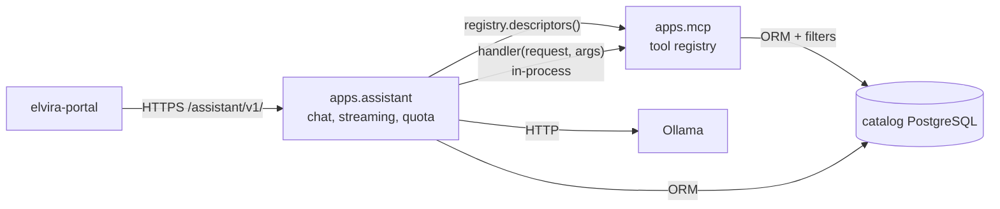

# IP-015: In-Catalog Chat Assistant (`apps/assistant`)

Build the Elvíra chat assistant as a Django app inside the catalog, served on a path instead of
a subdomain, storing its chats in the catalog's own PostgreSQL database through ordinary Django
migrations. The existing `elvira-ai-agent` Node service is treated purely as a **reference
implementation** — this is new code, with no data migration and no REST hop between the
assistant and the catalog.

<!-- more -->

## Status

**Status**: Draft
**Last Updated**: 2026-09-17
**Implementation**: Not started

Related: **[IP-012](ip-012-ai-powered-discovery.md) Phase 5** describes folding the chatbot into
the catalog *and* rewriting it as a RAG assistant, gated on IP-012 Phases 1–2 and
**[IP-013](ip-013-document-extraction-structure.md)** — none of which are started. IP-015 takes
only the in-catalog chat assistant, with no retrieval work, so it can land independently. See
**D12**.

## Problem Statement

The chat assistant currently lives outside the catalog and can only reach it over HTTP. That
boundary is the problem this proposal removes.

- **Every turn costs a round-trip to authenticate.** The assistant has no access to the session,
  so it resolves the caller by calling `GET /api/v1/users/me` on each `startchat`, `sendchat`
  and `resumechat`.
- **The user table is duplicated.** Running as a separate service forced a local mirror of the
  catalog's users, kept in sync by an upsert on every chat start. The catalog's `User` model
  already owns `db_table = "users"`, so that mirror can never coexist with it in one database.
- **Catalog relationships have to be faked in prose.** Because the assistant sees REST payloads
  rather than models, it threads `catalogId` through the LLM itself — a required tool parameter
  plus a `[Book Catalogs: {...}]` breadcrumb written into message text — to recover a foreign key
  the `Entry` model already has.
- **Chat state is not durable.** Sessions live in module-level dictionaries, so a restart drops
  live conversations and message sends fail until the client explicitly resumes.
- **Chat data cannot be joined to catalog data.** Separate databases mean no reporting across
  entries, users and conversations.
- **Two of everything to operate.** A second image, deploy, subdomain, TLS certificate, CORS
  policy and migration mechanism, for one chat feature.

Nothing in the catalog references the assistant today — a repository-wide grep for
`ai-agent`/`assistant`/`chatbot` outside `docs/` returns nothing — so this is additive on the
catalog side.

## Proposed Solution

### Overview

A new Django app **`apps/assistant`**, mounted at **`/assistant/v1/`** behind an
`EVILFLOWERS_ASSISTANT_ENABLED` flag, following the opt-out pattern IP-014 established for
`apps/mcp`. It stores chats in the catalog database via Django migrations, authenticates through
the catalog's existing `SecuredView` machinery, and reads entries through the ORM.

### Scope

**In scope**

- New app, models and migrations in the catalog database.
- Chat endpoints with streaming responses.
- An Ollama-backed LLM client with tool calling.
- Catalog tools reused from the `apps/mcp` registry, plus an assistant-local `displayBooks`.
- Daily usage quota.

**Out of scope — handled separately by the maintainer**

- Decommissioning the old `elvira_agent` PostgreSQL database.
- Unloading the nginx subdomain and its TLS configuration.

**Out of scope — other proposals**

- Embeddings, chunking, pgvector, semantic search, `ask_book`, summarization → IP-012.
- Document extraction → IP-013.

**Explicitly not happening**

- No data migration. The new tables start empty.
- No duplicated user table. `Chat.user` is a foreign key to `apps.core.models.User`.

### Key Components

1. **`apps/assistant` Django app** — repo-standard layout (`models/`, `views/`, `serializers/`,
   `urls.py`, `tests/`), registered in `INSTALLED_APPS`.
2. **Models on `BaseModel`** — inheriting the repo's UUID primary key and
   `created_at`/`updated_at`. Three tables; see **D2**.
3. **Catalog tools reused from `apps/mcp`** — the assistant does not define its own catalog
   tools. It reads them from the existing MCP registry and calls the handlers in-process.
   See *Reusing `apps/mcp` tools* below.
4. **Existing auth** — the view subclasses `SecuredView` as `McpEndpoint` does, accepting
   `Authorization: Bearer <api key JWT>` or `Basic`. The per-turn `users/me` call disappears.
5. **Durable, stateless turns** — conversation context is rebuilt from message rows each turn;
   no in-memory session registry, no separate resume step.
6. **Streaming responses** — SSE on the existing gevent workers; see **D5**.
7. **Ollama LLM client** — `apps/assistant/llm/`, configured by catalog settings.

### Reusing `apps/mcp` tools

IP-014 already built, tested and shipped exactly what the assistant needs: 25 catalog tools with
JSON Schemas, declared access levels and access-scoped queries. The assistant reuses them rather
than writing a second, weaker set.

This works because **the MCP transport and the MCP tools are separable**. A tool is a plain
Python callable:

```python
ToolHandler = Callable[..., dict]          # handler(request, arguments) -> dict
```

JSON-RPC and Streamable HTTP are a layer *above* that. Calling a tool from inside the assistant
is a function call on the same request object — no HTTP, no loopback, no second auth pass.

Concretely:

| Need | Provided by `apps/mcp` |
|------|------------------------|
| Tool schemas to advertise to the LLM | `registry.descriptors(write_enabled=...)` returns `name`, `description`, `inputSchema` — remapped mechanically to Ollama's tool format |
| Executing a tool call | `registry.get(name).handler(request, arguments)` |
| "Users must have access" | Handlers compose `EntryFilter(..., request=request)` and friends, so results are scoped to `request.user`. Object-level permission is checked inside handlers via `has_object_permission` |
| Refusing a tool the caller may not use | Each `Tool` declares `ToolAccess.PUBLIC` / `USER` / `WRITE`, enforced centrally before the handler runs |

The assistant authenticates with `SecuredView` like `McpEndpoint` does, so `request.user` is
populated the same way and the same scoping applies. Access control therefore has **one**
implementation across the REST API, MCP and the assistant.

The three reference tools map onto this cleanly:

| Reference tool | Reuse |
|----------------|-------|
| `getEntries` | `search_entries` |
| `getEntryDetails` | `get_entry` |
| `displayBooks` | **No equivalent — stays assistant-local.** It is a UI presentation directive, not a data lookup, so it belongs to the chat surface rather than the catalog tool registry |

Only `search_entries` and `get_entry` are advertised (see **D1**) — the registry's other 23 tools
stay unadvertised, because a small local model's tool-calling degrades quickly as the tool list
grows. Availability filtering, the one capability the reference agent lacked, needs no extra tool:
`search_entries` already accepts an `lcp_states` filter and its projections carry LCP and shelf
state.

Reuse leaves one thing to resolve: the declared-access check lives in a private method on
`McpServer`, so calling handlers directly would bypass it. It is lifted into a shared function
(see **D7**).

### Architecture



### Reference implementation notes

`elvira-ai-agent` is reference material, not a thing to port line-by-line. What is worth
carrying over, and what is worth reconsidering:

| Reference behaviour | Assessment |
|---------------------|------------|
| Three tools: `getEntries`, `getEntryDetails`, `displayBooks` | Replace — the first two exist in the `apps/mcp` registry as `search_entries` and `get_entry`; only `displayBooks` stays assistant-local |
| Ollama `/api/generate` with a hand-rolled `<tool_calls>` JSON block parsed out of the token stream, whole conversation flattened into one prompt | **Reconsider** — `/api/chat` offers native tool calling and message history. See **D9** |
| Required `catalogId` tool parameter + `[Book Catalogs: {...}]` breadcrumb in message text | Drop — the ORM has the catalog FK |
| Per-user daily message/token quota returning `429` | Keep, if quota is in scope (**D2**) |
| `blocked`/`blocked_until`/`blocked_reason` on the mirrored user table | Needs a new home (**D11**) |
| Auto-title from the first user message; `message_count`/`total_tokens` counters, maintained by PostgreSQL triggers | Keep the behaviour, implement in Python so it is testable and visible |
| In-memory session registry + explicit resume endpoint | Drop — rebuild from rows |
| `apiKey` accepted in the JSON body, query string or `x-api-key` | Drop — `Authorization` header only |
| `cors({ origin: '*' })` | Drop — use the catalog's CORS settings |

## Implementation Plan

### Phase 1: App and data model

- [ ] Create `apps/assistant/` following the layout of `apps/notifications`.
- [ ] Register `apps.assistant` in `INSTALLED_APPS`.
- [ ] Define models on `BaseModel` with explicit `db_table` names prefixed `assistant_`
      (final set per **D2**).
- [ ] `Chat.user` → FK to `core.User`. No assistant-local user table.
- [ ] Auto-title and counter maintenance as Python model/signal logic.
- [ ] Generate and apply the initial migration against the catalog database.

### Phase 2: LLM client

- [ ] `apps/assistant/llm/` — Ollama client with streaming, per the protocol chosen in **D9**.
- [ ] Tool schema definitions and dispatch.
- [ ] System prompt, adapted to drop the `catalogId` breadcrumb.
- [ ] Settings for endpoint, model and credentials (**D9**).

### Phase 3: Tools via the MCP registry

- [ ] Adapter mapping `registry.descriptors()` to the LLM's tool-schema format.
- [ ] Dispatch `registry.get(name).handler(request, arguments)` in-process.
- [ ] Apply the tool's declared `ToolAccess` before dispatch, sharing the check with
      `apps/mcp` per **D7**.
- [ ] Restrict the advertised set per **D1** and the write policy per **D1**.
- [ ] Assistant-local `displayBooks` tool for the UI.
- [ ] Catalog scoping semantics per **D4**.

### Phase 4: Endpoints

- [ ] `POST /assistant/v1/chats` — start a chat.
- [ ] `POST /assistant/v1/chats/{id}/messages` — send a message, streaming response.
- [ ] `GET /assistant/v1/chats` / `GET /assistant/v1/chats/{id}` — list and history.
- [ ] Rebuild conversation context from rows each turn, windowed per **D3**.
- [ ] Mount under `EVILFLOWERS_ASSISTANT_ENABLED` in `evil_flowers_catalog/urls.py`.

### Phase 5: Auth, quota, moderation

- [ ] Subclass `SecuredView`; Bearer/Basic per the catalog's existing schemes.
- [ ] Daily quota with a `429` response, if in scope (**D2**).
- [ ] Moderation/blocking per **D11**; admin surface per **D11**.

### Phase 6: Tests and docs

- [ ] Tests: quota exhaustion, cross-user chat access denial, streaming happy path, tool
      dispatch, disabled-flag routing.
- [ ] Register endpoints with `apps/openapi`.
- [ ] Update `docs/proposals/index.md`.

### Prerequisites

- An Ollama endpoint reachable from the Django container.
- No new runtime dependency beyond an HTTP client the catalog already has.

## Technical Details

### Technology Stack

| Technology | Why |
|------------|-----|
| Django app in the existing monolith | No new service or deploy; reuses auth, ORM, settings, CORS, OpenAPI |
| Catalog PostgreSQL | One database; chat data joinable with entries and users |
| Ollama | Existing inference backend; no model change in scope |

### Data Model Changes

New tables in the catalog database, all prefixed `assistant_`. Final set pending **D2**; the
baseline is:

| Table | Purpose |
|-------|---------|
| `assistant_chats` | One conversation. FK to `core.User`, optional FK to `core.Entry`, title, counters |
| `assistant_messages` | One turn. FK to chat, sender, text, tokens, referenced entries |
| `assistant_daily_limits` | Per-user per-day message/token usage, if quota is in scope |

```python
# apps/assistant/models/chat.py (sketch)
class Chat(BaseModel):
    class Meta:
        app_label = "assistant"
        db_table = "assistant_chats"

    user = models.ForeignKey("core.User", on_delete=models.CASCADE, related_name="assistant_chats")
    entry = models.ForeignKey("core.Entry", on_delete=models.SET_NULL, blank=True, null=True)
    title = models.CharField(max_length=500, blank=True, null=True)
    is_active = models.BooleanField(default=True)
    total_tokens = models.BigIntegerField(default=0)
    message_count = models.IntegerField(default=0)
```

No table named `users` is created. Nothing is backfilled.

### API Changes

New surface; no existing catalog endpoint changes.

```
POST   /assistant/v1/chats                 start a chat
POST   /assistant/v1/chats/{id}/messages   send a message (streaming)
GET    /assistant/v1/chats                 list the caller's chats
GET    /assistant/v1/chats/{id}            chat with message history
```

Authentication is the catalog's standard `Authorization` header.

### Configuration

```bash
EVILFLOWERS_ASSISTANT_ENABLED=True
EVILFLOWERS_ASSISTANT_OLLAMA_ENDPOINT=
EVILFLOWERS_ASSISTANT_OLLAMA_MODEL=
EVILFLOWERS_ASSISTANT_OLLAMA_API_KEY=
EVILFLOWERS_ASSISTANT_DAILY_LIMIT_MESSAGES=100
EVILFLOWERS_ASSISTANT_DAILY_LIMIT_TOKENS=50000
EVILFLOWERS_ASSISTANT_DAILY_LIMIT_RESET_HOUR=0
```

## Alternatives Considered

### Alternative 1: Reverse-proxy the subdomain onto a catalog path

**Description**: Keep the Node service; add an nginx location that proxies to it.

**Pros**: Trivial; satisfies the literal "path not subdomain" requirement.

**Cons**: Changes nothing that matters — two databases, duplicated users, an auth round-trip per
turn, in-memory sessions and two deployments all remain, behind a URL that now implies
integration that does not exist.

**Why not chosen**: cosmetic.

### Alternative 2: Keep the Node service, point it at the catalog database

**Description**: Share one PostgreSQL instance between both services.

**Pros**: Chat data becomes joinable; small change.

**Cons**: Two applications writing one schema through two independent migration systems; the
`users` table name collision is a hard blocker; the auth round-trip and in-memory sessions
survive.

**Why not chosen**: trades a clean REST boundary for an uncontrolled one.

### Alternative 3: Implement IP-012 Phase 5 as written

**Description**: Build the in-catalog assistant and the RAG rewrite together.

**Pros**: One portal migration; reaches the end state directly.

**Cons**: Blocked on IP-012 Phases 1–2 and IP-013 — chunking, embeddings, pgvector, hybrid
retrieval and a GPU host, none started.

**Why not chosen**: the chat assistant has no technical dependency on retrieval.

## Trade-offs and Risks

### Trade-offs

- **The portal re-points now and gains RAG later.** The second change is additive.
- **New code rather than reused TypeScript.** The reference is small and well-understood; the
  alternative is a permanent second runtime.
- **The Django image now makes LLM calls.** Long-lived streaming requests occupy a worker;
  see **D5**.

### Risks

| Risk | Impact | Mitigation |
|------|--------|-----------|
| Streaming ties up sync workers under the current server config | High | Settle transport in **D5** before Phase 4; measure under concurrency |
| A local model's tool calling is unreliable with a hand-rolled text protocol | Medium | Prefer native tool calling if the deployed model supports it (**D9**); keep the tool set at three |
| Context rebuilt from rows overflows the model's window on long chats | Medium | Windowing/token budget decided in **D3** |
| Tool results are not faithfully reconstructable on later turns | Medium | Persist tool calls and results as structured rows, not prose (**D8**) |
| Scope creep into IP-012's retrieval work | Medium | Non-goals stated above; tool set stays at three |

## Success Criteria

- [ ] Chat works end-to-end at `/assistant/v1/` with no HTTP call from the assistant to the
      catalog API.
- [ ] Chats and messages live in the catalog database, created by Django migrations.
- [ ] No `users`-table duplication: `Chat.user` is a foreign key to `core.User`.
- [ ] No `users/me` round-trip occurs during a turn.
- [ ] A restart does not lose or 404 an in-flight conversation.
- [ ] `EVILFLOWERS_ASSISTANT_ENABLED=False` leaves no route mounted.
- [ ] Tests cover quota, cross-user access denial, streaming and tool dispatch.

## Future Considerations

- **IP-012 Phase 5 becomes additive** — when Phases 1–2 land, retrieval tools (`semantic_search`,
  `ask_book`) are registered once in the `apps/mcp` registry and become available to the
  assistant *and* to external MCP clients in the same move.

## References

- [IP-012: AI-Powered Discovery](ip-012-ai-powered-discovery.md)
- [IP-013: Document Extraction, Classification & Feature Pipeline](ip-013-document-extraction-structure.md)
- [IP-014: Model Context Protocol Server](ip-014-model-context-protocol-server.md) — feature-flag, `SecuredView` and filter-composition patterns followed here
- `elvira-ai-agent` — reference implementation

## Decisions

All review questions are resolved. Decisions below are binding for implementation.

### D1: Tool set — exactly three, read-only

The assistant advertises the same three tools the reference agent had, no more:

| Tool | Source |
|------|--------|
| `search_entries` | `apps/mcp` registry — book search with filters |
| `get_entry` | `apps/mcp` registry — entry detail |
| `displayBooks` | assistant-local — UI directive telling the portal to render book cards |

The remaining 22 MCP tools are **not** advertised. The assistant never calls write tools; the
allowlist is hard-coded and read-only by construction, independent of
`EVILFLOWERS_MCP_ALLOW_WRITE`. Users make loans themselves in the portal in one click, so no
borrowing tool is exposed.

**Loan availability is data, not a tool.** `search_entries` already accepts an `lcp_states`
filter (`available_now`, `fully_borrowed`, `active_loan_for_user`, `not_lcp`) and its
`entry_summary`/`entry_detail` projections already carry LCP state and shelf information. The
assistant therefore can answer "which of these can I borrow right now?" and filter on it without
any new tool.

### D2: Tables — three

| Table | Purpose |
|-------|---------|
| `assistant_chats` | One conversation: FK to `core.User`, optional entry FK, title, counters, `last_message_at` |
| `assistant_messages` | One turn: FK to chat, role, text, tokens, structured tool calls/results |
| `assistant_user_policies` | Per-user moderation and limit overrides: blocked flag/until/reason, optional per-user message and token limits |

**No `assistant_daily_limits` table.** Daily usage is derived from `assistant_messages` with an
index on `(user, created_at)` — the token counts are already stored there, so a separate counter
table would be a second source of truth that can drift. Default limits live in settings; per-user
overrides live on `assistant_user_policies`.

No `users` table is created; `Chat.user` is a foreign key to `core.User`.

### D3: Conversation context — preserve the KV cache, trim only when cold

History is **append-only**: every turn re-sends the identical prompt prefix plus the new turn, so
Ollama's KV cache is reused instead of invalidated. Nothing rewrites, reorders or summarises
history while a chat is active.

Trimming happens only once a chat has gone cold — when `last_message_at` is more than
`EVILFLOWERS_ASSISTANT_CACHE_TTL` (default 1 hour) in the past, the cache is gone anyway, so the
next turn replays only the last `EVILFLOWERS_ASSISTANT_TRIM_MESSAGES` messages and becomes the new
stable prefix.

This makes prefix stability a hard constraint on the implementation: no timestamps, counters or
other volatile text may be injected into the prompt prefix.

### D4: Single catalog

There is one catalog in practice, so nothing is scoped by catalog: chats are not pinned to a
catalog and tool calls do not thread a catalog id. The reference agent's required `catalogId` tool
parameter and its `[Book Catalogs: {...}]` breadcrumb are both dropped.

For client compatibility the request may still carry `catalogId`; it is accepted and stored on the
chat, but no behaviour branches on it.

### D5: Streaming — SSE on the existing workers

`StreamingHttpResponse` emitting Server-Sent Events, keeping the reference event shapes
(`message`, `chunk`, `entries`) so the portal change is a base-URL and auth-header move.

This is safe on the current deployment: `conf/gunicorn.conf.py` sets `worker_class = "gevent"`
with 4 workers, so a request blocked on the Ollama read yields its greenlet rather than holding an
OS thread. No ASGI migration and no Celery fan-out is required. Proxy response buffering must be
disabled for the streaming route.

### D6: Authentication — the catalog's own

The endpoint subclasses `SecuredView` exactly as `McpEndpoint` does, accepting
`Authorization: Bearer <api key JWT>` or `Basic`. No `apiKey` in the body or query string, and no
`users/me` round-trip. `request.user` then drives all tool scoping.

### D7: Access enforcement is shared, not duplicated

`McpServer._authorize()` is lifted into a shared function in `apps/mcp` that both the JSON-RPC
server and the assistant call, so a tool's declared `ToolAccess` is enforced on both paths from
one implementation. The assistant's tool registry lookup does not depend on
`EVILFLOWERS_MCP_ENABLED`, which gates only URL mounting.

### D8: Tool activity is stored structurally

`assistant_messages` carries a `role` (`user`/`assistant`/`tool`) plus JSON `tool_calls` and
`tool_result` columns. No synthetic prose like `[Displayed 3 book(s)...]` is written into message
text, because with stateless turns whatever is stored *is* the conversation on the next turn.

### D9: Inference backend and request protocol

**Protocol.** `/api/chat` with native tool calling, not the reference's `/api/generate` plus a
hand-parsed `<tool_calls>` text block. Native tool calls arrive structured, which is what **D8**
stores, and a message array maps directly onto `assistant_messages` rows. Append-only history
(**D3**) keeps the prompt prefix stable either way, so this costs nothing in KV-cache terms. If
the configured model turns out not to support tools, the fallback is the reference's text
protocol behind the same client interface.

**Credentials.** Ollama endpoint, model and API key come from environment variables. Cloud is the current target;
nothing in the code assumes cloud or local. `EVILFLOWERS_ASSISTANT_OLLAMA_API_KEY` is sent as a
bearer token when set and omitted when blank.

### D10: URL prefix

`/assistant/v1/`, consistent with `api/v1/`, `opds/v2/`, `readium/v1/`, `data/v1/` and `mcp/v1`.

### D11: Moderation and admin

Blocking lives on `assistant_user_policies`, checked on chat start and on every send. Models are
registered in Django admin; no bespoke REST admin endpoints are built until the portal needs them.

### D12: Relationship to IP-012

IP-015 owns the assistant. IP-012 Phase 5 is to be rewritten later to assume `apps/assistant`
exists and to add retrieval-backed tools to the `apps/mcp` registry, where the assistant and
external MCP clients both pick them up.

## Changelog

| Date | Author | Changes |
|------|--------|---------|
| 2026-09-17 | tomikjetu | Initial draft: in-catalog chat assistant carved out of IP-012 Phase 5 |
| 2026-09-17 | tomikjetu | Reframed as new build with `elvira-ai-agent` as reference only; removed all data-migration scope; moved old-database and nginx decommissioning out of scope; expanded Review Questions to 14 |
| 2026-09-17 | tomikjetu | Assistant now reuses the `apps/mcp` tool registry in-process instead of defining its own tools; added Q15–Q17 on tool subset, write access and shared access enforcement |
| 2026-09-17 | tomikjetu | Resolved all review questions into binding Decisions (D1-D12); tool set fixed at three read-only tools; daily-limits table dropped in favour of derived usage; KV-cache-preserving context policy; single-catalog simplification |
