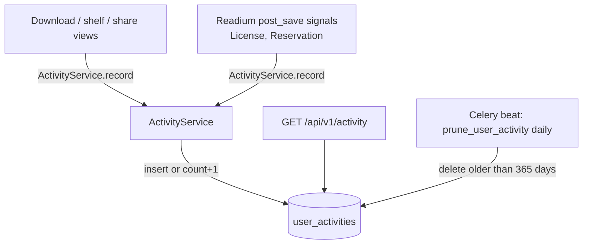

# IP-016: Personal Activity History

Give every user a personal, chronological history of what they did with books in the catalog:
downloads, bookmarks, loans, reservations and shared links. The history is a user-facing
feature ("what have I been reading?"), not an audit log. Repeated identical actions collapse
into one row with a counter, and rows older than 12 months are pruned automatically.

<!-- more -->

## Status

**Status**: Accepted
**Last Updated**: 2026-09-21
**Implementation**: Complete (backend + elvira-portal `History.tsx`); tests written, not yet run

## Problem Statement

The catalog records the *current* state of a user's relationship to a book (a `ShelfRecord`
exists, a `License` is `active`, a `Reservation` is `queued`), but not how they got there. Once a
shelf record is deleted, a loan is returned, or a reservation is claimed, the trace is gone
(or only recoverable by reading license/reservation rows the user never sees as a timeline).

- Users cannot answer "which book did I download last week?" or "what did I borrow last month?"
- Downloads of PDFs/EPUBs leave no per-user trace at all (only `UserAcquisition` bookkeeping for
  non-open-access content, which is overwritten, not appended).
- The portal has no data to build a "Recently read" / "History" page from.

## Proposed Solution

### Overview

A new append-and-collapse table `UserActivity` in `apps/core`, written by a small
`ActivityService.record()` helper that is called from the relevant views (user-initiated
actions) and from Readium `post_save` signals (lifecycle transitions, including system-driven
ones). A read-only paginated endpoint exposes the history to the owner.

### Tracked events

| Action | Trigger | Source |
|---|---|---|
| `entry_downloaded` | `GET /data/v1/acquisitions/{id}` (authenticated only) | `apps/files/views.py` `AcquisitionDownload` |
| `entry_downloaded` | `GET /data/v1/user-acquisitions/{id}` | `apps/files/views.py` `UserAcquisitionDownload` |
| `license_downloaded` | `GET /readium/v1/licenses/{id}.lcpl` (book opened in a reader app) | `apps/readium/views/download.py` |
| `shelf_added` | `POST /api/v1/shelf-records` (only when newly created) | `apps/api/views/shelf_records.py` |
| `shelf_removed` | `DELETE /api/v1/shelf-records/{id}` | `apps/api/views/shelf_records.py` |
| `acquisition_shared` | `POST /api/v1/user-acquisitions` with `type=shared` | `apps/api/views/user_acquisitions.py` |
| `loan_created` | `License` created | `post_save` signal |
| `loan_renewed` | `LicenseService.renew_license` succeeded | `apps/readium/services/license_service.py` |
| `loan_returned` | `License.state` → `returned` | `post_save` signal |
| `loan_expired` | `License.state` → `expired` (beat sweep or on-read reconcile) | `post_save` signal |
| `loan_revoked` | `License.state` → `revoked` | `post_save` signal |
| `loan_cancelled` | `License.state` → `cancelled` | `post_save` signal |
| `reservation_created` | `Reservation` created | `post_save` signal |
| `reservation_available` | `Reservation.status` → `available` ("your book is ready") | `post_save` signal |
| `reservation_claimed` | `Reservation.status` → `claimed` | `post_save` signal |
| `reservation_expired` | `Reservation.status` → `expired` | `post_save` signal |
| `reservation_cancelled` | `Reservation.status` → `cancelled` | `post_save` signal |

**Explicitly not tracked**: annotations (created in bulk by reader clients, would flood the
history), covers/thumbnails, OPDS feed browsing and search, `GET /readium/v1/content/{id}`
(encrypted payload fetched repeatedly by reader apps; `license_downloaded` already represents
"opened the book"), LSD status polling and device registration, admin CRUD on catalogs/entries.

### Collapsing repeated events

This is a personal history, so the same thing happening twice in a row must not produce two
rows. The rule:

> When recording `(user, entry, action)`, look up the user's **most recent** activity row for
> that `entry`. If its `action` is the same, increment `count` and bump `last_occurred_at`
> instead of inserting. Otherwise insert a new row with `count = 1`.

Consequences:

- Downloading the same PDF ten times (or a PDF reader issuing range requests) → one
  `entry_downloaded` row with `count = 10`, surfaced at the top of the history with its latest
  timestamp.
- Interleaved actions keep their story: *downloaded → added to shelf → downloaded* produces
  three rows, because the latest row for the entry changed in between.
- Borrow → return → borrow produces three rows (`loan_created`, `loan_returned`,
  `loan_created`), which is the history the user expects to see.

### Key Components

1. **`UserActivity` model** (`apps/core/models/user_activity.py`) with migration
   `apps/core/migrations/0041_useractivity.py`.
2. **`ActivityService`** (`apps/core/services/activity.py`): `record(user, entry, action,
   metadata=None)` with the collapse logic; never raises into the caller.
3. **Hooks** in the views listed above and new receivers in `apps/readium/signals.py`.
4. **API**: `GET /api/v1/activity` (list) with filter, serializer, OpenAPI metadata.
5. **Retention**: Celery beat task `apps.tasks.tasks.prune_user_activity` deleting rows whose
   `last_occurred_at` is older than `EVILFLOWERS_ACTIVITY_RETENTION_DAYS` (default `365`).

### Architecture



## Implementation Plan

### Phase 1: Model and service

- [x] Add `UserActivity` model and `ActivityAction` TextChoices to `apps/core/models/`, export
      from `apps/core/models/__init__.py`
- [x] Create migration `0041_useractivity`
- [x] Implement `ActivityService.record()` with collapse logic, wrapped in `try/except` +
      `logger.exception` so history failures never break a download or loan
- ~~Register the model in Django admin~~: dropped. Only catalogs and entries are registered in the
      admin, and reading history is owner-only (Q3)

### Phase 2: Recording hooks

- [x] `AcquisitionDownload.get` and `UserAcquisitionDownload.get`: record `entry_downloaded`
      after the permission and IP-block checks pass, only for authenticated users
- [x] `LicenseDownloadView.get`: record `license_downloaded` after a successful token check
- [x] `ShelfRecordManagement.post` (only when `created`) and `ShelfRecordDetail.delete`
- [x] `UserAcquisitionManagement.post`: record `acquisition_shared` for the requesting user, only for
      `type=shared` (personal user acquisitions are the ordinary download path)
- [x] `apps/readium/signals.py`: new `post_save` receivers for `License` (created, state
      transitions) and `Reservation` (created, status transitions), reusing the existing `pre_save`
      stash of the previous state. These receivers are **not** gated by
      `EVILFLOWERS_NOTIFICATIONS_ENABLED`
- [x] `LicenseService.renew_license`: record `loan_renewed` directly, because `renewal_count` is
      bumped with `.update()` and never reaches `post_save`

### Phase 3: API and OpenAPI

- [x] `apps/api/serializers/user_activities.py` (`UserActivitySerializer.Base`) with the nested
      `EntrySerializer.Base` (same shape as shelf records, so the portal reuses its entry type) plus
      `action`, `count`, `metadata`, `created_at` (first occurrence) and `last_occurred_at`
- [x] `apps/api/filters/user_activities.py`: `action` (multi), `entry_id`, `catalog_id`,
      `last_occurred_at__gte`, `last_occurred_at__lte`
- [x] `apps/api/views/user_activities.py`: `UserActivityManagement.get` returning
      `PaginationResponse` ordered by `-last_occurred_at` unless `order_by` is given; anonymous →
      `UnauthorizedException`
- [x] Route `path("activity", ..., name="user-activity-management")` in `apps/api/urls.py`
- [x] `@openapi.metadata(..., tags=["Activity"])`; the spec is generated from the decorators, filter
      and serializer, so there is no checked-in spec file to regenerate

### Phase 4: Retention

- [x] Setting `EVILFLOWERS_ACTIVITY_RETENTION_DAYS = 365` (env-configurable) and add it to
      `.env.example`
- [x] Celery task `apps/tasks/tasks.py::prune_user_activity` → `ActivityService.prune()`, deleting in
      batches
- [x] Register in `evil_flowers_catalog/celery.py` `beat_schedule` (daily, e.g. 03:30)

### Phase 5: Tests

`apps/core/tests/test_user_activity.py` (SimpleTestCase + mocks, readium test style):

- [x] Service: collapse, insert, first row, anonymous skipped, failure swallowed
- [x] Signals: every License / Reservation transition, silent on unchanged state,
      `claim_deadline` on `reservation_available`
- [x] Wiring: route registered, beat task scheduled
- [ ] DB-backed tests for the view hooks and the API endpoint (needs a test database)

### Phase 6: elvira-portal

- [x] `src/utils/interfaces/activity.ts`, `src/hooks/api/activity/useGetActivity.tsx`
- [x] `src/pages/common/History.tsx`: replaces the mock data with `GET /api/v1/activity` via
      `useInfiniteItemContainer` and a "Load more" button; shows thumbnail, action, `count` and
      relative time. Clicking a row opens the entry detail popup (`entry-detail-id`), which already
      shows the loan / reservation state
- [x] EN / SK translations for all 16 actions

## Technical Details

### Data model

```python
class UserActivity(BaseModel):
    class Meta:
        app_label = "core"
        db_table = "user_activities"
        default_permissions = ()
        verbose_name = _("User activity")
        verbose_name_plural = _("User activities")
        indexes = [
            models.Index(fields=["user", "-last_occurred_at"], name="user_activities_user_last_idx"),
            models.Index(fields=["user", "entry", "-last_occurred_at"], name="user_activities_entry_last_idx"),
            models.Index(fields=["last_occurred_at"], name="user_activities_last_idx"),
        ]

    class ActivityAction(models.TextChoices):
        ENTRY_DOWNLOADED = "entry_downloaded", _("Entry downloaded")
        LICENSE_DOWNLOADED = "license_downloaded", _("License downloaded")
        SHELF_ADDED = "shelf_added", _("Added to shelf")
        SHELF_REMOVED = "shelf_removed", _("Removed from shelf")
        ACQUISITION_SHARED = "acquisition_shared", _("Acquisition shared")
        LOAN_CREATED = "loan_created", _("Loan created")
        LOAN_RENEWED = "loan_renewed", _("Loan renewed")
        LOAN_RETURNED = "loan_returned", _("Loan returned")
        LOAN_EXPIRED = "loan_expired", _("Loan expired")
        LOAN_REVOKED = "loan_revoked", _("Loan revoked")
        LOAN_CANCELLED = "loan_cancelled", _("Loan cancelled")
        RESERVATION_CREATED = "reservation_created", _("Reservation created")
        RESERVATION_AVAILABLE = "reservation_available", _("Reservation available")
        RESERVATION_CLAIMED = "reservation_claimed", _("Reservation claimed")
        RESERVATION_EXPIRED = "reservation_expired", _("Reservation expired")
        RESERVATION_CANCELLED = "reservation_cancelled", _("Reservation cancelled")

    user = models.ForeignKey(User, on_delete=models.CASCADE, related_name="activities")
    entry = models.ForeignKey(Entry, on_delete=models.CASCADE, related_name="activities")
    action = models.CharField(max_length=32, choices=ActivityAction.choices)
    count = models.PositiveIntegerField(default=1)
    last_occurred_at = models.DateTimeField(default=timezone.now)
    metadata = models.JSONField(default=dict)
```

`created_at` (from `BaseModel`) is the first occurrence; `last_occurred_at` is the most recent
one and drives ordering and retention.

### `metadata` contents

| Action | Metadata |
|---|---|
| `entry_downloaded` | `acquisition_id`, `mime`, `via` (`acquisition` \| `user_acquisition`) |
| `license_downloaded` | `license_id` |
| `acquisition_shared` | `user_acquisition_id`, `type` (`shared` \| `personal`) |
| `loan_*` | `license_id`, `expires_at` |
| `reservation_*` | `reservation_id`; `claim_deadline` for `reservation_available` |

When a row is collapsed, `metadata` is overwritten with the latest occurrence's metadata.

### Collapse logic

```python
def record(user, entry, action, metadata=None) -> None:
    if user is None or user.is_anonymous:
        return
    try:
        now = timezone.now()
        latest = (
            UserActivity.objects.filter(user=user, entry=entry)
            .order_by("-last_occurred_at")
            .only("id", "action")
            .first()
        )
        if latest and latest.action == action:
            UserActivity.objects.filter(pk=latest.pk).update(
                count=F("count") + 1, last_occurred_at=now, metadata=metadata or {}, updated_at=now
            )
        else:
            UserActivity.objects.create(
                user=user, entry=entry, action=action, last_occurred_at=now, metadata=metadata or {}
            )
    except Exception:
        logger.exception("activity.record_failed", extra={"action": action, "entry_id": str(entry.pk)})
```

Concurrency: two simultaneous identical requests can both miss the collapse and insert two
rows. This is acceptable for a personal history (no uniqueness guarantee is needed) and avoids
row locks on the download hot path.

### API

`GET /api/v1/activity`

- Auth: required (Basic / Bearer / API key, as every `SecuredView`).
- Always scoped to `request.user`.
- Query: `action` (repeatable), `entry_id`, `catalog_id`, `last_occurred_at__gte`,
  `last_occurred_at__lte`, plus standard `page` / `limit` / `order_by`.
- Response: standard `PaginationResponse` of

```json
{
  "id": "uuid",
  "action": "entry_downloaded",
  "count": 3,
  "metadata": {"acquisition_id": "uuid", "mime": "application/pdf", "via": "acquisition"},
  "created_at": "2026-09-01T10:00:00Z",
  "last_occurred_at": "2026-09-20T18:42:11Z",
  "entry": {"id": "uuid", "title": "...", "catalog_id": "uuid", "thumbnail": "https://...", "...": "EntrySerializer.Base"}
}
```

### Retention

`prune_user_activity` deletes rows with `last_occurred_at < now - RETENTION_DAYS` in batches
of 5,000 primary keys to avoid long locks. A collapsed row that keeps being hit stays alive,
since its `last_occurred_at` keeps moving forward.

## Alternatives Considered

1. **Plain append-only event log** (one row per occurrence). Simplest to write, but PDF range
   requests and repeated opens flood the history, which the user explicitly doesn't want.
2. **One row per `(user, entry, action)` with a unique constraint** and upsert. Simplest dedup,
   but loses sequence: borrow → return → borrow would show only one `loan_created` and one
   `loan_returned`, with the return appearing to happen after the latest borrow.
3. **Derive history from existing tables** (`License`, `Reservation`, `ShelfRecord`). No new
   table, but downloads aren't recorded anywhere, deleted shelf records vanish, and state
   transitions aren't timestamped individually.
4. **Reuse `apps/events` (Kafka/Celery executors)**. More infrastructure than a synchronous
   single-row write needs; could be added later as a consumer if analytics want the stream.

## Trade-offs and Risks

- **Extra write on every authenticated download**: one indexed `SELECT` + one `UPDATE`/`INSERT`.
  Mitigated by the `(user, entry, -last_occurred_at)` index; failures are swallowed.
- **Privacy**: reading history is personal data. Only the owner can read it; retention is
  bounded at 12 months; rows are deleted with the user (`CASCADE`).
- **Signal coverage**: queryset `.update()` calls bypass signals (for example
  `generate_lcp_certification_bundle`). All production lifecycle paths use `.save()`, but a
  future bulk update would silently skip history.
- **Race on collapse** can produce duplicate adjacent rows under concurrent identical requests.

## Success Criteria

- Downloading a PDF, bookmarking, borrowing, renewing, returning and reserving a book each show
  up in `GET /api/v1/activity` in the right order.
- Downloading the same PDF repeatedly produces a single row whose `count` grows.
- "Your reservation is now available" appears in the history without any user action.
- Rows older than 12 months are gone after the daily prune task.
- A failure in `ActivityService` never causes a download or loan request to fail.
- The endpoint is documented in the generated OpenAPI spec.

## Future Considerations

- Let users delete individual history rows or clear their history
  (`DELETE /api/v1/activity/{id}`, `DELETE /api/v1/activity`).
- A "Continue reading" / "Recently read" OPDS feed built from `entry_downloaded` and
  `license_downloaded` rows.
- Per-user opt-out of history tracking.
- Feeding the stream into IP-012 recommendations.

## References

- [IP-002](ip-002-notification-engine.md): notification signals this proposal mirrors
- [IP-009](ip-009-readium-integration-closeout.md): license lifecycle vocabulary and expiry sweep
- [IP-011](ip-011-reservation-ux-completion.md): reservation lifecycle and claim flow
- `apps/readium/signals.py`: existing `pre_save`/`post_save` transition detection

## Review Questions

**Status**: ✅ Answered
**Review Date**: 2026-09-21
**Reviewer**: Claude AI

The following questions must be answered before implementation:

---

### Q1: Collapse scope 🔴 Critical

**Issue**: "Don't repeat the same event twice" can mean several things. The proposal collapses
only when the user's **latest row for the same entry** has the same action (see *Collapsing
repeated events*).

**Context**: This decides the data model (unique constraint or not) and what the history looks
like after borrow → return → borrow.

**Question**: Which collapse rule do you want?

**Options**:
- [x] **A**: Collapse into the latest row for the same entry if the action matches; keeps the
      sequence (recommended)
- [x] **B**: One row per `(user, entry, action)` forever, with a unique constraint; loses sequence
- [x] **C**: Collapse only within a time window (e.g. same action on same entry within 24 h)

**Answer**:
```
A: collapse into the latest row for the same entry ("let's not repeat the same event twice... have a row which will count").
```

**Resolution**:
```
Kept as specified in *Collapsing repeated events*. No unique constraint; `count` + `last_occurred_at`.
```

---

### Q2: What happens to history when an entry is deleted? ⚠️ Medium

**Issue**: The model uses `entry = ForeignKey(..., on_delete=CASCADE)`, so deleting a book
removes it from everyone's history.

**Context**: With `SET_NULL` the row survives, but the UI has nothing to show unless we also
snapshot the title into `metadata`.

**Question**: Should history rows survive entry deletion?

**Options**:
- [x] **A**: `CASCADE`: the history disappears with the book (recommended, simplest)
- [x] **B**: `SET_NULL` + store `entry_title` in `metadata` so the row still reads "You
      downloaded *Title* (no longer available)"

**Answer**:
```
A: CASCADE ("history is useless if I can't read it... if deleted I don't care").
```

**Resolution**:
```
`entry` stays `on_delete=CASCADE`; no title snapshot in `metadata`.
```

---

### Q3: Endpoint path and admin access ⚠️ Medium

**Issue**: The proposal uses `GET /api/v1/activity` scoped strictly to the current user,
matching `/api/v1/shelf-records`.

**Context**: Librarians may want to look at a user's history for support. That turns the
feature toward an audit tool, which the problem statement says it isn't.

**Question**: Should superusers be able to read other users' history?

**Options**:
- [x] **A**: No, owner only (recommended)
- [x] **B**: Superusers can pass `?user_id=`

**Answer**:
```
A: owner only (defaulted to the recommendation; it is a personal history, not an audit).
```

**Resolution**:
```
No `user_id` filter; `UserActivityFilter.qs` always restricts to `request.user`, including superusers.
```

---

### Q4: Anonymous open-access downloads ℹ️ Low

**Issue**: `AcquisitionDownload` skips authentication for `open-access` acquisitions, so
`request.user` is anonymous even if the client sent credentials.

**Context**: A logged-in user downloading an open-access PDF without an `Authorization` header
won't get a history row.

**Question**: Should the download view try optional authentication for open-access
acquisitions so logged-in users still get the event?

**Options**:
- [x] **A**: Yes: authenticate if credentials are present, but don't require them (recommended)
- [x] **B**: No: open-access downloads are only recorded when the user is already authenticated

**Answer**:
```
A.
```

**Resolution**:
```
No change needed: `SecuredView.dispatch` already authenticates whenever credentials are present, so open-access downloads by a logged-in user are recorded. Anonymous ones are skipped by `ActivityService.record`.
```

---

### Q5: Who is `acquisition_shared` recorded for? ℹ️ Low

**Issue**: `POST /api/v1/user-acquisitions` creates a link for the requesting user. When the
link is later downloaded by someone else, that download happens through
`UserAcquisitionDownload`, where `request.user` may be a different user or anonymous.

**Question**: Should downloads via a shared link be recorded for the link owner, the downloader,
or both?

**Options**:
- [x] **A**: Only the authenticated downloader (recommended; it's their reading history)
- [x] **B**: The link owner as well, as a "your shared link was used" row

**Answer**:
```
A: only the authenticated downloader (defaulted to the recommendation).
```

**Resolution**:
```
`UserAcquisitionDownload` records for `request.user`; the link owner gets an `acquisition_shared` row when creating the link.
```

---

### Q6: Should the user be able to delete history? ℹ️ Low

**Issue**: The proposal is read-only; deletion is listed under Future Considerations.

**Question**: Include `DELETE /api/v1/activity/{id}` and "clear all" in this proposal?

**Options**:
- [x] **A**: No, read-only for now (recommended)
- [x] **B**: Yes, add both endpoints in Phase 3

**Answer**:
```
A: "let's not yet implement any clearing".
```

**Resolution**:
```
Read-only endpoint; deletion stays under Future Considerations.
```

---

## Changelog

| Date | Author | Changes |
|------|--------|---------|
| 2026-09-21 | tomikjetu | Initial draft: event list, collapse rule, model, API, 12-month retention; annotations excluded |
| 2026-09-21 | tomikjetu | Added Review Questions section |
| 2026-09-21 | tomikjetu | Resolved all review questions (all option A); status → Accepted |
| 2026-09-21 | tomikjetu | Implemented backend (model, migration 0041, service, hooks, signals, `GET /api/v1/activity`, retention task) and elvira-portal History page; `loan_renewed` moved from signal to `LicenseService.renew_license`; `acquisition_shared` limited to `type=shared`; dropped admin registration |
