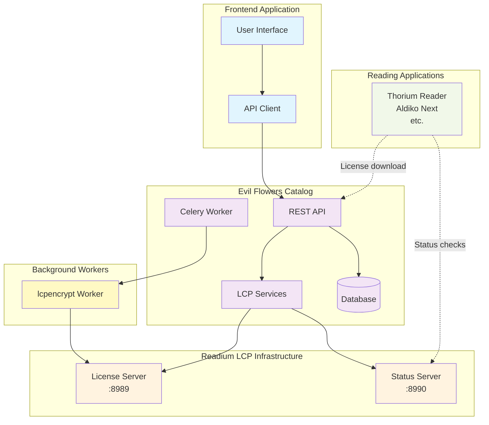
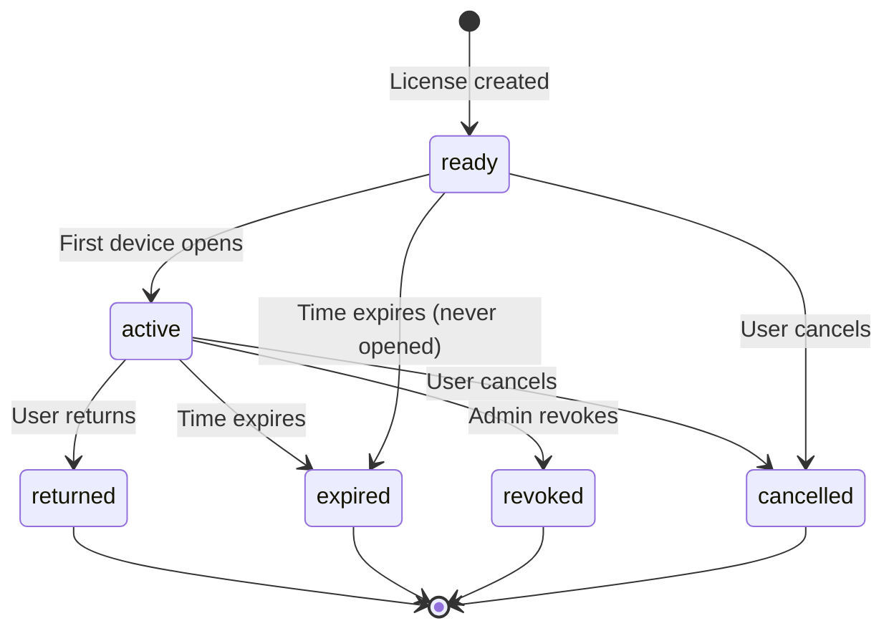
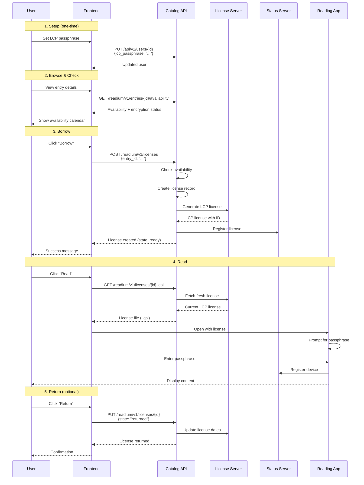

# Readium LCP Frontend Integration Guide

This guide explains how to integrate Readium LCP (Licensed Content Protection) functionality into a frontend
application that consumes the Evil Flowers Catalog API.

## Overview

The Evil Flowers Catalog implements a complete Readium LCP server integration that allows:
- **Protected content distribution**: EPUB and PDF files encrypted with LCP
- **License management**: Time-limited borrowing with concurrent user limits
- **Availability calendar**: Real-time view of borrowing slots
- **User passphrase management**: Users set their own passphrase for content protection
- **Content management server**: All license operations go through the catalog API

## Architecture Components



### Key Services

| Service | Port | Description |
|---------|------|-------------|
| Evil Flowers Catalog API | 8000 | Primary interface for all frontend operations |
| LCP License Server | 8989 | Generates LCP licenses, stores encryption keys |
| LCP Status Server | 8990 | Manages license status, device registration, returns |
| lcpencrypt Worker | - | Encrypts content and registers with License Server |

## User Setup: LCP Passphrase

**Important**: Before a user can borrow LCP-protected content, they must set up their LCP passphrase.

### Setting User Passphrase

**PUT** `/api/v1/users/{user_id}`

Update user profile to set the LCP passphrase:

```json
{
  "lcp_passphrase": "user-chosen-passphrase",
  "lcp_passphrase_hint": "Hint to remember passphrase"
}
```

**Response** (in detailed user view):
```json
{
  "id": "uuid",
  "username": "john.doe",
  "has_lcp_passphrase": true,
  "lcp_passphrase_hint": "Hint to remember passphrase"
}
```

### Checking Passphrase Status

**GET** `/api/v1/users/{user_id}` or `/api/v1/users/me`

Check if user has passphrase set:

```json
{
  "id": "uuid",
  "username": "john.doe",
  "has_lcp_passphrase": true,
  "lcp_passphrase_hint": "Hint to remember passphrase"
}
```

## API Endpoints

Base path: `/readium/v1/`

### 1. Entry Availability

**GET** `/readium/v1/entries/{entry_id}/availability`

Check if an entry is available for borrowing and get calendar data with encryption status.

**Query Parameters:**
- `start_date` (optional): ISO date string (e.g., "2024-01-01")
- `end_date` (optional): ISO date string (e.g., "2024-03-31")

**Response:**
```json
{
  "available": true,
  "max_concurrent": 3,
  "calendar": [
    {
      "date": "2024-01-15",
      "available_slots": 2,
      "total_slots": 3,
      "is_available": true
    },
    {
      "date": "2024-01-16",
      "available_slots": 0,
      "total_slots": 3,
      "is_available": false
    }
  ],
  "encryption": {
    "status": "registered",
    "ready_for_licensing": true,
    "encrypted_at": "2024-01-10T14:30:00Z",
    "error_message": null
  }
}
```

**Encryption Status Values:**
| Status | Description | Can Create License? |
|--------|-------------|---------------------|
| `not_started` | Encryption hasn't been triggered | No |
| `pending` | Waiting to start encryption | No |
| `encrypting` | Encryption in progress | No |
| `completed` | Encrypted but not registered | No |
| `failed` | Encryption failed | No |
| `registered` | Ready for licensing | Yes |

### 2. List User Licenses

**GET** `/readium/v1/licenses`

Get all licenses for the current user (non-admins only see their own).

**Query Parameters:**
- `entry_id` (optional): Filter by entry UUID
- `user_id` (optional): Filter by user UUID (admin only)
- `state` (optional): Filter by state (ready, active, returned, expired, revoked, cancelled)

**Response:**
```json
{
  "results": [
    {
      "id": "550e8400-e29b-41d4-a716-446655440000",
      "entry_id": "660e8400-e29b-41d4-a716-446655440001",
      "user_id": "770e8400-e29b-41d4-a716-446655440002",
      "state": "active",
      "starts_at": "2024-01-15T10:00:00Z",
      "expires_at": "2024-01-29T10:00:00Z",
      "created_at": "2024-01-15T09:55:00Z",
      "updated_at": "2024-01-15T10:00:00Z"
    }
  ],
  "count": 1,
  "next": null,
  "previous": null
}
```

### 3. Create License

**POST** `/readium/v1/licenses`

Create a new license for the current user to borrow an entry.

**Request Body:**
```json
{
  "entry_id": "660e8400-e29b-41d4-a716-446655440001",
  "user_passphrase": "optional-override-passphrase",
  "passphrase_hint": "Optional custom hint",
  "start_date": "2024-01-15T10:00:00Z",
  "duration_days": 14
}
```

**Field Details:**
| Field | Required | Description |
|-------|----------|-------------|
| `entry_id` | Yes | UUID of the entry to license |
| `user_passphrase` | No* | Passphrase for this license. If not provided, uses user's default |
| `passphrase_hint` | No | Hint for this license. Falls back to user's default hint |
| `start_date` | No | License start (default: now) |
| `duration_days` | No | Duration in days (default: 14) |

*If `user_passphrase` is not provided, the user must have `lcp_passphrase_hash` set in their profile.

**Success Response (201 Created):**
```json
{
  "id": "550e8400-e29b-41d4-a716-446655440000",
  "entry_id": "660e8400-e29b-41d4-a716-446655440001",
  "user_id": "770e8400-e29b-41d4-a716-446655440002",
  "state": "ready",
  "starts_at": "2024-01-15T10:00:00Z",
  "expires_at": "2024-01-29T10:00:00Z",
  "created_at": "2024-01-15T09:55:00Z",
  "updated_at": "2024-01-15T09:55:00Z"
}
```

**Error Responses:**

No passphrase available (400):
```json
{
  "title": "No LCP passphrase available. Please set your default passphrase via PUT /api/v1/users/{user_id} or provide 'user_passphrase' in this request.",
  "type": "/validation-error"
}
```

No available slots (400):
```json
{
  "title": "Cannot create license: No available slots for the requested period",
  "type": "/validation-error"
}
```

Content not ready (400):
```json
{
  "title": "Content not ready for licensing. Current status: encrypting",
  "type": "/validation-error"
}
```

### 4. License Details

**GET** `/readium/v1/licenses/{license_id}`

Get detailed information about a specific license.

**Response:**
```json
{
  "id": "550e8400-e29b-41d4-a716-446655440000",
  "entry_id": "660e8400-e29b-41d4-a716-446655440001",
  "entry": {
    "id": "660e8400-e29b-41d4-a716-446655440001",
    "title": "Example Book"
  },
  "user_id": "770e8400-e29b-41d4-a716-446655440002",
  "state": "active",
  "starts_at": "2024-01-15T10:00:00Z",
  "expires_at": "2024-01-29T10:00:00Z",
  "created_at": "2024-01-15T09:55:00Z",
  "updated_at": "2024-01-15T10:00:00Z"
}
```

### 5. Update License State

**PUT** `/readium/v1/licenses/{license_id}`

Update license state (return, renew, revoke, cancel).

**Request Body for Return:**
```json
{
  "state": "returned"
}
```

**Request Body for Renewal:**
```json
{
  "state": "renewed",
  "duration_days": 14
}
```

**Request Body for Revocation (admin):**
```json
{
  "state": "revoked",
  "reason": "Terms of service violation"
}
```

**Request Body for Cancellation:**
```json
{
  "state": "cancelled",
  "reason": "User requested cancellation"
}
```

### 6. Download License File (License Gateway)

**GET** `/readium/v1/licenses/{license_id}.lcpl`

Download the LCP license file for use in reading applications.

**Response:**
- Content-Type: `application/vnd.readium.lcp.license.v1.0+json`
- Content-Disposition: `attachment; filename="BookTitle.lcpl"`

The response is the complete LCP license JSON that can be imported into Readium-compatible reading applications like Thorium Reader or Aldiko Next.

### 7. Encryption Status (Admin)

**GET** `/readium/v1/entries/{entry_id}/encryption`

Get detailed encryption status for an entry.

**Response:**
```json
{
  "readium_enabled": true,
  "has_acquisition": true,
  "encryption": {
    "status": "registered",
    "lcp_content_id": "abc123-def456",
    "ready_for_licensing": true,
    "encrypted_at": "2024-01-10T14:30:00Z",
    "registered_at": "2024-01-10T14:31:00Z",
    "error_message": null
  }
}
```

### 8. Trigger Encryption (Admin)

**POST** `/readium/v1/entries/{entry_id}/encryption`

Manually trigger content encryption (requires `core.change_entry` permission).

**Request Body:**
```json
{
  "force": false
}
```

Set `force: true` to re-encrypt content that's already encrypted.

**Response (202 Accepted):**
```json
{
  "message": "Encryption triggered successfully",
  "lcp_content_id": "abc123-def456",
  "status": "encrypting"
}
```

## License States



| State | Description | Can Download LCPL? |
|-------|-------------|-------------------|
| `ready` | License created, not yet opened | Yes |
| `active` | At least one device registered | Yes |
| `returned` | User returned early | No |
| `expired` | Past expiration date | No |
| `revoked` | Admin revoked | No |
| `cancelled` | User cancelled | No |

## Complete Borrowing Flow



## Frontend Implementation

### TypeScript Interfaces

```typescript
interface User {
  id: string;
  username: string;
  has_lcp_passphrase: boolean;
  lcp_passphrase_hint?: string;
}

interface EncryptionStatus {
  status: 'not_started' | 'pending' | 'encrypting' | 'completed' | 'failed' | 'registered';
  ready_for_licensing: boolean;
  encrypted_at?: string;
  error_message?: string;
}

interface AvailabilityDay {
  date: string;
  available_slots: number;
  total_slots: number;
  is_available: boolean;
}

interface EntryAvailability {
  available: boolean;
  max_concurrent: number;
  calendar: AvailabilityDay[];
  encryption?: EncryptionStatus;
}

interface License {
  id: string;
  entry_id: string;
  user_id: string;
  state: 'ready' | 'active' | 'returned' | 'expired' | 'revoked' | 'cancelled';
  starts_at: string;
  expires_at: string;
  created_at: string;
  updated_at: string;
}

interface CreateLicenseRequest {
  entry_id: string;
  user_passphrase?: string;
  passphrase_hint?: string;
  start_date?: string;
  duration_days?: number;
}
```

### API Client

```typescript
class ReadiumApiClient {
  constructor(private baseUrl: string, private getAccessToken: () => string) {}

  private async fetch<T>(path: string, options: RequestInit = {}): Promise<T> {
    const response = await fetch(`${this.baseUrl}${path}`, {
      ...options,
      headers: {
        'Authorization': `Bearer ${this.getAccessToken()}`,
        'Content-Type': 'application/json',
        ...options.headers,
      },
    });

    if (!response.ok) {
      const error = await response.json();
      throw new Error(error.title || 'API request failed');
    }

    return response.json();
  }

  // User passphrase management
  async setUserPassphrase(userId: string, passphrase: string, hint?: string): Promise<User> {
    return this.fetch(`/api/v1/users/${userId}`, {
      method: 'PUT',
      body: JSON.stringify({
        lcp_passphrase: passphrase,
        lcp_passphrase_hint: hint,
      }),
    });
  }

  async getCurrentUser(): Promise<User> {
    return this.fetch('/api/v1/users/me');
  }

  // Availability
  async getAvailability(entryId: string, startDate?: string, endDate?: string): Promise<EntryAvailability> {
    const params = new URLSearchParams();
    if (startDate) params.append('start_date', startDate);
    if (endDate) params.append('end_date', endDate);

    const query = params.toString() ? `?${params}` : '';
    return this.fetch(`/readium/v1/entries/${entryId}/availability${query}`);
  }

  // License management
  async createLicense(request: CreateLicenseRequest): Promise<License> {
    return this.fetch('/readium/v1/licenses', {
      method: 'POST',
      body: JSON.stringify(request),
    });
  }

  async getLicenses(entryId?: string): Promise<{ results: License[] }> {
    const params = entryId ? `?entry_id=${entryId}` : '';
    return this.fetch(`/readium/v1/licenses${params}`);
  }

  async getLicense(licenseId: string): Promise<License> {
    return this.fetch(`/readium/v1/licenses/${licenseId}`);
  }

  async returnLicense(licenseId: string): Promise<License> {
    return this.fetch(`/readium/v1/licenses/${licenseId}`, {
      method: 'PUT',
      body: JSON.stringify({ state: 'returned' }),
    });
  }

  async renewLicense(licenseId: string, durationDays: number = 14): Promise<License> {
    return this.fetch(`/readium/v1/licenses/${licenseId}`, {
      method: 'PUT',
      body: JSON.stringify({ state: 'renewed', duration_days: durationDays }),
    });
  }

  // License file download URL
  getLicenseDownloadUrl(licenseId: string): string {
    return `${this.baseUrl}/readium/v1/licenses/${licenseId}.lcpl`;
  }
}
```

### Borrowing Service

```typescript
class BorrowingService {
  constructor(private api: ReadiumApiClient) {}

  async ensurePassphraseSet(): Promise<boolean> {
    const user = await this.api.getCurrentUser();
    return user.has_lcp_passphrase;
  }

  async checkCanBorrow(entryId: string): Promise<{
    canBorrow: boolean;
    reason?: string;
    availability?: EntryAvailability;
  }> {
    const availability = await this.api.getAvailability(entryId);

    // Check encryption status
    if (!availability.encryption?.ready_for_licensing) {
      return {
        canBorrow: false,
        reason: `Content not ready: ${availability.encryption?.status || 'unknown'}`,
        availability,
      };
    }

    // Check slot availability
    if (!availability.available) {
      return {
        canBorrow: false,
        reason: 'No available slots',
        availability,
      };
    }

    // Check existing license
    const licenses = await this.api.getLicenses(entryId);
    const activeLicense = licenses.results.find(l =>
      ['ready', 'active'].includes(l.state)
    );

    if (activeLicense) {
      return {
        canBorrow: false,
        reason: 'You already have an active license',
        availability,
      };
    }

    return { canBorrow: true, availability };
  }

  async borrow(entryId: string, durationDays: number = 14): Promise<License> {
    // Verify passphrase is set
    const hasPassphrase = await this.ensurePassphraseSet();
    if (!hasPassphrase) {
      throw new Error('Please set your LCP passphrase in your profile settings first');
    }

    // Create license
    return this.api.createLicense({
      entry_id: entryId,
      duration_days: durationDays,
    });
  }

  async return(licenseId: string): Promise<License> {
    return this.api.returnLicense(licenseId);
  }
}
```

### UI Components Example (React)

```tsx
function BorrowButton({ entryId }: { entryId: string }) {
  const [loading, setLoading] = useState(false);
  const [error, setError] = useState<string | null>(null);
  const borrowingService = useBorrowingService();
  const router = useRouter();

  const handleBorrow = async () => {
    setLoading(true);
    setError(null);

    try {
      const { canBorrow, reason } = await borrowingService.checkCanBorrow(entryId);

      if (!canBorrow) {
        setError(reason || 'Cannot borrow at this time');
        return;
      }

      const license = await borrowingService.borrow(entryId);
      router.push(`/read/${license.id}`);
    } catch (err) {
      setError(err instanceof Error ? err.message : 'Failed to borrow');
    } finally {
      setLoading(false);
    }
  };

  return (
    <div>
      <button onClick={handleBorrow} disabled={loading}>
        {loading ? 'Borrowing...' : 'Borrow'}
      </button>
      {error && <p className="error">{error}</p>}
    </div>
  );
}

function PassphraseSetup() {
  const [passphrase, setPassphrase] = useState('');
  const [hint, setHint] = useState('');
  const [loading, setLoading] = useState(false);
  const api = useReadiumApi();
  const user = useCurrentUser();

  const handleSubmit = async (e: React.FormEvent) => {
    e.preventDefault();
    setLoading(true);

    try {
      await api.setUserPassphrase(user.id, passphrase, hint);
      alert('Passphrase set successfully!');
    } catch (err) {
      alert('Failed to set passphrase');
    } finally {
      setLoading(false);
    }
  };

  return (
    <form onSubmit={handleSubmit}>
      <h3>Set LCP Passphrase</h3>
      <p>This passphrase will be required to open borrowed content in reading apps.</p>

      <label>
        Passphrase (min 4 characters):
        <input
          type="password"
          value={passphrase}
          onChange={(e) => setPassphrase(e.target.value)}
          minLength={4}
          required
        />
      </label>

      <label>
        Hint (optional):
        <input
          type="text"
          value={hint}
          onChange={(e) => setHint(e.target.value)}
          placeholder="Something to help you remember"
        />
      </label>

      <button type="submit" disabled={loading || passphrase.length < 4}>
        {loading ? 'Saving...' : 'Save Passphrase'}
      </button>
    </form>
  );
}
```

## Reading App Integration

### Supported Reading Applications

| Application | Platform | Website |
|-------------|----------|---------|
| Thorium Reader | Windows, macOS, Linux | https://thorium.edrlab.org/ |
| Aldiko Next | Android, iOS | https://www.aldiko.com/ |
| Cantook by Aldiko | iOS | App Store |

### Opening Content

1. **Download the .lcpl file** from `/readium/v1/licenses/{id}.lcpl`
2. **Open with reading app** - the app will:
   - Parse the license
   - Download the encrypted content from the URL in the license
   - Prompt for the user's passphrase
   - Decrypt and display the content

### Deep Linking (Mobile)

For mobile apps, use URL schemes:

```typescript
// iOS/Android deep link
const openInReadingApp = (licenseUrl: string) => {
  // Thorium Reader
  window.location.href = `thorium://open?url=${encodeURIComponent(licenseUrl)}`;

  // Or trigger download and let OS handle .lcpl file type
  window.location.href = licenseUrl;
};
```

## Error Handling

```typescript
const ERROR_MESSAGES: Record<string, string> = {
  'No LCP passphrase available': 'Please set your passphrase in profile settings',
  'No available slots': 'All copies are currently borrowed. Check availability calendar.',
  'Content not ready': 'This content is being prepared. Please try again later.',
  'already has an active license': 'You already have this item borrowed.',
  'License has been revoked': 'This license is no longer valid.',
  'License has expired': 'This license has expired. Please borrow again.',
};

function getReadableError(error: Error): string {
  for (const [key, message] of Object.entries(ERROR_MESSAGES)) {
    if (error.message.includes(key)) {
      return message;
    }
  }
  return 'An unexpected error occurred. Please try again.';
}
```

## Security Considerations

1. **Passphrase Security**
   - Passphrases are hashed (SHA-256) before storage
   - Never transmitted in plain text after initial setup
   - Users should choose unique passphrases

2. **License Protection**
   - Licenses are user-specific and non-transferable
   - Device registration tracked by Status Server
   - Expired/revoked licenses cannot be used

3. **Content Protection**
   - Content encrypted with AES-256-CBC
   - Encryption keys stored only in License Server
   - Content cannot be accessed without valid license + passphrase

## Performance Tips

1. **Cache availability data** (short TTL ~1-5 minutes)
2. **Prefetch user's licenses** on app load
3. **Show optimistic UI** while license is being created
4. **Background refresh** license status periodically

```typescript
// Example: SWR hook for availability
function useAvailability(entryId: string) {
  return useSWR(
    `/readium/v1/entries/${entryId}/availability`,
    () => api.getAvailability(entryId),
    { refreshInterval: 60000 } // Refresh every minute
  );
}
```