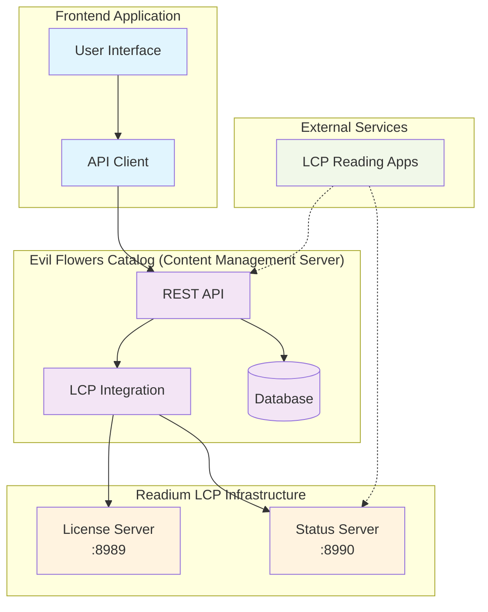
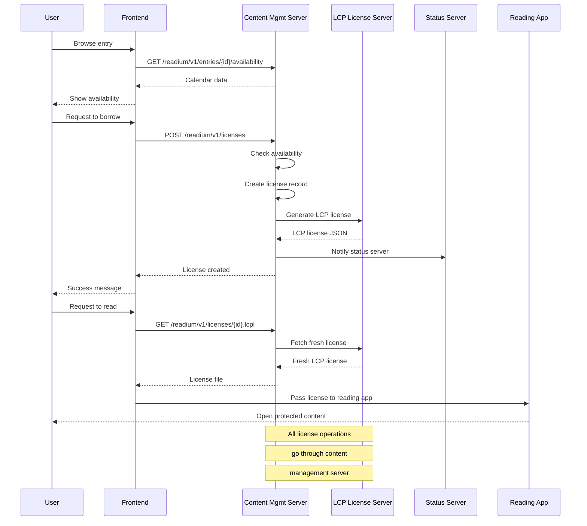

# Readium LCP Frontend Integration Guide

This guide explains how to integrate Readium LCP (Licensed Content Protection) functionality into a frontend
application that consumes the Evil Flowers Catalog API.

## Overview

The Evil Flowers Catalog implements a complete Readium LCP server integration that allows:
- **Protected content distribution**: PDF files encrypted with LCP
- **License management**: Time-limited borrowing with concurrent user limits
- **Availability calendar**: Real-time view of borrowing slots
- **Content management server**: All license operations go through the content management system

## Architecture Components



### Backend Services

1. **Evil Flowers Catalog API** (Content Management Server)
   - Primary interface for all frontend operations
   - User authentication and authorization
   - License availability management
   - Coordinates with LCP servers behind the scenes

2. **LCP License Server** (`http://127.0.0.1:8989`)
   - Generates and manages LCP licenses
   - Handles content encryption
   - Accessible only through content management server

3. **LCP Status Server** (`http://127.0.0.1:8990`)
   - Manages license status documents
   - Handles device registration
   - Processes license updates (return, renewal, revocation)

### Frontend Integration Points

The frontend integrates exclusively with the Evil Flowers Catalog API. Direct access to LCP servers is not permitted in content management mode.

## API Endpoints

### 1. Entry Availability

**GET** `/readium/v1/entries/{entry_id}/availability`

Check if an entry is available for borrowing and get calendar data.

**Query Parameters:**
- `start_date` (optional): ISO date string (e.g., "2023-12-01")
- `end_date` (optional): ISO date string (e.g., "2023-12-31")

**Response:**
```json
{
  "available": true,
  "max_concurrent": 3,
  "calendar": [
    {
      "date": "2023-12-01",
      "available_slots": 2,
      "total_slots": 3,
      "is_available": true
    },
    {
      "date": "2023-12-02",
      "available_slots": 0,
      "total_slots": 3,
      "is_available": false
    }
  ]
}
```

### 2. List User Licenses

**GET** `/readium/v1/licenses`

Get all licenses for the current user. Use query parameters to filter by entry.

**Query Parameters:**
- `entry_id` (optional): Filter licenses for a specific entry
- `user_id` (optional): Filter licenses for a specific user (admin only)
- `state` (optional): Filter by license state (ready, active, returned, etc.)

**Response:**
```json
{
  "results": [
    {
      "id": "uuid",
      "entry_id": "uuid",
      "user_id": "uuid",
      "state": "active",
      "starts_at": "2023-12-01T10:00:00Z",
      "expires_at": "2023-12-15T10:00:00Z",
      "lcp_license_id": "uuid",
      "device_count": 2
    }
  ]
}
```

### 3. Create License

**POST** `/readium/v1/licenses`

Create a new license for the current user to borrow an entry.

**Request Body:**
```json
{
  "entry_id": "uuid",
  "start_date": "2023-12-01",
  "duration_days": 14,
  "passphrase_hint": "Your mother's maiden name"
}
```

**Response:**
```json
{
  "id": "uuid",
  "entry_id": "uuid",
  "user_id": "uuid",
  "state": "ready",
  "starts_at": "2023-12-01T10:00:00Z",
  "expires_at": "2023-12-15T10:00:00Z",
  "lcp_license_id": "uuid"
}
```

### 4. License Details

**GET** `/readium/v1/licenses/{license_id}`

Get detailed information about a specific license.

**Response:**
```json
{
  "id": "uuid",
  "entry": {
    "id": "uuid",
    "title": "Example Book",
    "readium_enabled": true,
    "readium_amount": 3
  },
  "user_id": "uuid",
  "state": "active",
  "starts_at": "2023-12-01T10:00:00Z",
  "expires_at": "2023-12-15T10:00:00Z",
  "lcp_license_id": "uuid",
  "device_count": 2
}
```

### 5. Download License File

**GET** `/readium/v1/licenses/{license_id}.lcpl`

Download the actual LCP license file for use in reading applications.

**Response:**
- Content-Type: `application/vnd.readium.lcp.license.v1.0+json`
- Content-Disposition: `attachment; filename="BookTitle.lcpl"`

Returns the LCP license JSON that can be imported into Readium-compatible reading applications.

## Frontend Implementation

### 1. Availability Calendar Component

Create a calendar component that displays borrowing availability:

```typescript
interface AvailabilityDay {
  date: string;
  available_slots: number;
  total_slots: number;
  is_available: boolean;
}

interface EntryAvailability {
  available: boolean;
  max_concurrent: number;
  calendar: AvailabilityDay[];
}

async function getEntryAvailability(
  entryId: string,
  startDate?: string,
  endDate?: string
): Promise<EntryAvailability> {
  const params = new URLSearchParams();
  if (startDate) params.append('start_date', startDate);
  if (endDate) params.append('end_date', endDate);

  const response = await fetch(
    `/readium/v1/entries/${entryId}/availability?${params}`,
    {
      headers: {
        'Authorization': `Bearer ${accessToken}`
      }
    }
  );

  return response.json();
}
```

### 2. License Management

Handle license creation and management:

```typescript
interface CreateLicenseRequest {
  entry_id: string;
  start_date?: string;
  duration_days?: number;
  passphrase_hint?: string;
}

async function createLicense(
  entryId: string,
  request: Omit<CreateLicenseRequest, 'entry_id'>
): Promise<License> {
  const response = await fetch(
    `/readium/v1/licenses`,
    {
      method: 'POST',
      headers: {
        'Authorization': `Bearer ${accessToken}`,
        'Content-Type': 'application/json'
      },
      body: JSON.stringify({
        entry_id: entryId,
        ...request
      })
    }
  );

  if (!response.ok) {
    const error = await response.json();
    throw new Error(error.detail || 'Failed to create license');
  }

  return response.json();
}

async function getUserLicenses(entryId?: string): Promise<License[]> {
  const params = new URLSearchParams();
  if (entryId) params.append('entry_id', entryId);
  
  const response = await fetch(
    `/readium/v1/licenses?${params}`,
    {
      headers: {
        'Authorization': `Bearer ${accessToken}`
      }
    }
  );

  const data = await response.json();
  return data.results;
}
```

### 3. Borrowing Workflow

Implement the complete borrowing workflow:

```typescript
class BorrowingService {
  async checkAvailability(entryId: string): Promise<boolean> {
    const availability = await getEntryAvailability(entryId);
    return availability.available;
  }

  async borrowEntry(
    entryId: string,
    startDate: string,
    durationDays: number = 14,
    passphraseHint?: string
  ): Promise<License> {
    // Check if user already has a license
    const existingLicenses = await getUserLicenses(entryId);
    const activeLicense = existingLicenses.find(
      license => ['ready', 'active'].includes(license.state)
    );

    if (activeLicense) {
      throw new Error('You already have an active license for this entry');
    }

    // Create new license
    return createLicense(entryId, {
      start_date: startDate,
      duration_days: durationDays,
      passphrase_hint: passphraseHint
    });
  }

  async returnEntry(licenseId: string): Promise<void> {
    // This would typically involve calling the LCP Status Server
    // to update the license status to "returned"
    const response = await fetch(
      `/readium/v1/licenses/${licenseId}`,
      {
        method: 'PATCH',
        headers: {
          'Authorization': `Bearer ${accessToken}`,
          'Content-Type': 'application/json'
        },
        body: JSON.stringify({
          state: 'returned'
        })
      }
    );

    if (!response.ok) {
      throw new Error('Failed to return entry');
    }
  }
}
```

## License Borrowing Flow



## User Experience Flows

### 1. Browsing Available Entries

```typescript
// When displaying entry details
const entryId = "entry-uuid";
const availability = await getEntryAvailability(entryId);

if (availability.available) {
  // Show "Available to Borrow" button
  showBorrowButton();
} else {
  // Show availability calendar
  showAvailabilityCalendar(availability.calendar);
}
```

### 2. Borrowing Process

```typescript
async function handleBorrowClick(entryId: string) {
  try {
    // 1. Check current availability
    const availability = await getEntryAvailability(entryId);
    if (!availability.available) {
      showError("No available slots at this time");
      return;
    }

    // 2. Show borrowing form
    const borrowingDetails = await showBorrowingForm({
      maxDuration: 14,
      defaultDuration: 14
    });

    // 3. Create license
    const license = await borrowingService.borrowEntry(
      entryId,
      borrowingDetails.startDate,
      borrowingDetails.duration,
      borrowingDetails.passphraseHint
    );

    // 4. Show success message
    showSuccess(`Successfully borrowed until ${license.expires_at}`);

    // 5. Update UI state
    updateEntryState(entryId, 'borrowed');

  } catch (error) {
    showError(error.message);
  }
}
```

### 3. Reading Protected Content

```typescript
async function handleReadClick(entryId: string) {
  try {
    // 1. Get user's license
    const licenses = await getUserLicenses(entryId);
    const activeLicense = licenses.find(
      license => ['ready', 'active'].includes(license.state)
    );

    if (!activeLicense) {
      showError("No active license found");
      return;
    }

    // 2. Get LCP license file
    const lcpLicenseUrl = `/readium/v1/licenses/${activeLicense.id}.lcpl`;

    // 3. Pass to Readium reading system
    await readiumReader.openPublication({
      licenseUrl: lcpLicenseUrl,
      onPassphraseRequired: () => promptForPassphrase()
    });

  } catch (error) {
    showError("Failed to open publication");
  }
}
```

## Error Handling

Common error scenarios and how to handle them:

### License Creation Errors

```typescript
try {
  await createLicense(entryId, licenseRequest);
} catch (error) {
  if (error.message.includes('No available slots')) {
    showAvailabilityCalendar();
  } else if (error.message.includes('already has an active license')) {
    showExistingLicenseInfo();
  } else {
    showGenericError(error.message);
  }
}
```

### Availability Check Errors

```typescript
try {
  const availability = await getEntryAvailability(entryId);
  if (!availability.available) {
    showAlternativeOptions(availability.calendar);
  }
} catch (error) {
  showError("Unable to check availability");
}
```

## Integration with Existing Acquisition System

The Readium integration works seamlessly with the existing UserAcquisition system:

1. **Automatic License Creation**: When a user creates a UserAcquisition for a readium-enabled entry, a license is automatically created
2. **Unified Access Control**: Both systems respect the same permission model
3. **Consistent API**: Uses the same authentication and error handling patterns

## Testing

### Unit Tests

```typescript
describe('BorrowingService', () => {
  it('should create license when entry is available', async () => {
    // Mock availability check
    mockGetEntryAvailability.mockResolvedValue({
      available: true,
      max_concurrent: 3,
      calendar: []
    });

    const license = await borrowingService.borrowEntry(
      'entry-id',
      '2023-12-01',
      14
    );

    expect(license).toBeDefined();
    expect(license.state).toBe('ready');
  });

  it('should throw error when no slots available', async () => {
    mockGetEntryAvailability.mockResolvedValue({
      available: false,
      max_concurrent: 3,
      calendar: []
    });

    await expect(
      borrowingService.borrowEntry('entry-id', '2023-12-01', 14)
    ).rejects.toThrow('No available slots');
  });
});
```

### Integration Tests

```typescript
describe('Readium Integration', () => {
  it('should complete full borrowing workflow', async () => {
    // 1. Check availability
    const availability = await getEntryAvailability(entryId);
    expect(availability.available).toBe(true);

    // 2. Create license
    const license = await createLicense(entryId, {
      start_date: '2023-12-01',
      duration_days: 14
    });
    expect(license.state).toBe('ready');

    // 3. Verify license in user's list
    const userLicenses = await getUserLicenses(entryId);
    expect(userLicenses).toContain(license);
  });
});
```

## Security Considerations

1. **Authentication**: All API calls require valid JWT tokens
2. **Authorization**: Users can only access their own licenses
3. **Passphrase Security**: Passphrases are hashed before storage
4. **License Validation**: All license operations validate user permissions
5. **Content Protection**: Encrypted content can only be accessed with valid licenses

## Performance Optimization

1. **Caching**: Cache availability data for frequently accessed entries
2. **Pagination**: Use pagination for large license lists
3. **Lazy Loading**: Load license details only when needed
4. **Background Sync**: Update license status in background

```typescript
// Example caching strategy
const availabilityCache = new Map<string, {
  data: EntryAvailability;
  timestamp: number;
}>();

async function getCachedAvailability(entryId: string): Promise<EntryAvailability> {
  const cached = availabilityCache.get(entryId);
  const now = Date.now();

  if (cached && (now - cached.timestamp) < 5 * 60 * 1000) { // 5 minutes
    return cached.data;
  }

  const data = await getEntryAvailability(entryId);
  availabilityCache.set(entryId, { data, timestamp: now });
  return data;
}
```

## Monitoring and Analytics

Track key metrics for the borrowing system:

```typescript
// Analytics events
analytics.track('license_created', {
  entry_id: entryId,
  duration_days: durationDays,
  user_id: userId
});

analytics.track('entry_borrowed', {
  entry_id: entryId,
  license_id: licenseId,
  available_slots_remaining: availableSlots
});

analytics.track('availability_checked', {
  entry_id: entryId,
  is_available: availability.available,
  total_slots: availability.max_concurrent
});
```

This completes the frontend integration guide for Readium LCP in the Evil Flowers Catalog system.
